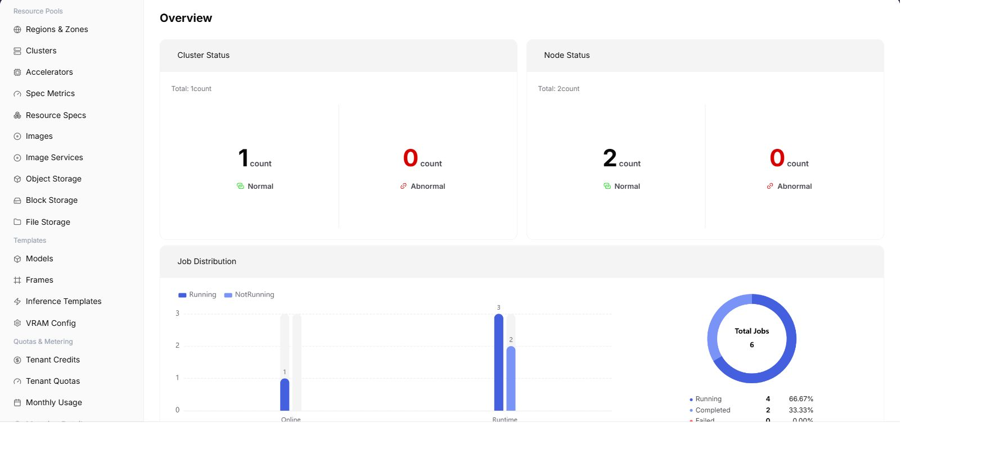

# Statistics Overview

::: info Document Information
Version: v1.0
Updated: 2026-07-08
:::

## Feature Overview

`Statistics Overview` is used to view resource pool overview, cluster count, node status, job distribution, and resource capacity, helping operators perform capacity inspections, locate exceptions, and make resource scheduling judgments.

| Item | Content |
| --- | --- |
| Applicable Role | Operator |
| Navigation Path | Monitoring > Statistics Overview |
| Page Route | `/powerone/monitor/overview` |
| Managed Objects | Resource pool overview, cluster count, node status, job distribution, and resource capacity |
| Typical Use | Daily inspection, quick capacity risk discovery, and entry to drill-down pages |

### Beginner View

Statistics overview is like the resource pool cockpit. First check overall watermarks, exception counts, and update time, then decide whether to drill down to cluster, node, device, or job pages for further troubleshooting.

### Terms Quick Reference

| Term | Description |
| --- | --- |
| Global Watermark | Overall platform resource usage. |
| Exception Aggregation | Centralized display of cluster, node, device, and job exceptions. |
| Trend Entrypoint | Analysis entrypoint that jumps to a specific monitoring object. |
| Update Time | Time point used to determine whether monitoring data is delayed. |

## Prerequisites

1. The current account has operator monitoring view permissions.
2. Target regions, availability zones, and clusters have completed resource access.
3. Monitoring collection components normally report cluster, node, device, and job data.
4. For troubleshooting, the time range and affected resource type have been clarified.

## Page Description

Statistics overview is used to view global resource watermarks, exception aggregation, and trend entrypoints from an operator perspective. The page helps operators first determine whether an issue is concentrated in clusters, nodes, devices, or jobs, then enter the corresponding monitoring page for drill-down.

The following figure shows the statistics overview page.

## View Statistics Overview

### Procedure

1. Go to `Monitoring > Statistics Overview`.
2. Confirm the region in the upper-right corner and page filters.
3. View lists, charts, or statistic cards.
4. Focus on abnormal status, high watermarks, long periods without updates, or data inconsistent with expectations.
5. After finding an exception, go to cluster statistics, node statistics, device monitoring, or job monitoring for further location.

### Key Focus

- Whether cluster and node counts change abnormally.
- Whether GPU, CPU, memory, and disk watermarks are close to limits.
- Whether failed, queued, or long-running jobs increase.

### Parameters

| Field Name | Required | Field Type | Example | Description |
| --- | --- | --- | --- | --- |
| Time Range | Yes | Date range | `Last 1 hour` | Controls the query window for overview cards, trend charts, and exception statistics. |
| Region | Conditionally required | Drop-down | `Central China Zone 1` | Limits the resource scope covered by the statistics overview. |
| Cluster Count | System-generated | Number | `12` | Total number of clusters included in monitoring statistics in the current region. |
| Exception Count | System-generated | Number | `3` | Aggregates abnormal objects in clusters, nodes, devices, or jobs. |
| Update Time | System-generated | Date time | `2026-07-06 10:00` | Used to determine whether overview data has collection delay. |

### Pitfalls

- The overview can only help locate direction and does not replace specific object details.
- Rising watermarks should be judged together with new jobs, expansion, and queueing.
- Mask tenants, node names, and business identifiers before screenshots.

### Result Validation

1. Overview cards display summaries for clusters, nodes, devices, jobs, and exceptions.
2. After switching region or time range, trends and exception counts change accordingly.
3. After drilling down to detail pages, object scope is consistent with overview statistics.

## Configuration Rules and Impact

- **Use overview to determine direction first**: Confirm whether exceptions are concentrated in a region, cluster, or resource type before entering drill-down pages.
- **Interpret exception count with time range**: The longer the time window, the more easily historical exceptions are included. Fix the time range during troubleshooting.
- **Update time determines trustworthiness**: If update time is clearly delayed, check the collection link before judging whether resources are truly abnormal.
- **Watermark changes require trends**: Instant high watermarks are not necessarily failures. Judge them together with new jobs, expansion, maintenance windows, and historical trends.

## FAQ

### Monitoring Data Is Delayed or Missing

**Symptom:**

Resource, job, or node status in statistics overview is inconsistent with the actual situation.

**Possible Causes:**

- Monitoring collection is delayed.
- Cluster or node collection components are abnormal.
- Filtered region or time range is incorrect.

**Solution:**

1. Confirm page update time and filters.
2. Enter cluster statistics, node statistics, and job monitoring for cross-validation.
3. Contact operations to check collection components and reporting links.

### Overview Resource Watermark Suddenly Rises

**Symptom:**

GPU, CPU, memory, or disk watermark suddenly approaches the limit.

**Possible Causes:**

- Batch jobs or large-specification instances were submitted intensively.
- Some nodes became unavailable, reducing available capacity.
- Statistical definitions changed or data was backfilled after collection recovery.

**Solution:**

1. Enter job monitoring to locate high-consumption jobs.
2. Enter node statistics to confirm whether nodes are abnormal.
3. Expand capacity, migrate jobs, or adjust tenant quotas if necessary.

### Expected Cluster Is Not Visible in Overview

**Symptom:**

A cluster already exists in the resource pool, but statistics overview does not show its data.

**Possible Causes:**

- Cluster monitoring access has not been completed.
- The cluster is unavailable or excluded by filters.
- Account permissions cannot view this cluster's monitoring.

**Solution:**

1. Check the region and filters in the upper-right corner.
2. Go to resource pool cluster management to confirm cluster status.
3. Verify monitoring permissions and collection configuration.

## Follow-Up Operations

1. If exceptions are concentrated in clusters, go to cluster statistics.
2. If exceptions are concentrated in nodes or devices, go to the corresponding monitoring page.
3. If job failures or queueing increase, go to job monitoring and troubleshoot with quotas.

## Notes

- Overview is used to discover direction and should not be the sole basis for incident responsibility.
- Mask tenants, nodes, IPs, and business identifiers before screenshots.
- Watermark exceptions need to be judged together with historical trends, business windows, and job changes.
