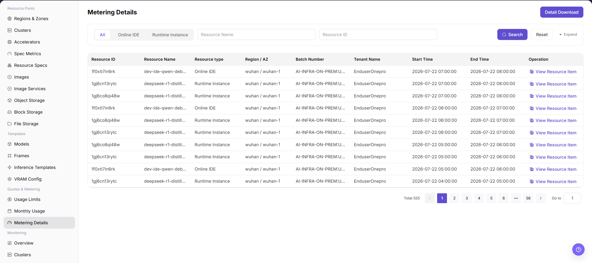

# Metering Details

::: info Document Information
Version: v1.0
Updated: 2026-07-08
:::

## Feature Overview

`Metering Details` is used to view resource-level metering records and supports filtering by resource type, region, availability zone, batch, and enterprise.

| Item | Content |
| --- | --- |
| Applicable Role | Operator |
| Navigation Path | Quota & Metering > Metering Details |
| Page Route | /powerone/quota-metric/resource |
| Managed Objects | Resource ID, resource name, resource type, region, availability zone, batch number, enterprise, and start/end time |
| Typical Use | Reconcile monthly metering, explain user consumption, and download details |

### Beginner View

Metering details are like resource consumption transaction records. They record what resources a tenant used, when they were used, how much was used, and how many Credits were converted.

### View Flow

1. Go to `Quota & Metering > Metering Details`.
2. Filter by time, status, resource type, or keyword.
3. View the list or chart results.
4. If an exception is found, drill down into the associated page.

### Terms Quick Reference

| Term | Description |
| --- | --- |
| Resource Type | Type of metered object, such as online IDE or runtime instance. |
| Batch Number | Metering task or aggregation batch identifier. |
| Detail Download | Exports details within the current filter scope. |

## Prerequisites

1. The current account has operator permissions.
2. The target region has been selected correctly.
3. Related resources, jobs, or metering tasks have reported data.

## Page Description

Metering details are used to reconcile tenants, resources, billing cycles, usage, and Credits consumption record by record. Operators can locate abnormal details by tenant, resource name, or time range, and cross-check them with monthly metering summaries.

The following figure shows the metering details page.

## Main Operations

### View Metering Details

#### Procedure

1. Go to `Quota & Metering > Metering Details`.
2. Select resource type, region, availability zone, or enterprise.
3. Click `Search`.
4. Expand details to view resource start and end time.
5. To reconcile offline, click `Download Details`.

#### Parameters

| Field Name | Required | Field Type | Example | Description |
| --- | --- | --- | --- | --- |
| Tenant | Yes | Drop-down | `tenant-a` | Filters the consumption subject to view. |
| Resource Name | Conditionally required | Text | `inference-qwen` | Instance, job, or storage resource that generated metering. |
| Billing Cycle | Yes | Date range | `2026-07-01 to 2026-07-31` | Settlement cycle to which the details belong. |
| Usage | System-generated | Number / duration | `12 card-hours` | Actual resource usage. |
| Credits | System-generated | Number | `360` | Consumed credits converted from usage according to billing rules. |
| Detail Status | System-generated | Status | `Posted` | Shows whether the detail has completed statistics, posting, or correction. |

#### Pitfalls

- Sufficient quota does not mean the underlying cluster definitely has idle resources.
- Metering data may be delayed. Use a unified time range and statistical definition during reconciliation.
- Sanitize tenant, amount, and business identifiers before exporting data.

#### Result Validation

1. Filter results match the conditions.
2. Detail start/end time and resource type can explain monthly summaries.

## Configuration Rules and Impact

- **Filter before download**: Avoid exporting an overly large range.
- **Use details to explain summaries**: Monthly metering differences should first be checked from detail totals.

## FAQ

### Instance Record Cannot Be Found in Metering Details

**Symptom:**

The user is known to have created an instance, but the corresponding record cannot be found in metering details.

**Possible Causes:**

- The instance runtime does not fall within the filter range.
- The instance has not entered metering status or has been filtered out.
- Tenant, region, or specification filters do not match.

**Solution:**

1. Expand the time range and query again.
2. Cross-filter by instance name, tenant, and specification.
3. Confirm whether instance status and metering tasks have completed.

### Metering Detail Amount or Usage Is Abnormal

**Symptom:**

The usage, duration, or amount of a single metering record is clearly inconsistent with expectations.

**Possible Causes:**

- Specification unit price or metering unit is configured incorrectly.
- The instance runs across cycles and is split into multiple metering records.
- Resource release is delayed, causing occupied time to be longer than expected.

**Solution:**

1. Verify specifications, units, and metering rules.
2. Check the instance lifecycle and release time.
3. Initiate an operations review for abnormal records.

## Follow-Up Operations

1. When details are abnormal, narrow the query scope by tenant, resource, and time range.
2. When details and monthly usage are inconsistent, confirm whether there are delayed postings, correction records, or cross-cycle resources.
3. Before exporting details, sanitize tenant names, resource names, amounts, and internal unit prices.
4. When explaining fees, combine resource specification, runtime duration, and billing rules into a definition tenants can understand.

## Notes

- Metering details may have statistical delays. Confirm final posting status before settlement.
- Detail export files contain sensitive business data and should not be distributed through public channels.
- Do not directly modify detail definitions. Handle them through billing rules or correction processes.
