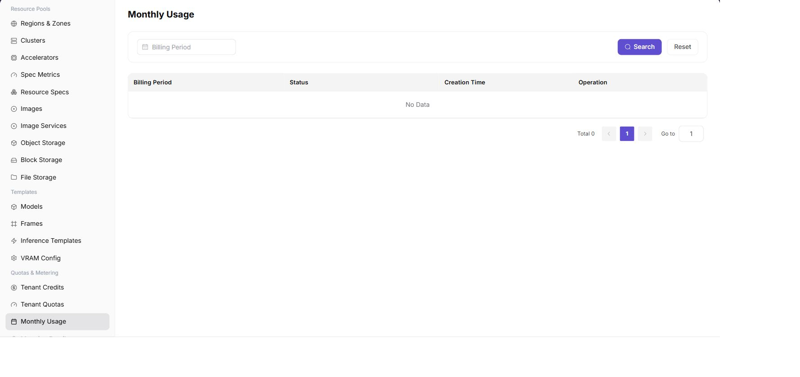

# Monthly Metering

::: info Document Information
Version: v1.0
Updated: 2026-07-08
:::

## Feature Overview

`Monthly Metering` is used to view monthly aggregated metering results by billing period.

| Item | Content |
| --- | --- |
| Applicable role | Operator |
| Navigation path | AI Infrastructure > On-Prem > Quotas & Metering > Monthly Metering |
| Page route | `/powerone/quota-metric/month` |
| Managed objects | Billing period, status, creation time, and monthly summary records |
| Typical use | Month-end reconciliation, billing period confirmation, and discovery of abnormal monthly consumption |

#### Beginner Explanation

Monthly usage is like a monthly resource bill summary. It aggregates scattered compute, storage, and instance consumption into month, tenant, and resource type dimensions.

#### View Flow

1. Go to `Quota & Metering > Monthly Metering`.
2. Filter by time, status, resource type, or keyword.
3. View the list or chart results.
4. If an exception is found, drill down into the associated page.

#### Terms Quick Reference

| Term | Description |
| --- | --- |
| Billing Period | Month or cycle to which metering belongs. |
| Monthly Summary | Consumption result aggregated by billing period. |

## Prerequisites

1. The current account has operator permissions.
2. The target region has been selected correctly.
3. Related resources, jobs, or metering tasks have reported data.

## Page Description

Monthly metering aggregates tenant resource consumption, Credits conversion, and export status by month. Operators can first view monthly summaries, then drill down to metering details to reconcile abnormal growth, cross-cycle resources, or delayed postings.

The following figure shows the monthly metering page.

## Main Operations

### View Monthly Metering

#### Procedure

1. Go to `AI Infrastructure > On-Prem > Quotas & Metering > Monthly Metering`.
2. Filter by billing period or status.
3. View billing period status and creation time in the list.
4. If the monthly summary is abnormal, go to metering details for reconciliation.

## Parameter Reference

| Field Name | Required | Field Type | Example | Description |
| --- | --- | --- | --- | --- |
| Month | Yes | Month selector | `2026-07` | Month to which the monthly statistics belong. |
| Tenant | Conditionally required | Drop-down | `tenant-a` | View monthly usage for a specified tenant. |
| Resource Type | Conditionally required | Enum | `GPU` | Aggregates by compute, storage, instance, and other categories. |
| Aggregated Usage | System-generated | Number / capacity | `960 card-hours` | Accumulated usage for the month. |
| Fee / Credits | System-generated | Number | `28800` | Fee or Credits converted according to metering rules. |
| Export Status | System-generated | Status | `Generated` | Whether the monthly report can be downloaded or is still generating. |

## Pitfalls

- Sufficient quota does not mean the underlying cluster definitely has idle resources.
- Metering data may be delayed. Use a unified time range and statistical definition during reconciliation.
- Sanitize tenant, amount, and business identifiers before exporting data.

## Result Validation

1. Billing period list matches expectations.
2. Summaries can correspond to detail totals.

## Configuration Rules and Impact

- **Summary before details**: Monthly exceptions should be traced back to metering details.
- **Do not mix billing periods**: Clarify billing period scope during reconciliation.

## FAQ

#### Monthly Metering Data Is Not Updated

**Symptom:**

After entering the monthly metering page, current-month data is empty or still remains at an old time.

**Possible Causes:**

- The metering task has not completed.
- The selected month or tenant is incorrect.
- The target tenant has not generated meterable resources.

**Solution:**

1. Confirm the selected month and tenant.
2. Check metering task execution time.
3. Go to metering details to verify whether instance consumption records exist.

#### Monthly Summary and Metering Details Are Inconsistent

**Symptom:**

Monthly metering totals do not match accumulated metering details.

**Possible Causes:**

- Details and summaries were refreshed at different times.
- Filter dimensions, tenant, or specification are inconsistent.
- Cross-month running instances or recalculation records exist.

**Solution:**

1. Reconcile again with unified filters.
2. View cross-month instances and recalculation records.
3. Use the summary after metering task completion as the settlement basis.

## Next Steps

1. When monthly summaries are abnormal, drill down to metering details to reconcile resources and time ranges.
2. Before settlement, confirm that statistical cycles, delayed postings, and correction records have been processed.
3. After exporting reports, perform internal reviews by tenant or business line.
4. When abnormal fee growth is found, combine monitoring and job records to locate high-consumption resources.

## Notes

- Monthly usage is a reference for business operations and settlement. Confirm statistical definitions and final posting status before publishing.
- Exported reports may contain tenant names, fees, and usage details. Restrict distribution scope.
- Cross-month running resources may be split by cycle. Do not infer full-month fees from single-day details only.
