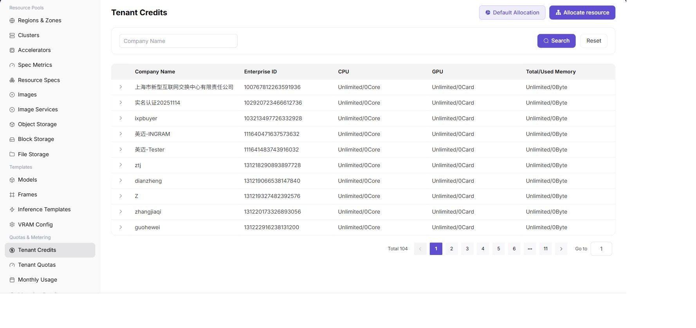

# Tenant Credits

::: info Document Information
Version: v1.0
Updated: 2026-07-08
:::

## Feature Overview

`Tenant Credits` is used by operators to view and allocate CPU, GPU, and memory resource credits for tenants in the current resource pool.

| Item | Content |
| --- | --- |
| Applicable Role | Operator |
| Navigation Path | Quota & Metering > Tenant Credits |
| Page Route | /powerone/quota-metric/credit |
| Managed Objects | Tenant, enterprise ID, CPU credits, GPU credits, memory credits, and used amount |
| Typical Use | Set default resource allocation, allocate resources to specified tenants, and troubleshoot tenant resource shortage |

### Beginner View

Tenant Credits are like the tenant account balance. They control consumable credits and arrears status, helping operators determine whether resource creation should continue.

### Maintenance Flow

1. Confirm tenant resource requirements.
2. Set default allocated resources.
3. Allocate resources by tenant.
4. View used amount.
5. Troubleshoot consumption together with tenant quotas and metering details.

### Terms Quick Reference

| Term | Description |
| --- | --- |
| Credits | Resource limit that tenants are allowed to use. |
| Used Amount | Resources currently occupied by the tenant. |
| Unlimited | Does not limit resource credits by this dimension. |

## Prerequisites

1. The current account has tenant credit management permissions.
2. Tenant name or enterprise ID has been confirmed.
3. Business impact has been confirmed before credit adjustment.

## Page Description

The page displays enterprise name, enterprise ID, CPU, GPU, and memory total/used amount, and supports searching by enterprise name.

The following figure shows the tenant credit list, where each tenant's total resources and used amount can be viewed.

## Set Default Allocated Resources

### Applicable Scenario

- A unified default resource credit definition is required.

### Pre-Operation Check

1. Confirm that default credits will not cause new tenants to over-occupy resources.

### Procedure

1. Go to `Quota & Metering > Tenant Credits`.
2. Click `Default Allocated Resources`.
3. Set the default allocation policy for CPU, memory, and GPU.
4. Click `OK` to save.

The following figure shows the default allocated resources entrypoint for maintaining the default resource allocation policy.

### Result Validation

1. The default policy is saved successfully.
2. New tenants or initialization flows use the default values.

## Allocate Resources

### Applicable Scenario

- Resource credits need to be adjusted for a single tenant.

### Pre-Operation Check

1. Confirm that the target tenant is correct.
2. Confirm that adjusted credits meet business requirements and do not exceed the resource pool plan.

### Procedure

1. Click `Allocate Resources`.
2. Select the tenant.
3. Fill in CPU, memory, and GPU credits.
4. To add GPU categories, click `Add Row`.
5. Click `OK` to save.

The following figure shows the allocate resources dialog, where CPU, memory, and GPU credits can be maintained by tenant.

### Parameters

| Field Name | Required | Field Type | Example | Description |
| --- | --- | --- | --- | --- |
| Tenant | Yes | Drop-down | `tenant-a` | Tenant whose Credits need to be viewed or adjusted. |
| Credits Balance | System-generated | Number | `12000` | Tenant's current remaining consumable credits. |
| Frozen Credits | System-generated | Number | `500` | Credits occupied by running resources or settlement processes. |
| Adjustment Type | Conditionally required | Enum | `Top-up` | Type of manual increase, deduction, or freeze of Credits. |
| Adjustment Quantity | Conditionally required | Number | `2000` | Credits quantity adjusted this time. |
| Effective Time | System-generated | Date time | `2026-07-06 10:00` | Time when the credit change is written to the account. |

### Pitfalls

- Before decreasing credits, confirm whether running jobs already exceed the new credits.

### Result Validation

1. Target tenant credits are updated in the list.
2. User-side credit validation behaves as expected when creating jobs.

## Configuration Rules and Impact

- **Credits are not billing**: Credits control resource limits; metering details record actual consumption.
- **Check used amount before adjustment**: Avoid reducing credits below used amount.
- **Select the right tenant**: When enterprise names are similar, verify enterprise ID first.

## FAQ

### Tenant Credits Are Sufficient but Specification Is Still Unavailable

**Symptom:**

The tenant credit page shows sufficient CPU, memory, or accelerator credits, but the specification is unavailable when users create instances.

**Possible Causes:**

- The specification is not associated with the target cluster.
- The template limits selectable specifications.
- Region or tenant authorization does not include this resource.

**Solution:**

1. Check that the cluster has associated specifications.
2. Verify the template specification scope.
3. Confirm that the tenant has resource authorization in the target region.

### Default Credits Do Not Take Effect

**Symptom:**

After default credits are set, a new tenant or target tenant does not receive credits as expected.

**Possible Causes:**

- Default credits affect only subsequent initialization flows.
- The target tenant already has an independent credit record.
- Customer credit initialization has not been executed.

**Solution:**

1. Confirm the applicable scope of default credits.
2. Check whether the tenant already has a credit record.
3. Execute or rerun customer credit initialization.

### Credit Deduction Is Inconsistent with Instance Status

**Symptom:**

The instance has stopped or failed, but tenant credits still show usage.

**Possible Causes:**

- Resource release and metering synchronization are delayed.
- The instance still has storage, image, or background task usage.
- The metering cycle has not completed settlement.

**Solution:**

1. View metering details and instance status.
2. Confirm whether associated resources have been released.
3. Wait for synchronization or contact the operator to check metering tasks.

## Follow-Up Operations

1. When Credits balance is insufficient, verify top-up records, deduction details, and arrears status.
2. After manual adjustment, go to metering details to confirm whether the change is recorded.
3. Before restoring service for tenants in arrears, confirm that balance, quotas, and resource pool capacity all meet requirements.
4. Periodically export balance and change records as the basis for operations settlement and customer communication.

## Notes

- Credits involve settlement definitions. Screenshots and export files must not expose real tenant names, amounts, or internal discounts.
- Confirm approval basis before manual deduction or top-up to avoid inconsistency with monthly metering results.
- Sufficient Credits do not mean resources can definitely be created. Quotas and cluster capacity must also be satisfied.
