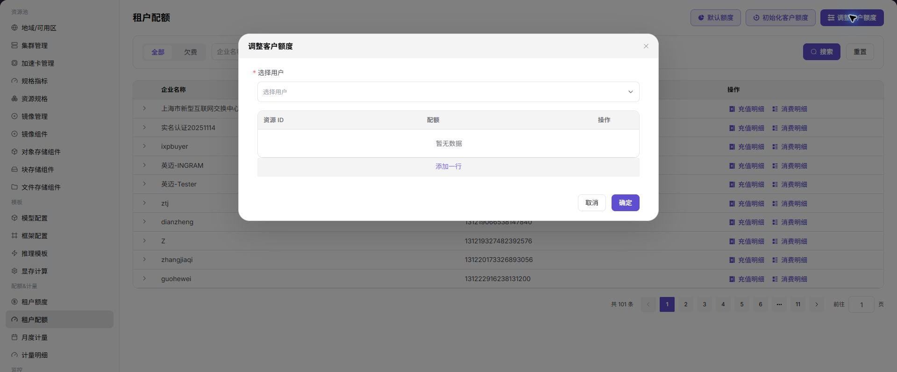

# Tenant Quotas

::: info Document Information
Version: v1.0
Updated: 2026-07-08
:::

## Feature Overview

`Tenant Quotas` is used to maintain tenant account credits, initialize customer credits, adjust customer credits, and view top-up and consumption details.

| Item | Content |
| --- | --- |
| Applicable Role | Operator |
| Navigation Path | Quota & Metering > Tenant Quotas |
| Page Route | /powerone/quota-metric/tenant |
| Managed Objects | Tenant, default credits, customer credits, top-up details, and consumption details |
| Typical Use | Initialize tenant accounts, adjust customer credits, and troubleshoot arrears and consumption records |

### Beginner View

Tenant quotas are like each tenant's resource budget table. They specify how much compute, storage, and instance credits a tenant can use, preventing a single tenant from occupying all shared resources.

### Configuration Flow

1. Set default credits.
2. Initialize customer credits.
3. Adjust customer credits as needed.
4. Reconcile finance through top-up details and consumption details.
5. Cross-check exceptions with metering details.

### Terms Quick Reference

| Term | Description |
| --- | --- |
| Default Credits | Default account credits used for new tenants or initialization. |
| Initialize Customer Credits | Generates initial credit records for customers. |
| Adjust Customer Credits | Increases or decreases customer account credits. |
| Consumption Details | Credit consumption records. |

## Prerequisites

1. The current account has tenant quota management permissions.
2. Adjustment target and adjustment reason have been confirmed.
3. Approval or internal confirmation has been completed for customer credit changes.

## Page Description

The page displays enterprise name, enterprise ID, and top-up/consumption detail entrypoints, and supports filtering all tenants or tenants in arrears.

The following figure shows the tenant quota list, where top-up details and consumption details can be opened.

## Main Operations

### Set Default Credits

#### Procedure

1. Go to `Quota & Metering > Tenant Quotas`.
2. Click `Default Credits`.
3. Fill in the default credit policy.
4. Click `OK` to save.

The following figure shows the default credits entrypoint.

#### Result Validation

1. The default credit policy is saved successfully.

### Initialize Customer Credits

#### Procedure

1. Click `Initialize Customer Credits`.
2. Select or confirm the customer that needs initialization.
3. Confirm initialized credits.
4. After submission, view the list and top-up details.

The following figure shows the initialize customer credits entrypoint.

#### Result Validation

1. The customer appears in the list.
2. A corresponding initialization record exists in top-up details.

### Adjust Customer Credits

#### Procedure

1. Click `Adjust Customer Credits`.
2. Select the target customer.
3. Fill in the credit adjustment and reason.
4. After submission, view top-up details and consumption details.

The following figure shows the adjust customer credits entrypoint.

#### Parameters

| Field Name | Required | Field Type | Example | Description |
| --- | --- | --- | --- | --- |
| Tenant | Yes | Drop-down | `tenant-a` | Tenant whose quotas need to be configured or viewed. |
| Resource Type | Yes | Enum | `GPU` | Resource category constrained by quotas, such as GPU, CPU, memory, storage, or instance count. |
| Quota Limit | Yes | Number / capacity | `8 cards` | Maximum resource credits the tenant can use. |
| Used | System-generated | Number / capacity | `5 cards` | Resources currently occupied by the tenant. |
| Remaining | System-generated | Number / capacity | `3 cards` | Available credits after subtracting used from quota limit. |
| Adjustment Reason | Conditionally required | Text | `Project expansion` | Business reason recorded for manual credit adjustment. |

#### Pitfalls

- Do not mix resource credit issues with account credit issues. Troubleshoot them separately.

#### Result Validation

1. Target customer credit changes match expectations.
2. Detail records are traceable.

## Configuration Rules and Impact

- **Credit adjustments must leave records**: Customer credit changes should be traceable in details.
- **Check details before handling arrears**: View consumption details and metering details before handling arrears.
- **Enterprise ID first**: Confirm by enterprise ID when enterprise names are the same or similar.

## FAQ

### Quotas Look Normal but Instance Creation Still Fails

**Symptom:**

The tenant quota page looks sufficient, but users still fail to create instances.

**Possible Causes:**

- Account credits and resource quotas are not the same concept.
- CPU, memory, or accelerator quota for the target specification is insufficient.
- Template, region, or cluster resources do not meet creation conditions.

**Solution:**

1. Check tenant quotas, tenant credits, and user-side resource quotas at the same time.
2. View instance failure events to confirm whether the issue is credit, specification, or scheduling.
3. Adjust resource credits or change specifications if necessary.

### Details Are Inconsistent After Customer Credit Adjustment

**Symptom:**

After customer credits are adjusted, the list balance and top-up/consumption details do not match.

**Possible Causes:**

- Details have refresh delay.
- The wrong enterprise ID or time range is being viewed.
- Credit adjustment and consumption deduction happened at the same time.

**Solution:**

1. Filter again by enterprise ID.
2. Reconcile top-up details, consumption details, and metering details.
3. Record the adjustment reason and retain approval basis.

### Tenant in Arrears Cannot Restore Creation Capability

**Symptom:**

After credits are supplemented, users still cannot create instances.

**Possible Causes:**

- Resource quotas are still insufficient.
- Template or region permissions have not been opened.
- Existing failed instances need to be resubmitted.

**Solution:**

1. Check tenant credits and resource quotas.
2. Confirm that templates, regions, specifications, and clusters are available.
3. Ask users to re-enter the creation flow and submit the instance again.

## Follow-Up Operations

1. When quotas are insufficient, first verify tenant business requirements, resource pool capacity, and approval records.
2. After quota adjustment, enter the instance creation or job submission flow to verify whether specifications are selectable.
3. Periodically compare quotas, used amount, and metering details to discover long-idle or abnormally occupied tenants.
4. For large quota adjustments, also evaluate cluster capacity and impact on other tenants.

## Notes

- Quotas are not resource reservations. Even with sufficient remaining credits, creation can still fail due to cluster capacity, specification association, or scheduling conditions.
- Retain business reasons before adjusting credits to support later metering and capacity reviews.
- In external communication, do not expose real tenant names, business project names, or internal cost definitions.
