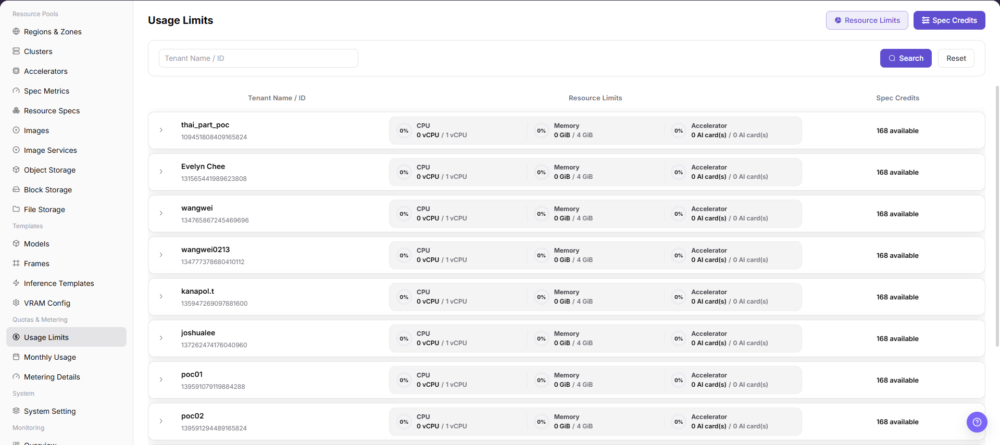
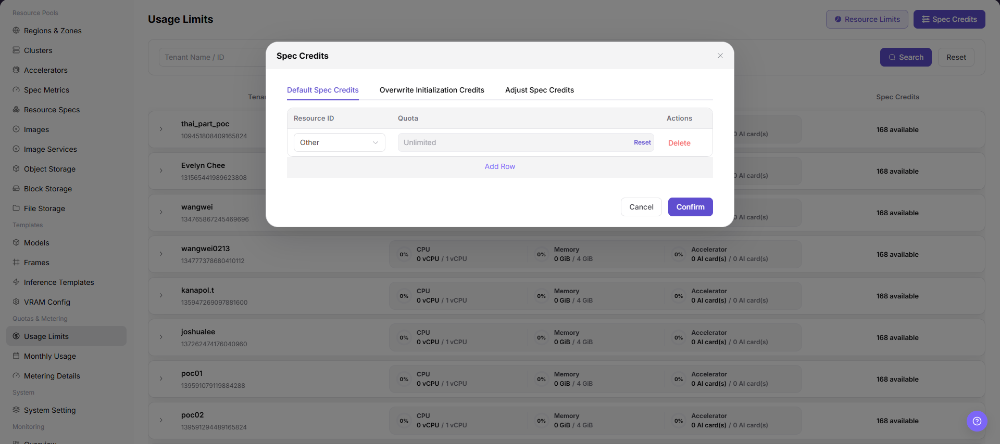

# Usage Limits

::: info Document Information
Version: v1.0
Updated: 2026-07-22
:::

## Feature Overview

`Usage Limits` is used to view and maintain tenant-level resource limits and spec credits. Operators use this page to control the CPU, memory, accelerator, and spec credit scope available to each tenant.

| Item | Content |
| --- | --- |
| Applicable role | Operator |
| Navigation path | AI Infrastructure > On-Prem > Quotas & Metering > Usage Limits |
| Page route | `/powerone/quota-metric/credit` |
| Managed objects | Tenant, resource limits, spec credits, resource items, resource IDs, and quota configuration |
| Typical use | View tenant resource boundaries, adjust resource limits, reconcile spec credits, and troubleshoot unavailable resources |

#### Beginner Explanation

Usage limits are like a resource boundary sheet for a tenant. Resource specs define how much resource a single instance or job uses. Usage limits define how much resource a tenant can use in total and whether specific resources or specs have quota constraints.

#### Terms Quick Reference

| Term | Description |
| --- | --- |
| Resource Limits | Limits tenant usage by resource category, such as CPU, memory, and accelerator. |
| Spec Credits | Limits tenant usage by resource ID or spec dimension. |
| Unlimited | Removes a fixed limit from the resource item and expands the available scope. |
| Delete | Removes the current configuration item. |
| Confirm | Submits changes in the expanded area and is a high-risk final action. |

## Prerequisites

1. The current account has operator permissions.
2. The correct region is selected, and the region selector shows a normal status.
3. The target tenant, resource type, and spec scope have been confirmed.
4. For learning or screenshots only, view fields, expanded rows, and buttons without clicking the final `Confirm`.

## Page Description

Go to `Quotas & Metering > Usage Limits`. The page provides two top switches: `Resource Limits` and `Spec Credits`. The search box supports `Tenant Name / ID`. The main table shows `Tenant Name / ID`, `Resource Limits`, and `Spec Credits`.

After expanding a tenant row, operators can view or maintain the corresponding limit configuration. The `Resource Limits` expanded area shows `Category`, `Allocate resource`, and `Operation`. The `Spec Credits` expanded area shows `Resource ID`, `Quota`, and `Actions`. Actions such as `Delete`, `Unlimited`, and `Confirm` affect the tenant's available resource scope.

## Main Operations

### View and Maintain Usage Limits

#### Pre-Operation Check

1. Confirm that the current region is the target region.
2. Confirm that the target tenant, resource type, and quota adjustment scope have been internally approved or verified.
3. Confirm whether this operation is for viewing, reconciliation, or actual maintenance. For learning or screenshots, use only `Search`, `Reset`, row expansion, and `Cancel`.

#### Procedure

1. Go to `AI Infra(On-Prem) > Quotas & Metering > Usage Limits`.
2. Click `Resource Limits` or `Spec Credits` according to the verification target.
3. Enter `Tenant Name / ID` in the search box, or leave it empty to view the list.
4. Click `Search` to view matching tenants. Click `Reset` to restore query conditions.
5. Expand the target tenant row and review the current resource limits or spec credits.
6. In the `Resource Limits` expanded area, review `Category`, `Allocate resource`, and `Operation`.
7. In the `Spec Credits` expanded area, review `Resource ID`, `Quota`, and `Actions`.

8. Before maintaining configuration, identify whether `Unlimited`, `Delete`, `Add Row`, `Cancel`, and `Confirm` are present.
9. Before clicking the final `Confirm`, verify tenant, resource category, resource ID, quota, unlimited status, and deletion impact again.
10. For learning or screenshots only, click `Cancel` or collapse the row after viewing. Do not submit real configuration.

## Parameter Reference

| Field Name | Area | Type | Description |
| --- | --- | --- | --- |
| Tenant Name / ID | Search box, main table | Text / system-generated | Locates the target tenant. Do not write real tenant names or tenant IDs in documentation. |
| Resource Limits | Top switch, main table | Switch / summary column | Views or maintains tenant limits for CPU, memory, accelerator, and other resource categories. |
| Spec Credits | Top switch, main table | Switch / summary column | Views or maintains tenant credits by resource ID or spec dimension. |
| Category | Resource Limits expanded area | System field | Resource category, such as CPU, memory, or accelerator category. |
| Allocate resource | Resource Limits expanded area | Quantity / capacity | Allowed resource amount for the current category. |
| Resource ID | Spec Credits expanded area | System field | Spec or resource item identifier. Do not write real resource IDs in documentation. |
| Quota | Spec Credits expanded area | Quantity / capacity | Available quota for the current resource ID. |
| Unlimited | Expanded-area action | Quick action | Removes the fixed limit from the corresponding resource item. |
| Delete | Expanded-area action | High-risk action | Deletes the current configuration item. |
| Add Row | Expanded-area action | Configuration action | Adds a new resource item or quota configuration row. |
| Cancel | Expanded-area action | Safe exit | Discards unsubmitted changes in the expanded area. |
| Confirm | Expanded-area action | High-risk final action | Submits the current configuration adjustment. |

## Pitfalls

- `Confirm` is a high-risk final action and may immediately change the tenant's available resource scope.
- `Delete` removes a configuration item and may leave a resource or spec without the expected limit.
- `Unlimited` expands the available resource scope and must not be used for real tenants without approval.
- Sufficient resource limits do not guarantee that the underlying cluster has idle capacity. Also check resource specs, cluster capacity, and scheduling status.
- Incorrect spec credits or resource IDs may make specs unavailable to users or expand access beyond expectations.
- Do not write real tenant IDs, tenant names, resource IDs, internal resource keys, accounts, secrets, tokens, or internal test parameters.

## Result Validation

| Check Item | Success Criteria | If Abnormal |
| --- | --- | --- |
| Page access | `Usage Limits` opens normally and the route is `/powerone/quota-metric/credit` | Check account permissions, region selection, and sidebar entry |
| Search | Searching by `Tenant Name / ID` returns the expected tenant scope | Check tenant name, tenant ID, and region |
| Resource limits | The main table shows `Resource Limits`; expanded rows show resource categories and allocated resources | Check whether the tenant already has resource limit configuration |
| Spec credits | The main table shows `Spec Credits`; expanded rows show resource IDs and quotas | Check resource ID, spec configuration, and tenant scope |
| Learning only | The row is collapsed or `Cancel` is used, and `Confirm` is not clicked | If a high-risk action was clicked accidentally, follow the internal change review process |

## FAQ

#### The User Side Still Reports Insufficient Resources

**Symptom:**

Usage limits appear sufficient, but the user still receives an insufficient resource message when creating an instance or job.

**Possible Causes:**

- The resource spec is unavailable or not associated with the target cluster.
- The underlying cluster does not have enough idle capacity.
- Either spec credits or resource limits do not cover the target spec.

**Solution:**

1. Verify that both `Resource Limits` and `Spec Credits` satisfy the target spec.
2. Check resource specs, cluster association, and remaining cluster capacity.
3. Use `Metering Details` and monitoring pages to troubleshoot resource usage.

#### Can I Confirm Unlimited Directly?

**Symptom:**

Some resource items show `Unlimited` after expanding a tenant row.

**Possible Causes:**

- The current resource item has no fixed upper limit.
- An operator is preparing to temporarily remove a quota limit.

**Solution:**

1. Confirm whether the setting matches the tenant resource governance policy.
2. Check whether it affects other tenants or resource pool capacity.
3. For learning or screenshots, do not click `Confirm`.

## Next Steps

1. After changing real limits, return to the user side and verify whether the target spec is selectable.
2. Use `Metering Details` to check whether subsequent resource usage matches expectations.
3. Use resource pools, monitoring, and job pages to troubleshoot insufficient resources or queued workloads.
4. Include quota changes in internal change or audit records.

## Notes

- Usage limits directly affect the tenant's available resource scope. Confirm tenant, region, and resource scope before real changes.
- `Confirm`, `Delete`, and `Unlimited` require explicit risk warnings.
- Do not write real tenant IDs, tenant names, resource IDs, internal resource keys, test parameters, accounts, secrets, or tokens in documentation, screenshots, or tickets.
- Sanitize tenant and resource identifiers before exporting or copying page information.
