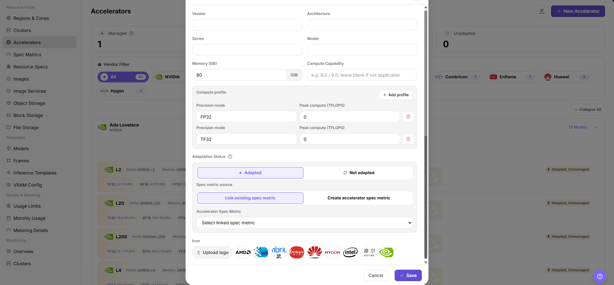

# Accelerator Management

::: info Document Information
Version: v1.0
Updated: 2026-07-08
:::

## Feature Overview

`Accelerator Management` is used to maintain AI accelerator vendors, models, architectures, series, VRAM capacity, compute capability, adaptation status, and specification metric associations that the platform can identify. After the operator maintains accelerators, resource specifications, job scheduling, monitoring display, and inference template recommendations can use a unified hardware definition.

| Item | Content |
| --- | --- |
| Applicable role | Operator |
| Navigation path | AI Infrastructure > On-Prem > Resource Pools > Accelerator Management |
| Page route | `/powerone/resourcepool/accelerators` |
| Managed objects | AI accelerator vendors, architectures, series, models, VRAM, compute capability, specification metrics, and management status |
| Typical use | Unify the accelerator dictionary, support specification metrics, and help resource specifications and inference templates identify available hardware |

#### Beginner Explanation

- **Accelerator model** is like a hardware identity card. It tells the platform whether this is A100, H100, Ascend 910B, or another model.
- **Specification metric** is like a scheduling label. It determines which resource key Kubernetes uses to request the corresponding accelerator.
- **selector-key** helps identify device types, node labels, or monitoring fields. Incorrect configuration affects scheduling and monitoring matching.
- **Managed** means the platform can include this model in resource specifications and job scheduling.
- **Not adapted** models can be maintained as hardware information first, but cannot be opened as stable scheduling capability directly.

#### Initial Maintenance Flow

1. Confirm the accelerator vendors, models, VRAM capacity, and Kubernetes resource keys that actually exist in the cluster.
2. Prepare the corresponding AI accelerator metrics in `Resource Pools > Specification Metrics`.
3. Go to `Resource Pools > Accelerator Management` to create or maintain accelerator models.
4. Associate accelerator models with the correct specification metrics.
5. Reference the metric in resource specifications and verify scheduling, monitoring, and template recommendation results with a test job.

#### Terms Quick Reference

| Term | Description |
| --- | --- |
| Accelerator Vendor | Accelerator manufacturer, such as NVIDIA, Huawei, AMD, or Intel. |
| Model | Specific accelerator model, such as A100, H100, or Ascend 910B. |
| Architecture | Hardware architecture or generation under the same vendor, such as Ampere or Hopper. |
| Series | Product series under the same vendor, used for classification and filtering. |
| VRAM Capacity | Single-card available VRAM capacity, used to determine whether a model and inference template can be deployed. |
| Compute Capability | Peak compute power or compute capability under different precision modes. |
| Specification Metric | Scheduling metric associated with resource specifications, usually including a Kubernetes resource key. |
| Kubernetes Resource Key | Resource name reported by the device plugin in the cluster, such as `nvidia.com/gpu`. |
| selector-key | Auxiliary field used to match devices, node labels, or monitoring identification. |
| Adaptation Status | Marks whether the model has completed platform adaptation and specification metric binding. |

## Prerequisites

1. The current account has operator permissions and can enter `AI Infra > On-Prem > Resource Pools > Accelerator Management`.
2. The target accelerator vendor, model, architecture, series, VRAM capacity, and compute capability have been confirmed.
3. Kubernetes resource key, selector-key, or monitoring identification fields have been confirmed to match actual cluster-reported information.
4. If the model needs to be managed for job scheduling, the corresponding metric has been prepared in `Resource Pools > Specification Metrics`.
5. For learning or screenshots, only view page fields and dialogs without submitting real accelerator configuration.

## Page Description

The page organizes accelerator models by vendor and architecture. The top area displays management status statistics, the left side supports vendor filtering, and cards display model, VRAM, compute power, and adaptation status.

The following figure shows the Accelerator Management list, where hardware models can be viewed by vendor and management status.

#### Vendor and Status Filters

| Area | Description |
| --- | --- |
| Status Statistics | Displays the counts of managed, adapted but not managed, and not adapted models. |
| Vendor Filter | Narrows the scope by vendors such as NVIDIA, AMD, Intel, and Huawei. |
| Model Card | Displays series, model, VRAM, compute capability, and peak compute power under different precisions. |
| Operation Entry | Opens create, edit, view, or other actual page operation entries. |

## Main Operations

### Add Accelerator

#### Applicable Scenarios

Before a new hardware model is connected to the platform, accelerator basic information must be maintained. Existing accelerator models can also be maintained through this entry when adaptation status or specification metrics need to be supplemented.

#### Steps

1. Go to `AI Infrastructure > On-Prem > Resource Pools > Accelerator Management`.
2. Click `New Accelerator` or the actual add entry on the page.
3. Fill in vendor, architecture, series, model, Memory (GB) GiB, compute capability, precision mode, and peak compute (TFLOPS) according to the page fields.
4. Select or associate the specification metric as required by the page, and verify Kubernetes resource key, selector-key, or monitoring identification fields.
5. Before clicking the final `Save`, `Submit`, or `OK`, verify that the hardware model, resource metric, and actual cluster-reported information are consistent.
6. For learning or page validation only, view the fields and dialog without submitting real accelerator configuration.

The following figure shows the Create Accelerator dialog. Focus on hardware basic information and specification metric association.

## Parameter Reference

| Field Name | Required | Field Type | Example | Description |
| --- | --- | --- | --- | --- |
| Vendor | Yes | Dropdown / enum | `NVIDIA` | Accelerator vendor. Keep it consistent with the real hardware vendor. |
| Architecture | Yes | Dropdown / enum | `Ampere` | Accelerator architecture. Select according to page options or the real hardware architecture. |
| Series | Yes | Text | `Example value` | Accelerator series. Keep it consistent with vendor and model. |
| Model | Yes | Dropdown / enum | `A100-SXM4-80GB` | Accelerator model. Match the model actually reported by cluster nodes. |
| Memory (GB) GiB | Yes | Number / capacity | `128 GiB` | Single-card memory capacity. Use the page unit and avoid mixing GiB and GB. |
| Compute Capability | Optional | Text | `8.0` | CUDA or hardware capability version. Do not invent a value when it is not confirmed. |
| Precision mode | Conditionally required | Number / capacity | `FP16` | Precision mode for compute capability configuration. Keep it consistent with supported page options and hardware capability. |
| Peak compute (TFLOPS) | Conditionally required | Number / capacity | `312` | Peak compute value under the selected precision mode. Fill in only confirmed public or hardware-reported data. |
| Accelerator Spec Metric | Conditionally required | Text | `gpu-a100-80g` | Link an existing spec metric or create an accelerator spec metric. Verify k8s-key and selector-key against labels actually reported by nodes. |
| Adaptation Status | Yes | Status | `Adapted` | Whether platform resource recognition and scheduling are adapted. Do not expose unadapted devices to users. |
| Actions | System-generated | Action entry | `Edit` | New, edit, import/export, save, and similar entries. `Save` submits real configuration. Do not click it during learning or screenshot capture. |

## Pitfalls

- Adding an accelerator affects resource specifications, scheduling identification, monitoring display, and inference template recommendations.
- Incorrect model, VRAM capacity, resource key, or selector-key may cause specifications to be unavailable, scheduling to fail, or monitoring to fail to match devices.
- Do not merge cards with similar display names but different Kubernetes resource keys into the same model.
- VRAM capacity affects inference templates and VRAM estimation results. Verify it against hardware information before submission.
- `Save`, `Submit`, and `OK` are high-risk final actions. Do not click them during learning or screenshots.

## Result Validation

| Check Item | Success Signal | If Abnormal |
| --- | --- | --- |
| Page can be opened | `AI Infra > On-Prem > Resource Pools > Accelerator Management` is accessible. | Check menu configuration and account permissions. |
| List loads normally | Accelerator list, vendor filters, and status statistics are displayed normally. | Refresh the page and check service status or browser console errors. |
| Add entry is visible | The page shows `Create Accelerator` or the actual add entry. | Check operator permissions and page status. |
| Add dialog can be opened | Clicking the add entry opens the Create Accelerator dialog or page. | Check route, permissions, and frontend errors. |
| Required field validation works | Validation prompts appear when required fields are missing. | Fill in fields according to page prompts and do not use real internal parameters for learning tests. |
| No real configuration is submitted during learning | Only fields and dialogs are viewed. The final `Save`, `Submit`, or `OK` is not clicked. | If submitted by mistake, notify the platform administrator and follow the change process. |
| Record is traceable after real submission | The new model appears in the accelerator list, and status statistics match expectations. | Check filters, adaptation status, and submission result. |
| Specification metric is selectable | The resource specification creation page can select the metric corresponding to this accelerator. | Check specification metric status, resource key, and selector-key. |

## Configuration Rules and Impact

- **Resource key consistency**: The Kubernetes resource key in the accelerator metric must be consistent with the resource key actually reported by the cluster.
- **selector-key consistency**: selector-key should remain consistent with node labels, specification metrics, or monitoring identification fields.
- **Naming stability**: Vendor, series, and model should be consistent with hardware procurement, driver identification, and monitoring collection definitions.
- **Pre-management validation**: Before management, use a test job to verify resource requests, scheduling, and monitoring display.
- **Template impact**: VRAM capacity, compute capability, and adaptation status affect inference template recommendations and resource specification selection.

## FAQ

#### Accelerator model is maintained but not selectable in resource specifications

**Symptom:** The model is visible in Accelerator Management, but no corresponding metric is available when creating a resource specification.

**Resolution:**

1. Check the adaptation status and management status of the accelerator model.
2. Go to specification metrics and confirm the corresponding Kubernetes resource key and selector-key.
3. Confirm that the specification metric status is available.
4. Create the resource specification after management validation is complete.

#### VRAM capacity causes inaccurate template recommendations

**Symptom:** The inference template recommends specifications that are too large or too small and do not match the actual accelerator capability.

**Resolution:**

1. Verify the hardware inventory and driver identification result.
2. Correct single-card VRAM, model, series, and architecture information.
3. Add test data for this model in the VRAM estimation configuration.
4. Use a test job to verify whether the recommendation result meets expectations.

#### Accelerator monitoring has no corresponding device

**Symptom:** The node has an accelerator, but device monitoring or resource specifications cannot identify it.

**Resolution:**

1. Check the node device plugin and resource reporting.
2. Verify accelerator model, Kubernetes resource key, selector-key, and specification metric.
3. Confirm that the monitoring collection component supports this model.
4. Contact operations to confirm driver, firmware, and monitoring collection adaptation.

## Next Steps

1. Go to `Resource Pools > Specification Metrics` to maintain or confirm the corresponding metric.
2. Go to `Resource Pools > Resource Specifications` to create a specification that includes this accelerator.
3. Verify that this model can be selected correctly in an inference template or test job.
4. Return to the Accelerator Management list and confirm that status statistics, vendor filters, and model card information are as expected.

## Notes

- Accelerator model, vendor, architecture, VRAM capacity, and compute capability should remain consistent with hardware inventory, driver identification, and monitoring collection.
- Before managing a model, confirm that the device plugin can report resources, specification metrics can identify the resource key, and monitoring can collect utilization and VRAM.
- Different driver or firmware versions may affect resource identification and stability. Submit a test job for validation before production access.
- Do not write real internal resource key mappings, node labels, cluster IDs, resource pool IDs, internal addresses, accounts, keys, tokens, AK/SK, or internal test parameters.
