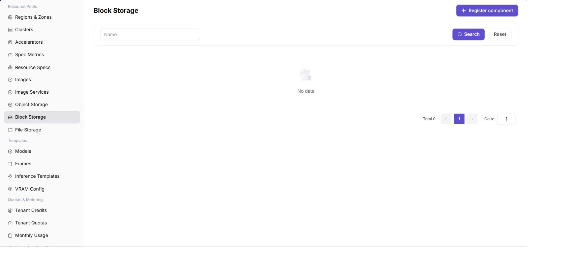

# Block Storage Component

:::: info Document Information
Version: v1.0
Updated: 2026-07-06
::::

## Feature Overview

`Block Storage Component` is used to connect volume-oriented storage capabilities. Common implementations include Ceph RBD. Block storage is suitable for providing independent disk volumes to workloads, especially scenarios that require persistent volumes, low-level block devices, or specific performance characteristics.

| Item | Content |
| --- | --- |
| Applicable Role | Operator |
| Navigation Path | Resource Pools > Block Storage Component |
| Page Route | `/powerone/resourcepool/block-storage` |
| Managed Objects | Ceph cluster, Mon addresses, FSID, RBD Pool, capacity, access credentials, and associated regions |
| Typical Use | Provide persistent block device capability for clusters or jobs |

### Terms Quick Reference

| Term | Description |
| --- | --- |
| Ceph | A distributed storage system that can provide object, block, and file capabilities. |
| Mon | Ceph Monitor, responsible for maintaining cluster status and member information. |
| FSID | The unique identifier of a Ceph cluster, used to distinguish different Ceph clusters. |
| RBD | Ceph block device capability, commonly used for Kubernetes PersistentVolume. |
| Pool | A storage pool in Ceph, used to organize RBD images and capacity policies. |
| StorageClass | A Kubernetes resource that describes how dynamic volumes are created. |

## Prerequisites

1. Ceph or an equivalent block storage service has been deployed.
2. Connection materials such as Mon addresses, FSID, Pool, authentication user, and keyring have been prepared.
3. The target Kubernetes cluster has the corresponding CSI or volume plugin capability.
4. Capacity, performance, tenant isolation, and reclaim policies have been confirmed.

## Page Description

The page displays connected block storage components, status, capacity, connection information summary, and associated regions.

The following figure shows the block storage component page.

## Register Block Storage Component

### Pre-Operation Check

1. Mon addresses are accessible from the platform and target cluster.
2. FSID, Pool, authentication user, and keyring are consistent with the underlying Ceph cluster.
3. The CSI driver has been installed and verified in the target cluster.
4. Capacity, reclaim policy, and permission boundaries have been confirmed.

### Procedure

1. Go to `Resource Pools > Block Storage Component`.
2. Click the register or add entrypoint.
3. Fill in the component name, Ceph connection information, capacity information, and associated regions.
4. If the page provides connection testing, verify the connection first.
5. After submission, return to the list and check component status.

### Parameters

| Field Name | Required | Field Type | Example | Description |
| --- | --- | --- | --- | --- |
| Component Name | Yes | Text | `ceph-rbd-prod` | Display name of the block storage component. |
| Access Protocol | Yes | Enum | `RBD` | Block storage access protocol. |
| Endpoint | Yes | URL | `https://storage.example.com` | Component access entrypoint. Use a placeholder in documentation. |
| Bound Cluster | Conditionally required | Multi-select | `cluster-a` | Clusters that are allowed to use this component. |
| Status | System-generated | Enum | `Available` | Component registration and probing status. |

### Pitfalls

- Resource pool configuration affects job scheduling. Confirm running instances before making changes.
- If a drop-down list is empty, check region, permissions, and dependent component status first.
- Prepare replacement resources and a rollback plan before deleting or disabling resources.

### Result Validation

1. The component appears in the list and its status matches expectations.
2. The target region can bind block storage capability.
3. A test workload can create, mount, unmount, and release block volumes.
4. Capacity statistics remain consistent with the underlying storage system.

## FAQ

### Block Volume Creation Fails

**Symptom:**

After a job or instance requests block storage, the volume cannot be created or remains waiting.

**Possible Causes:**

- Ceph Mon, FSID, Pool, or authentication information is configured incorrectly.
- The target cluster CSI driver is abnormal.
- The underlying storage has insufficient capacity or Pool policy restrictions.

**Solution:**

1. Check the block storage component connection information.
2. Check CSI controller and node plugin status in the target cluster.
3. Confirm Pool capacity, quotas, and permissions.

### Block Volume Mount Fails

**Symptom:**

The volume has been created, but it cannot be mounted when the container starts.

**Possible Causes:**

- The node-side CSI plugin is abnormal.
- The volume access mode does not match the workload.
- The node cannot reach the Ceph network.

**Solution:**

1. View instance events and node logs.
2. Check access mode, StorageClass, and node plugin.
3. Confirm network connectivity from nodes to Mon and OSD.

## Follow-Up Operations

1. Bind the block storage component in regions.
2. Use a test workload to verify creation, mounting, unmounting, and capacity release.
3. Include Ceph, RBD, Pool, and reclaim policies in operations inspections.

## Notes

- keyring, Ceph user keys, and kubeconfig are sensitive materials.
- Before deleting a block storage component, confirm that no running instances, PVCs, or business data depend on it.
