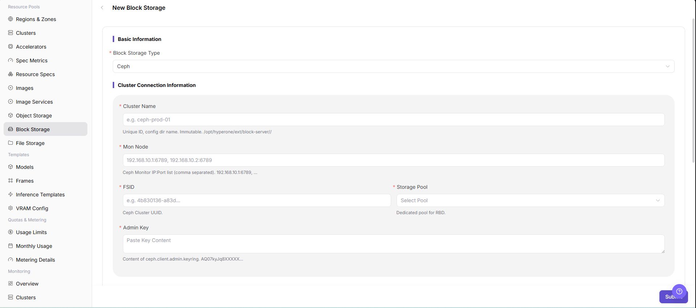

# Block Storage Component

::: info Document Information
Version: v1.0
Updated: 2026-07-08
:::

## Feature Overview

`Block Storage Component` is used to connect volume-oriented storage capabilities. Common implementations include Ceph RBD. Block storage is suitable for providing independent disk volumes to workloads, especially scenarios that require persistent volumes, low-level block devices, or specific performance characteristics.

| Item | Content |
| --- | --- |
| Applicable role | Operator |
| Navigation path | AI Infra > On-Prem > Resource Pools > Block Storage Component |
| Page route | `/powerone/resourcepool/block-storage` |
| Managed objects | Ceph cluster, Mon addresses, FSID, RBD Pool, StorageClass, capacity, access credentials, associated regions, and bound clusters |
| Typical use | Provide persistent block device capability for workload PVC creation, volume mounting, capacity display, and resource scheduling |

#### Beginner View

Block Storage Component is like the independent disk supplier for instances. It connects Ceph RBD or compatible block device capabilities to the platform. When users create instances that require persistent volumes, the platform applies and mounts block volumes according to StorageClass, capacity, access mode, and reclaim policy configured here.

#### Terms

| Term | Description |
| --- | --- |
| Ceph | A distributed storage system that can provide object, block, and file capabilities. |
| Mon Addresses | Ceph Monitor addresses used to access and discover Ceph cluster status. |
| FSID | The unique identifier of a Ceph cluster, used to distinguish different Ceph clusters. |
| RBD Pool | A Ceph storage pool that hosts RBD images. |
| StorageClass | A Kubernetes resource that describes how dynamic volumes are created. |
| Keyring/Secret | Authentication materials required to access Ceph or CSI. These are sensitive information. |
| Reclaim Policy | Policy that controls whether the underlying volume is retained or deleted after PVC deletion. |

## Prerequisites

1. Ceph or an equivalent block storage service has been deployed.
2. Connection materials such as Endpoint, Mon addresses, FSID, RBD Pool, authentication user, Keyring, or Secret have been prepared.
3. The target Kubernetes cluster has the corresponding CSI or volume plugin capability.
4. StorageClass, capacity, performance, tenant isolation, and reclaim policies have been confirmed.
5. For learning or screenshots, only view fields and dialogs without submitting real block storage component configuration.

## Page Description

The page displays connected block storage components, status, capacity, connection information summary, and associated regions.

The following figure shows the block storage component list, where component status, capacity, and connection information summary can be viewed.

## Main Operations

### Create Block Storage Component

#### Applicable Scenarios

Create a block storage component when a new Ceph RBD or compatible block storage service needs to be connected and used for workload PVC creation, volume mounting, capacity display, and resource scheduling. If the actual UI still shows `Register` or `Register Block Storage Component`, keep that real entry text in the steps.

#### Steps

1. Go to `AI Infra > On-Prem > Resource Pools > Block Storage Component`.
2. Click `Create Block Storage Component`, `Add`, `Register`, or the actual creation entry on the page.
3. Fill in component name, storage type, access protocol, Endpoint, Mon addresses, FSID, RBD Pool, and other connection information according to the page fields.
4. Configure authentication method, authentication user, Keyring or Secret, associated regions, bound clusters, capacity information, and reclaim policy as required by the page.
5. If the page provides connection testing, run the connection test first and confirm the returned result.
6. Before clicking the final `Save`, `Submit`, or `OK`, verify connection information, credential source, binding scope, and capacity impact again.
7. For learning or page validation only, view fields and dialogs without submitting real block storage component configuration.

The following figure shows the Create Block Storage Component form, used to fill in component basic information and connection parameters.

## Parameter Reference

| Parameter | Required | Description | Configuration Suggestion |
| --- | --- | --- | --- |
| Component Name | Yes | Display name of the block storage component. | Use a name that reflects storage type, environment, region, or Ceph cluster purpose. |
| Storage Type | Yes | Block storage backend type. | Select Ceph RBD or another page-supported type according to the actual backend. |
| Access Protocol | Yes | Block storage access protocol. | Keep it consistent with the underlying storage and CSI capability. |
| Endpoint | Conditionally required | Access entrypoint of the block storage or management service. | Do not record real Endpoint values in documentation. Confirm that the platform and target clusters can access it before submission. |
| Mon Addresses | Yes | Ceph Monitor address list. | Must be consistent with the underlying Ceph cluster, and target node network must be reachable. |
| FSID | Yes | Unique Ceph cluster identifier. | Obtain it from the real Ceph cluster configuration. Do not guess manually. |
| RBD Pool | Yes | Ceph Pool that hosts RBD images. | Confirm capacity, quota, permissions, and reclaim policy. |
| Authentication Method | Conditionally required | Authentication method for the block storage backend. | Select user, Keyring, Secret, or another supported method according to the page. |
| Authentication User | Conditionally required | Ceph or storage backend access user. | Use minimum required permissions and do not record real accounts. |
| Keyring/Secret | Conditionally required | Key material for accessing Ceph or CSI. | Maintain it only in system forms or Secrets. Do not write it into documentation. |
| StorageClass | Conditionally required | Kubernetes dynamic volume creation configuration. | Keep it consistent with CSI driver, Pool, access mode, and reclaim policy. |
| Associated Region | Conditionally required | Region scope where the block storage component can be bound or visible. | Keep it consistent with resource pools, availability zones, clusters, and data scope. |
| Bound Cluster | Conditionally required | Clusters that can use this block storage component. | Before binding, confirm cluster CSI, network, and node plugin status. |
| Capacity Information | No | Total capacity, available capacity, or quota information. | Keep it consistent with the underlying storage system statistics. |
| Reclaim Policy | Conditionally required | Volume handling policy after PVC deletion. | Choose delete policies carefully in production to avoid accidental data deletion. |
| Status | System-generated | Component registration, connection test, and probe status. | After creation, watch status, update time, and error messages. |
| Actions | No | Supports create, edit, enable, disable, delete, test connection, and other operations. | Confirm impacts on workloads, PVCs, and data before high-risk operations. |

## Pitfalls

- Creating a block storage component may affect workload PVC creation, volume mounting, capacity display, and resource scheduling.
- Incorrect Mon addresses, FSID, Pool, StorageClass, CSI configuration, or Keyring may cause volume creation failure, mount failure, or data unavailability.
- StorageClass, Pool, and access mode must match the target cluster CSI capability. Otherwise, volumes may be created but fail to mount.
- Before expanding a block volume, confirm that the underlying storage, file system, and workload all support online expansion.
- Before unmounting or deleting a block volume, confirm that the instance has stopped writing to avoid file system corruption or data loss.
- `Save`, `Submit`, and `OK` are high-risk final actions.
- Do not record real Endpoint values, Mon addresses, FSID, Pool names, Keyring, Secret, kubeconfig, cluster IDs, resource pool IDs, accounts, keys, tokens, or internal test parameters.

## Result Validation

| Check Item | Expected Result | Troubleshooting |
| --- | --- | --- |
| Page can be opened | `AI Infra > On-Prem > Resource Pools > Block Storage Component` is accessible. | Check menu configuration and account permissions. |
| List loads normally | Block storage component list, status, capacity, and connection information summary are displayed normally. | Refresh the page and check service status or browser console errors. |
| Creation entry is visible | `Create Block Storage Component`, `Add`, `Register`, or the actual creation entry is displayed. | Check operator permissions, License, and page configuration. |
| Creation form can be opened | Clicking the entry shows fields such as component name, access protocol, Endpoint, Mon addresses, FSID, and RBD Pool. | Check route, permissions, and frontend errors. |
| Required field validation works | Validation prompts appear when component name, Mon addresses, FSID, Pool, authentication information, or binding scope is missing. | Complete fields according to page prompts without bypassing validation. |
| No real submission during learning | No real save, submit, or OK action is triggered. | If submitted by mistake, immediately verify the component list and binding scope. |
| Status is traceable after real submission | The component appears in the list, and status matches expectations. | Check connection information, credentials, CSI configuration, and connection test result. |
| Binding scope can be verified | The target region or cluster can bind block storage capability. | Check component status, region, cluster, and permissions. |
| Volume lifecycle can be verified | A test workload can create, mount, unmount, and release a block volume. | Check CSI controller, node plugin, StorageClass, Pool, and node network. |
| Capacity statistics are consistent | Page capacity statistics remain consistent with the underlying storage system. | Check collection scope, quota, and sync status. |

## FAQ

#### Block Volume Creation Fails

**Symptom:**

After a job or instance requests block storage, the volume cannot be created or remains waiting.

**Possible Causes:**

- Ceph Mon, FSID, Pool, or authentication information is configured incorrectly.
- StorageClass or CSI configuration does not match.
- The target cluster CSI driver is abnormal.
- The underlying storage has insufficient capacity or Pool policy restrictions.

**Solution:**

1. Check the block storage component connection information.
2. Check StorageClass, CSI parameters, FSID, and Pool configuration.
3. Check CSI controller and node plugin status in the target cluster.
4. Confirm Pool capacity, quotas, and permissions.

#### Block Volume Mount Fails

**Symptom:**

The volume has been created, but it cannot be mounted when the container starts.

**Possible Causes:**

- The node-side CSI plugin is abnormal.
- The volume access mode does not match the workload.
- The node cannot reach Ceph Mon or OSD network.
- Keyring, Secret, or authentication user permissions are insufficient.

**Solution:**

1. View instance events and node logs.
2. Check access mode, StorageClass, and node plugin.
3. Confirm network connectivity from nodes to Mon and OSD.
4. Verify Keyring, Secret, and authentication user permissions.

## Next Steps

1. Bind the block storage component in regions or target clusters.
2. Use a test workload to verify creation, mounting, unmounting, and capacity release.
3. Include Ceph, RBD Pool, StorageClass, CSI status, and reclaim policies in operations inspections.
4. Regularly verify capacity statistics, Pool quotas, and abnormal events.

## Notes

- Creating a block storage component may affect workload PVC creation, volume mounting, capacity display, and resource scheduling.
- keyring, Ceph user keys, Secret, and kubeconfig are sensitive materials.
- Before deleting a block storage component, confirm that no running instances, PVCs, PVs, or business data depend on it.
- `Save`, `Submit`, and `OK` are high-risk final actions. Do not trigger them during learning or screenshots.
- Do not record real Endpoint values, Mon addresses, FSID, Pool names, Keyring, Secret, kubeconfig, cluster IDs, resource pool IDs, accounts, keys, tokens, or internal test parameters.
