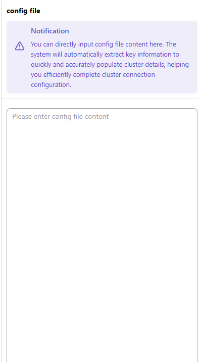
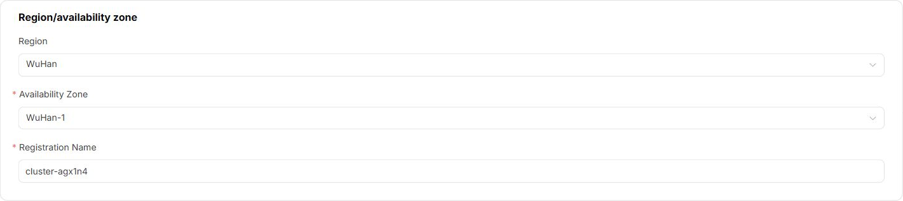
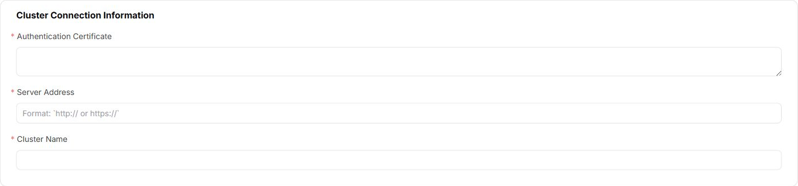
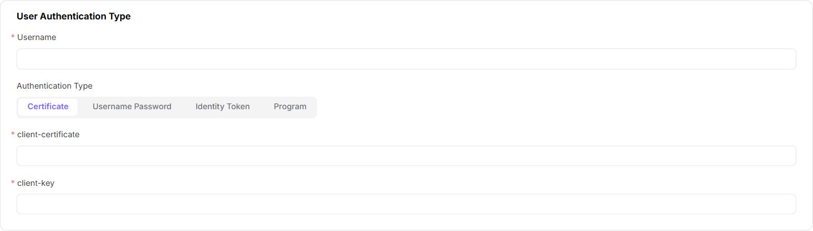
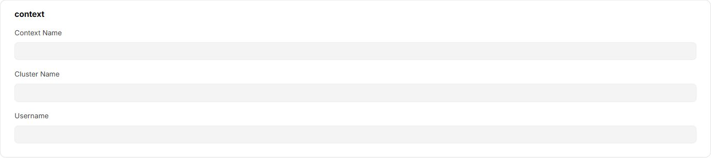
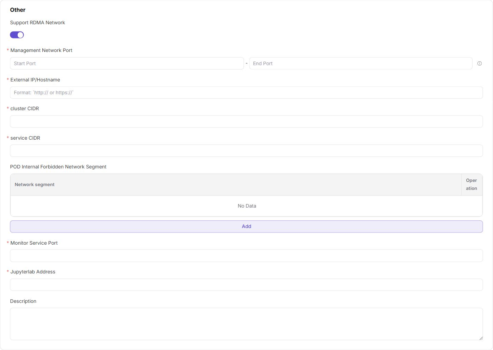

# Cluster Management

:::: info Document Information
Version: v1.0
Updated: 2026-07-06
::::

## Overview

`Cluster Management` is used to connect Kubernetes clusters, the container orchestration system for managing compute nodes, containers, and job scheduling, to AI Infra-On Prem resource pools. It also provides ongoing management for cluster specifications, shared storage, node status, job distribution, and resource monitoring. After the operator registers a cluster, the platform can schedule development, training, inference, and other jobs in the corresponding region and availability zone.

| Item | Description |
| --- | --- |
| Applicable role | Operator |
| Navigation path | Resource Pools > Cluster Management |
| Managed objects | Kubernetes clusters, cluster specifications, cluster storage, nodes, jobs, and resource monitoring |
| Typical uses | Connect compute clusters, view resource capacity, maintain node status, configure available job specifications, and configure shared directories |

### Beginner's View

You can understand an On-Prem resource pool as an office resource system:

- **Region/availability zone** is like a resource map. It tells the platform which city, machine room, or resource group the compute resources are in.
- **Cluster** is like the group of servers that actually provides compute resources. The platform can schedule jobs to these machines only after the cluster is registered.
- **Node** is like a workstation in the server group. Each node provides specific resources such as CPU, GPU, memory, and disks.
- **Specification** is like a resource package. It defines how much CPU, memory, GPU, and other resources a job can request.
- **Storage** is like a shared file cabinet. It allows jobs to read models, datasets, code repositories, or output results.
- **Job** is like a concrete task. After submission, the platform schedules it to resources that match the region, availability zone, cluster, specification, and storage conditions.

The core purpose of registering a cluster is to connect actual compute resources to the platform scheduling system. Without cluster registration, even if regions and availability zones have been created, the platform still has no schedulable node resources.

### First-Time Onboarding Flow

For first-time cluster onboarding, perform the following steps in order:

1. Confirm that the target region and availability zone have been created and that their status meets onboarding expectations.
2. Prepare the kubeconfig or authentication materials, including the API Server address, CA certificate, authentication method, and corresponding credentials.
3. Register the cluster in `Resource Pools > Cluster Management` and verify the automatically populated connection information.
4. Associate specifications with the cluster so that later jobs can select suitable resource packages.
5. Add shared storage as required by the business, such as NFS or hostpath.
6. View the node list and resource monitoring data, and confirm that nodes, resource usage, and monitoring data are visible.
7. Create a test job to verify image pulling, resource scheduling, storage mounting, and job results.

### Terminology Quick Reference

| Term | Description |
| --- | --- |
| Kubernetes | A container orchestration system used to manage compute nodes, containers, service discovery, and job scheduling. |
| kubeconfig | A Kubernetes connection configuration file, usually provided by the cluster administrator. It contains cluster addresses, certificates, users, and authentication information. |
| API Server | The Kubernetes control entry point. The platform uses it to read node, resource, job, and other information. |
| CA certificate | A certificate used to verify the identity of the API Server and prevent connections to an incorrect or untrusted cluster entry point. |
| context | A connection configuration combination in kubeconfig that associates the cluster, user, and naming information. The page usually generates or imports it automatically. |
| Pod | The smallest scheduling unit for running containers in Kubernetes. Training, inference, or IDE jobs eventually run as Pod or similar resources. |
| CIDR | IP network segment notation, such as `172.20.0.0/16`, used to describe a continuous IP address range. |
| NodePort | A Kubernetes service exposure port range. The platform may access cluster-side services through this range. |
| RDMA network | An advanced option related to high-speed networking capabilities. Enable it only when hardware, drivers, and network planning explicitly support it. |
| kubelet | A Kubernetes component that runs on nodes. It manages containers on the node and reports node status. |
| kube-proxy | A Kubernetes network component that runs on nodes. It manages service access and forwarding rules. |
| Label | A key-value marker on a node or resource, used for filtering, grouping, and scheduling matches. |
| Taint | A scheduling restriction on a node, used to prevent jobs that do not meet conditions from being scheduled to the node. |
| EL expression | An advanced option for storage tenant scope, used to dynamically generate tenant directories according to rules. It is generally not required. |

## Prerequisites

Before registering or maintaining a cluster, confirm that the following conditions are met:

1. The current account has operator permissions and can access `Resource Pools > Cluster Management`.
2. The target region and availability zone have been created in `Resource Pools > Regions/Availability Zones` and are in a state that can be used for cluster onboarding.
3. The Kubernetes API Server can be accessed from the platform management side.
4. Cluster connection information has been prepared, including the CA certificate, API Server address, cluster name, and administrator authentication materials.
5. The network administrator has confirmed that network configurations such as Pod CIDR, Service CIDR, and NodePort port range do not conflict with the existing environment.
6. If NFS storage needs to be added, the NFS service address, shared path, and access permissions have been prepared in advance.
7. If monitoring data needs to be viewed, node-side monitoring collection has been deployed and can report data.

## Page Description

The Cluster Management page mainly includes the cluster list, cluster details drawer, cluster nodes page, and node details drawer.

The following figure shows the cluster list entry, cluster cards, resource usage, and cluster operation entry points.

### Cluster List

The cluster list is used to view connected clusters, filter clusters, and access cluster operations.

| Area | Description |
| --- | --- |
| Status filter | Filters clusters by statuses such as `All`, `Available`, `Unavailable`, `Onboarding`, `Failed`, and `Pending Approval`. |
| Region/availability zone filter | Filters clusters by their region and availability zone. |
| Search area | Supports searching by name, node count, and other conditions. |
| View switch | Supports grid and list views so that clusters can be viewed at different densities. |
| Cluster card | Displays the cluster name, status, region/availability zone, specifications, node count, and GPU, CPU, MEM, and DISK usage. |
| More actions | Opens cluster details or cluster nodes, or performs cluster-level operations such as disable and enable. If the page provides a delete entry, confirm running jobs, storage data, and dependencies before deletion. |

### Cluster Details

The cluster details drawer is used to view the resource overview and configuration relationships of a single cluster, including device information, basic information, associated specifications, and storage.

### Cluster Nodes

The cluster nodes page is used to view the node list, node resource usage, and job information. The node details drawer further displays hardware, network, runtime, labels, taints, and monitoring charts.

## Register a Cluster

### Applicable Scenarios

Register a cluster when a new Kubernetes cluster needs to be included in unified platform scheduling, monitoring, and resource management. The following scenarios usually require cluster registration:

- The On-Prem resource pool is deployed for the first time, and region and availability zone configuration has been completed.
- A new machine room, newly purchased compute resources, or a newly created Kubernetes cluster needs to be scheduled by the platform.
- Compute resources from different environments, departments, or tenants need to be grouped and connected to a unified operations view.
- Available nodes, specifications, and shared storage need to be provided for later jobs.

### Read Before Registration

Before filling in the registration form, understand the following key fields:

- **kubeconfig**: Usually provided by the cluster administrator. It contains the cluster address, CA certificate, user, and authentication information. After you paste the kubeconfig, the page attempts to automatically populate some fields, but you still need to manually verify the region/availability zone, server address, authentication method, and context.
- **API Server**: The Kubernetes control entry point. The platform needs to read node, resource, job, and status information through the API Server.
- **CA certificate**: Used to verify the API Server identity. The certificate content is not an account password, but it is still sensitive material and should not be leaked.
- **Authentication materials**: These may be a client certificate/private key, username and password, token, or auth-provider information. Different authentication methods require different fields.
- **CIDR**: IP network segment notation. `cluster CIDR` usually corresponds to the Pod address range, and `service CIDR` corresponds to the Service address range. Confirm in advance that they do not conflict with the platform, nodes, office network, or other cluster network segments.
- **NodePort**: A Kubernetes service exposure port range. The current page port input supports `1-65535`. Fill it in according to cluster and network planning.
- **Support RDMA network**: An advanced switch. If you are not sure whether the underlying hardware, drivers, and network planning support it, keep it disabled and contact platform operations for confirmation.

### Pre-Operation Checks

Before registration, complete the following checks:

1. The target Kubernetes cluster API Server address can be accessed from the platform side.
2. Authentication materials are valid and have the permissions required to read nodes, resources, and jobs.
3. The target region and availability zone exist and can be used to register the cluster.
4. Cluster network planning has been confirmed, and the Pod CIDR, Service CIDR, and NodePort range do not conflict with the existing network.
5. If `Support RDMA network` is enabled, the underlying hardware, drivers, network, and scheduling plan have been confirmed to support it.
6. The registration name has been determined according to long-term operations planning. Use lowercase letters, numbers, and hyphens, and reflect the environment, region, and purpose, such as `prod-wuhan-gpu-1`.

### Procedure

1. Go to `Resource Pools > Cluster Management`.
2. Click `Cluster Registration` in the upper-right corner of the page to open the `Cluster Creation` page.
3. If the kubeconfig has been prepared, paste the configuration content in the `config file` panel on the right. The system attempts to automatically extract and populate part of the cluster connection information.

The following figure shows the kubeconfig paste area on the right, which is suitable for quickly importing cluster connection information.

4. In the `Region/Availability Zone` section, select the cluster ownership and enter the registration name.

The following figure shows the region, availability zone, and registration name fields. The registration name is an important identifier for the platform to recognize the cluster.

5. In the `Cluster Connection Information` section, enter the CA certificate, API Server address, and cluster name.

The following figure shows the cluster connection information section. Focus on verifying the CA certificate, server address, and cluster name.

6. In the `User Authentication Type` section, select the authentication method and enter the corresponding authentication materials.

The following figure shows the user authentication type section. You can select certificate, username/password, identity token, or authentication program authentication.

7. In the `context` section, check the context information automatically generated by the system. This section is usually populated automatically and does not need manual editing.

The following figure shows automatically generated context information, which associates the cluster, user, and connection configuration.

8. In the `Other` section, enter advanced configurations such as network, ports, monitoring service, JupyterLab address, and description.

The following figure shows the advanced configuration section for network, ports, monitoring, and description.

9. After confirming that all configurations are correct, click `Submit`.

### Parameter Description

| Field Name | Required | Field Type | Example | Description |
| --- | --- | --- | --- | --- |
| Object name | Yes | Text | `resource-a` | Name of the current page object. |
| Region | Conditionally required | Dropdown | `Wuhan` | Region to which the object belongs. |
| Associated resource | Conditionally required | Text | `cluster-a` | Resource that the object depends on or is associated with. |
| Status | System generated | Enum | `Available` | Current status of the object. |
| Maintenance notes | No | Multi-line text | `Used for production environment` | Records purpose, boundaries, and maintenance information. |

### Pitfalls

- kubeconfig auto-fill can reduce manual input, but it cannot replace manual verification. Pay special attention to the region/availability zone, server address, authentication type, and context.
- Certificates, private keys, tokens, passwords, and complete kubeconfig files are sensitive materials. Do not write them into documents, screenshots, tickets, or commit records.
- Incorrect CIDR values or conflicts with the existing network may cause Pod, Service, or platform access exceptions. Confirm them with the network administrator before submission.
- Selecting the wrong authentication method may cause registration failure or node read failure. Keep it consistent with the kubeconfig provided by the cluster administrator.
- If the API Server is unreachable, the platform cannot connect to the cluster even if the form fields are correctly formatted.
- The registration name should remain stable for long-term use. Avoid temporary or meaningless names such as `test1` and `aaa`.

### Result Verification

After submission succeeds, confirm that the cluster has been connected as follows:

1. Return to the `Cluster Management` list and confirm that the new cluster appears.
2. Confirm that the cluster status changes to `Onboarding`, `Available`, or another expected status.
3. Open cluster details and confirm that device information, basic information, and resource usage are displayed normally.
4. Go to `Cluster Nodes` and confirm that the node list is visible and node status is `Ready` or as expected.
5. If monitoring has been configured, open node resource monitoring and confirm that the charts can be loaded.
6. If jobs will be created later, confirm that the cluster has associated available specifications.

## View Cluster Details

View cluster details when you need to confirm cluster capacity, basic information, specifications, and storage configuration.

### Applicable Scenarios

View cluster details when you need to verify cluster status, resource capacity, region/availability zone ownership, associated specifications, or storage configuration.

1. Find the target cluster in the cluster list.
2. Click the target cluster card, or click `...` on the target cluster and select `Cluster Details`.
3. In the details drawer, view device information, basic information, associated specifications, and storage configuration.

### View Device Information

Device information is used to quickly view the overall resource capacity and usage of the cluster, including CPU, GPU, running jobs, memory, and disks.

The following figure shows the overview of overall cluster CPU, GPU, jobs, memory, and disk capacity.

If CPU, memory, GPU, or disk usage is close to full, continue checking node resources, job distribution, and monitoring data to determine whether expansion, job migration, or abnormal node removal is required.

### View Basic Information

Basic information is used to confirm the cluster ID, name, status, region/availability zone, and creation time.

The following figure shows the cluster basic information section, which is suitable for verifying cluster ownership, name, and current status.

When the cluster status is abnormal, first confirm API Server connectivity, authentication material validity, node status, and whether platform-side monitoring collection is normal.

### View Associated Specifications

Associated specifications determine which job specifications the cluster can carry.

The following figure shows the associated specifications list. When users create jobs, they can select only specifications that meet the association relationship.

If users cannot select a specification when creating a job, check whether the specification has been associated with the target cluster and whether the specification itself is available.

### View Storage

The storage section displays the container shared directories configured for the cluster, including type, access policy, shared path, container path, tenant scope, and operation entries.

The following figure shows the cluster storage list. The edit and delete storage entries are available on the right.

Storage configuration affects job data read/write, model weight loading, and local repository paths. Before modifying or deleting storage, confirm that no running jobs depend on the directory.

## Manage Cluster Specifications

### Associate Specifications

When a cluster needs to carry jobs with specific CPU, memory, GPU, or specification combinations, associate specifications with the cluster.

#### Applicable Scenarios

When jobs need to use specific CPU, memory, GPU, or specification combinations but the target cluster has not enabled the specification, associate the specification with the cluster first.

1. Open `Cluster Details` for the target cluster.
2. In the `Associated Specifications` section, click `+ Associate Specification`.
3. Select one or more specifications in the dialog.
4. Click `OK` to save.

The following figure shows the associate specification dialog. Select specifications and save to establish the availability relationship between the cluster and specifications.

### Result Verification

After saving, confirm that the selected specifications appear in the `Associated Specifications` list. When creating jobs later, if the selected region, availability zone, and cluster resource scope match, the associated specifications should be available.

## Manage Cluster Storage

### Add Storage

When jobs need shared directories, model repositories, local Git repositories, or NFS directories, add storage for the cluster. The current Add Storage dialog supports two storage types: `nfs` and `hostpath`.

### Confirm Before Adding

Before adding storage, confirm the following:

1. The shared path exists or has been created according to operations standards.
2. The NFS service address can be accessed from cluster nodes, and the exported directory, read/write permissions, and network policy are correct.
3. The `hostpath` path exists on the target node and does not cause job failures because of dependency on a single abnormal node.
4. The container path does not conflict with system directories, application directories, or other mount paths.
5. The tenant scope has been clearly planned to prevent multiple tenants from accidentally reading or writing the same directory.
6. Whether the path needs to be used as a local Git repository or local model repository directory has been confirmed.

### Procedure

1. Open `Cluster Details` for the target cluster.
2. In the `Storage` section, click `+ Add`.
3. Enter the storage name, type, access policy, shared path, container path, and tenant scope.
4. Enable `Local Git Repository` and `Local Model Repository` as needed.
5. Click `OK` to save.

The following figure shows the Add Storage dialog. You can select `nfs` or `hostpath`, and set the policy, paths, and tenant scope.

### Parameter Description

| Field Name | Required | Field Type | Example | Description |
| --- | --- | --- | --- | --- |
| Name | Yes | Text | `prod-model-nfs` | Storage volume identifier. It should reflect the purpose, environment, and scope. |
| Type | Yes | Radio | `nfs` / `hostpath` | `nfs` is suitable for network shared directories. `hostpath` is suitable for mounting local directories on the host. |
| Policy | Yes | Radio | `Read/Write` / `Read Only` | Storage access permission. Production environments should follow the principle of least privilege. |
| File storage service | Conditionally required | Text | `nfs.example.local` | Enter the NFS service address when `nfs` is selected. It is usually not required when `hostpath` is selected. |
| Shared path | Yes | Text | `/data/models` | Shared directory on the host or NFS server. Confirm that the path exists and permissions are correct. |
| Container path | Yes | Text | `/mnt/models` | Mount path inside the job container. Avoid conflicts with system directories or application directories. |
| Tenant scope | Yes | Radio | `Shared by all tenants` / `Independent subdirectory per tenant` / `EL expression` | Controls isolation when different tenants access the same storage. `EL expression` is an advanced option used to dynamically generate tenant directories according to rules. It is generally not required. |
| Local Git repository | Yes | Switch | On / Off | Whether to use the path as a local Git repository directory. |
| Local model repository | Yes | Switch | On / Off | Whether to use the path as a local model repository directory. |

### Edit Storage

Edit storage when the storage path, access policy, or tenant scope needs to be adjusted.

1. Open `Cluster Details` for the target cluster.
2. Find the target storage in the `Storage` list.
3. Click `Edit`.
4. Adjust the fields and click `OK`.

Before editing, confirm whether any running jobs are using the storage. Path or permission changes may cause job read/write failures.

### Delete Storage

Delete a storage configuration when the storage is no longer used.

> Risk Notice
>
> Deleting storage configuration may affect jobs, models, or repositories that depend on the directory. Before the operation, confirm that no running jobs depend on it, data has been backed up, and model/repository paths are no longer used.

### Confirm Before Deleting

Before deleting storage, confirm the following:

1. No running jobs depend on the storage.
2. Data that needs to be retained has been backed up or migrated.
3. Model repositories, local Git repositories, or business scripts no longer reference the path.
4. Deleting the platform storage configuration does not necessarily mean that the underlying shared directory is deleted. Handle underlying data according to the operations process.

### Procedure

1. Open `Cluster Details` for the target cluster.
2. Find the target storage in the `Storage` list.
3. Click `Delete`.
4. Read the confirmation prompt and submit.

## View Cluster Nodes and Jobs

### View Node List

The node list is used to view cluster node status, roles, and node-level resource usage.

#### Applicable Scenarios

View the node list when you need to confirm whether nodes are online, whether resources are tight, whether node roles are correct, or whether jobs can continue to be scheduled.

1. Find the target cluster in the cluster list.
2. Click `...` on the target cluster.
3. Select `Cluster Nodes`.
4. View the node list on the `Node Information` tab.

The following figure shows the Node Information tab, where you can view node status, resource usage, and Kubernetes node status.

Focus on the following information:

- Whether the node status is available.
- Whether the Kubernetes node status is `Ready`.
- Whether the node role is as expected, such as `master` or `worker`.
- Whether CPU, GPU, memory, and disk utilization increases abnormally.

### View Job Information

The `Job Information` tab is used to view running instances and online IDE jobs carried by the cluster.

1. Go to the `Cluster Nodes` page of the target cluster.
2. Switch to the `Job Information` tab.
3. View jobs by `Running Instances`, `Online IDE`, `Running Jobs`, or `Historical Jobs`.
4. Search for the target job by job name.

The following figure shows the Job Information tab, where you can view tasks carried by the cluster by job type.

When troubleshooting job issues, focus on job status, image, specification, node, region/availability zone, and running duration.

### View Node Details

Node details are used to confirm the hardware, network, runtime, labels, and taints of a single node.

1. In `Cluster Nodes > Node Information`, find the target node.
2. Click `Details` on the right side of the node row.
3. View each information section in the node details drawer.

The following figure shows the node details drawer, where you can view basic information, hardware, network, runtime, labels, and taints.

Common troubleshooting information in node details includes:

- Basic information: node name, role, status, operating system, kernel version, and architecture.
- Hardware information: CPU, memory, disk, and GPU configuration, used to determine node capacity and hardware capability.
- Network information: internal IP, external IP, and Pod CIDR, used to determine node network ownership and Pod address range.
- Runtime: `kubelet` manages node containers and status reporting; `kube-proxy` manages service forwarding rules; the container runtime actually starts containers; heartbeat time is used to determine whether the node remains online.
- Labels: used for scheduling filters and resource grouping, such as distinguishing GPU nodes, CPU nodes, or nodes in a specific machine room.
- Taints: used to restrict normal jobs from being scheduled to specific nodes. They are common on dedicated nodes, maintenance nodes, or special hardware nodes.

### View Node Resource Monitoring

Resource monitoring is used to observe resource change trends for a node within a specified time range.

1. In `Cluster Nodes > Node Information`, find the target node.
2. Click `Resource Monitoring` on the right side of the node row.
3. In the node details drawer, switch to the `Resource Monitoring` tab.
4. Select the start time, end time, sampling interval, and data type.
5. Switch between `Basic Monitoring`, `AI Accelerator Card Monitoring`, and `Network Monitoring` as needed.

The following figure shows the Node Resource Monitoring tab, where you can view basic monitoring, AI accelerator card monitoring, and network monitoring by time range.

If the monitoring chart is empty, first check the monitoring service port, collection components, node connectivity, and query time range.

## Manage Cluster Status

### Search and Filter

| Operation | Result |
| --- | --- |
| Search by name | Enter cluster name keywords and click `Search` to locate the target cluster. |
| Search by node count | Enter the node count and click `Search` to filter clusters that meet the condition. |
| Status filter | Narrow the scope by statuses such as available, unavailable, onboarding, failed, and pending approval. |
| Region/availability zone filter | View only clusters in the specified region or availability zone. |
| Reset filters | Clear current filter conditions and restore the default list. |

### Switch Views

Click the view switch button on the page to switch between grid view and list view. Grid view is suitable for viewing resource overviews, while list view is suitable for scanning fields in batches.

### Disable or Enable a Cluster

When a cluster needs maintenance, needs to be taken offline, or needs to stop carrying new jobs temporarily, disable the cluster. After the cluster becomes available again, enable it through the page entry.

> Risk Notice
>
> Disabling a cluster may affect new job scheduling. The impact on running jobs is subject to the page confirmation prompt and platform scheduling policy. Confirm the maintenance window and alternative resources before the operation.

### Confirm Before Disabling

Before disabling a cluster, confirm the following:

1. No critical new jobs depend on the cluster.
2. The impact scope of existing running jobs, online IDE, or service instances has been confirmed.
3. Other available clusters can take over later scheduling.
4. The maintenance window, notification scope, and rollback plan have been confirmed.

### Procedure

1. Find the target cluster in the cluster list.
2. Click `...` on the target cluster.
3. Select `Disable Cluster` or the corresponding enable operation.
4. Read the confirmation prompt and submit.

### Delete a Cluster

If the page provides a delete entry, confirm running jobs, storage data, and dependencies before deletion. If there is no delete entry, do not directly clean up cluster records by bypassing the page.

> Risk Notice
>
> Deleting a cluster is a high-risk operation and may cause the platform to stop managing the cluster and its node resources. Before deletion, make sure that jobs, specifications, storage, and operations dependencies have all been handled.

### Confirm Before Deleting

Before deleting a cluster, confirm the following:

1. The cluster has no running jobs, online IDE, or service instances that need to be retained.
2. Nodes no longer carry platform scheduling tasks.
3. Shared storage, model repositories, Git repositories, and business data have been migrated or backed up.
4. Specifications and job dependencies associated with the cluster have been migrated to other clusters.
5. Operations, business teams, and platform administrators have confirmed the deletion window and rollback plan.

## Configuration Rules and Impact

- **Configuration order**: Create the region and availability zone first, and then register the cluster under the corresponding availability zone.
- **Cluster onboarding dependencies**: API Server reachability, valid authentication materials, and correct CIDR and port planning are prerequisites for cluster onboarding.
- **kubeconfig auto-fill**: Pasting kubeconfig can improve form completion efficiency, but automatic parsing results still need manual verification.
- **Network configuration**: `cluster CIDR`, `service CIDR`, and NodePort range should be filled in according to network planning to avoid conflicts with platform, node, and service network segments.
- **Specification association**: Clusters without associated specifications may be unable to carry certain job specifications.
- **Storage binding**: `hostpath` depends on node-local paths, and `nfs` depends on network shared paths. Nonexistent paths, insufficient permissions, or unreachable services can all cause job mount failures.
- **Node status**: A node being `Ready` does not mean resources are sufficient. CPU, GPU, memory, disk, and job distribution must also be considered.
- **Monitoring data**: Monitoring charts are used for trend analysis. If data is missing, troubleshoot collection components, ports, and time ranges together.
- **Disable impact**: Disabling a cluster affects new job scheduling. Confirm running jobs, alternative resources, and the maintenance window before the operation.

## FAQ

### The Cluster Does Not Appear in the List After Registration

**Symptom:** After submitting registration and returning to the cluster list, the new cluster is not visible.

**Possible causes:**

- Current filters have filtered out the new cluster.
- The cluster is still onboarding, or the registration result has not been refreshed.
- The registration name does not match the search condition.
- The registration request failed, but the error prompt was not handled in time.

**Resolution:**

1. Click `Reset` to clear filter conditions.
2. Check whether the list is filtered by status, region, or availability zone.
3. Search by registration name keyword.
4. Refresh the page and check again.
5. If it is still not visible, return to the registration page or operation records to confirm whether the submission succeeded.

### Cluster Registration Fails

**Symptom:** Registration fails after submission, or the page reports exceptions in connection, authentication, or network fields.

**Possible causes:**

- The API Server address cannot be accessed from the platform side.
- The CA certificate, client certificate, private key, token, or password is invalid.
- The authentication method is inconsistent with the authentication materials in kubeconfig.
- The Pod CIDR, Service CIDR, or port range conflicts with network planning.
- The target region or availability zone cannot be used for cluster onboarding.

**Resolution:**

1. Check whether the API Server address can be accessed from the platform side.
2. Verify the CA certificate, authentication method, and authentication materials with the cluster administrator.
3. Check whether the Pod CIDR, Service CIDR, and port range comply with network planning.
4. Check the status of the target region and availability zone.
5. Locate the specific field according to the page error prompt and resubmit.

### Cluster Status Is Unavailable

**Symptom:** The cluster appears in the list, but its status is not available, or resource information cannot be loaded normally.

**Possible causes:**

- The Kubernetes API Server is inaccessible.
- Authentication materials have expired or permissions are insufficient.
- Nodes are not in the `Ready` state.
- Network connectivity between the platform side and the cluster side is abnormal.
- Monitoring or resource collection components are not working normally.

**Resolution:**

1. Check whether the Kubernetes API Server is accessible.
2. Check whether authentication materials have expired or permissions are insufficient.
3. Go to the cluster nodes page and check whether nodes are `Ready`.
4. Check network connectivity between the platform side and the cluster side.
5. View node resource monitoring or collection component status, and confirm whether data is reported normally.

### The Node List Is Empty

**Symptom:** After entering `Cluster Nodes`, the node information list has no data.

**Possible causes:**

- Cluster registration has not been completed and is still onboarding.
- The authentication account does not have permission to read nodes.
- The Kubernetes cluster itself has no visible nodes.
- API Server connection or permission verification is abnormal.

**Resolution:**

1. Confirm that cluster registration has been completed and is not onboarding.
2. Check whether the authentication account has permission to read nodes.
3. Check whether the Kubernetes cluster itself has nodes.
4. Refresh the page or reopen the cluster nodes page.
5. If the list is still empty, contact the cluster administrator to verify API Server and RBAC permissions.

### A Specification Cannot Be Selected

**Symptom:** Users cannot select a specification when creating a job, or the target specification does not appear in the specification list.

**Possible causes:**

- The target specification has not been associated with the cluster.
- The specification itself is not enabled or does not match the current job type.
- The region, availability zone, or cluster scope selected for the job is inconsistent with the specification association.

**Resolution:**

1. Open cluster details and confirm that the target specification has been associated.
2. Check whether the specification itself is enabled.
3. Check whether the region, availability zone, and cluster scope selected for the job are consistent with the specification association.
4. After saving the specification association, re-enter the job creation flow and confirm whether the specification appears.

### Storage Mount Is Abnormal

**Symptom:** After a job starts, it cannot access the shared directory, or read/write to the mount path fails.

**Possible causes:**

- The shared path or container path is incorrect.
- The `nfs` service address is unreachable, the directory is not exported, or permissions are insufficient.
- The `hostpath` target node local path does not exist or permissions are insufficient.
- The tenant scope or read/write policy is inconsistent with business expectations.
- The container path conflicts with the application directory or system directory.

**Resolution:**

1. Check whether the shared path and container path are correct.
2. For `nfs`, check the NFS service address, directory export, and network connectivity.
3. For `hostpath`, check whether the target node local path exists and has correct permissions.
4. Check whether the tenant scope and read/write policy meet business expectations.
5. Use a test job to verify whether the directory is readable and writable.

### Resource Monitoring Has No Data

**Symptom:** The node resource monitoring chart is empty, or only some monitoring types have data.

**Possible causes:**

- The monitoring service port is incorrect or inaccessible.
- The node monitoring collection component is not running.
- The query time range has no data points.
- The target node is offline or in an abnormal state.

**Resolution:**

1. Check whether the monitoring service port is correct.
2. Check whether the node monitoring collection component is running.
3. Adjust the query time range and sampling interval.
4. Check whether the target node is online.
5. If only AI accelerator card monitoring is empty, confirm whether the node has the corresponding accelerator card and collection capability.

### The Registration Name Is Not Standardized and Is Difficult to Maintain Later

**Symptom:** The cluster has been registered, but the registration name is unclear, making it difficult to identify region, environment, purpose, or capacity ownership during later troubleshooting.

**Possible causes:**

- A temporary name was used, such as `test1`.
- A name with no business meaning was used, such as `aaa`.
- A name without environment or region information was used, such as `cluster01`.
- No unified naming plan was defined before registration.

**Resolution:**

1. When creating a new cluster, prioritize names that reflect the environment, region, and purpose.
2. Recommended names: `wuhan-gpu-1`, `prod-wuhan-gpu-1`, `dev-shanghai-cpu-1`.
3. Not recommended: `test1`, because its test meaning becomes invalid over time; `aaa`, because it cannot identify resource ownership; `cluster01`, because it lacks region and purpose information.
4. If the page does not provide an entry to edit the registration name, the name will affect operations identification for a long time. If the name already affects maintenance, plan new cluster onboarding and job migration.

### Should the Storage Type Be nfs or hostpath?

**Symptom:** When adding storage, you are not sure whether to select `nfs` or `hostpath`.

**Possible causes:**

- Network shared directories and node-local directories are not distinguished.
- It is unclear whether jobs will be scheduled across nodes.
- It is unclear whether data needs to be shared across multiple nodes.

**Resolution:**

1. For multi-node sharing, model repositories, or dataset sharing, prefer `nfs`.
2. Consider `hostpath` only when the job depends on a single node-local directory and the job scheduling scope is controllable.
3. If a job may be scheduled to different nodes, do not use a `hostpath` that exists only on a single node casually.
4. In production environments, use a test job to verify read/write and mount paths before adding storage.

### Disabling a Cluster Fails or the Impact Scope Is Unclear

**Symptom:** Disabling or enabling fails after clicking the operation, or you are not sure which jobs disabling will affect.

**Possible causes:**

- The cluster still has running jobs or online IDE.
- The current account has insufficient permissions.
- The platform detects resource dependencies or a status that does not allow switching.
- The business side has not prepared an alternative cluster.

**Resolution:**

1. Go to `Cluster Nodes > Job Information` and confirm running instances, online IDE, and running jobs.
2. Confirm whether an alternative cluster can take over new job scheduling.
3. Disable the cluster within the maintenance window and notify relevant business teams in advance.
4. If disabling fails, handle dependent resources according to the confirmation prompt or contact platform operations.

## Follow-Up Operations

After completing cluster registration and basic configuration, continue checking the following items:

1. The cluster status is as expected, and the cluster can be seen on both the list and details pages.
2. The node list is visible, and key node status is `Ready` or meets operations expectations.
3. Required specifications have been associated, and users can select the target specifications when creating jobs.
4. Required storage has been added, and a test job has confirmed that it can be mounted and read/write normally.
5. Node resource monitoring has data, and the time range, sampling interval, and monitoring type can be switched normally.
6. Test jobs can run, images can be pulled, resources can be scheduled, and logs and results meet expectations.

## Notes

- Registration names, cluster names, storage names, and specification associations should be named according to long-term operations planning. Avoid temporary names.
- Before taking screenshots, check whether the page exposes certificates, private keys, tokens, passwords, AK/SK, complete kubeconfig, or internal sensitive data.
- kubeconfig, certificates, and authentication materials are used only for cluster onboarding and should not be pasted directly as documentation examples.
- Before disabling, enabling, deleting storage, or deleting clusters, confirm the impact scope, business window, alternative resources, and rollback plan.
- The current account needs permissions to view, register, associate specifications, manage storage, and view nodes. If buttons are invisible or dropdowns are empty, check permissions and resource status first.
