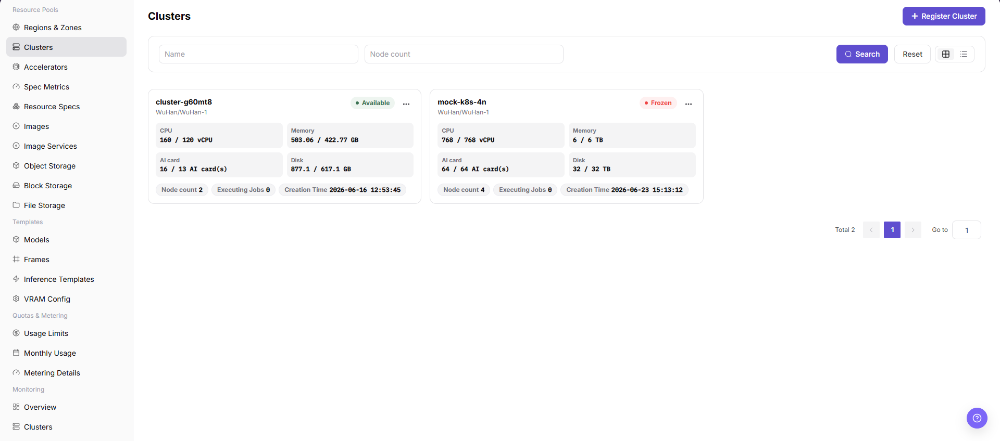
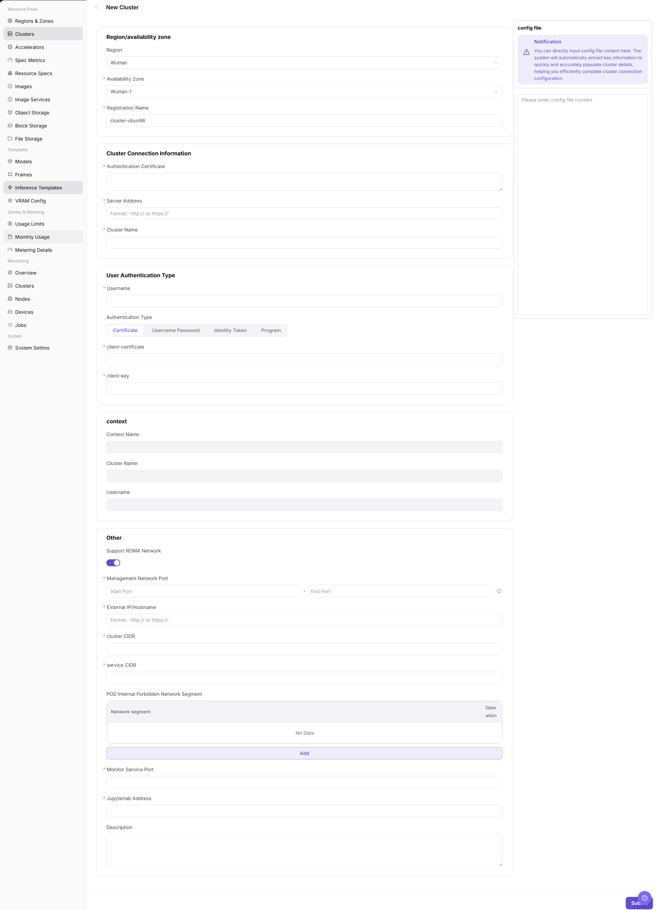
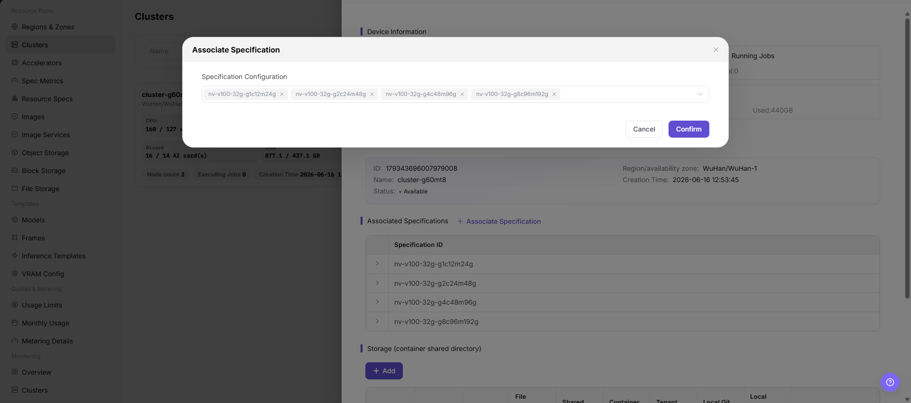
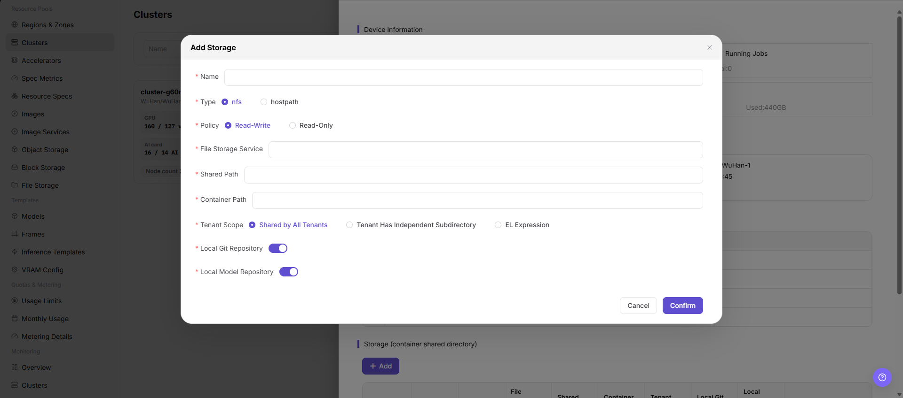

# Cluster Management

::: info Document Information
Version: v1.0
Updated: 2026-07-08
:::

## Feature Overview

`Cluster Management` is used to connect Kubernetes clusters to AI Infra On-Prem resource pools, so the platform can schedule, monitor, and manage nodes, specifications, storage, and jobs in a unified way. After the operator creates a cluster, the platform can run development, training, inference, and other workloads in the corresponding region and availability zone.

| Item | Content |
| --- | --- |
| Applicable role | Operator |
| Navigation path | AI Infra > On-Prem > Resource Pools > Cluster Management |
| Page route | /powerone/resourcepool/cluster |
| Managed objects | Kubernetes clusters, regions, availability zones, nodes, specifications, storage, jobs, and resource monitoring |
| Typical use | Create cluster onboarding, view cluster status, check node resources, and maintain specifications and storage configuration |

#### Beginner View

You can understand an On-Prem resource pool as a local compute management system:

- **Region/availability zone** indicates the site, machine room, or resource group where compute resources are located.
- **Cluster** is the Kubernetes environment that actually provides compute resources. The platform can schedule jobs only after the cluster is connected.
- **Node** is a specific server in the cluster and provides CPU, GPU, memory, disk, and other resources.
- **Specification** defines the resource package that a user job can request.
- **Storage** provides model, dataset, code repository, or output directories for jobs.

The core purpose of cluster creation is to bring a real Kubernetes cluster into platform scheduling, monitoring, and resource management.

#### First-Time Onboarding Flow

For first-time cluster onboarding, perform the following steps in order:

1. Create or confirm the target region and availability zone.
2. Prepare kubeconfig, CA certificate, API Server, authentication method, and network configuration.
3. In `Resource Pools > Cluster Management`, click `Cluster Registration` to open the `Cluster Creation` page.
4. Paste or verify the kubeconfig parsing result, and complete region, availability zone, registration name, authentication, and network fields.
5. After submission, return to the cluster list and verify status, nodes, resource usage, and monitoring data.
6. Associate specifications, configure storage as needed, and use a test job to verify scheduling and mounting.

#### Terms

| Term | Description |
| --- | --- |
| Kubernetes | A container orchestration system used to manage compute nodes, containers, service discovery, and job scheduling. |
| kubeconfig | A Kubernetes connection configuration file that usually contains the cluster address, certificates, users, and authentication information. |
| API Server | The Kubernetes control entry point. The platform uses it to read nodes, resources, jobs, and status. |
| CA Certificate | A certificate used to verify API Server identity. It is sensitive material. |
| User Authentication Type | The page field used to select certificate, username/password, identity token, authentication program, or another authentication method. |
| context | A connection context in kubeconfig that associates the cluster, user, namespace, and related information. |
| Cluster CIDR | Pod network segment planning. Incorrect values may cause network conflicts. |
| Service CIDR | Service network segment planning. Incorrect values may affect service access. |
| NodePort | The port range used by Kubernetes to expose services. |
| RDMA Network | An advanced high-speed networking option. Enable it only when hardware, drivers, and network planning explicitly support it. |

## Prerequisites

Before creating a cluster, confirm that the following conditions are met:

1. The current account has operator permissions and can access `AI Infra > On-Prem > Resource Pools > Cluster Management`.
2. The target region and availability zone have been created in `Resource Pools > Regions/Availability Zones`.
3. The Kubernetes API Server can be reached from the platform management side.
4. kubeconfig, CA certificate, API Server, cluster name, and authentication materials have been prepared.
5. Cluster CIDR, Service CIDR, and NodePort have been checked against existing network plans.
6. If monitoring, JupyterLab, or RDMA capabilities are required, related services, ports, hardware, and network plans have been confirmed.
7. For learning or screenshots, do not submit real kubeconfig, certificates, private keys, tokens, passwords, or internal addresses.

## Page Description

The Cluster Management page mainly includes the cluster list, cluster details, and cluster nodes information.

The following figure shows the cluster list entry, cluster cards, resource usage, and cluster operation entries.

#### Cluster List

| Area | Description |
| --- | --- |
| Status filter | Filters clusters by `All`, `Available`, `Unavailable`, `Onboarding`, `Failed`, `Pending Approval`, and other statuses. |
| Region/availability zone filter | Filters clusters by their region and availability zone. |
| Search area | Supports searching by cluster name, node count, and other conditions. |
| View switch | Supports grid view and list view. |
| Cluster card | Displays cluster name, status, region/availability zone, specifications, node count, and resource usage. |
| Operation entry | Opens cluster details, cluster nodes, or cluster-level operations such as disable and enable. |

#### Cluster Details

Cluster details are used to view device information, basic information, associated specifications, and storage configuration of a single cluster. Use this area first when troubleshooting cluster status, resource capacity, specification availability, or storage mounting.

#### Cluster Nodes

The cluster nodes page is used to view node status, resource usage, job information, and node details. Node details usually include hardware, network, runtime, labels, taints, and monitoring charts.

## Main Operations

### Create Cluster

#### Applicable Scenarios

Create a cluster when a new Kubernetes cluster needs to be included in unified platform scheduling, monitoring, and resource management. Common scenarios include first-time compute onboarding, adding a machine room or resource group, expanding GPU/CPU nodes, and providing schedulable nodes for later jobs.

#### Pre-Operation Checks

1. The target region and availability zone have been created and can be used for cluster onboarding.
2. kubeconfig or equivalent authentication materials come from a trusted cluster administrator.
3. API Server address, certificates, authentication method, and context have been verified.
4. Cluster CIDR, Service CIDR, and NodePort have been confirmed by network planning.
5. Monitoring service, JupyterLab address, RDMA, and other advanced options have been confirmed as required.
6. For learning or screenshots, only view page fields and do not submit real configuration.

#### Steps

1. Go to `AI Infra > On-Prem > Resource Pools > Cluster Management`.
2. Click `Cluster Registration` in the upper-right corner of the page to open the `Cluster Creation` page.
3. Paste kubeconfig in the `config file` area, or verify the connection information parsed by the page.

The following figure shows the `Cluster Creation` page. Use it to locate kubeconfig, region/availability zone, connection information, authentication type, context, and advanced configuration areas.

4. Select `Region` and `Availability Zone`, and fill in `Registration Name`.
5. Verify or fill in `CA Certificate`, `API Server`, and `Cluster Name`.
6. Select `User Authentication Type`, fill in the corresponding authentication materials according to the page fields, and verify `context`.
7. Configure `Cluster CIDR`, `Service CIDR`, `NodePort`, monitoring service, JupyterLab address, `Support RDMA Network`, description, and other advanced options.
8. Before clicking the final `Submit`, verify sensitive information, region/availability zone, network configuration, and scheduling impact again.
9. For learning or page validation only, view fields and screenshots. Do not perform the final `Submit`, `OK`, or `Save`.

### Associate Specifications

#### Applicable Scenarios

Associate specifications when the target cluster needs to run jobs with specific CPU, memory, GPU, or other accelerator configurations. After association, users may select these specifications when creating jobs in the corresponding region, availability zone, or cluster scope.

#### Steps

1. Go to `AI Infra > On-Prem > Resource Pools > Cluster Management`.
2. In the cluster list, find the target cluster and verify cluster status, region, availability zone, and resource capacity.
3. Click `...` in the target cluster operation area and select `Cluster Details`.
4. In the left-side menu of the `Cluster Details` page, select the specification-related entry.
5. Click `Associate Specifications` or the actual association entry on the page.
6. Select the specifications to associate with the cluster, and verify specification name, specification type, CPU, memory, GPU, or other accelerator configuration.
7. Before clicking the final `Save`, `Submit`, or `OK`, verify that the specifications match the cluster resource capability.
8. For learning or page validation only, view the fields and dialog without submitting real association configuration.

### Add Storage

#### Applicable Scenarios

Add storage when jobs need shared directories, model repositories, local Git repositories, NFS directories, or host paths. Storage configuration affects job startup, file read/write, model loading, and tenant access scope.

#### Steps

1. Go to `AI Infra > On-Prem > Resource Pools > Cluster Management`.
2. In the cluster list, find the target cluster and verify cluster status, region, availability zone, and resource capacity.
3. Click `...` in the target cluster operation area and select `Cluster Details`.
4. In the left-side menu of the `Cluster Details` page, select the storage-related entry.
5. Click `Add Storage` or the actual add entry on the page.
6. Configure storage name, storage type, shared path, container mount path, access mode, tenant scope, and description according to the page fields.
7. Before clicking the final `Save`, `Submit`, or `OK`, verify the storage path, mount policy, permission scope, and impact on running jobs.
8. For learning or page validation only, view the fields and dialog without submitting real storage configuration.

## Parameter Reference

| Parameter | Required | Description | Configuration Notes |
| --- | --- | --- | --- |
| Registration Name | Yes | Name used by the platform to identify the cluster. | Use a name that reflects environment, region, purpose, and resource type. It is usually not recommended to change after creation. |
| Region | Yes | Region to which the cluster belongs. | Select an existing and available region. It affects resource pool ownership and scheduling scope. |
| Availability Zone | Yes | Availability zone to which the cluster belongs. | Must match the selected region. Incorrect selection affects node ownership and job scheduling. |
| config file | Conditionally required | kubeconfig content or connection configuration source. | Can be used to auto-fill some fields, but parsed results must be manually verified. |
| CA Certificate | Yes | Certificate used to verify API Server identity. | Sensitive material. Do not record it in documents or screenshots. |
| API Server | Yes | Kubernetes API access entry. | Must be reachable from the platform side. Do not record real addresses in this document. |
| Cluster Name | Yes | Kubernetes cluster name or page identification name. | Keep it consistent with kubeconfig or real cluster information. |
| User Authentication Type | Yes | Authentication method used to access the cluster. | Select according to kubeconfig or materials provided by the administrator. |
| context | Conditionally required | Connection context in kubeconfig. | Usually generated or imported automatically. Verify it before submission. |
| Cluster CIDR | Conditionally required | Pod network segment configuration. | Must match network planning and avoid conflicts with the platform, nodes, or other clusters. |
| Service CIDR | Conditionally required | Service network segment configuration. | Must match network planning and avoid service access issues. |
| NodePort | Conditionally required | Kubernetes NodePort port range. | Fill in according to page-supported range and network policy. |
| Monitoring Service | Optional | Cluster resource monitoring service configuration. | Confirm monitoring collection capability, port, and network reachability. |
| JupyterLab Address | Optional | Service address related to online development. | Configure only when online IDE capability is required. |
| Support RDMA Network | Optional | Whether to enable RDMA-related capabilities. | Enable only when hardware, drivers, network, and scheduling policies explicitly support it. |
| Specification Name | Yes | Name of the specification to associate with the cluster. | Should match the actual CPU, memory, GPU, or other accelerator capability of the cluster. |
| Specification Type | Conditionally required | Resource type or job type of the specification. | Confirm that the specification applies to the target cluster and business scenario. |
| CPU | Conditionally required | CPU configuration in the specification. | Must not exceed cluster capability or scheduling policy limits. |
| Memory | Conditionally required | Memory configuration in the specification. | Verify it together with CPU, GPU, or accelerator configuration. |
| GPU/Accelerator | Conditionally required | GPU, NPU, or other accelerator configuration in the specification. | Must match target cluster node hardware and driver capability. |
| Enabled Status | System generated or optional | Whether the specification or storage configuration is available. | If disabled, it is usually unavailable to users. |
| Association Status | System generated | Whether the specification has been associated with the target cluster. | After saving, confirm the status in the list or details page. |
| Storage Name | Yes | Name of the cluster storage configuration. | Use a name that reflects purpose, environment, and access scope. |
| Storage Type | Yes | Storage source or mount type. | Common types include `nfs`, `hostpath`, or actual page-supported types. |
| Shared Path | Yes | Host-side or shared storage path. | Do not record real paths in this document. Confirm that the path exists and permissions are correct before submission. |
| Container Mount Path | Yes | Path used by job containers to access the storage. | Avoid conflicts with system directories, application directories, or other mount paths. |
| Access Mode | Yes | Storage read/write permission or access policy. | Follow the least privilege principle and avoid granting write permission by mistake. |
| Tenant Scope | Conditionally required | Tenant visibility or isolation scope of the storage. | Avoid unexpected cross-tenant access to the same directory. |
| Description | Optional | Cluster purpose, boundary, or maintenance notes. | Record non-sensitive operations notes only. Do not write internal test parameters. |
| Actions | System generated | Page entries for view, edit, disable, enable, and similar operations. | Confirm impact scope and rollback plan before high-risk operations. |

## Pitfalls

- Cluster creation/registration connects a real Kubernetes cluster to platform scheduling, monitoring, and resource management. Treat it as a high-impact operation.
- kubeconfig, certificates, private keys, tokens, and passwords are sensitive materials. Do not write them into documents, screenshots, tickets, commit records, or chat messages.
- If the API Server is unreachable, the platform cannot complete onboarding even when form fields are correctly formatted.
- Incorrect region or availability zone may cause resource ownership, specification association, storage configuration, and job scheduling exceptions.
- Incorrect authentication type, CIDR, or NodePort may cause onboarding failure, network conflicts, or service access exceptions.
- Associating specifications affects which resource specifications users can select when creating jobs. Incorrect association may cause scheduling failure, resource request mismatch, or capacity misjudgment.
- Adding storage affects job mount paths, read/write permissions, data access scope, and runtime stability. Incorrect shared paths, mount paths, or permission scope may cause job startup failure, inaccessible data, or unauthorized access.
- `Save`, `Submit`, and `OK` are high-risk final actions. Do not click them during learning or screenshots.

## Result Validation

| Check Item | Success Criteria | Troubleshooting |
| --- | --- | --- |
| Page can be opened | `AI Infra > On-Prem > Resource Pools > Cluster Management` is accessible. | Check menu configuration and account permissions. |
| Cluster list loads normally | Cluster cards, status, region/availability zone, and resource usage are visible. | Refresh the page and check backend services or browser console errors. |
| Create cluster entry is visible | The page shows the `Cluster Registration` entry. | Check operator permissions and page status. |
| Cluster creation page can be opened | Clicking `Cluster Registration` opens the `Cluster Creation` page. | Check routes, permissions, and frontend errors. |
| Required field validation works | Validation prompts appear when required fields are missing. | Fill in fields according to page prompts and do not use real sensitive values for learning tests. |
| No real configuration is submitted during learning | Only fields, dialogs, and screenshots are viewed. The final `Submit`, `OK`, or `Save` is not clicked. | If submitted by mistake, notify the platform administrator and follow the security process immediately. |
| Record is traceable after real submission | The new cluster appears in the list and the status changes to `Onboarding`, `Available`, or another expected status. | Verify API Server, authentication materials, region/availability zone, and network configuration. |
| Nodes and monitoring can be verified | Node list, resource usage, and monitoring charts are displayed as expected. | Check RBAC, collection components, monitoring service, and time range. |
| Specification association can be verified | The target specification appears in the cluster details specification list, and users can select it according to permissions. | Check specification status, cluster capability, and association scope. |
| Storage configuration can be verified | The new storage appears in the cluster details storage list, and mount path and access mode match the configuration. | Check shared path, container mount path, permissions, and tenant scope. |

## Configuration Rules and Impact

- **Configuration order**: Create the region and availability zone first, and then create the cluster under the corresponding availability zone.
- **Onboarding dependencies**: API Server reachability, valid authentication materials, and correct CIDR and port planning are prerequisites for cluster onboarding.
- **Auto parsing**: Pasting kubeconfig can improve form completion efficiency, but the parsing result still requires manual verification.
- **Network impact**: Cluster CIDR, Service CIDR, and NodePort affect Pod, Service, and platform access paths.
- **Scheduling impact**: After creation, the cluster enters the platform scheduling scope, and later specifications, storage, and authorization configuration may reference it.
- **Specification impact**: Associating specifications changes which resource specifications users can select when creating jobs. Incorrect configuration may cause scheduling failure or resource request mismatch.
- **Storage impact**: Adding storage changes job mount paths, read/write permissions, and tenant access scope. Incorrect configuration may cause inaccessible data or unauthorized access.
- **Monitoring impact**: Monitoring data is used for capacity analysis and troubleshooting. If data is missing, check collection components, ports, and time ranges together.
- **Operations impact**: Disabling, enabling, or deleting a cluster may affect job scheduling and business availability. Confirm the maintenance window and rollback plan in advance.

## FAQ

#### The cluster does not appear in the list after registration

**Symptom:** After registration is submitted, the new cluster is not visible in the cluster list.

**Resolution:**

1. Click `Reset` to clear filters.
2. Check status, region, or availability zone filters.
3. Search by registration name keyword.
4. Refresh the page and check again.
5. If it is still not visible, confirm whether submission succeeded and check page errors or operation records.

#### Cluster registration fails

**Symptom:** Registration fails after submission, or the page reports connection, authentication, or network field errors.

**Resolution:**

1. Check whether the API Server can be reached from the platform side.
2. Verify CA certificate, authentication type, and authentication materials with the cluster administrator.
3. Check whether Cluster CIDR, Service CIDR, and NodePort comply with network planning.
4. Check the status of the target region and availability zone.
5. Locate the specific field according to page prompts and reconfigure it.

#### Cluster status is unavailable

**Symptom:** The cluster appears in the list, but its status is not available, or resource information cannot load normally.

**Resolution:**

1. Check Kubernetes API Server connectivity.
2. Check whether authentication materials have expired or permissions are insufficient.
3. Go to the cluster nodes page and check whether nodes are `Ready`.
4. Check network connectivity between the platform side and the cluster side.
5. Check monitoring or resource collection component status.

#### The node list is empty

**Symptom:** After entering `Cluster Nodes`, the node information list has no data.

**Resolution:**

1. Confirm that cluster registration has completed and is not still onboarding.
2. Check whether the authentication account can read nodes.
3. Check whether the Kubernetes cluster itself has visible nodes.
4. Refresh the page or reopen the cluster nodes page.
5. If it is still empty, contact the cluster administrator to verify API Server and RBAC permissions.

#### A specification cannot be selected

**Symptom:** Users cannot select a specification when creating a job.

**Resolution:**

1. Open cluster details and confirm that the target specification has been associated.
2. Check whether the specification itself is enabled.
3. Check whether the selected region, availability zone, and cluster scope are consistent with the specification association.
4. After saving the specification association, re-enter the job creation flow and confirm whether the specification appears.

#### Storage mount is abnormal

**Symptom:** After a job starts, it cannot access the shared directory, or mount path read/write fails.

**Resolution:**

1. Check whether the shared path and container path are correct.
2. For `nfs`, check the NFS service address, directory export, and network connectivity.
3. For `hostpath`, check whether the target node local path exists and has correct permissions.
4. Check whether tenant scope and read/write policy meet business expectations.
5. Use a test job to verify whether the directory is readable and writable.

#### Resource monitoring has no data

**Symptom:** Node resource monitoring charts are empty, or only some monitoring types have data.

**Resolution:**

1. Check whether the monitoring service port is correct.
2. Check whether the node monitoring collection component is running.
3. Adjust the query time range and sampling interval.
4. Check whether the target node is online.
5. If only AI accelerator monitoring is empty, confirm whether the node has the corresponding accelerator card and collection capability.

#### The registration name is hard to maintain after using a poor name

**Symptom:** The cluster has been registered, but the registration name is unclear, making it difficult to identify region, environment, purpose, or capacity ownership.

**Resolution:**

1. When creating a new cluster, prioritize names that reflect environment, region, and purpose.
2. Recommended names should reflect environment, region, and resource type.
3. Avoid temporary or unclear names such as `test1`, `aaa`, or `cluster01`.
4. If the page does not provide an entry to edit the registration name, plan new cluster onboarding and job migration.

#### Disabling a cluster fails or the impact scope is unclear

**Symptom:** Disabling or enabling fails after clicking the operation, or the impact scope is unclear.

**Resolution:**

1. Go to `Cluster Nodes > Job Information` and confirm running instances, online IDE, and running jobs.
2. Confirm whether an alternative cluster can take over new job scheduling.
3. Disable the cluster within the maintenance window and notify related business teams in advance.
4. If disabling fails, handle dependent resources according to the confirmation prompt or contact platform operations.

## Next Steps

1. Return to the `Cluster Management` list and verify cluster status, region/availability zone, and resource usage.
2. Open cluster details and verify device information, basic information, associated specifications, and storage configuration.
3. Associate specifications with the cluster as needed so users can select target specifications when creating jobs.
4. Configure shared storage as needed, and use a test job to verify mounting, read/write, and path isolation.
5. View node resource monitoring and confirm that monitoring data, time range, and monitoring type can be switched normally.

## Notes

- Cluster creation/registration connects a real Kubernetes cluster to platform scheduling, monitoring, and resource management.
- kubeconfig, certificates, private keys, tokens, and passwords are sensitive materials and must not be written into documents, screenshots, tickets, or commit records.
- Incorrect region/availability zone, API Server, authentication type, CIDR, or NodePort may cause onboarding failure, network conflicts, or scheduling exceptions.
- Associating specifications and adding storage affect real job specifications, mount paths, read/write permissions, and data access scope.
- `Save`, `Submit`, and `OK` are high-risk final actions.
- Do not write real kubeconfig, certificates, private keys, tokens, passwords, shared paths, internal addresses, API Server addresses, accounts, keys, AK/SK, cluster IDs, resource pool IDs, or internal test parameters.
