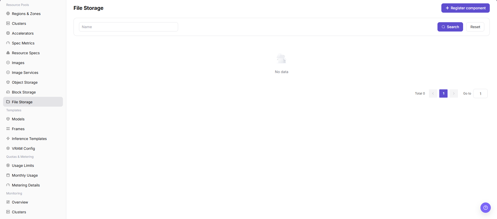
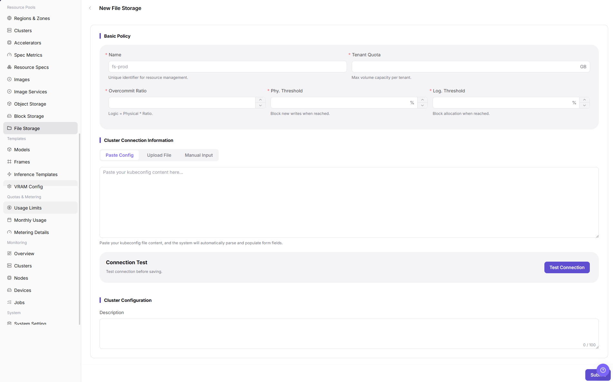

# File Storage Component

::: info Document Information
Version: v1.0
Updated: 2026-07-08
:::

## Feature Overview

`File Storage Component` is used to connect shared directory and file volume capabilities. Common implementations include NFS or compatible file storage supported by the platform. File storage is suitable for multiple jobs, nodes, or instances to read and write the same directory, such as shared datasets, model repositories, code directories, and output results.

| Item | Content |
| --- | --- |
| Applicable role | Operator or user with resource pool storage component management permissions |
| Navigation path | AI Infra > On-Prem > Resource Pools > File Storage Component |
| Page route | `/powerone/resourcepool/file-storage` |
| Managed objects | NFS services, service addresses, shared paths, access policies, capacity, mount paths, and associated regions or clusters |
| Typical use | Create file storage components to provide shared directory mounts, model repositories, local Git repositories, or dataset directories |

#### Beginner View

A file storage component is like a shared filing cabinet in the platform. It determines which clusters can mount shared directories. Operators first connect NFS or compatible shared storage to the platform, and then user-side instances and jobs can use the same directory to read data, models, and output files.

#### Terms

| Term | Description |
| --- | --- |
| NFS | Network File System, used to share directories over the network. |
| Shared Path | The directory path exported by the file storage service. |
| Mount Path | The path after mounting inside a container or node. |
| kubeconfig | Configuration file content used to connect to and validate the target Kubernetes cluster. |
| Tenant Isolation | Permission boundaries that prevent different tenants from accidentally reading or writing the same directory. |

## Prerequisites

1. NFS or an equivalent file storage service has been deployed.
2. The shared path has been created, and access permissions, directory ownership, and network policies have been confirmed.
3. Target cluster nodes can access the file storage service address and exported directory.
4. Tenant directories, read/write policies, capacity, overcommit ratio, and backup policies have been planned.
5. If the page requires `kubeconfig`, prepare sanitized validation material. Do not paste real cluster credentials during learning or screenshot capture.

## Page Description

The page displays connected file storage components, status, service address, shared path, capacity, and associated regions or clusters.

The following figure shows the file storage component page.

## Main Operations

### Create File Storage Component

#### Pre-Operation Check

1. The file storage service address is accessible from target cluster nodes.
2. The shared path has been exported and permissions comply with the read/write policy.
3. The mount path does not conflict with container system directories or application directories.
4. Tenant isolation method, directory naming rules, capacity limit, and overcommit policy have been confirmed.

#### Procedure

1. Go to `AI Infra > On-Prem > Resource Pools > File Storage Component`.
2. Click `Create File Storage Component`, `Add`, `Register`, or the actual creation entry on the page.
3. Fill in `Name`, `Tenant Quota`, `Overcommit Ratio`, `Phy. Threshold`, and `Log. Threshold` according to the page fields.
4. In `Cluster Connection Information`, provide connection configuration through `Paste Config`, `Upload File`, or `Manual Input`, and confirm that the configuration content has been sanitized.
5. If the page provides `Test Connection`, verify connectivity from target cluster nodes to the file storage service first.
6. In `Cluster Configuration`, fill in `Description`, and continue checking service address, shared path, mount path, read/write permission, associated region, or bound cluster according to the actual page.
7. Before clicking the final `Save`, `Submit`, or `OK`, verify the service address, shared path, permission scope, and capacity impact again.
8. For learning or page validation only, view fields and dialogs without submitting real file storage component configuration.

The following figure shows the Create File Storage Component page, used to fill in basic policy, cluster connection information, and cluster configuration.

## Parameter Reference

| Field Name | Required | Field Type | Description |
| --- | --- | --- | --- |
| Component Name | Yes | Text | Display name or unique identifier of the file storage component. The page may display this field as `Name`. |
| Storage Type | Conditionally required | Enum | File storage implementation type, such as NFS or another type supported by the page. |
| Access Protocol | Conditionally required | Enum | File storage access protocol, such as NFS. |
| Service Address | Conditionally required | Text | File storage service address or access entry. Do not write real internal addresses in documentation. |
| Shared Path | Conditionally required | Text | Shared directory path exported by the service. Use placeholders only in documentation. |
| Mount Path | Conditionally required | Text | Container path mounted by jobs, IDEs, or model services. |
| Access Policy | Conditionally required | Enum | Controls directory read/write scope, visibility scope, or access mode. |
| Read/Write Permission | Conditionally required | Enum | Controls whether the directory is read-only or read/write. |
| Tenant Quota | Conditionally required | Number | Maximum file volume capacity available to a single tenant. |
| Overcommit Ratio | Conditionally required | Number | Ratio between logical allocatable capacity and actual physical capacity. |
| Physical Threshold | Conditionally required | Number | Blocking threshold based on actual physical usage. The page may display this field as `Phy. Threshold`. |
| Logical Threshold | Conditionally required | Number | Blocking threshold based on logical capacity usage. The page may display this field as `Log. Threshold`. |
| Associated Region | Conditionally required | Single-select/Multi-select | Regions where the file storage component can be referenced. |
| Bound Cluster | Conditionally required | Single-select/Multi-select | Clusters that are allowed to mount the shared directory. |
| Capacity Information | Conditionally required | Number | Total capacity, available capacity, or tenant quota of the file storage. |
| Tenant Isolation | Conditionally required | Configuration item | Controls tenant directories, permissions, and access boundaries. |
| Status | System-generated | Enum | Component creation, connection test, and mount capability status. |
| Actions | Optional | Button/Menu | Create, edit, test connection, save, submit, OK, or delete entries. |

## Pitfalls

- Creating a file storage component may affect mounts and read/write access for jobs, IDEs, model repositories, or dataset directories.
- Incorrect service address, shared path, export permission, UID/GID, or read/write policy may cause mount failure, write failure, or unintended cross-tenant access.
- Incorrect capacity thresholds or overcommit ratio may block file volume creation too early, or make displayed capacity inconsistent with actual resources.
- Verify the file storage service address and mount path from target nodes, not only from the platform management side.
- `Save`, `Submit`, and `OK` are high-risk final actions.
- Do not write real NFS addresses, internal paths, accounts, secrets, tokens, kubeconfig, cluster IDs, resource pool IDs, tenant directories, or internal test parameters.

## Result Validation

| Check Item | Success Criteria | Troubleshooting |
| --- | --- | --- |
| Page is accessible | The `File Storage Component` page can be opened. | Check account permissions, menu configuration, and page route. |
| Component list loads normally | The list displays connected file storage components and status. | Check dependent services, filter conditions, and API responses. |
| Creation entry is visible | `Create File Storage Component`, `Add`, `Register`, or the actual creation entry is displayed. | Check operator permissions, License, and page configuration. |
| Creation page can be opened | The Create File Storage Component page opens, and Basic Policy and Cluster Connection Information are displayed. | Check frontend route, form configuration, and browser console errors. |
| Required field validation works | The page displays validation prompts when required fields are empty. | Complete name, capacity, connection configuration, or other required fields according to page prompts. |
| Connection test can be executed | If `Test Connection` is provided, it returns a clear result after execution. | Check network connectivity, kubeconfig, service address, and access permissions. |
| High-risk action is not triggered accidentally | No final save, submit, or OK action is clicked during learning or screenshot capture. | If real configuration is submitted by mistake, immediately verify impact and roll back according to the change process. |
| Status is correct after real submission | If real creation is performed, the new component appears in the list and its status matches expectations. | Return to the configuration page and check connection parameters, binding scope, capacity thresholds, and backend logs. |

## FAQ

#### File Storage Mount Fails

**Symptom:**

The job cannot mount the shared directory at startup, or the directory is not visible after mounting.

**Possible Causes:**

- The file storage service address or shared path is incorrect.
- Network from the target node to the file storage service is unreachable.
- NFS export permissions, directory ownership, or access policy is incorrect.

**Solution:**

1. Check the service address, shared path, and network connectivity.
2. Verify file storage mounting on the target node.
3. Adjust export permissions, directory ownership, and read/write policy.

#### Cannot Write After Mounting

**Symptom:**

The directory is visible in the container, but writing files fails.

**Possible Causes:**

- The directory is configured as read-only.
- Server-side permissions or UID/GID do not match.
- The tenant directory isolation policy is inconsistent with the actual path.

**Solution:**

1. Confirm whether the access policy requires read/write.
2. Check server-side directory ownership, permissions, and export configuration.
3. Verify tenant subdirectory rules and the container runtime user.

## Next Steps

1. Reference the file storage component in region or cluster storage configuration.
2. Use a test job to verify read/write, concurrency, and capacity limits.
3. Include shared directories in backup, cleanup, and permission audits.

## Notes

- Do not configure shared directories with an overly broad public read/write scope.
- Before deleting or adjusting a shared path, confirm that no running jobs, IDEs, model repositories, or dataset directories depend on it.
- Do not record real NFS addresses, internal paths, kubeconfig, accounts, secrets, tokens, cluster IDs, resource pool IDs, tenant directories, or internal test parameters in documentation, screenshots, or examples.
