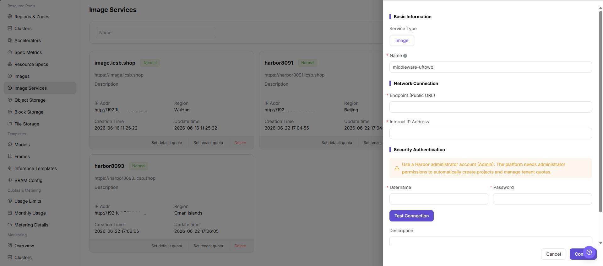

# Image Component

::: info Document Information
Version: v1.0
Updated: 2026-07-08
:::

## Feature Overview

`Image Component` is used to connect Harbor, Docker Registry, or compatible image repositories, providing image pull capability for regions, clusters, jobs, online IDEs, and model instances. When no available image component exists, later image sync, image upload, job startup, and model service deployment are usually affected.

| Item | Content |
| --- | --- |
| Applicable Role | Operator |
| Navigation Path | AI Infra > On-Prem > Resource Pools > Image Component |
| Page Route | `/powerone/resourcepool/images` |
| Managed Objects | Component name, repository address, Endpoint, authentication method, access credentials, certificate policy, associated region, bound cluster, project sync scope, and sync status |
| Typical Use | Connect Harbor/Registry to support public images, custom images, job image pulling, and user-side image project sync |

#### Beginner View

Image Component is like the image repository access card of the platform. It tells the platform where to pull runtime images, which credentials to use, and which regions or clusters can use the repository. When the image component is configured incorrectly, user-side model instances, online IDEs, runtime instances, and jobs usually get stuck during image pull.

#### Terms

| Term | Description |
| --- | --- |
| Harbor | A common enterprise container image repository. |
| Registry | Image repository service used to store and distribute container images. |
| Endpoint | Service address used by the platform or clusters to access the image repository. |
| Robot Credentials | Automated image repository account and password. These are sensitive credentials. |
| Image Pull Secret | Credential used by Kubernetes to pull private images. |
| Project Sync Scope | Scope of projects, namespaces, or image lists synchronized from the image repository by the platform. |

## Prerequisites

1. The image repository has been deployed and can be accessed from the platform side and target clusters.
2. Repository address, Endpoint, authentication method, access credentials, and certificate policy have been prepared.
3. The target cluster can resolve and access the image repository address.
4. Associated regions, bound clusters, public images, custom images, and tenant project permission boundaries have been confirmed.
5. For learning or screenshots, only view fields and forms without submitting real image component configuration.

## Page Description

The page displays connected image components, status, access address, project count, sync status, and associated regions.

The following figure shows the image component list, where component status, Endpoint, sync status, and operation entrypoints can be viewed.

## Main Operations

### Register Image Component

#### Applicable Scenarios

Register an image component when a new Harbor, Docker Registry, or compatible image repository needs to be connected and used by specified regions, clusters, or user-side image services.

#### Steps

1. Go to `AI Infra > On-Prem > Resource Pools > Image Component`.
2. Click `Register`, `Add`, or the actual registration entry on the page.
3. Fill in component name, image repository address, Endpoint, authentication method, access credentials, and certificate configuration according to the page fields.
4. Select associated regions, bound clusters, project sync scope, or sync policy as required by the page.
5. Before submission, confirm that the repository address is reachable from both the platform side and target clusters, and that robot credentials or access accounts have minimum required permissions.
6. Before clicking the final `Save`, `Submit`, or `OK`, verify repository address, credential source, certificate policy, and region binding scope again.
7. For learning or page validation only, view fields and forms without submitting real image component configuration.

The following figure shows the Register Image Component form, used to fill in image service connection information and sync configuration.

## Parameter Reference

| Parameter | Required | Description | Configuration Suggestion |
| --- | --- | --- | --- |
| Component Name | Yes | Display name of the image component. | Use a name that reflects repository purpose, region, or environment. |
| Repository Address | Yes | Access address of the image repository. | Use placeholders only in documentation. Do not record real repository addresses. |
| Endpoint | Yes | Service address used by the platform and clusters to access the image repository. | Confirm that the platform side, target cluster nodes, and container runtime can access it. |
| Authentication Method | Conditionally required | Authentication method for image pull, push, or sync. | Select Robot account, access account, or another page-supported method according to repository capability. |
| Access Credentials | Conditionally required | Account, password, token, or key material required for authentication. | Fill credentials only in system forms. Do not write them in documents, screenshots, or tickets. |
| Certificate Policy | Conditionally required | Private certificate, certificate chain, or TLS verification policy. | For private repositories, confirm the trust chain on the cluster side. |
| Associated Region | Conditionally required | Region scope where the image component is available. | Keep it consistent with resource pools, user entrypoints, and image project visibility scope. |
| Bound Cluster | Conditionally required | Clusters that can access this image component. | Before binding, confirm cluster network, DNS, and container runtime configuration. |
| Project Sync Scope | No | Scope of projects, namespaces, or image lists synchronized by the platform. | Use the minimum required scope to avoid exposing unrelated projects. |
| Sync Status | System-generated | Image component sync or probe status. | After registration, watch sync status, update time, and error messages. |
| Actions | No | Supports register, edit, sync, test connection, bind, delete, and other operations. | Confirm impacts on regions, clusters, and user-side visibility before high-risk actions. |

## Pitfalls

- Registering an image component affects image pull capability for regions, clusters, jobs, online IDEs, and model instances.
- Incorrect repository address, certificate chain, Robot credentials, or Image Pull Secret may cause `ImagePullBackOff`.
- Binding the image component to the wrong region may cause user-side image projects to be invisible or jobs to fail image pull.
- `Save`, `Submit`, and `OK` are high-risk final actions.
- Do not record real repository addresses, Robot passwords, Image Pull Secret, tokens, AK/SK, internal addresses, cluster IDs, resource pool IDs, or internal test parameters.

## Result Validation

| Check Item | Expected Result | Troubleshooting |
| --- | --- | --- |
| Page can be opened | `AI Infra > On-Prem > Resource Pools > Image Component` is accessible. | Check menu configuration and account permissions. |
| Component list loads normally | Component name, status, access address, project count, sync status, and associated region are displayed normally. | Refresh the page and check service status or browser console errors. |
| Registration entry is visible | `Register`, `Add`, or the actual registration entry is displayed on the page. | Check operator permissions, License, and page configuration. |
| Registration form can be opened | Clicking the entry shows component name, repository address, Endpoint, authentication method, and certificate configuration fields. | Check route, permissions, and frontend errors. |
| Required field validation works | Validation prompts appear when component name, repository address, authentication information, or region scope is missing. | Complete fields according to page prompts without bypassing validation. |
| No real submission during learning | No real save, submit, or OK action is triggered. | If submitted by mistake, immediately verify the component list and binding scope. |
| Status is traceable after real submission | The new component appears in the list, and status and sync result are visible. | Check repository connectivity, credentials, certificates, and sync logs. |
| Downstream image pull can be verified | A test job, online IDE, or model instance can pull images normally. | Check Image Pull Secret, region binding, DNS, network, and certificate trust. |

## FAQ

#### Job Image Pull Fails

**Symptom:**

Instance events or logs show image pull failure, authentication failure, image not found, or `ImagePullBackOff`.

**Possible Causes:**

- Image address, project name, or tag is incorrect.
- Robot credentials, Image Pull Secret, or repository permissions are configured incorrectly.
- The target cluster cannot access the image repository Endpoint.
- The private certificate is not trusted by the cluster.
- The image component is not bound to the region or cluster where the job runs.

**Solution:**

1. Check the complete image address, project name, and tag.
2. Verify image component authentication information, Robot credentials, and user-side project permissions.
3. Verify repository network connectivity and DNS resolution on the target node.
4. Check certificate trust and container runtime configuration.
5. Verify the binding relationship among region, cluster, and image component.

#### User Side Cannot See Image Projects

**Symptom:**

After a regular user enters Image Services, custom projects or public images are not visible.

**Possible Causes:**

- The image component is not bound to the region selected by the user.
- Project sync scope does not cover the target project.
- The user has no image service permissions.
- Image sync has not completed or has failed.

**Solution:**

1. Check the binding relationship between the region and image component.
2. Verify project sync scope, tenant permissions, and account permissions.
3. Perform image sync or refresh the page.
4. Check sync status, update time, and error messages.

## Next Steps

1. Go to [Regions / Availability Zones](../regions-zones/) to bind or verify the image component.
2. Guide users to create projects and push images in [Image Services](../../../user/extensions/images/).
3. Go to Image Management or user-side Image Services to confirm that projects, images, and tags are visible.
4. Use a test job, online IDE, or model instance to verify image pull and startup.

## Notes

- Registering an image component affects image pull capability for regions, clusters, jobs, online IDEs, and model instances.
- Robot credentials, repository passwords, Image Pull Secret, tokens, and certificate materials are sensitive information.
- Incorrect repository address, certificate chain, Robot credentials, or Image Pull Secret may cause `ImagePullBackOff`.
- Binding the image component to the wrong region may cause user-side image projects to be invisible or jobs to fail image pull.
- Long-term use of the `latest` tag in production templates is not recommended. Use explicit version tags instead.
- `Save`, `Submit`, and `OK` are high-risk final actions. Do not trigger them during learning or screenshots.
- Do not record real repository addresses, Robot passwords, Image Pull Secret, tokens, AK/SK, internal addresses, cluster IDs, resource pool IDs, or internal test parameters.
