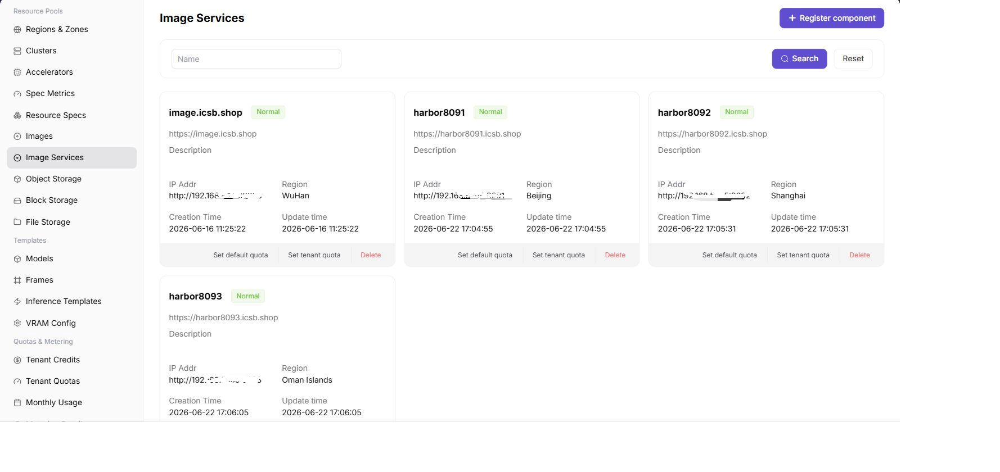

# Image Component

:::: info Document Information
Version: v1.0
Updated: 2026-07-08
::::

## Feature Overview

`Image Component` is used to connect Harbor, Docker Registry, or compatible image repositories, providing image pull capability for regions, clusters, and jobs. When no available image component exists, model instances, online IDEs, and runtime instances usually cannot pull their runtime environments.

| Item | Content |
| --- | --- |
| Applicable Role | Operator |
| Navigation Path | Resource Pools > Image Component |
| Page Route | `/powerone/resourcepool/image-service` |
| Managed Objects | Image repository, Endpoint, projects, access credentials, sync status, and associated regions |
| Typical Use | Connect Harbor/Registry to support public images, custom images, and job image pulling |

### Terms Quick Reference

| Term | Description |
| --- | --- |
| Harbor | A common enterprise container image repository. |
| Registry | Image repository service used to store and distribute container images. |
| Project | A project or namespace in Harbor. |
| Robot Credentials | Automated image repository account and password. These are sensitive credentials. |
| Image Pull Secret | Credential used by Kubernetes to pull private images. |

## Prerequisites

1. The image repository has been deployed and can be accessed from the platform and target cluster.
2. Repository address, project plan, access credentials, and certificate policy have been prepared.
3. The target cluster can resolve and access the image repository address.
4. Permission boundaries for public images, custom images, and tenant projects have been confirmed.

## Page Description

The page displays connected image components, status, access address, project count, sync status, and associated regions.

The following figure shows the image component page.

## Register Image Component

### Pre-Operation Check

1. The repository Endpoint is accessible from the platform and target cluster.
2. Certificate, domain name, and image pull policy have been confirmed.
3. Robot credentials or access accounts have the minimum required permissions.
4. The target region needs to bind this image component.

### Procedure

1. Go to `Resource Pools > Image Component`.
2. Click the register or add entrypoint.
3. Fill in the component name, repository address, authentication information, and associated region.
4. If the page provides connection testing or sync, verify availability first.
5. After submission, return to the list and check component status.

### Parameters

| Field Name | Required | Field Type | Example | Description |
| --- | --- | --- | --- | --- |
| Component Name | Yes | Text | `harbor-prod` | Image component display name. |
| Repository Address | Yes | URL | `https://registry.example.com` | Image repository entrypoint. Use a placeholder in documentation. |
| Authentication Method | Conditionally required | Enum | `Robot Account` | Authentication method for image pull or push. |
| Bound Cluster | Conditionally required | Multi-select | `cluster-a` | Clusters that can access this image component. |
| Sync Status | System-generated | Enum | `Normal` | Image component sync or probe status. |

### Pitfalls

- Resource pool configuration affects job scheduling. Confirm running instances before making changes.
- If a drop-down list is empty, check region, permissions, and dependent component status first.
- Prepare replacement resources and a rollback plan before deleting or disabling resources.

### Result Validation

1. The component appears in the list and its status matches expectations.
2. The component can be bound in a region.
3. User-side image services can see public images or custom image projects.
4. A test job can pull images normally.

## FAQ

### Job Image Pull Fails

**Symptom:**

Instance events or logs show image pull failure, authentication failure, or image not found.

**Possible Causes:**

- Image address, project name, or tag is incorrect.
- Robot credentials, Image Pull Secret, or repository permissions are configured incorrectly.
- The target cluster cannot access the image repository.
- The private certificate is not trusted by the cluster.

**Solution:**

1. Check the complete image address and tag.
2. Verify image component authentication information and user-side project permissions.
3. Verify repository network connectivity on the target node.
4. Check certificate trust and container runtime configuration.

### User Side Cannot See Image Projects

**Symptom:**

After a regular user enters Image Services, custom projects or public images are not visible.

**Possible Causes:**

- The image component is not bound to the region selected by the user.
- The user has no image service permissions.
- Image sync has not completed.

**Solution:**

1. Check the binding relationship between the region and image component.
2. Verify tenant and account permissions.
3. Perform image sync or refresh the page.

## Follow-Up Operations

1. Go to [Regions / Availability Zones](../regions-zones/) to bind the image component.
2. Guide users to create projects and push images in [Image Services](../../../user/extensions/images/).
3. Use a test job to verify image pull and startup.

## Notes

- Robot credentials, repository passwords, and Image Pull Secret are sensitive information.
- Long-term use of the `latest` tag in production templates is not recommended. Use explicit version tags instead.
