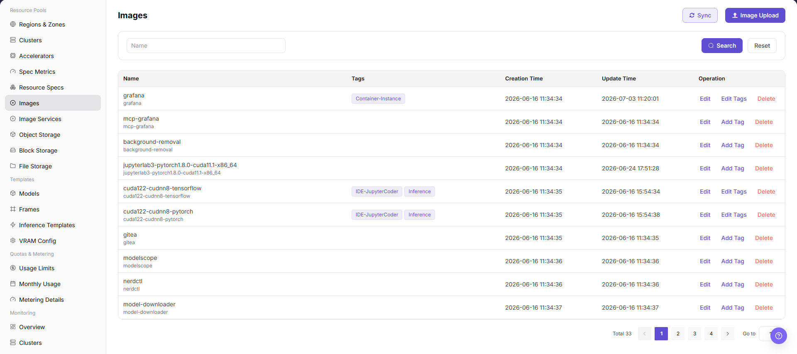
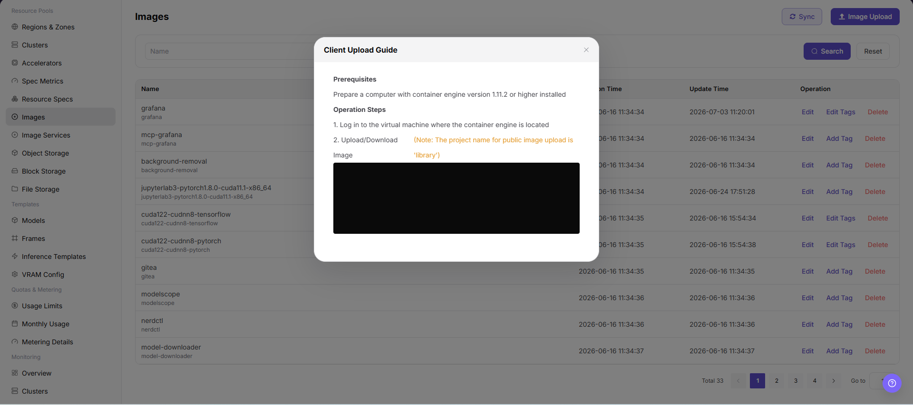

# Image Management

::: info Document Information
Version: v1.0
Updated: 2026-07-08
:::

## Feature Overview

`Image Management` is used to manage image entries and tags in image repositories, supporting runtime environment selection for jobs, online IDEs, inference services, templates, and other workloads. Operators can view image lists, maintain tags, sync images, and add images pushed from local clients to platform management as required by the page.

| Item | Content |
| --- | --- |
| Applicable Role | Operator |
| Navigation Path | AI Infra > On-Prem > Resource Pools > Image Management |
| Page Route | /powerone/resourcepool/image |
| Managed Objects | Client tool, image registry, project/namespace, image name, image tag, image address, image type, architecture, and sync status |
| Typical Use | Synchronize images, maintain image tags, record client-uploaded images, and clean up unused image records |

#### Beginner View

Image Management is like the runtime environment shelf of the platform. Operators first make sure the image registry and image component are available, then build, log in, and push images through a client, and finally return to the platform page to sync or register image information so that jobs, IDEs, inference services, or templates can select the correct version.

#### Maintenance Flow

1. Connect and verify an available image component.
2. Prepare Docker, Podman, or the actual client tool supported by the page.
3. Tag the image address with a placeholder format, such as `<registry>/<project>/<image>:<tag>`.
4. After pushing the image, return to the platform to sync or register image information.
5. Maintain clear tags and purposes for images.
6. Confirm that no jobs, templates, or model versions depend on an image before cleanup.

#### Terms Quick Reference

| Term | Description |
| --- | --- |
| Client Tool | Local tool used to build, log in, and push images, such as Docker, Podman, or the actual client supported by the page. |
| Image Registry | Registry service that stores images. |
| Project/Namespace | Project, organization, or namespace in the image registry, used to isolate images. |
| Image Tag | Tag used to describe image purpose or version. |
| Sync Status | Visibility and availability status after the platform synchronizes images from the image service. |

## Prerequisites

1. The image component has been connected, and the Image Management list loads normally.
2. The current account has view and management permissions for `AI Infra > On-Prem > Resource Pools > Image Management`.
3. Docker, Podman, or the actual client tool supported by the page is ready on the local client.
4. Image naming, tag meaning, purpose, architecture, and impact scope have been planned.
5. For learning or screenshots, only view fields, dialogs, and client command formats. Do not push real images or submit real configuration.

## Page Description

The page displays image name, tags, creation time, update time, and operation entrypoints in a table.

The following figure shows the image management list, where image tags can be maintained and upload or sync can be performed.



## Main Operations

### Client Upload Guide

#### Applicable Scenarios

Use the client upload guide when a locally built or existing runtime image needs to be pushed to an image registry and added to platform Image Management.

#### Steps

1. Go to `AI Infra > On-Prem > Resource Pools > Image Management`, and confirm that the image component is connected and the image list loads normally.
2. Prepare the local client environment for image build, login, and push, such as Docker, Podman, or the actual client tool supported by the page.
3. Build or load the local image, and tag the image address with a placeholder format, such as `<registry>/<project>/<image>:<tag>`.
4. Log in to the image registry and push the image. Use placeholders only in learning or documentation examples. Do not write real registry addresses, accounts, or passwords.
5. Return to `Image Management`, click `Upload Image`, `Sync`, or the actual page entry, and add the image address, tags, purpose, architecture, and other information to platform management.
6. Before clicking the final `Save`, `Submit`, or `OK`, verify the image source, tag meaning, purpose, and impact on existing jobs.
7. For learning or page validation only, view fields, dialogs, and client command formats. Do not push real images or submit real configuration.

Use placeholder-only client command examples:

```bash
docker tag <local-image>:<local-tag> <registry>/<project>/<image>:<tag>
docker login <registry>
docker push <registry>/<project>/<image>:<tag>
```

The following figure shows the Upload Image entrypoint. Confirm image source, purpose, and tags before uploading.



## Parameter Reference

| Parameter | Required | Description | Configuration Suggestion |
| --- | --- | --- | --- |
| Client Tool | Conditionally required | Local tool used to build, log in, and push images. | Use Docker, Podman, or the actual client tool supported by the page. |
| Image Registry | Yes | Registry where the image is stored. | Use only the `<registry>` placeholder in documentation examples, not real registry addresses. |
| Project/Namespace | Yes | Project, organization, or namespace in the image registry. | Use the `<project>` placeholder in examples, and fill in real values according to registry permissions only during actual operations. |
| Image Name | Yes | Image display name or image name in the registry. | The name should reflect framework, purpose, or runtime environment. |
| Image Tag | Yes | Image version tag. | Avoid using only `latest` in production scenarios. |
| Image Address | Yes | Full image address, such as `<registry>/<project>/<image>:<tag>`. | Verify registry, project, image, and tag before submission. |
| Image Type | No | Image purpose type, such as development, training, or inference. | Keep it consistent with later job, IDE, or inference template use. |
| Architecture | No | Image CPU architecture or hardware architecture. | Match the target cluster node architecture. |
| Sync Status | System-generated | Status after the platform synchronizes the image. | Return to the platform after pushing and refresh or sync to check status. |
| Actions | No | Supports upload image, sync, edit tags, view, delete, and other operations. | Confirm impact scope before high-risk operations. |

## Pitfalls

- Client upload may write images to a real image registry and affect later jobs, IDEs, inference services, or template choices.
- Reusing or overwriting image tags may cause existing tasks to pull unexpected versions.
- Images must not contain keys, tokens, AK/SK, account passwords, internal configuration files, or test data.
- Do not write real accounts, passwords, or registry addresses in commands such as `docker login` or `podman login`.
- `Save`, `Submit`, and `OK` are high-risk final actions.

## Result Validation

| Check Item | Expected Result | Troubleshooting |
| --- | --- | --- |
| Page can be opened | `AI Infra > On-Prem > Resource Pools > Image Management` is accessible. | Check menu configuration and account permissions. |
| Image list loads normally | Image name, tags, creation time, update time, and operation entrypoints are displayed normally. | Refresh the page and check image component status. |
| Client command format is safe | Example commands contain placeholders only and do not expose real registries or credentials. | Replace real sensitive information in the document. |
| Upload or sync entry is visible | `Upload Image`, `Sync`, or the actual entry is displayed. | Check operator permissions, image component status, and page configuration. |
| Upload dialog can be opened | Clicking the entry shows fields such as image address, tags, purpose, and architecture. | Check route, permissions, and frontend errors. |
| No real submission during learning | No real image is pushed and no real save, submit, or OK action is triggered. | If submitted by mistake, immediately verify the image registry and platform list. |
| Record is traceable after real submission | The image appears in the list, and sync status is visible. | Check image address, tag, sync status, and filters. |
| Downstream pages can select it | Job, online IDE, inference service, or template pages can select the image. | Check image type, tags, architecture, sync status, and permission scope. |

## Configuration Rules and Impact

- **Image before job**: The target image must be pullable from the registry before a job can run.
- **Stable tags**: Tags are used for filtering, recommendation, and deployment reproduction. Do not change their semantics casually.
- **Pullable address**: Image address, project/namespace, and tag must match the actual repository content.
- **Least privilege**: Client login credentials should only cover the required push or pull scope and must not be written into the document.
- **Delete carefully**: Before deleting or taking an image offline, confirm that no jobs, templates, model versions, online IDEs, or inference services depend on it.

## FAQ

#### Page List Is Empty

**Symptom:**

No image records are visible after entering the page.

**Possible Causes:**

- Filters, region, permissions, or image component status do not match the current page.
- Page data is still syncing, or no visible image has been pushed to the image registry.
- The image has been pushed to the registry, but the platform has not synchronized or registered it yet.

**Solution:**

1. Click `Reset` to clear filters.
2. Confirm whether the region in the upper-right corner is selected correctly.
3. Check whether the image component has been connected and is healthy.
4. Check whether the image has been pushed to the correct registry as `<registry>/<project>/<image>:<tag>`.
5. Click `Sync` or register image information according to the page flow.

#### Add or Register Button Is Not Visible

**Symptom:**

The page only shows the list, and no upload image, sync, add, register, or create entrypoint is visible.

**Possible Causes:**

- The current account is not an operator or lacks image management permissions.
- The image component is not connected or is unhealthy.
- License, menu permissions, or region permissions are incomplete.

**Solution:**

1. Confirm that the current account is an operator.
2. Check whether License, menu permissions, and region permissions are complete.
3. Confirm that the image component has been connected and is available.
4. Refresh the page and enter the target navigation again.
5. If it is still not visible, contact the platform administrator to verify role authorization.

## Next Steps

1. Enter model configuration, framework configuration, job creation, online IDE, or inference service flows to verify that the image is selectable.
2. Maintain tags, architecture, and description according to image purpose for later filtering.
3. Regularly clean up unused image records after confirming that no downstream dependencies remain.

## Notes

- Client upload may write images to a real image registry and affect later jobs, IDEs, inference services, or template choices.
- Reusing or overwriting image tags may cause existing tasks to pull unexpected versions.
- Images must not contain keys, tokens, AK/SK, account passwords, internal configuration files, or test data.
- Do not write real accounts, passwords, or registry addresses in commands such as `docker login` or `podman login`.
- `Save`, `Submit`, and `OK` are high-risk final actions. Do not trigger them during learning or screenshots.
