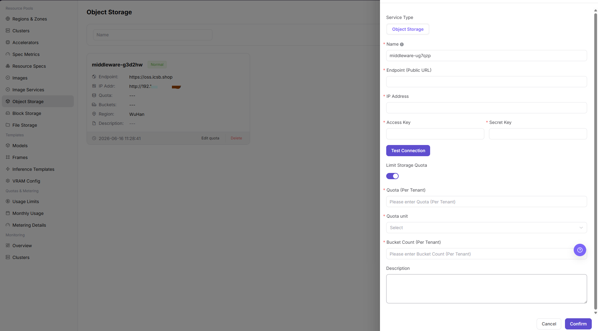

# Object Storage

::: info Document Information
Version: v1.0
Updated: 2026-07-08
:::

## Feature Overview

`Object Storage` is used to connect MinIO, S3-compatible storage, or other object storage services, providing bucket, object path, and unstructured data capabilities for regions, user-side object storage, job object path read/write, and model data management.

| Item | Content |
| --- | --- |
| Applicable role | Operator |
| Navigation path | AI Infrastructure > On-Prem > Resource Pools > Object Storage |
| Page route | `/powerone/resourcepool/storage` |
| Managed objects | Service Type, Object Storage, Name, Endpoint (Public URL), IP Address, Access Key, Secret Key, Limit Storage Quota, Description, and Actions |
| Typical use | Connect MinIO/S3 to support model files, datasets, artifact packages, task output, and user-side bucket management |

#### Beginner Explanation

- **Object storage** is like a bucket-organized file repository, suitable for storing model weights, datasets, compressed packages, and runtime artifacts.
- **Bucket** is the top-level container of object storage. Users can organize objects only after creating buckets.
- **Endpoint** is the access entrypoint. The platform, clusters, or jobs need to access object storage through it.
- **AK/SK** are access credentials and sensitive information. They should not appear in screenshots, documentation, or tickets.

#### Terms Quick Reference

| Term | Description |
| --- | --- |
| MinIO | A common S3-compatible object storage implementation. |
| S3 | Object storage API protocol or compatible interface. |
| Bucket | The top-level object storage container used to organize objects. |
| Object | A single file or data item in a bucket. |
| Endpoint | Object storage access entrypoint. Confirm that it is reachable from the platform side and cluster side. |
| AK/SK | Access keys, which are sensitive credentials. |

## Prerequisites

1. The object storage service has been deployed and can be accessed from the platform management side and target clusters.
2. Endpoint, internal address, access protocol, authentication method, access credentials, capacity plan, and associated regions have been prepared.
3. Bucket naming, tenant isolation, permission boundaries, and data retention policies have been confirmed.
4. The current account has operator resource pool management permissions.
5. For learning or screenshots, only view fields and forms without submitting real object storage configuration.

## Page Description

The page displays connected object storage components, status, access Endpoint, internal address, capacity information, and associated regions.

The following figure shows the object storage list, where component status, Endpoint, internal address, capacity, and operation entrypoints can be viewed.

## Main Operations

### Register Storage Component

#### Applicable Scenarios

Register a storage component when a new MinIO, S3-compatible storage, or another object storage service needs to be connected and used by regions, user-side buckets, or job object path read/write. In this page, storage component refers to the object storage entry managed here.

#### Steps

1. Go to `AI Infra > On-Prem > Resource Pools > Object Storage`.
2. Click `Register component`.
3. Fill in `Service Type`, `Object Storage`, `Name`, `Endpoint (Public URL)`, `IP Address`, `Access Key`, `Secret Key`, `Limit Storage Quota`, and `Description` according to the page fields.
4. If the page provides `Test Connection`, run the read-only connectivity check first and confirm the returned result.
5. Before clicking the final `Save`, `Submit`, or `OK`, verify Endpoint (Public URL), IP Address, Access Key, Secret Key, and quota limit again.
6. For learning or page validation only, view fields and forms without submitting real object storage configuration.

The following figure shows the Register Storage Component form, used to configure object storage access method and connection parameters.

## Parameter Reference

| Parameter | Required | Description | Configuration Suggestion |
| --- | --- | --- | --- |
| Service Type | Yes | Service type of the current component. | On the Object Storage page, this usually displays `Object Storage`. |
| Object Storage | Yes | Service type value when registering a storage component. | Keep it consistent with the actual page option. |
| Name | Yes | Display name of the object storage component. | Use a name that reflects storage type, environment, or region. |
| Endpoint (Public URL) | Yes | Public entry exposed by object storage to the platform or service side. | Do not record real Endpoint values in documentation. |
| IP Address | Conditionally required | Address used by clusters or the platform to access object storage. | Keep it consistent with actual network, DNS, and routing configuration. |
| Access Key | Yes | Access key for object storage. | Fill it only in system forms. Do not write it in documents, screenshots, or tickets. |
| Secret Key | Yes | Secret key for object storage. | Sensitive credential. Do not write it in documents, screenshots, or tickets. |
| Limit Storage Quota | No | Whether to limit object storage quota. | Plan according to tenant, region, and job scale. |
| Description | No | Component purpose, boundary, or maintenance notes. | Record non-sensitive notes only. |
| Actions | System-generated | Register component, Test Connection, Cancel, Confirm, Edit quota, Delete, and similar entries. | `Confirm` and `Delete` are high-risk actions. |

## Pitfalls

- Registering a storage component affects regional object storage capability, user-side bucket creation, job object path read/write, and data access scope.
- Incorrect Endpoint, internal address, certificate, AK/SK, bucket policy, or region binding may cause jobs to fail to read from or write to object storage.
- AK/SK, tokens, internal connection strings, and production bucket paths are sensitive information and must not be written into documents, screenshots, or tickets.
- `Save`, `Submit`, and `OK` are high-risk final actions.
- Do not record real Endpoint values, internal addresses, AK/SK, tokens, bucket names, production object paths, cluster IDs, resource pool IDs, or internal test parameters.

## Result Validation

| Check Item | Expected Result | Troubleshooting |
| --- | --- | --- |
| Page can be opened | `AI Infra > On-Prem > Resource Pools > Object Storage` is accessible. | Check menu configuration and account permissions. |
| Component list loads normally | Component name, Endpoint, internal address, capacity, status, and associated regions are displayed normally. | Refresh the page and check service status or browser console errors. |
| Registration entry is visible | `Register component` is displayed on the page. | Check operator permissions, License, and page configuration. |
| Registration form can be opened | Clicking the entry shows Service Type, Name, Endpoint (Public URL), IP Address, Access Key, Secret Key, and Limit Storage Quota fields. | Check route, permissions, and frontend errors. |
| Required field validation works | Validation prompts appear when Name, Endpoint, Access Key, Secret Key, or quota fields are missing. | Complete fields according to page prompts without bypassing validation. |
| No real submission during learning | No real save, submit, or OK action is triggered. | If submitted by mistake, immediately verify the component list and region binding scope. |
| Status is traceable after real submission | The component appears in the object storage list, and status matches expectations. | Check Endpoint, internal address, credentials, certificates, and connection test results. |
| Region binding can be verified | The object storage entry can be bound to the target region in `Regions / Availability Zones`. | Check component status, associated regions, permissions, and visibility scope. |
| Downstream read/write can be verified | The user-side object storage page can create buckets, and a test job can read from or write to object paths. | Check AK/SK, bucket policy, network, certificates, and path configuration. |

## FAQ

#### Object Storage List Is Empty

**Symptom:**

No object storage component records are visible after entering the page.

**Possible Causes:**

- No object storage component has been registered.
- Filters limit the results.
- The current account has no view permission.
- Component registration failed or status has not synchronized.

**Solution:**

1. Click `Reset` to clear filters.
2. Confirm whether component registration has been completed.
3. Check the current account's resource pool management permissions.
4. Check registration result, sync status, and error messages.

#### Object Storage Cannot Be Selected in Region

**Symptom:**

When creating or editing a region, the object storage drop-down list is empty.

**Possible Causes:**

- The component is not enabled or its status is abnormal.
- The component has no bindable relationship with the target region.
- The current account has no binding permission.
- Associated regions or visibility scope do not cover the target region.

**Solution:**

1. Return to the object storage list and check status.
2. Confirm the component's associated region and visibility scope.
3. Check account permissions and reopen the region form.
4. If it is still empty, check Endpoint, internal address, and connection test status.

#### Job Cannot Read or Write Object Paths

**Symptom:**

After a user job starts, it cannot read model files, datasets, or output objects.

**Possible Causes:**

- Endpoint, internal address, credentials, or bucket permissions are configured incorrectly.
- Network from the cluster to object storage is unreachable.
- Object path, bucket name, or access policy is incorrect.
- Certificate, DNS, or cross-region access policy is configured incorrectly.

**Solution:**

1. Check Endpoint, internal address, and network connectivity.
2. Verify AK/SK, token, or access policies.
3. Check bucket policy, object path, and region binding scope.
4. Use a test job to verify bucket read/write.

## Next Steps

1. Go to [Regions / Availability Zones](../regions-zones/) to bind the object storage component.
2. Guide users to create buckets and upload data in [Object Storage](../../../user/storage/object-storage/).
3. Verify object read/write, permissions, and path configuration with a test job.
4. Regularly check capacity usage, bucket policy, and data retention policy.

## Notes

- Registering a storage component affects regional object storage capability, user-side bucket creation, job object path read/write, and data access scope.
- Do not screenshot or record real Endpoint values, internal addresses, AK/SK, tokens, internal connection strings, production bucket names, or production object paths.
- Before deleting, disabling, or replacing an object storage component, confirm data migration, backups, region bindings, and dependent jobs.
- `Save`, `Submit`, and `OK` are high-risk final actions. Do not trigger them during learning or screenshots.
- Do not record real Endpoint values, internal addresses, AK/SK, tokens, bucket names, production object paths, cluster IDs, resource pool IDs, or internal test parameters.
