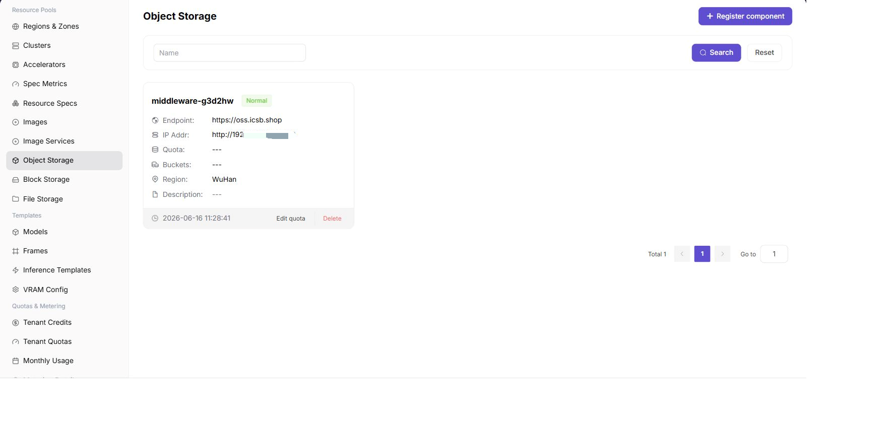

# Object Storage Component

## Feature Overview

`Object Storage Component` is used to connect MinIO, S3-compatible storage, or other object storage services, providing bucket, object path, and unstructured data capabilities for regions and user-side object storage.

| Item | Content |
| --- | --- |
| Applicable Role | Operator |
| Navigation Path | Resource Pools > Object Storage Component |
| Page Route | `/powerone/resourcepool/storage` |
| Managed Objects | Object storage service, Endpoint, internal address, bucket capability, capacity limits, and associated regions |
| Typical Use | Connect MinIO/S3 to support model files, datasets, artifact packages, and task output |

### Beginner View

- **Object storage** is like a bucket-organized file repository, suitable for storing model weights, datasets, compressed packages, and runtime artifacts.
- **Bucket** is the top-level container of object storage. Users can organize objects only after creating buckets.
- **Endpoint** is the access entrypoint. The platform, cluster, or jobs need to access object storage through it.
- **AK/SK** are access credentials and sensitive information. They should not appear in screenshots, documentation, or tickets.

### Terms Quick Reference

| Term | Description |
| --- | --- |
| MinIO | A common S3-compatible object storage implementation. |
| S3 | Object storage API protocol or compatible interface. |
| Bucket | The top-level object storage container used to organize objects. |
| Object | A single file or data item in a bucket. |
| Endpoint | Object storage access entrypoint. Confirm that it is reachable from the platform side and cluster side. |
| AK/SK | Access keys, which are sensitive credentials. |

## Prerequisites

1. The object storage service has been deployed and can be accessed from the platform management side and target clusters.
2. Endpoint, internal address, access credentials, capacity plan, and associated regions have been prepared.
3. Bucket naming, tenant isolation, permission boundaries, and data retention policies have been confirmed.
4. The current account has operator resource pool management permissions.

## Page Description

The page displays connected object storage components, status, access endpoint, internal address, capacity information, and associated regions.

The following figure shows the object storage component page.

## Register Object Storage Component

### Pre-Operation Check

1. Endpoint, internal address, and ports are accessible from the platform and target clusters.
2. Access credential permissions follow the principle of least privilege.
3. Capacity quota, bucket count limits, and tenant isolation policies have been confirmed.
4. The target region needs to enable object storage capability.

### Procedure

1. Go to `Resource Pools > Object Storage Component`.
2. Click `Register Component` or the add entrypoint provided by the page.
3. Fill in the component name, Endpoint, internal address, capacity control, and authentication information.
4. If the page provides connection testing, run the test first.
5. After submission, return to the list and check component status.

### Parameters

| Field Name | Required | Field Type | Example | Description |
| --- | --- | --- | --- | --- |
| Object Name | Yes | Text | `resource-a` | Object name on the current page. |
| Region | Conditionally required | Drop-down | `Wuhan` | Region to which the object belongs. |
| Associated Resource | Conditionally required | Text | `cluster-a` | Resource that the object depends on or is associated with. |
| Status | System-generated | Enum | `Available` | Current object status. |
| Maintenance Notes | No | Multi-line text | `Used in production` | Records use, boundaries, and maintenance information. |

### Pitfalls

- Resource pool configuration affects job scheduling. Confirm running instances before making changes.
- If a drop-down list is empty, check region, permissions, and dependent component status first.
- Prepare replacement resources and a rollback plan before deleting or disabling resources.

### Result Validation

1. The component appears in the list and its status matches expectations.
2. The object storage component can be bound to the target region in `Regions / Availability Zones`.
3. The user-side object storage page can create buckets or see object storage capability.
4. A test job can read from or write to object paths.

## FAQ

### Object Storage Component List Is Empty

**Symptom:**

No object storage component records are visible after entering the page.

**Possible Causes:**

- No object storage component has been registered.
- Filters limit the results.
- The current account has no view permission.

**Solution:**

1. Click reset to clear filters.
2. Confirm whether component registration has been completed.
3. Check the current account's resource pool management permissions.

### Object Storage Component Cannot Be Selected in Region

**Symptom:**

When creating or editing a region, the object storage drop-down list is empty.

**Possible Causes:**

- The component is not enabled or its status is abnormal.
- The component has no bindable relationship with the target region.
- The current account has no binding permission.

**Solution:**

1. Return to the object storage component list and check status.
2. Confirm the component's associated region and visibility scope.
3. Check account permissions and reopen the region form.

### Job Cannot Read or Write Object Paths

**Symptom:**

After a user job starts, it cannot read model files, datasets, or output objects.

**Possible Causes:**

- Endpoint, credentials, or bucket permissions are configured incorrectly.
- Network from the cluster to object storage is unreachable.
- Object path, bucket name, or access policy is incorrect.

**Solution:**

1. Check Endpoint and network connectivity.
2. Verify AK/SK or access policies.
3. Use a test job to verify bucket read/write.

## Follow-Up Operations

1. Go to [Regions / Availability Zones](../regions-zones/) to bind the object storage component.
2. Guide users to create buckets and upload data in [Object Storage](../../../user/storage/object-storage/).
3. Verify object read/write, permissions, and path configuration with a test job.

## Notes

- Do not screenshot or record real AK/SK, tokens, internal connection strings, or production bucket paths.
- Before deleting, disabling, or replacing an object storage component, confirm data migration, backups, and dependent jobs.
