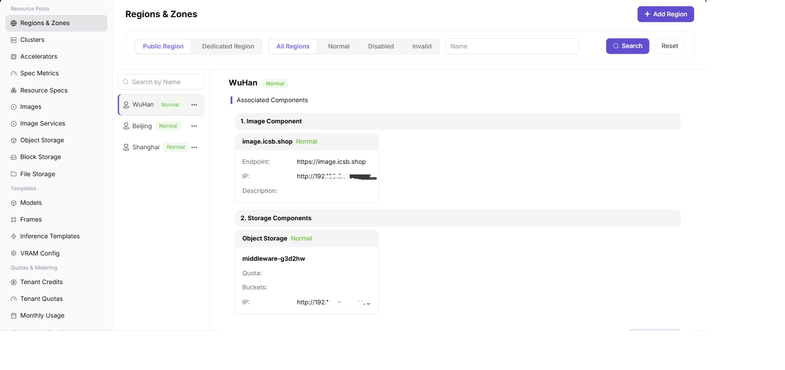
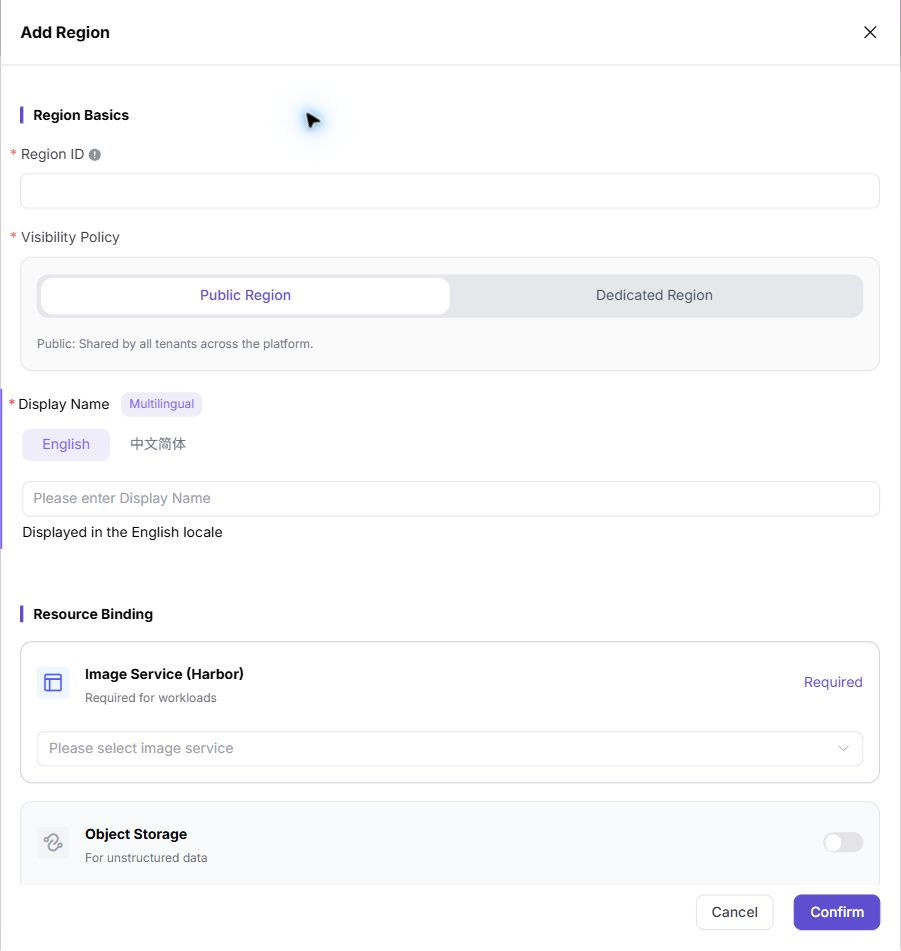
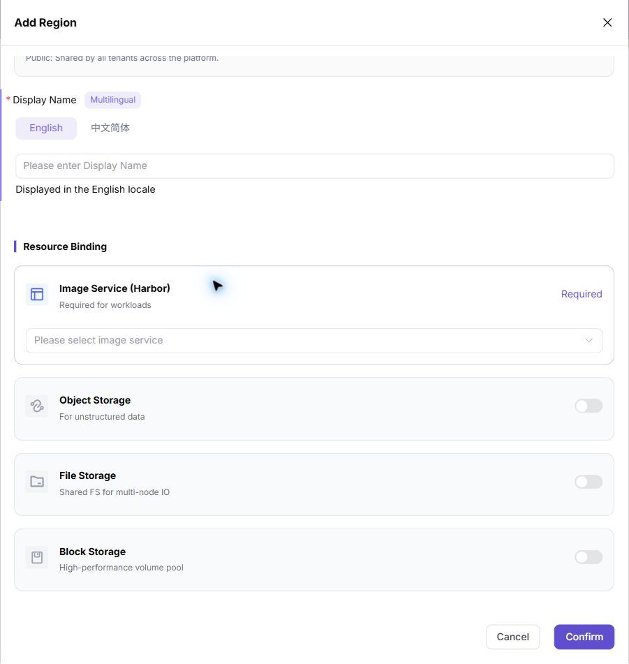
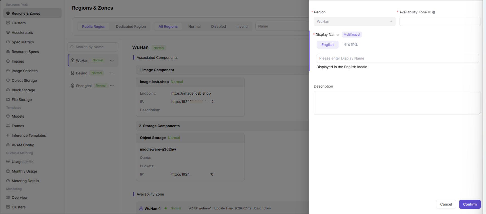

# Regions & Zones

:::: info Document Information
Version: v1.0
Updated: 2026-07-06
::::

## Overview

| Item   | Description                                       |
| ---- | ---------------------------------------- |
| Applicable Role | Operator                                    |
| Navigation Path | Resource Pools > Regions & Zones                             |
| Function | The core entry for Operators to configure On-Prem resource pools (English UI title **Regions & Zones**), with a **2-level hierarchy** (**Region** + **Availability Zone**). You can view the associated components of each region (image service + 3 types of storage) and the cluster resource usage under each availability zone. |

## Page Layout

The page is divided into 3 main areas:

### Top Toolbar

- **"Region Type"** Tab: **Public Region** (default, purple highlighted) / Dedicated Region
- **"Status"** Tab: **All Regions** / Normal / Disabled / Invalid
- **"Name"** input field + **"Search"** / **"Reset"** buttons

### Left Region List

"Search by Name" box + region list (e.g., **WuHan** / **Beijing** / **Shanghai**, each item with a status badge ● Normal and a "..." menu).

### Right Detail Area (shown after a region is selected)

- **Associated Components** (in order 1-N):
  - **1. Image Component** (e.g., `image.icsb.shop`, status badge ● Normal): includes Endpoint / IP / Description
  - **2. Storage Components** (e.g., **Object Storage** `middleware-g3d2hw`, status badge ● Normal): includes Quota / Buckets / IP
- **Availability Zone** (each region can have multiple AZs attached): includes Status / AZ ID / Update Time / Description / **"2 Clusters"** statistic + **"Edit"** / **"Disable"** buttons
- **Cluster List under Availability Zone** (e.g., `cluster-g60mt8` / `mock-k8s-4n`), each cluster contains 4 resource usage progress bars: **GPU** / **CPU** / **MEM** / **DISK** + Nodes / Jobs / Created time

## Operation Steps

### Add Region

1. Click the **"+ Add Region"** button (purple) in the upper right corner of the page to open the **"Add Region"** configuration dialog.

2. In the **"Region Basics"** section, configure:
   - **"\* Region ID"** (required, info icon ⊕): e.g., `wuhan` (the unique English identifier of the region)
   - **"\* Visibility Policy"** (required, two-option Tab):
     - **Public Region** (default selected, purple underline): shared by all tenants on the platform; any user can create and run jobs in this region
     - **Dedicated Region**: restricted to specified tenants only (on demand)
   - **"\* Display Name"** (required, purple highlighted field):
     - **English** / **中文简体** Tab toggle (purple highlights the current Tab)
     - Fill in the name in the corresponding language in the input box (e.g., fill in `武汉` under the **中文简体** Tab, with the hint "Displayed in the 中文简体 locale" below)

3. In the **"Resource Binding"** section, configure 4 types of components:
   - **"Image Service (Harbor)"** (**Required**, purple highlighted): "Required for workloads" → dropdown selection (e.g., `image.icsb.shop`)
   - **"Object Storage"** (off by default): "For unstructured data" → switch + dropdown selection (e.g., `middleware-g3d2hw`)
   - **"File Storage"** (off by default): "Shared FS for multi-node IO" → switch + dropdown selection
   - **"Block Storage"** (off by default): "High-performance volume pool" → switch + dropdown selection

4. After confirming that all information is filled in correctly, click the **"Confirm"** button (primary button, purple highlighted) in the lower right corner of the dialog to complete the addition; to discard, click **"Cancel"**.

#### Parameter Description - Add Region

| Field | Type | Example | Description |
|----------|----------|------|------|
| Region ID | Text | `wuhan` | **Required**, the unique English identifier of the region |
| Visibility Policy | Two-option Tab | `Public Region` / `Dedicated Region` | **Required**, Public Region is shared by all tenants on the platform; Dedicated Region is restricted to specified tenants |
| Display Name (Multilingual) | Multilingual Tab | 中文简体 `武汉` / English `WuHan-1` | **Required**, must be configured under both the "中文简体" and "English" Tabs; a hint of the corresponding display locale is shown below |
| Image Service (Harbor) | Dropdown | `image.icsb.shop` | **Required**, an image source must be associated to support job execution |
| Object Storage | Switch + Dropdown | On / `middleware-g3d2hw` | Optional, an object storage component can be bound when enabled; supports unstructured data and model storage |
| File Storage | Switch + Dropdown | Off / `--` | Optional, a file storage component can be bound when enabled; supports a shared file system with concurrent read/write from multiple nodes |
| Block Storage | Switch + Dropdown | Off / `--` | Optional, a block storage component can be bound when enabled; provides high-performance independent disk volumes for compute nodes |

### Add Availability Zone

1. In the right-side **"Availability Zone"** section, click the **"+ Create AZ"** button (purple) in the upper right corner to open the **"Add Availability Zone"** configuration dialog.
2. Configure the basic information of the availability zone:
   - **"\* Region"** (dropdown, required): automatically bound to the owning region (e.g., `WuHan`)
   - **"\* Availability Zone ID"** (required, info icon ⊕): e.g., `wuhan-1` (the unique English identifier of the availability zone)
   - **"\* Display Name"** (required, purple highlighted field):
     - **English** / **中文简体** Tab toggle (purple highlights the current Tab)
     - Fill in the name in the corresponding language in the input box (e.g., fill in `WuHan-1` under the **English** Tab, with the hint "Displayed in the English locale" below)
   - **"Description"** (multi-line text, optional): fill in the description of the availability zone (e.g., geographic location, business purpose, etc.)
3. After confirming that all information is filled in correctly, click the **"Confirm"** button (primary button, purple highlighted) in the lower right corner of the dialog to complete the addition; to discard, click **"Cancel"**.

#### Parameter Description - Add Availability Zone

| Field | Type | Example | Description |
|----------|----------|------|------|
| Region | Dropdown | `WuHan` | **Required**, the parent region to which the availability zone belongs (cannot be changed when adding; can be switched via dropdown when editing) |
| Availability Zone ID | Text | `wuhan-1` | **Required**, the unique English identifier of the availability zone |
| Display Name (Multilingual) | Multilingual Tab | English `WuHan-1` / 中文简体 `武汉-1` | **Required**, must be configured under both the "English" and "中文简体" Tabs; a hint of the corresponding display locale is shown below |
| Description | Multi-line text | `武汉一区` | Optional, fill in the description of the availability zone (geographic location, business purpose, etc.) |

## Other Operations

| Operation | Steps |
|----------|----------|
| Switch Region Type Filter | Top **"Public Region"** / **"Dedicated Region"** Tab → filter the region list |
| Switch Status Filter | Top **"All Regions"** / **"Normal"** / **"Disabled"** / **"Invalid"** Tab → filter regions with the corresponding status |
| Search by Name | Top **"Name"** input field → enter a keyword and click the **"Search"** button |
| Reset Filter | Top **"Reset"** button → clear all filter conditions |
| Search by Name on the Left | Left **"Search by Name"** input field → quickly locate a region |
| Region "..." Menu | The **"..."** button on a region row in the left list → pops up the region-level action menu (e.g., Edit / Disable) |
| Edit Availability Zone | The **"Edit"** button on an availability zone row → opens the Edit Availability Zone dialog |
| Disable Availability Zone | The **"Disable"** button on an availability zone row → disables that availability zone (no new jobs can be assigned after being disabled) |
| View Cluster Resources | Expand an availability zone → view the GPU / CPU / MEM / DISK resource usage and the number of Nodes / Jobs of each cluster |

## Notes

- **Page Title**: "Regions & Zones" is the page title at the top, and the **Navigation Path** is "Resource Pools > Regions & Zones" (with a slash in between).
- **2-Level Hierarchy**: Region → Availability Zone → Cluster → Node. Each level must be configured before the next level can be created.
- **Image Service Required**: When adding a region, an Image Service (Harbor) **must** be associated; otherwise, jobs cannot be created or run in that region.
- **Storage Components Optional**: All 3 types of storage (Object / File / Block) are off by default and can be enabled and bound to the corresponding components as needed.
- **Visibility Policy**: Public Region is shared by all tenants on the platform, while Dedicated Region is restricted to specified tenants; switching to a Dedicated Region may affect jobs of existing tenants.
- **Multilingual Display**: The display name must be filled in under both the "中文简体" and "English" Tabs. The "Currently editing: XXX" hint at the top of the UI indicates the language currently being edited.
- **Disable Availability Zone**: After an availability zone is disabled, no new jobs can be assigned to any cluster in that availability zone; already running jobs are not affected.
- **Filter Tabs**: The 2 groups of filter Tabs (**Region Type** + **Status**) can be used in combination; switching both "Public/Dedicated" + "All Regions/Normal/Disabled/Invalid" at the same time can help locate a specific region.
- **Real Data Example**: The screenshot shows 3 Public Regions (**WuHan** / **Beijing** / **Shanghai**, status Normal) + 1 availability zone under the WuHan region (**WuHan-1** / AZ ID `wuhan-1`) + 2 clusters (`cluster-g60mt8` 9/16 AI card(s) / 46/160 vCPU / 92.77/503.06 GB MEM / 657.1/877.1 GB DISK + `mock-k8s-4n` 64/64 AI card(s) / 768/768 vCPU / 6/6 TB MEM / 32/32 TB DISK).
- **Resource Usage Progress Bar**: The 4 resource usage items of each cluster under an availability zone are displayed in the "used/total" format (e.g., `8/16 AI card(s)`), helping to quickly identify resource bottlenecks.
