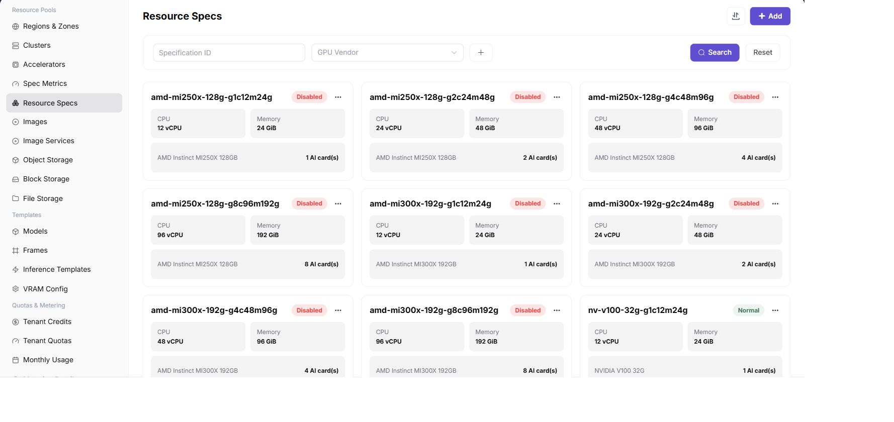

# Resource Specifications

:::: info Document Information
Version: v1.0
Updated: 2026-07-08
::::

## Feature Overview

`Resource Specifications` is used to maintain resource packages that users can select when creating jobs, combining metrics such as CPU, memory, and AI accelerators.

| Item | Content |
| --- | --- |
| Applicable Role | Operator |
| Navigation Path | Resource Pools > Resource Specifications |
| Page Route | /powerone/resourcepool/flavor/list |
| Managed Objects | Specification name, CPU, memory, accelerator metrics, quantity, status, and copy-create relationship |
| Typical Use | Define job resource packages, limit the resource request scope for users, and open specifications to jobs after associating them with clusters |

### Beginner View

- **Resource specification** is like a resource package. Users select it to request resources when creating jobs.
- **Specification metric** is the ingredient in the package. Metrics must exist before they can be combined into specifications.
- **Create from this** copies an existing specification to quickly create a similar one.

### Configuration Flow

1. Prepare CPU, memory, and accelerator metrics.
2. Create a resource specification, fill in the specification name and metric quantities.
3. Enable the specification and associate it with the target cluster.
4. Create a test job to confirm that the specification is selectable and schedulable.

### Terms Quick Reference

| Term | Description |
| --- | --- |
| Specification Name | Resource package name displayed on the user side or job creation page. |
| CPU/Memory | Basic resource request amount for jobs. |
| AI Accelerator | Optional hardware resource configured by metric and quantity. |
| Status | Determines whether the specification can be used by subsequent flows. |

## Prerequisites

1. Specification metrics have been configured.
2. If the specification includes accelerators, accelerator model and metric association has been completed.
3. Specification naming, resource tiers, and applicable job types have been planned.

## Page Description

The page displays specification name, status, CPU, memory, accelerator type, and quantity. It supports filtering by GPU vendor.

The following figure shows the resource specification list. Cards show CPU, memory, and accelerator quantity.

## Add Resource Specification

### Applicable Scenarios

- Add resource tiers for training, inference, or development jobs.
- Provide different specification combinations by GPU model.

### Pre-Operation Check

1. Confirm that specification metrics exist and are available.
2. Confirm that the specification name reflects CPU, memory, card type, and card count.

### Procedure

1. Go to `Resource Pools > Resource Specifications`.
2. Click `Add`.
3. Fill in the specification name.
4. Select CPU, memory, and accelerator metrics, and fill in quantities.
5. Confirm the status and applicable scope.
6. Click `OK` to save.

The following figure shows the add resource specification entrypoint. Clarify the CPU, memory, and accelerator combination during creation.

### Parameters

| Field Name | Required | Field Type | Example | Description |
| --- | --- | --- | --- | --- |
| Specification Name | Yes | Text | `gpu-a100-1-16c-64g` | Specification selected when users create instances. |
| CPU | Yes | Number | `16` | CPU cores included in the specification. |
| Memory | Yes | Text | `64GiB` | Memory included in the specification. |
| Accelerator | No | Text | `A100 x 1` | Accelerator included in the specification. |
| Associated Cluster | Conditionally required | Multi-select | `cluster-a` | Clusters where this specification is available. |

### Pitfalls

- Oversized specifications may cause user jobs to wait for resources for a long time.
- If a specification name is widely referenced after creation, frequent changes to the display definition are not recommended.

### Result Validation

1. The specification appears in the list.
2. The target cluster details can associate this specification.
3. Users can select this specification when creating jobs.

## Configuration Rules and Impact

- **Metrics before specifications**: Specifications depend on specification metrics.
- **Then associate clusters**: After a specification is created, it must still be associated with clusters before users can select it.
- **Readable naming**: Specification names should help capacity troubleshooting and user selection.

## FAQ

### Resource Specification Is Not Selectable When Users Create Instances

**Symptom:**

The resource specification has been created, but users cannot see it when creating an online IDE, runtime instance, or model service.

**Possible Causes:**

- The specification is not enabled or is excluded by filters.
- The specification is not associated with the target cluster.
- The accelerator metric in the specification is inconsistent with the resource key actually reported by the cluster.
- Tenant quota or template visibility scope does not cover the specification.

**Solution:**

1. Confirm specification status and name.
2. Go to cluster details and check "Associated Specifications."
3. Verify the k8s-key and selector-key in the specification metric.
4. Check tenant quota, template specification scope, and the region selected by the user.

### Scheduling Fails Because Specification and Cluster Are Not Associated

**Symptom:**

The user can submit an instance, but the instance remains queued for a long time or events indicate that no resources are available.

**Possible Causes:**

- The target specification is not associated with the hosting cluster.
- The specification is associated with the cluster, but cluster resources are insufficient.
- The region or availability zone selected by the user is inconsistent with the associated cluster.

**Solution:**

1. Associate the target specification with the target cluster in cluster details.
2. View cluster, node, and device monitoring to confirm remaining capacity.
3. Ask the user to reselect the correct region or use another specification.

### Resource Usage Definition Is Inconsistent After Specification Configuration

**Symptom:**

The CPU, memory, or accelerator quantity displayed by the specification is inconsistent with monitoring, metering, or instance events.

**Possible Causes:**

- Specification metric units or quantities are inconsistent.
- Metric key is inconsistent with the Kubernetes reported resource key.
- Metering rules and specification display definitions are not synchronized.

**Solution:**

1. Verify specification metrics, resource specifications, and metering rules.
2. Use a test instance to confirm actual requested resources.
3. Standardize metric units and display names if necessary.

## Follow-Up Operations

1. Go to `Resource Pools > Cluster Management` and associate specifications with the target cluster.
2. Submit a test job to verify specification scheduling results.

## Notes

- Once opened to users, resource specifications directly affect creation choices for model instances, online IDEs, and runtime instances.
- Before modifying specification name, resource quantity, or enabled/disabled status, confirm associated clusters, templates, tenant quotas, and running instances.
- Large specifications may increase queue time, while small specifications may cause insufficient resources after task startup. Calibrate with monitoring and failure cases.
- Prepare replacement specifications and notify affected tenants or businesses before disabling specifications.
