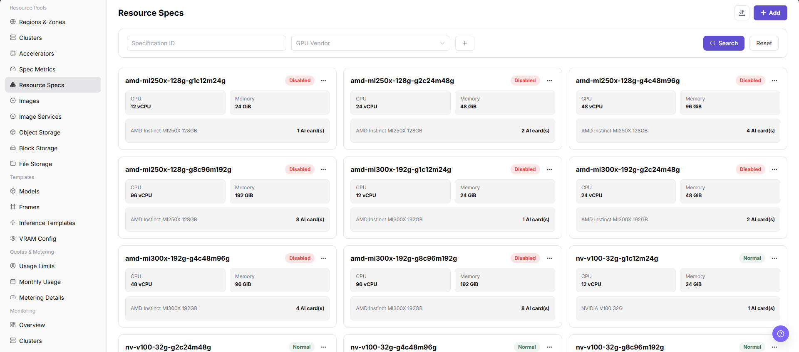
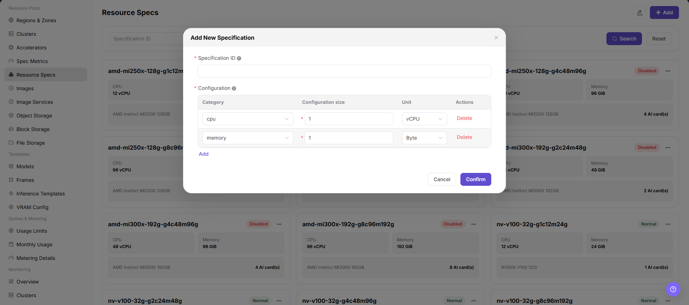

# Resource Specifications

::: info Document Information
Version: v1.0
Updated: 2026-07-08
:::

## Feature Overview

`Resource Specifications` is used to maintain resource packages that users can select when creating online IDEs, runtime instances, training jobs, or model services. It combines specification metrics such as CPU, memory, and AI accelerators, and becomes available to users after being associated with clusters.

| Item | Content |
| --- | --- |
| Applicable Role | Operator |
| Navigation Path | AI Infra > On-Prem > Resource Pools > Resource Specifications |
| Page Route | /powerone/resourcepool/flavor/list |
| Managed Objects | Specification name, CPU, memory, accelerator, accelerator quantity, specification metrics, associated clusters, and enabled status |
| Typical Use | Define job resource packages, limit the resource request scope for users, and open specifications to jobs or model services after cluster association |

#### Beginner View

- **Resource specification** is like a resource package. Users select it to request resources when creating jobs or services.
- **Specification metric** is a resource item in the package. CPU, memory, or accelerator metrics must exist before they can be combined into specifications.
- **Associated cluster** determines where the specification is available. After creation, the specification still needs to match actual cluster capacity.

#### Configuration Flow

1. Prepare CPU, memory, accelerator, and other specification metrics.
2. Add a resource specification, fill in the specification name, and combine metric quantities.
3. If the specification includes accelerators, verify accelerator metric, k8s-key, selector-key, and resources actually reported by the cluster.
4. Enable the specification and associate it with the target cluster.
5. Submit a test job or model service to confirm that the specification is selectable and schedulable.

#### Terms Quick Reference

| Term | Description |
| --- | --- |
| Specification Name | Resource package name displayed on the user side or job creation page. |
| CPU | CPU cores or CPU metric quantity included in the specification. |
| Memory | Memory capacity included in the specification. |
| Accelerator | Optional hardware resource, usually configured by accelerator metric and quantity. |
| Specification Metric | Base metric referenced by resource specifications, such as CPU, memory, or AI accelerator metric. |
| Associated Cluster | Cluster scope where the specification can be scheduled. |

## Prerequisites

1. The current account has operator permissions and can access `AI Infra > On-Prem > Resource Pools > Resource Specifications`.
2. Specification metrics have been configured, and CPU, memory, and accelerator metrics are available.
3. If the specification includes accelerators, accelerator model, k8s-key, selector-key, and resources actually reported by cluster nodes have been confirmed.
4. Specification naming, resource tiers, applicable job types, and later cluster association scope have been planned.
5. For learning or screenshots, only view page fields and dialogs without submitting real specification configuration.

## Page Description

The page displays specification name, status, CPU, memory, accelerator type, and quantity. It supports filtering by GPU vendor.

The following figure shows the resource specification list. Cards show CPU, memory, and accelerator quantity.

## Main Operations

### Add Resource Specification

#### Applicable Scenarios

Add a specification when resource tiers are required for training, inference, development, or model services, or when different resource combinations need to be provided by CPU, memory, accelerator model, and card count.

#### Steps

1. Go to `AI Infra > On-Prem > Resource Pools > Resource Specifications`.
2. Click `Add` or the actual add entry on the page.
3. Fill in the specification name. Use a name that reflects CPU, memory, accelerator model, card count, and applicable scenario.
4. Select CPU, memory, accelerator, and other specification metrics, and fill in the corresponding quantities.
5. If the specification includes accelerators, verify that the accelerator metric, k8s-key, and selector-key are consistent with resources actually reported by the cluster.
6. Before clicking the final `Save`, `Submit`, or `OK`, verify the resource combination, naming convention, and later cluster association impact.
7. For learning or page validation only, view the fields and dialog without submitting real specification configuration.

The following figure shows the Add Resource Specification dialog. Clarify the CPU, memory, and accelerator combination during creation.

## Parameter Reference

| Parameter | Required | Description | Configuration Suggestion |
| --- | --- | --- | --- |
| Specification Name | Yes | Specification name selected when users create online IDEs, runtime instances, training jobs, or model services. | Use a name that reflects CPU, memory, accelerator model, card count, and applicable scenario. |
| CPU | Conditionally required | CPU metric and quantity included in the specification. | Match the CPU resources required by the job, and avoid oversized or undersized settings. |
| Memory | Conditionally required | Memory metric and capacity included in the specification. | Keep memory units consistent to avoid display and scheduling definition mismatch. |
| Accelerator | No | AI accelerator type or metric included in the specification. | Keep it consistent with maintained accelerators and specification metrics. |
| Accelerator Quantity | No | Number of accelerator cards included in the specification. | Match resources actually reported by cluster nodes and schedulable capacity. |
| Specification Metric | Yes | CPU, memory, accelerator, and other metrics referenced by the resource specification. | k8s-key, selector-key, and unit should already be calibrated. |
| Associated Cluster | Conditionally required | Cluster scope where the specification is available. | Verify cluster region, availability zone, and actual resource capacity before association. |
| Enabled Status | No | Controls whether the specification can be selected by later flows. | Complete association and test validation before opening it to users. |
| Actions | No | Supports add, edit, create from this, enable, disable, delete, and other operations. | Confirm impact scope and replacement options before high-risk actions. |

## Pitfalls

- Adding a specification affects resource packages available when users create online IDEs, runtime instances, training jobs, or model services.
- Oversized specifications may increase queue time; undersized specifications may cause insufficient resources after task startup.
- Incorrect specification metrics, k8s-key, or selector-key may make the specification unavailable or cause scheduling failures.
- `Save`, `Submit`, and `OK` are high-risk final actions.
- Do not record real cluster IDs, resource pool IDs, node labels, internal resource key mappings, tenant information, accounts, keys, tokens, or internal test parameters.

## Result Validation

| Check Item | Expected Result | Troubleshooting |
| --- | --- | --- |
| Page can be opened | `AI Infra > On-Prem > Resource Pools > Resource Specifications` is accessible. | Check menu configuration and account permissions. |
| List loads normally | Specification cards, status, CPU, memory, accelerator type, and quantity are displayed normally. | Refresh the page and check service status or browser console errors. |
| Add entry is visible | `Add` or the actual add entry is displayed on the page. | Check operator permissions and page configuration. |
| Add dialog can be opened | Clicking the add entry opens the Add Resource Specification dialog. | Check route, permissions, and frontend errors. |
| Required field validation works | Validation prompts appear when specification name, specification metric, or quantity is missing. | Complete fields according to page prompts without bypassing validation. |
| No real submission during learning | No real save, submit, or OK action is triggered. | If submitted by mistake, immediately check the list and follow the handling process. |
| Record is traceable after real submission | The new specification appears in the Resource Specifications list, and status is visible. | Check filters, enabled status, and submission result. |
| Cluster association can be verified | The target cluster details can associate or show this specification. | Check specification enabled status, associated cluster, and cluster resource capacity. |

## Configuration Rules and Impact

- **Metrics before specifications**: Specifications depend on specification metrics. Without metrics, CPU, memory, or accelerators cannot be configured accurately.
- **Then associate clusters**: After a specification is created, it must still be associated with clusters before users can select it.
- **Consistent resource combination**: CPU, memory, and accelerator quantity in the specification should match cluster schedulable resources.
- **Readable naming**: Specification names should help capacity troubleshooting, user selection, and later template references.
- **Change enabled status carefully**: Before disabling or modifying an opened specification, confirm impacts on templates, tenant quotas, and running instances.

## FAQ

#### Resource Specification Is Not Selectable When Users Create Instances

**Symptom:**

The resource specification has been created, but users cannot see it when creating an online IDE, runtime instance, or model service.

**Possible Causes:**

- The specification is not enabled or is excluded by filters.
- The specification is not associated with the target cluster.
- The accelerator metric in the specification is inconsistent with the resource key actually reported by the cluster.
- Tenant quota or template visibility scope does not cover the specification.

**Solution:**

1. Confirm specification status and name.
2. Go to cluster details and check associated specifications.
3. Verify the k8s-key and selector-key in the specification metric.
4. Check tenant quota, template specification scope, and the region selected by the user.

#### Scheduling Fails Because Specification and Cluster Are Not Associated

**Symptom:**

The user can submit an instance, but the instance remains queued for a long time or events indicate that no resources are available.

**Possible Causes:**

- The target specification is not associated with the hosting cluster.
- The specification is associated with the cluster, but cluster resources are insufficient.
- The region or availability zone selected by the user is inconsistent with the associated cluster.

**Solution:**

1. Associate the target specification with the target cluster in cluster details.
2. View cluster, node, and device monitoring to confirm remaining capacity.
3. Ask the user to reselect the correct region or use another specification.

#### Resource Usage Definition Is Inconsistent After Specification Configuration

**Symptom:**

The CPU, memory, or accelerator quantity displayed by the specification is inconsistent with monitoring, metering, or instance events.

**Possible Causes:**

- Specification metric units or quantities are inconsistent.
- Metric key is inconsistent with the Kubernetes reported resource key.
- Metering rules and specification display definitions are not synchronized.

**Solution:**

1. Verify specification metrics, resource specifications, and metering rules.
2. Use a test instance to confirm actual requested resources.
3. Standardize metric units and display names if necessary.

## Next Steps

1. Go to `AI Infra > On-Prem > Resource Pools > Cluster Management` and associate specifications with the target cluster.
2. Submit a test job, online IDE, or model service to verify specification scheduling results.
3. Return to the Resource Specifications list and confirm that enabled status, filter results, and associations are as expected.

## Notes

- Once opened to users, resource specifications directly affect creation choices for model instances, online IDEs, runtime instances, and training jobs.
- Before modifying specification name, resource quantity, or enabled/disabled status, confirm associated clusters, templates, tenant quotas, and running instances.
- Large specifications may increase queue time, while small specifications may cause insufficient resources after task startup. Calibrate with monitoring and failure cases.
- `Save`, `Submit`, and `OK` are high-risk final actions. Do not trigger them during learning or screenshots.
- Do not record real cluster IDs, resource pool IDs, node labels, internal resource key mappings, tenant information, accounts, keys, tokens, or internal test parameters.
