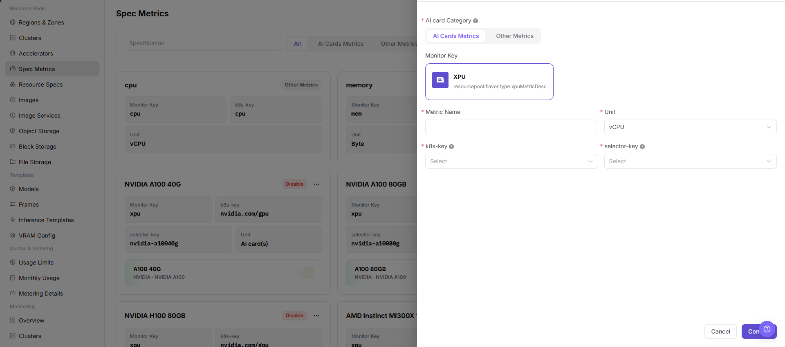

# Specification Metrics

::: info Document Information
Version: v1.0
Updated: 2026-07-08
:::

## Feature Overview

`Specification Metrics` is used to maintain base metrics that resource specifications can reference, including CPU, memory, AI accelerator metrics, and other resource metrics supported by the page. Metrics determine how resource specifications map to Kubernetes resource keys and affect job scheduling, monitoring display, and capacity statistics.

| Item | Content |
| --- | --- |
| Applicable role | Operator |
| Navigation path | AI Infrastructure > On-Prem > Resource Pools > Specification Metrics |
| Page route | `/powerone/resourcepool/flavor/type` |
| Managed objects | Metric name, metric type, resource key, unit, k8s-key, selector-key, monitoring metric, and enabled status |
| Typical use | Define resource specification fields, associate accelerator models, and support job resource requests and monitoring display |

#### Beginner Explanation

Specification metrics are like units of measure in a resource specification table. Whether CPU, memory, GPU, VRAM, and other fields can be correctly identified, displayed, and counted depends on metric definitions. When metric definitions are inconsistent, the specification name users see can fail to match the actual scheduled resources.

#### Configuration Flow

1. Confirm resource keys, node labels, and monitoring metric definitions actually reported by the target cluster.
2. Create CPU, memory, AI accelerator metrics, or other metrics supported by the page in `Specification Metrics`.
3. For an AI accelerator metric, verify accelerator model, k8s-key, and selector-key.
4. Reference the metric in `Resource Specifications`.
5. Use a test job to verify resource requests, scheduling result, and monitoring display.

#### Terms Quick Reference

| Term | Description |
| --- | --- |
| Metric Name | Metric name displayed on the page and referenced by resource specifications. |
| Metric Type | CPU, memory, AI accelerator metric, or another metric type provided by the page. |
| Resource Key | Resource identifier used for scheduling or metering. |
| Unit | Resource display and metering unit, such as vCPU, GiB, Byte, or AI card(s). |
| k8s-key | Kubernetes scheduling resource key, such as `cpu`, `memory`, or `nvidia.com/gpu`. |
| selector-key | Accelerator model or node label filter key, used to distinguish different hardware under the same k8s-key. |
| Monitoring Metric | Metric mapping used in platform resource monitoring. |
| Enabled Status | Whether the metric can be referenced by resource specifications, templates, or job flows. |

## Prerequisites

1. The current account has operator permissions and can access `AI Infra > On-Prem > Resource Pools > Specification Metrics`.
2. Target cluster resource reporting definitions have been confirmed, including k8s-key, selector-key, unit, and monitoring metric mapping.
3. If creating an AI accelerator metric, accelerator model, node labels, and device plugin reporting information have been confirmed.
4. The impact on resource specifications, templates, job scheduling, or metering rules has been evaluated.
5. For learning or screenshots, only view page fields and drawers without submitting real specification metric configuration.

## Page Description

The page displays configured metrics as cards and supports filtering by metric name, AI accelerator metrics, and other metrics.

The following figure shows the specification metric list, where monitoring metrics, k8s-key, selector-key, and units can be viewed.

## Main Operations

### Add Specification Metric

#### Applicable Scenarios

Add a specification metric when a new hardware resource type needs to be added, CPU or memory metrics need maintenance, or an AI accelerator needs to be connected to resource specifications and job scheduling.

#### Steps

1. Go to `AI Infra > On-Prem > Resource Pools > Specification Metrics`.
2. Click `Add` or the actual add entry on the page.
3. Select a metric type, such as CPU, memory, AI accelerator metric, or another metric type provided by the page.
4. Select AI card category, AI cards metrics, or other metrics, and fill in metric name, unit, k8s-key, and selector-key according to the page fields.
5. For an AI accelerator metric, verify that selector-key is consistent with labels actually reported by cluster nodes.
6. Before clicking the final `Save`, `Submit`, or `OK`, verify the metric scope, unit, k8s-key, and selector-key again.
7. For learning or page validation only, view the fields and drawer without submitting real specification metric configuration.

The following figure shows the Add Specification Metric drawer. AI accelerator metrics require k8s-key and selector-key.

## Parameter Reference

| Parameter | Required | Description | Configuration Suggestion |
| --- | --- | --- | --- |
| AI card Category | Conditionally required | Category selected when adding an AI accelerator metric. | Keep it consistent with hardware categories in Accelerators. |
| AI Cards Metrics | Conditionally required | Metric type selected for AI accelerator spec metrics. | Used to distinguish accelerator metrics. |
| Other Metrics | Conditionally required | CPU, memory, or another non-accelerator metric supported by the page. | Keep it consistent with resource specification display and scheduling scope. |
| Metric Name | Yes | Display name of the specification metric. | Use a name that expresses resource type and unit. |
| Unit | Yes | Display or metering unit. | Keep it consistent with capacity statistics and Resource Specs. |
| k8s-key | Conditionally required | Kubernetes scheduling resource key. | Must match the resource key actually reported by Kubernetes nodes. |
| selector-key | Conditionally required | Accelerator model, node label, or device selector key. | Must match the accelerator model or node label. |
| Actions | System-generated | Add, edit, import/export, delete, and similar entries. | `Confirm` submits real configuration. Do not click it during learning or screenshot capture. |

## Pitfalls

- Adding specification metrics affects resource specifications, job scheduling, monitoring display, and metering definitions.
- k8s-key must match the resource key actually reported by Kubernetes nodes, or jobs may fail to request resources.
- selector-key must match accelerator models or node labels, or AI accelerator metrics may fail to match devices correctly.
- Incorrect metric units may cause specification display, capacity statistics, or template recommendation deviations.
- Before disabling or deleting metrics referenced by resource specifications, confirm the impact on specifications, templates, and running jobs.
- `Save`, `Submit`, and `OK` are high-risk final actions. Do not click them during learning or screenshots.

## Result Validation

| Check Item | Success Criteria | Troubleshooting |
| --- | --- | --- |
| Page can be opened | `AI Infra > On-Prem > Resource Pools > Specification Metrics` is accessible. | Check menu configuration and account permissions. |
| List loads normally | Metric cards, filters, k8s-key, selector-key, and units are displayed normally. | Refresh the page and check service status or browser console errors. |
| Add entry is visible | The page shows `Add` or the actual add entry. | Check operator permissions and page status. |
| Add drawer can be opened | Clicking the add entry opens the Add Specification Metric drawer. | Check route, permissions, and frontend errors. |
| Required field validation works | Validation prompts appear when required fields are missing. | Fill in fields according to page prompts and do not use real internal parameters for learning tests. |
| No real configuration is submitted during learning | Only fields and drawer are viewed. The final `Save`, `Submit`, or `OK` is not clicked. | If submitted by mistake, notify the platform administrator and follow the change process. |
| Record is traceable after real submission | The new metric appears in the specification metric list. | Check filters, enabled status, and submission result. |
| Resource specification can reference it | The resource specification creation page can select this metric. | Check metric enabled status, k8s-key, and selector-key. |
| Test job can be scheduled | A test job can request resources according to this metric and schedule normally. | Verify Kubernetes node reporting, device plugin, and resource specification configuration. |

## Configuration Rules and Impact

- **Metric before specification**: Resource specifications must reference existing and available specification metrics.
- **k8s-key consistency**: Use the key actually reported by Kubernetes nodes, not the page display name.
- **selector-key consistency**: The selector-key of AI accelerator metrics should be consistent with accelerator models or node labels.
- **Unit consistency**: Capacity metrics such as memory, VRAM, and disk should use unified GiB, GB, or platform-defined units.
- **Disable impact**: Disabling a metric may affect resource specifications, template recommendations, job creation, and metering statistics.
- **Monitoring impact**: Incorrect monitoring metric mapping may cause abnormal resource monitoring display or capacity statistics deviations.

## FAQ

#### Metric units are inconsistent

**Symptom:** The same resource appears with inconsistent units or quantities across specification, monitoring, and metering pages.

**Resolution:**

1. Confirm metric units, such as vCPU, GiB, Byte, and AI card(s).
2. Compare cluster resource reporting and monitoring definitions.
3. Synchronize resource specifications, template recommendations, and metering rules.
4. Use a test job to confirm that display and actual resource requests are consistent.

#### Job cannot request resources after k8s-key is filled in

**Symptom:** The metric has been created and referenced by a resource specification, but job scheduling events indicate that the resource does not exist or is insufficient.

**Resolution:**

1. Verify the real k8s-key in cluster node resources.
2. Check whether the device plugin and node labels are reported normally.
3. Verify whether selector-key matches the accelerator model or node label.
4. Correct the metric, re-associate the resource specification, and submit a test job.

#### Referenced metric cannot be safely taken offline

**Symptom:** When preparing to disable or delete a metric, it is unclear which specifications and jobs will be affected.

**Resolution:**

1. Search for resource specifications that reference this metric first.
2. Confirm associated clusters, templates, and running jobs.
3. Migrate specifications during a maintenance window before disabling the metric.
4. After disabling, use a test job to confirm that the new metric and specification can schedule normally.

## Next Steps

1. Go to `Resource Pools > Resource Specifications` to create or adjust specifications.
2. Go to `Resource Pools > Accelerator Management` to confirm accelerator model associations.
3. Verify in a test job that the metric resource can be requested normally.
4. Return to the Specification Metrics list and confirm that enabled status, unit, and filter results are as expected.

## Notes

- Adding specification metrics affects resource specifications, job scheduling, monitoring display, and metering definitions.
- k8s-key, selector-key, unit, and monitoring metric mapping must follow real cluster and platform definitions.
- Do not directly delete metrics referenced by specifications. Migrate specifications and verify job scheduling first.
- `Save`, `Submit`, and `OK` are high-risk final actions.
- Do not write real internal resource key mappings, node labels, cluster IDs, resource pool IDs, internal addresses, accounts, keys, tokens, or internal test parameters.
