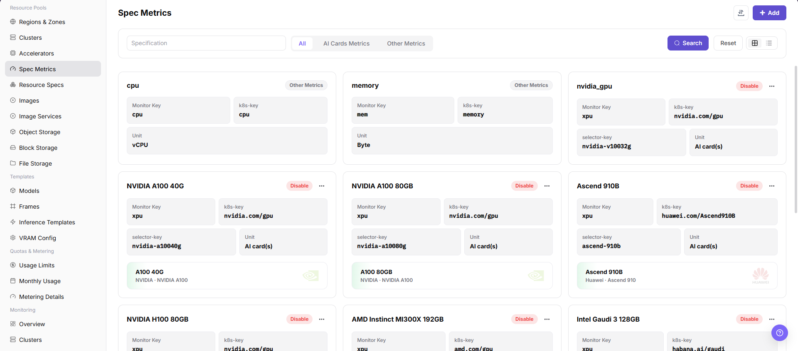

# Specification Metrics

## Feature Overview

`Specification Metrics` is used to maintain base metrics that resource specifications can reference, including CPU, memory, and AI accelerator metrics. Metrics determine how resource specifications map to Kubernetes resource keys.

| Item | Content |
| --- | --- |
| Applicable Role | Operator |
| Navigation Path | Resource Pools > Specification Metrics |
| Page Route | /powerone/resourcepool/flavor/type |
| Managed Objects | CPU metrics, memory metrics, AI accelerator metrics, k8s-key, selector-key, and units |
| Typical Use | Define resource specification fields, associate accelerator models, and support job resource requests |

### Beginner View

Specification metrics are like units of measure in a specification table. They determine how CPU, memory, GPU, VRAM, and other fields are identified, displayed, and counted. When metric definitions are inconsistent, the specification name users see can easily fail to match the actual scheduled resources.

### Configuration Flow

1. Confirm the resource keys reported by the cluster.
2. Create CPU, memory, or accelerator metrics.
3. For accelerator metrics, associate the corresponding accelerator model.
4. Reference the metric in resource specifications and verify job scheduling.

### Terms Quick Reference

| Term | Description |
| --- | --- |
| Monitoring Metric | Metric type used in platform resource monitoring. |
| k8s-key | Kubernetes scheduling resource key, such as `cpu`, `memory`, or `nvidia.com/gpu`. |
| selector-key | Accelerator model filter key, used to distinguish different hardware under the same k8s-key. |
| Unit | Resource display and metering unit, such as vCPU, Byte, or AI card(s). |

## Prerequisites

1. The target cluster resource reporting definition has been confirmed.
2. If creating an AI accelerator metric, the accelerator model and selector-key have been confirmed.
3. The current account has specification metric maintenance permissions.

## Page Description

The page displays configured metrics as cards and supports filtering by metric name, AI accelerator metrics, and other metrics.

The following figure shows the specification metric list, where monitoring metrics, k8s-key, selector-key, and units can be viewed.

## Add Specification Metric

### Applicable Scenario

- Add a hardware resource type or connect an accelerator to resource specifications.

### Pre-Operation Check

1. Confirm that k8s-key is consistent with what cluster nodes actually report.
2. Confirm that the unit and metric name match long-term maintenance definitions.

### Procedure

1. Go to `Resource Pools > Specification Metrics`.
2. Click `Add`.
3. Select AI accelerator metric or another metric.
4. Fill in metric name, unit, k8s-key, and selector-key.
5. Click `OK` to save.

The following figure shows the add specification metric drawer. AI accelerator metrics require k8s-key and selector-key.

### Parameters

| Field Name | Required | Field Type | Example | Description |
| --- | --- | --- | --- | --- |
| Metric Name | Yes | Text | `GPU` | Specification metric display name. |
| Resource Key | Yes | Text | `nvidia.com/gpu` | Resource key used for scheduling. |
| Unit | Yes | Text | `card` | Metric metering unit. |
| Display Order | No | Number | `10` | Page display order. |
| Status | Yes | Enum | `Enabled` | Whether specifications can reference it. |

### Pitfalls

- Do not change k8s-key casually for display convenience.
- Before disabling a metric already referenced by resource specifications, confirm the impact scope.

### Result Validation

1. The metric appears in the list.
2. The resource specification creation page can select this metric.
3. A test job can request resources according to this metric.

## Configuration Rules and Impact

- **Metric before specification**: Resource specifications must reference existing specification metrics.
- **Disable impact**: Disabling a metric may affect resource specifications and job creation.
- **Resource key priority**: Use the key actually reported by the cluster, not the page display name.

## FAQ

### Metric Units Are Inconsistent

**Symptom:**

The same resource appears with inconsistent units or quantities across specification, monitoring, and metering pages.

**Possible Causes:**

- The specification metric unit is selected incorrectly.
- Memory, VRAM, or disk uses different conversion definitions.
- Metering rules have not synchronized the latest metric units.

**Solution:**

1. Confirm metric units, such as vCPU, GiB, and AI card(s).
2. Compare cluster resource reporting and monitoring definitions.
3. Synchronize resource specifications and metering rules.

### Job Cannot Request Resources After k8s-key Is Filled In

**Symptom:**

The metric has been created and referenced by a resource specification, but job scheduling events indicate that the resource does not exist or is insufficient.

**Possible Causes:**

- k8s-key is inconsistent with the key actually reported by cluster nodes.
- selector-key does not match the accelerator model label.
- The target node has not reported this extended resource.

**Solution:**

1. Verify the real key in cluster node resources.
2. Check the device plugin and node labels.
3. Correct the metric, re-associate the resource specification, and submit a test job.

### Referenced Metric Cannot Be Safely Taken Offline

**Symptom:**

When preparing to disable or delete a metric, it is unclear which specifications and jobs will be affected.

**Possible Causes:**

- The metric has been referenced by multiple resource specifications.
- Specifications have been associated with clusters and used by templates.
- Running jobs still request resources according to this metric.

**Solution:**

1. Search for resource specifications that reference this metric first.
2. Confirm associated clusters, templates, and running jobs.
3. Migrate specifications during a maintenance window before disabling the metric.

## Follow-Up Operations

1. Go to `Resource Pools > Resource Specifications` to create or adjust specifications.
2. Go to `Resource Pools > Accelerator Management` to confirm accelerator model associations.

## Notes

- Metric units, dimensions, and k8s-key affect resource specifications, monitoring display, and metering definitions. Do not modify them only by display name.
- Capacity metrics such as memory, VRAM, and disk should use unified GiB, GB, or platform-defined units to avoid metering deviation.
- The selector-key of accelerator metrics should be consistent with labels actually reported by nodes.
- Do not directly delete metrics referenced by specifications. Migrate specifications and verify job scheduling first.
