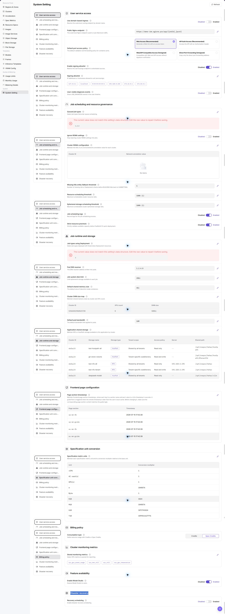
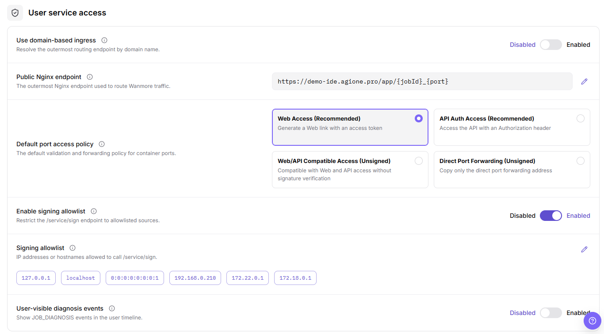
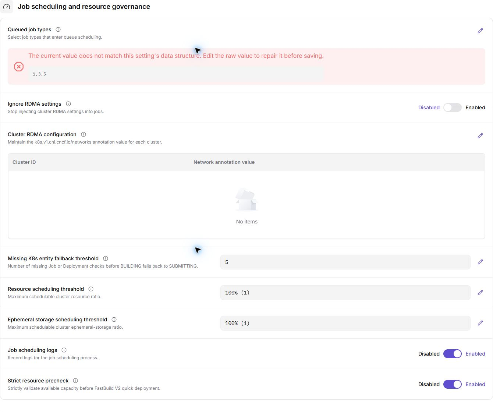
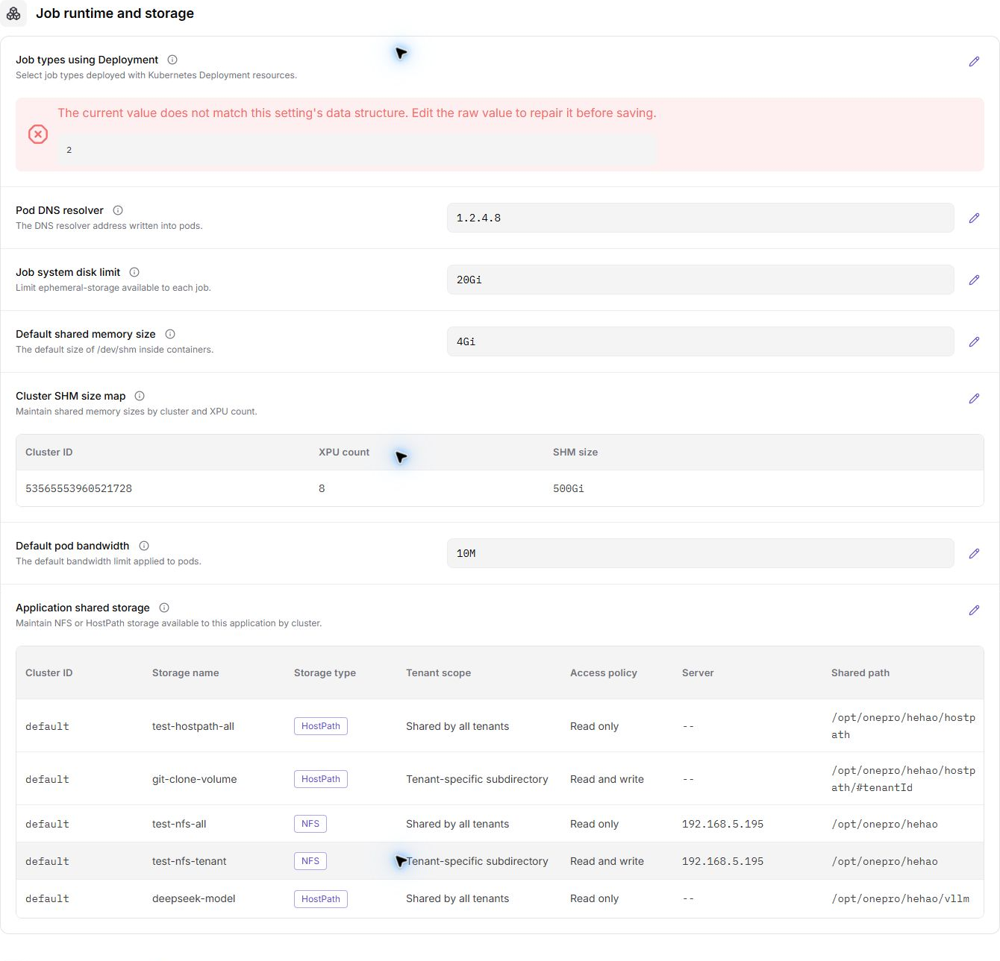
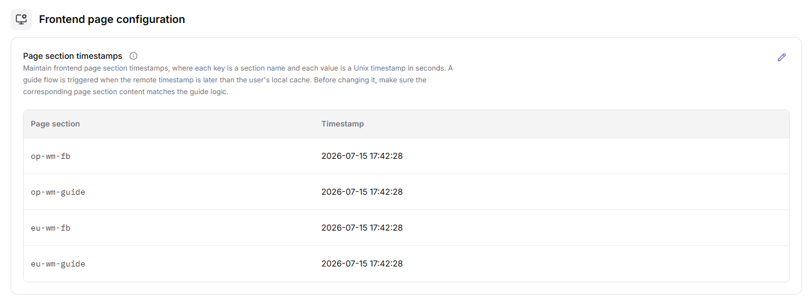
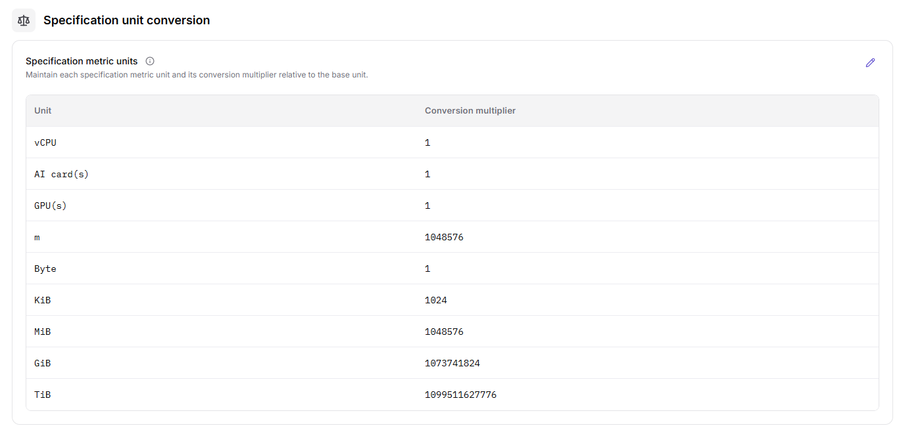
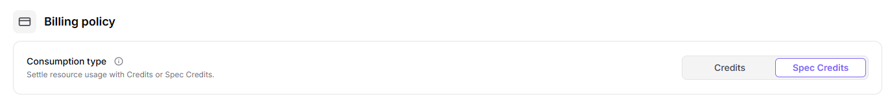
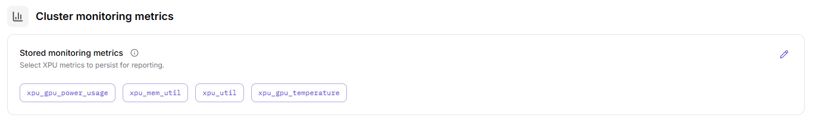
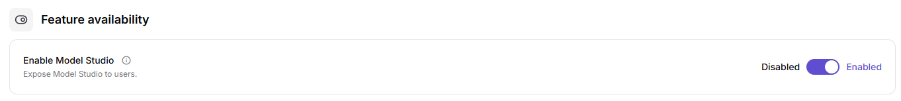
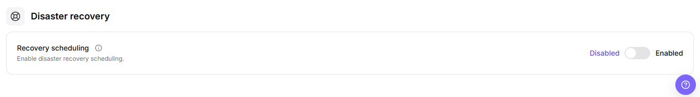

# System Setting

::: info Document Information
Version: v1.0
Updated: 2026-07-23
:::

## Feature Overview

`System Setting` is used to view system-level configuration items and their current status. Operators can use this page to check whether platform configuration is complete, enabled, and available for further review.

| Item | Content |
| --- | --- |
| Applicable role | Operator |
| Navigation path | AI Infrastructure > On-Prem > System > System Setting |
| Page route | `/powerone/system/config-properties` |
| Managed objects | System configuration items, configuration values, descriptions, status, and action entries |
| Typical use | View platform-level configuration, verify configuration status, and locate system configuration entries |

#### Beginner Explanation

System setting is like a global configuration list for the platform. These settings may affect default behavior, available capabilities, or display logic across multiple modules. For learning or screenshots, view only and do not submit changes.

#### Terms Quick Reference

| Term | Description |
| --- | --- |
| Configuration Item | A system-level parameter or switch provided by the platform. |
| Configuration Value | The current value used by a configuration item. It may be a switch, text, enum, or number. |
| Status | Whether the configuration item is enabled, available, or effective. |
| Action Entry | The page entry used to view, edit, or maintain a configuration item. |

## Prerequisites

1. The current account has operator permissions.
2. The correct On-Prem environment and target region have been selected.
3. Confirm whether this operation is read-only or has approved change permission.
4. For learning or screenshots only, view lists, fields, and dialogs without clicking the final `Save`, `Submit`, or `OK`.

## Page Description

Go to `AI Infra > On-Prem > System > System Setting`. The page displays system-level configuration items. The list is used to view configuration item names, configuration values, descriptions, status, and possible action entries.

If the page provides buttons such as `Edit`, `Save`, `Submit`, or `OK`, open only to review fields and do not perform the final action.

## Main Operations

### View System Setting

#### Pre-Operation Check

1. Confirm that the current environment, account, and region match the review target.
2. Confirm that this operation is for viewing only and will not modify real configuration values.
3. If an edit dialog or drawer must be opened, record only field names, buttons, and prompts. Do not record real configuration values.

#### Procedure

1. Go to `AI Infrastructure > On-Prem > System > System Setting`.
2. View the system configuration list and confirm that the page route is `/powerone/system/config-properties`.
3. Review configuration item name, configuration value, description, status, or action entry.
4. If the page provides view-only buttons such as search, filter, refresh, expand, or details, use them to narrow the review scope.
5. If the page provides `Edit` or a similar maintenance entry, open it only to review fields and do not fill in real configuration values.
6. Before clicking the final `Save`, `Submit`, or `OK`, stop and verify change approval, impact scope, and rollback plan again.
7. For learning or screenshots only, view lists, fields, and dialogs without submitting real system configuration.

##### User Service Access

1. Go to `AI Infrastructure > On-Prem > System > System Setting`.
2. Locate the `User Service Access` configuration group.
3. Review configuration item names, configuration values, descriptions, status, and action entries.
4. If changes are required, record only fields, inline edit areas, or dialogs. Do not click the final `Save`, `Submit`, or `OK` during learning or screenshots.

##### Task Scheduling and Resource Control

::: details Additional screenshot file

:::

1. Go to `AI Infrastructure > On-Prem > System > System Setting`.
2. Locate the `Task Scheduling and Resource Control` configuration group.
3. Review configuration item names, configuration values, descriptions, status, and action entries.
4. If changes are required, record only fields, inline edit areas, or dialogs. Do not click the final `Save`, `Submit`, or `OK` during learning or screenshots.

##### Task Runtime Environment and Storage

::: details Additional screenshot file

:::

1. Go to `AI Infrastructure > On-Prem > System > System Setting`.
2. Locate the `Task Runtime Environment and Storage` configuration group.
3. Review configuration item names, configuration values, descriptions, status, and action entries.
4. If changes are required, record only fields, inline edit areas, or dialogs. Do not click the final `Save`, `Submit`, or `OK` during learning or screenshots.

##### Frontend Page Configuration

::: details Additional screenshot file

:::

1. Go to `AI Infrastructure > On-Prem > System > System Setting`.
2. Locate the `Frontend Page Configuration` configuration group.
3. Review configuration item names, configuration values, descriptions, status, and action entries.
4. If changes are required, record only fields, inline edit areas, or dialogs. Do not click the final `Save`, `Submit`, or `OK` during learning or screenshots.

##### Specification Unit Conversion

::: details Additional screenshot file

:::

1. Go to `AI Infrastructure > On-Prem > System > System Setting`.
2. Locate the `Specification Unit Conversion` configuration group.
3. Review configuration item names, configuration values, descriptions, status, and action entries.
4. If changes are required, record only fields, inline edit areas, or dialogs. Do not click the final `Save`, `Submit`, or `OK` during learning or screenshots.

##### Billing Policy

1. Go to `AI Infrastructure > On-Prem > System > System Setting`.
2. Locate the `Billing Policy` configuration group.
3. Review configuration item names, configuration values, descriptions, status, and action entries.
4. If changes are required, record only fields, inline edit areas, or dialogs. Do not click the final `Save`, `Submit`, or `OK` during learning or screenshots.

##### Cluster Monitoring Metrics

1. Go to `AI Infrastructure > On-Prem > System > System Setting`.
2. Locate the `Cluster Monitoring Metrics` configuration group.
3. Review configuration item names, configuration values, descriptions, status, and action entries.
4. If changes are required, record only fields, inline edit areas, or dialogs. Do not click the final `Save`, `Submit`, or `OK` during learning or screenshots.

##### Feature Availability

1. Go to `AI Infrastructure > On-Prem > System > System Setting`.
2. Locate the `Feature Availability` configuration group.
3. Review configuration item names, configuration values, descriptions, status, and action entries.
4. If changes are required, record only fields, inline edit areas, or dialogs. Do not click the final `Save`, `Submit`, or `OK` during learning or screenshots.

##### Disaster Recovery

1. Go to `AI Infrastructure > On-Prem > System > System Setting`.
2. Locate the `Disaster Recovery` configuration group.
3. Review configuration item names, configuration values, descriptions, status, and action entries.
4. If changes are required, record only fields, inline edit areas, or dialogs. Do not click the final `Save`, `Submit`, or `OK` during learning or screenshots.

## Parameter Reference

| Field Name | Required | Field Type | Example | Description |
| --- | --- | --- | --- | --- |
| Configuration Item | Depends on item | System field | `platform.feature.enabled` | Identifies a system-level configuration item. |
| Configuration Value | Depends on item | Text / switch / enum / number | `true` | Current value used by the configuration item. Do not write real sensitive values in documentation or screenshots. |
| Description | Depends on item | Text | `Feature switch description` | Describes the purpose and impact scope of the configuration item. |
| Status | Depends on item | Status | `Enabled` | Shows whether the configuration item is enabled, available, or effective. |
| Actions | Depends on item | Action entry | `Edit` | Entry used to view, edit, or maintain a configuration item. |

## Pitfalls

- System settings may affect global platform behavior. Confirm the impact scope before making changes.
- `Save`, `Submit`, and `OK` are high-risk final actions and must not be clicked during learning or screenshots.
- Incorrect feature availability, billing policy, disaster recovery, scheduling, or resource governance settings may affect user access, job scheduling, billing results, and recovery capability.
- Do not write real configuration values, tokens, AK/SK, internal endpoints, tenant information, accounts, secrets, or test parameters.
- If a configuration item involves authentication, networking, billing, scheduling, or resource governance, confirm it through the internal change process before modifying it.
- For read-only learning, you may view fields and dialogs, but do not enter real values or trigger final submission.

## Result Validation

| Check Item | Success Signal | If Abnormal |
| --- | --- | --- |
| Page access | `System Setting` opens normally and the route is `/powerone/system/config-properties` | Check account permissions, environment entry, and sidebar entry |
| List view | The page shows the system configuration list or an empty state | Check whether system configuration has been initialized |
| Fields identified | Configuration item name, configuration value, description, status, or action entry can be reviewed | Align the documentation with the actual UI fields |
| No high-risk action | For learning or screenshots, `Save`, `Submit`, or `OK` is not clicked | If triggered accidentally, follow the internal change review process |

## FAQ

#### The Page List Is Empty

**Symptom:**

No configuration item is displayed after entering System Setting.

**Possible Causes:**

- The current account does not have permission to view system configuration.
- System configuration has not been initialized in the current environment.
- The filter condition is too narrow or data loading failed.

**Solution:**

1. Check whether the current account and environment are correct.
2. Clear filter conditions and refresh the page.
3. Contact the platform administrator to confirm whether system configuration has been initialized.

## Next Steps

1. If configuration is missing, record the configuration item name and page location first, then follow the internal confirmation process.
2. If configuration must be changed, confirm the impact scope, approval record, and rollback plan first.
3. After changes, return to affected modules and verify that pages, tasks, or service behavior matches expectations.

## Notes

- System Setting is a platform-level configuration entry and should not be modified casually.
- System settings affect global platform behavior. Confirm the impact scope, approval record, and rollback plan before real changes.
- Do not write real configuration values, secrets, tokens, internal endpoints, accounts, or tenant information in documentation, screenshots, or tickets.
- Before sharing page information externally, desensitize configuration values and internal identifiers.
