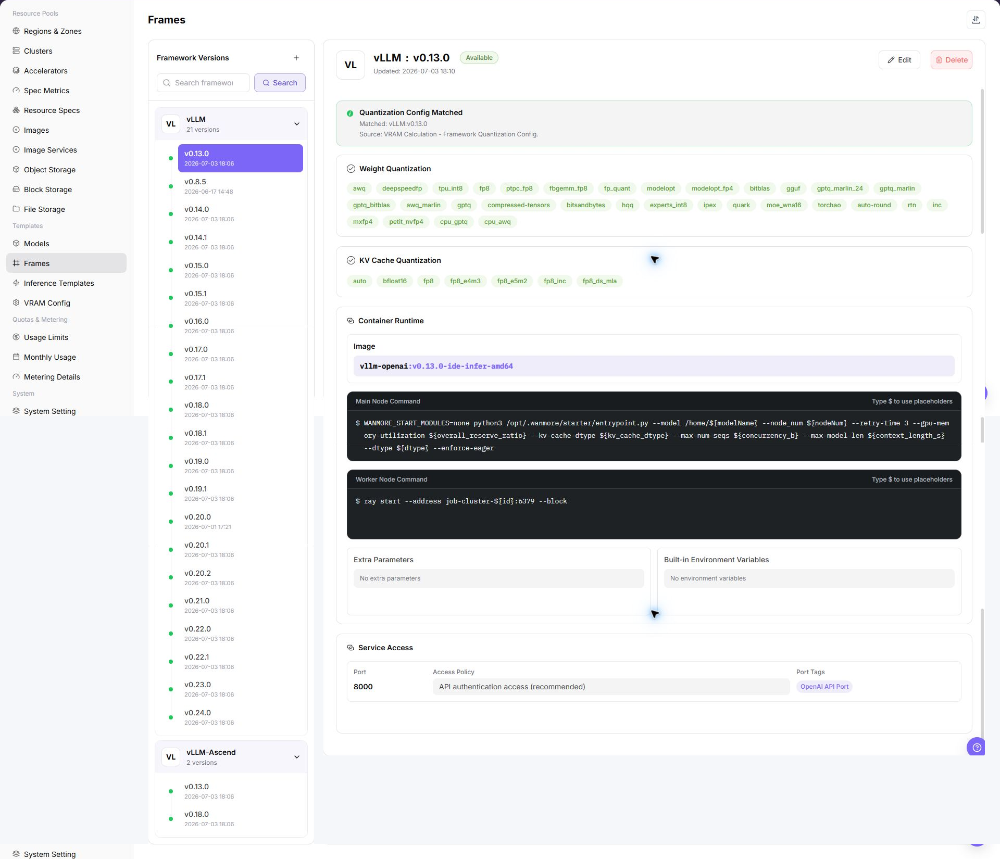
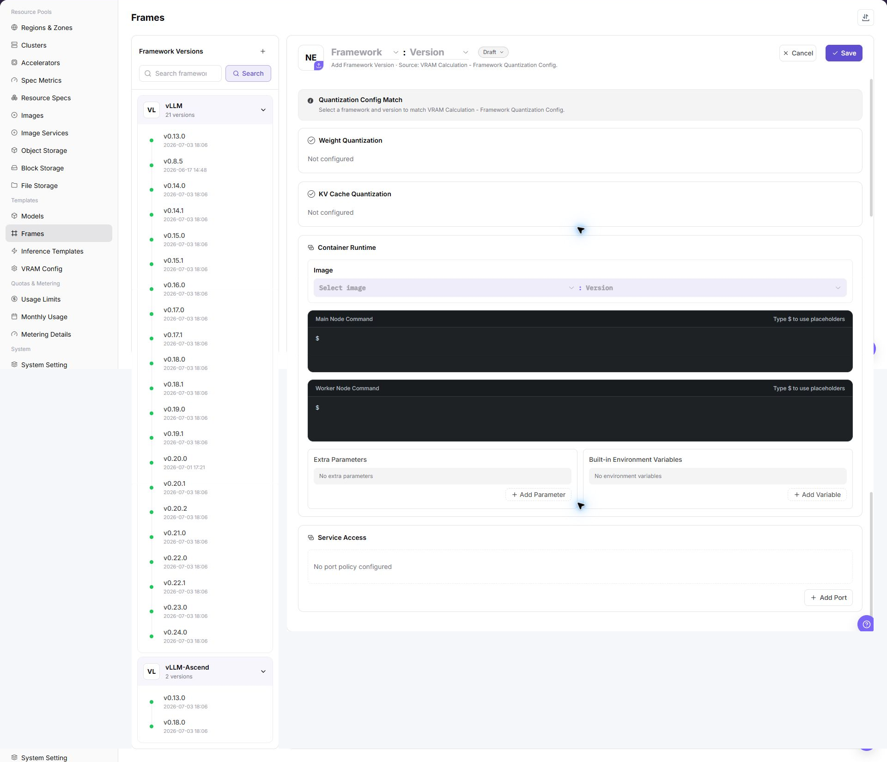

# Framework Configuration

::: info Document Information
Version: v1.0
Updated: 2026-07-08
:::

## Feature Overview

`Framework Configuration` provides a unified and reusable deployment environment template for fast inference services by presetting core parameters such as container images, startup commands, network policies, and environment variables. It simplifies clustered inference deployment, keeps runtime environments consistent, and supports flexible scheduling across different infrastructure resources.

| Item | Content |
| --- | --- |
| Applicable role | Operator |
| Navigation path | AI Infrastructure > On-Prem > Templates > Framework Configuration |
| Page route | `/powerone/fast-build-v2/frameworks` |
| Managed objects | Framework name, version name, image, main node startup command, worker node startup command, extra parameters, environment variables, port exposure policy, port tags, and creation success message |
| Typical use | Provide reusable deployment environment templates for inference templates |

#### Beginner Explanation

Framework configuration is like a standard startup manual for model services. It defines which container image to use, which commands the main node and worker nodes run, which ports are exposed, which environment variables are injected, and what message is shown to users after creation succeeds. When users deploy a model through an inference template, the platform assembles the runtime environment from this configuration.

#### Terms Quick Reference

| Term | Description |
| --- | --- |
| Framework Configuration | A reusable deployment environment template composed of core parameters such as container images, startup commands, network policies, and environment variables. |
| Framework Name | Name of the underlying inference framework or engine. Use the official framework name where possible, such as `VLLM`, `TensorRT`, or `Triton Inference Server`. |
| Version Name | Version identifier of the framework configuration, used for iteration tracking or compatibility management. It can align with the underlying framework version or use an internal scenario name. |
| Image | Container image required to run inference tasks, including the operating system, dependency libraries, and the framework itself. |
| Main Node Startup Command | Startup command for the main node in the task cluster when quickly deploying an inference model. In single-node tasks, this is used directly as the node startup command. |
| Worker Node Startup Command | Startup command for Worker nodes in an inference task cluster, used in distributed inference scenarios. |
| Extra Parameters | Key-value parameters used to dynamically supplement or adjust startup commands. They can be used as individual placeholders or injected into commands through `${extraParamString}` or `${prefixExtraParamString}`. |
| Environment Variables | Preset key-value configurations injected when the container starts, such as `LOG_LEVEL=DEBUG` or `CUDA_VISIBLE_DEVICES=0`. |
| Port Exposure Policy | The default exposure method and access authentication mechanism for network ports after an inference service is deployed. |
| Port Tag | A semantic tag attached to an exposed port to identify the protocol type or purpose. |
| Creation Success Message | Message shown to users after the task cluster is created. Markdown and placeholders are supported. |
| Parameter Placeholder | Variable used in startup commands or creation success messages. The platform replaces it with the actual parameter when the job is created. |

#### Region Availability

Images used by framework configurations are usually hosted in region-specific image repositories, so configuration availability is affected by region. When a framework is selected for fast deployment, the platform filters available framework configurations by the selected region. Before maintaining a framework, confirm that the target region has an available image repository and that the cluster can pull the corresponding image.

## Prerequisites

1. The framework image has been prepared and can be pulled by the target region and target cluster.
2. The supported model types, quantization methods, ports, main node startup command, and worker node startup command have been clarified.
3. Extra parameters, environment variables, port exposure policy, port tags, and creation success message have been planned.
4. Startup commands, environment variables, extra parameters, and message text have been confirmed not to expose real keys, tokens, AK/SK, private keys, or internal download addresses.
5. The current account has template management permissions.

## Page Description

The page displays the framework configuration list and supports maintaining framework basic information, image versions, startup commands, and configuration parameters.

The following figure shows the framework configuration page.

## Main Operations

### Add Framework/Version

#### Pre-Operation Check

1. The container image, base dependencies, and image region required by the framework have been confirmed.
2. The main node startup command, worker node startup command, and single-node startup method have been confirmed.
3. The service port, port exposure policy, port tags, and access authentication method have been confirmed.
4. Extra parameters, environment variables, and placeholders have been sanitized.
5. The model types, inference protocols, and resource specifications supported by the framework have been confirmed.

#### Procedure

1. Go to `AI Infra > On-Prem > Templates > Framework Configuration`.
2. Click `Add`, `Add Framework`, or the actual add entry on the page.
3. In the basic information area, fill in framework name, version name, description, and supported scenarios.
4. Select or fill in the framework image, and confirm image region, target cluster, and image registry pull permissions.
5. Configure main node startup command and worker node startup command, and confirm that commands run as foreground processes.
6. Maintain extra parameters, environment variables, and placeholder references as required by the page.
7. Configure service port, port exposure policy, port tag, and health check.
8. Configure the creation success message to describe access methods and follow-up operations, without real credentials or internal addresses.
9. Before clicking the final `Save`, `Submit`, or `OK`, verify image, startup commands, ports, authentication policy, and region availability.
10. For learning or screenshots only, view fields and pages without submitting real framework configuration.

The following figure shows the add framework page, used to configure basic information, runtime settings, port policy, and creation message.

## Parameter Reference

| Parameter | Required | Description | Configuration suggestion |
| --- | --- | --- | --- |
| Framework Name | Yes | Name of the underlying inference framework or engine. | Use the official framework name where possible for easier identification and technical integration. |
| Version Name | Yes | Version identifier of the framework configuration, used for iteration tracking or compatibility management. | Align it with the underlying framework version or use a stable internal scenario name. |
| Image | Yes | Container image required to run inference tasks. | Use placeholders in documentation. Do not write real image registry addresses. |
| Image Region | Conditionally required | Region where the image is hosted or can be pulled. | Keep it consistent with target region, cluster network, and registry permissions. |
| Main Node Startup Command | Yes | Startup command for the main node in the task cluster. In single-node tasks, this is used directly as the node startup command. | The command must run as a foreground process to avoid immediate container exit. |
| Worker Node Startup Command | Required for distributed scenarios | Startup command for Worker nodes, used in distributed inference. | Keep it consistent with main-node communication, scheduling topology, and framework version. |
| Extra Parameters | No | Parameters used to dynamically supplement or adjust startup commands. They can be injected into commands through placeholders. | Do not write real tokens, AK/SK, private keys, passwords, or internal addresses. |
| Environment Variables | No | Preset environment variables injected when the container starts. | Use only non-sensitive variables. Use platform credentials or Secret mechanisms for sensitive values. |
| Service Port | Yes | Listening port used for platform probing, routing, or service exposure. | Must match the actual listening port of the framework. |
| Port Exposure Policy | Conditionally required | Default exposure method and access authentication mechanism for the port. | Do not select a non-authenticated policy for external or cross-tenant access. |
| Port Tag | No | Used to identify port protocol type or purpose. | System predefined tags can generate corresponding access help documents. |
| Health Check | Conditionally required | Path or command used to determine whether the framework service starts successfully. | Match the actual service path, port, and startup delay. |
| Creation Success Message | No | Message shown to users after the task cluster is created. Markdown and placeholders are supported. | It can include access methods and follow-up operations, but not real credentials or internal endpoints. |
| Parameter Placeholder | No | Variable used in startup commands, extra parameters, or creation success messages. | Use platform-supported placeholder names and avoid unsupported variables. |
| Actions | System-generated | Add, edit, save, submit, OK, and similar page operations. | `Save`, `Submit`, and `OK` are high-risk final actions. |

#### Port Exposure Policy and Port Tags

| Configuration | Value | Description |
| --- | --- | --- |
| Port Exposure Policy | `Web access` | Provides a Web-based access entry. Access requests carry a time-limited security token, `wmtoken`. |
| Port Exposure Policy | `API validation access` | Provides a native API endpoint. The `Authorization` request header must carry valid signature information. |
| Port Exposure Policy | `Web/API compatible validation access` | The port does not enable authentication. Use it only in trusted networks or test scenarios. |
| Port Exposure Policy | `Direct port forwarding` | The port does not enable authentication and is accessed through the cluster node IP and mapped port. It is suitable for internal debugging or specific network architectures. |
| Port Tag | `OpenAI API Port` | Identifies an inference service compatible with the OpenAI API format. The system generates corresponding API call help documents. |
| Port Tag | `Ollama API Port` | Identifies an inference service compatible with the Ollama API format. The system generates corresponding Ollama API usage guides. |
| Port Tag | `Custom` | Used for internal notes or special protocol identifiers. It does not trigger automatic document generation. |

#### Parameter Placeholder Description

Startup commands, extra parameters, and creation success messages can use placeholders. When a job is created, the platform replaces placeholders with actual task cluster parameters.

| Placeholder | Description |
| --- | --- |
| `${regionId}` | Region ID assigned to the task cluster. |
| `${zoneId}` | Zone ID assigned to the task cluster. |
| `${name}` | Task cluster name. |
| `${flavorId}` | Specification ID used by the task cluster. |
| `${image}` | Image used by the task cluster. |
| `${envs}` | Environment variables. |
| `${useRdma}` | Whether to use the RDMA network. |
| `${openSsh}` | Whether SSH is enabled. |
| `${startCommand}` | Startup command object, including main node and worker node commands. |
| `${clusterId}` | Cluster ID assigned to the task. |
| `${portOpenPolicy}` | Port exposure policy. |
| `${portTag}` | Port tag of the exposed port. |
| `${jobType}` | Task deployment type. |
| `${modelName}` | Fast deployment model name. |
| `${frame}` | Fast deployment framework name. |
| `${frameVersion}` | Fast deployment framework version. |
| `${extraParamString}` | Extra parameter concatenation string. Parameter names do not include the `--` prefix. |
| `${prefixExtraParamString}` | Extra parameter concatenation string. Parameter names include the `--` prefix. |
| `${vendor}` | Model vendor. |
| `${supportModelClusterIds}` | List of cluster IDs that support the current model. |

## Pitfalls

- The startup command must run as a foreground process to avoid the container exiting immediately after startup.
- The service port must match the actual framework listening port, otherwise health checks or access entries may fail.
- The image must include framework dependencies, model loading dependencies, and required system libraries.
- Inconsistent image region, image registry permissions, or target cluster network may cause image pull failures.
- A non-authenticated port exposure policy may expand the real service exposure scope. Do not select it for external or cross-tenant access.
- Environment variables, extra parameters, and creation success messages must not contain real tokens, AK/SK, private keys, passwords, or internal endpoints.
- `Save`, `Submit`, and `OK` are high-risk final actions. Do not click them during learning or screenshots.

## Result Validation

| Check item | Expected result | Troubleshooting |
| --- | --- | --- |
| Page can be opened | `AI Infra > On-Prem > Templates > Framework Configuration` is accessible. | Check menu configuration, account permissions, and frontend route. |
| Framework/version appears in the list | The newly added or maintained framework version appears in the list. | Check filters, save result, enabled status, and version configuration. |
| Inference templates can select this framework | The framework and version are available in inference template configuration. | Check framework status, model type, image region, and template filter conditions. |
| Image can be pulled | The target cluster can pull the image when creating a service with this framework. | Check image region, registry permissions, network connectivity, and image address. |
| Startup command can execute | Main-node or worker-node startup commands run normally as foreground processes. | Check commands, dependencies, working directory, environment variables, and logs. |
| Port is accessible or health check passes | The service port is accessible, or the health check returns the expected result. | Check listening address, port exposure policy, port tag, and health check path. |
| Creation success message placeholders are replaced | Placeholders in the creation success message are replaced with actual task parameters. | Check placeholder names, supported scope, and usage position. |
| No real submission during learning | During learning or screenshots, the final `Save`, `Submit`, or `OK` action is not clicked. | If submitted by mistake, immediately check the framework list, template references, and service exposure scope. |

## FAQ

#### Framework Is Not Selectable in Inference Templates

**Symptom:**

When configuring an inference template, the framework drop-down list does not contain the target framework.

**Possible Causes:**

- The framework is not enabled or the version is unavailable.
- The model type supported by the framework does not match the current model.
- The framework image region does not match the current deployment region.
- The framework image or configuration has not passed validation.

**Solution:**

1. Check framework status and version.
2. Confirm the model type, quantization method, and framework support scope.
3. Check whether the target region has an available image repository and corresponding image.
4. Save the framework configuration and re-enter the inference template.

#### Port Is Inaccessible After Service Starts

**Symptom:**

The model instance is running, but service port access fails.

**Possible Causes:**

- The framework listening port is inconsistent with the template port.
- The startup command does not bind to `0.0.0.0`.
- The port exposure policy or port tag does not match the access method.
- The container starts successfully, but the service process exits abnormally.

**Solution:**

1. Verify the framework port and inference template port.
2. Check the startup command and logs.
3. Confirm the port exposure policy, port tags, and access authentication method.
4. Confirm the service listening address and health check configuration.

#### Placeholders Are Not Replaced Correctly

**Symptom:**

The service fails to start, or the creation success message still shows variables in the `${...}` format.

**Possible Causes:**

- The placeholder name is misspelled.
- The placeholder is used in a position that does not support the variable.
- Extra parameters are not injected into the startup command through `${extraParamString}` or `${prefixExtraParamString}`.

**Solution:**

1. Check variable names against the parameter placeholder description.
2. Check placeholder positions in startup commands, extra parameters, and the creation success message.
3. Create a service with a test model and verify the actual replacement result.

## Next Steps

1. Reference the framework in [Inference Templates](../inference-templates/).
2. Use a test model to verify image, command, port, extra parameters, and placeholders.
3. Include framework changes in version records to avoid affecting existing templates.

## Notes

- Do not write keys in environment variable examples, extra parameters, creation success messages, or screenshots.
- Before changing framework image, port exposure policy, or startup command, confirm the impact scope of templates and instances that use this framework.
- Images are related to regions. After adding a region or migrating images, revalidate framework availability.
