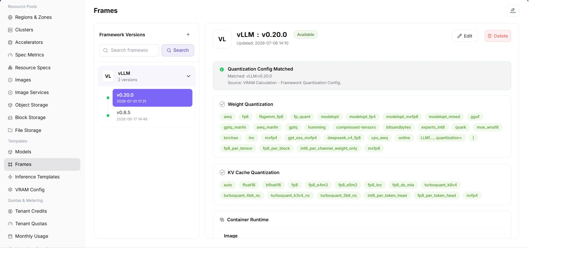

# Framework Configuration

:::: info Document Information
Version: v1.0
Updated: 2026-07-08
::::

## Feature Overview

`Framework Configuration` is used to maintain inference or runtime frameworks, including framework name, version, image, startup command, ports, environment variables, and supported model types. The framework determines which service process hosts a model instance after it starts.

| Item | Content |
| --- | --- |
| Applicable Role | Operator |
| Navigation Path | Templates > Framework Configuration |
| Page Route | `/powerone/fast-build-v2/frameworks` |
| Managed Objects | Inference frameworks, framework versions, runtime images, ports, startup commands, and environment variables |
| Typical Use | Provide reusable runtime frameworks for inference templates |

### Beginner View

Framework configuration is like the instruction manual for a service launcher. It defines the image, startup command, port, and health check in advance so later templates can reliably bring up model services.

### Terms Quick Reference

| Term | Description |
| --- | --- |
| Inference Framework | Runtime framework that hosts model services, such as vLLM, TGI, or an in-house service framework. |
| Startup Command | Command executed after the container starts, determining how the service loads the model. |
| Port | Listening port exposed by the framework. |
| Environment Variable | Key-value configuration that affects framework runtime behavior. |
| Parameter Trigger Condition | Rule that dynamically displays or enables parameters based on model, specification, or user input. |

## Prerequisites

1. The framework image has been prepared and can be pulled by the target cluster.
2. The model types, quantization methods, ports, and startup parameters supported by the framework have been clarified.
3. Default commands, environment variables, and exposable parameters have been confirmed not to leak sensitive information.
4. The current account has template management permissions.

## Page Description

The page displays the framework list and supports maintaining framework basic information, image versions, and configuration parameters.

The following figure shows the framework configuration page.

## Add or Maintain a Framework

### Pre-Operation Check

1. Runtime image, base dependencies, and startup command required by the framework have been confirmed.
2. Service listening port, health check path, and probing method have been confirmed.
3. Model types, inference protocols, and resource specifications adapted by the framework have been confirmed.
4. Image registry credentials, environment variables, and startup parameters have been sanitized.

### Procedure

1. Go to `Templates > Framework Configuration`.
2. Click the add, edit, or maintenance entrypoint provided by the page.
3. On the Basic Information tab, fill in framework name, version, description, and supported scenarios.
4. On the Runtime Configuration tab, select image, port, startup command, and environment variables.
5. On the Parameter Configuration tab, maintain user-fillable parameters, default values, and trigger conditions.
6. Save and reference this framework in inference templates.

### Parameters

| Field Name | Required | Field Type | Example | Description |
| --- | --- | --- | --- | --- |
| Framework Name | Yes | Text | `vllm-runtime` | Runtime framework selected in inference templates. |
| Runtime Image | Yes | Image address | `registry.example.com/runtime/vllm:1.0` | Container image used when the framework starts. |
| Startup Command | Yes | Command line | `python -m vllm.entrypoints.openai.api_server` | Service command executed after container startup. |
| Service Port | Yes | Number | `8000` | Listening port for platform probing and traffic routing. |
| Health Check | Conditionally required | Path / command | `/health` | Used to determine whether the framework service starts successfully. |
| Environment Variables | No | Key-value pairs | `HF_HOME=/models/cache` | Runtime environment configuration passed into the framework. |

### Pitfalls

- The startup command must run as a foreground process to avoid the container exiting immediately after startup.
- The service port must match the actual framework listening port, otherwise health checks will fail.
- The runtime image must include framework dependencies, model loading dependencies, and required system libraries.

### Result Validation

1. The framework appears in the list.
2. Inference templates can select this framework.
3. When a test service is created with this framework, the image can be pulled, the command can execute, and the port is accessible.

## FAQ

### Framework Is Not Selectable in Inference Templates

**Symptom:**

When configuring an inference template, the framework drop-down list does not contain the target framework.

**Possible Causes:**

- The framework is not enabled or the version is unavailable.
- The model type supported by the framework does not match the current model.
- The framework image or configuration has not passed validation.

**Solution:**

1. Check framework status and version.
2. Confirm model type, quantization method, and framework support scope.
3. Save the framework configuration and re-enter the inference template.

### Port Is Inaccessible After Service Starts

**Symptom:**

The model instance is running, but service port access fails.

**Possible Causes:**

- The framework listening port is inconsistent with the template port.
- The startup command does not bind to `0.0.0.0`.
- The container starts successfully, but the service process exits abnormally.

**Solution:**

1. Verify the framework port and inference template port.
2. Check the startup command and logs.
3. Confirm service listening address and health check configuration.

## Follow-Up Operations

1. Reference the framework in [Inference Templates](../inference-templates/).
2. Use a test model to verify image, command, port, and parameters.
3. Include framework changes in version records to avoid affecting existing templates.

## Notes

- Do not write keys in environment variable examples or screenshots.
- Before changing framework image, port, or startup command, confirm the impact scope of templates and instances that use this framework.
