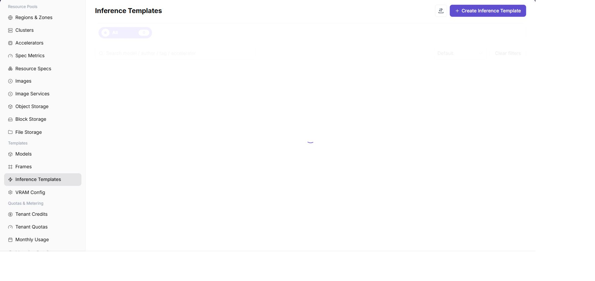
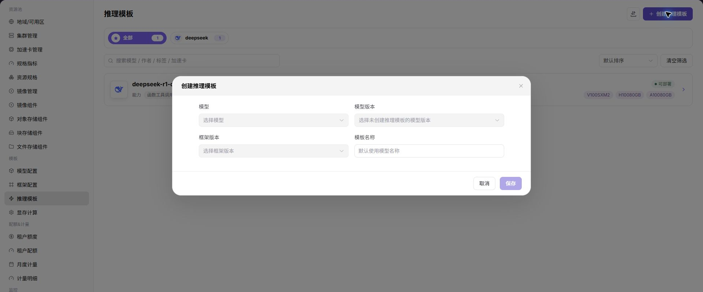

# Inference Templates

::: info Document Information
Version: v1.0
Updated: 2026-07-08
:::

## Feature Overview

`Inference Templates` is used to combine models, frameworks, images, specifications, VRAM estimation, ports, variables, and default parameters into templates that regular users can deploy directly.

| Item | Content |
| --- | --- |
| Applicable Role | Operator |
| Navigation Path | Templates > Inference Templates |
| Page Route | `/powerone/fast-build-v2/templates` |
| Managed Objects | Inference templates, model scope, framework scope, specification recommendations, form parameters, and publication status |
| Typical Use | Publish deployable model service plans to regular users |

### Beginner View

An inference template is like an assembly list for a model service. It combines frameworks, specifications, default parameters, and visibility scope so users can quickly create services from the template during deployment.

### Terms Quick Reference

| Term | Description |
| --- | --- |
| Template | Deployment plan selected when users create model instances. |
| Factor Form | Parameter set filled in by users when creating instances. |
| Dynamic Expression | Dynamically calculates field values or display conditions based on user input, model, precision, or resource conditions. |
| VRAM Configuration | VRAM recommendation and validation rules used to reduce specification selection errors. |
| Parameter Trigger Condition | Controls fields displayed under specific models, frameworks, or options. |

## Prerequisites

1. Model configuration, framework configuration, and VRAM estimation have been completed.
2. Available resource specifications have been created and associated with target clusters.
3. Image services and required storage capabilities have been connected.
4. The parameters that users need to fill in when creating instances have been clarified.

## Page Description

The page displays the inference template list, including template name, status, model scope, framework scope, update time, and operation entrypoints.

The following figure shows the inference templates page.

## Create Inference Template

### Pre-Operation Check

1. Available frameworks, runtime images, and model configurations have been prepared.
2. Resource specifications, deployment mode, and visibility scope adapted by the template have been confirmed.
3. Default parameters have been confirmed not to expose internal paths, credentials, or test endpoints.
4. Which user deployment entrypoints are affected by template changes has been clarified.

### Procedure

1. Go to `Templates > Inference Templates`.
2. Click the add or create entrypoint.
3. On the Basic Information tab, fill in template name, description, applicable scenarios, and publication scope.
4. On the Model and Framework tab, select model, model version, framework, and runtime image.
5. On the Resource Configuration tab, select specification scope, VRAM estimation rules, and ports.
6. On the Factor Form tab, configure parameters users need to fill in, default values, validation rules, and trigger conditions.
7. Save and publish the template.

### Parameters

| Field Name | Required | Field Type | Example | Description |
| --- | --- | --- | --- | --- |
| Template Name | Yes | Text | `qwen-vllm-template` | Template name users see when creating inference services. |
| Resource Specification | Yes | Drop-down | `2 * A800 / 160GB` | Default recommended or bound compute specification for the template. |
| Deployment Mode | Yes | Enum | `Single replica` | Determines service replicas, scaling, and scheduling mode. |
| Default Parameters | No | Key-value pairs | `temperature=0.7` | Model or runtime parameters prefilled when creating services. |
| Visibility Scope | Yes | Enum / multi-select | `Specific tenants` | Controls which users or tenants can use the template. |
| Associated Framework | Yes | Drop-down | `vllm-runtime` | Runtime framework configuration called by the template. |

### Pitfalls

- Do not fill in resource specifications based only on minimum VRAM. Reserve margin based on concurrency, context length, and model precision.
- Visibility scope changes directly affect whether users can select the template on the creation page.
- Default parameters are inherited by users. Confirm that they do not contain internal paths or test values before publishing.

### Result Validation

1. The template appears in the list and its status matches expectations.
2. The user-side deployment template page can see this template.
3. When a test instance is created with the template, model, framework, specification, parameters, and ports all take effect as expected.

## FAQ

### User Side Cannot See the Template

**Symptom:**

The template has been saved, but it is not visible in the regular user's deployment template list.

**Possible Causes:**

- The template is not published or its status is unavailable.
- The template visibility scope does not include the target tenant.
- Model, framework, or specification has unavailable dependencies.

**Solution:**

1. Check template status and publication scope.
2. Verify tenant permissions and visibility scope.
3. Check whether model, framework, specification, and VRAM configuration are available.

### Parameters Do Not Match Expectations When Creating Instances

**Symptom:**

When users create instances, form fields are missing, default values are incorrect, or trigger conditions do not take effect.

**Possible Causes:**

- Factor form configuration is incomplete.
- Dynamic expression conditions are incorrect.
- Model, framework, or specification trigger conditions do not match the actual selection.

**Solution:**

1. Check factor form fields, default values, and validation rules.
2. Verify dynamic expressions one by one.
3. Test form visibility with different model, framework, and specification combinations.

## Follow-Up Operations

1. Use a test tenant to create a model instance and verify the template.
2. Adjust image, startup command, ports, and parameters based on failure logs.
3. After template publication, periodically review model versions, framework versions, and specification scope.

## Notes

- Template parameters must not contain real tokens, keys, or internal addresses.
- Before publishing a template, confirm that dependent models, frameworks, images, specifications, and storage are all available.
