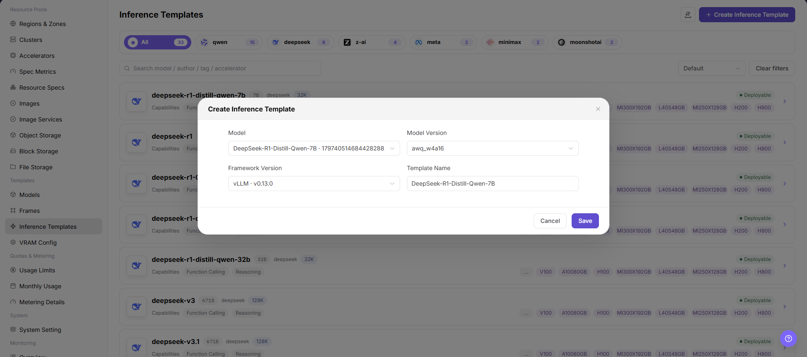

# Inference Templates

::: info Document Information
Version: v1.0
Updated: 2026-07-08
:::

## Feature Overview

`Inference Templates` is used to combine models, frameworks, images, specifications, VRAM estimation, ports, variables, and default parameters into templates that regular users can deploy directly.

| Item | Content |
| --- | --- |
| Applicable role | Operator |
| Navigation path | AI Infrastructure > On-Prem > Templates > Inference Templates |
| Page route | `/powerone/fast-build-v2/inference-templates` |
| Managed objects | Inference templates, model scope, framework scope, specification recommendations, form parameters, and publication status |
| Typical use | Publish deployable model service plans to regular users |

#### Beginner Explanation

An inference template is like an assembly list for a model service. It combines frameworks, specifications, default parameters, and visibility scope so users can quickly create services from the template during deployment.

#### Terms Quick Reference

| Term | Description |
| --- | --- |
| Template | Deployment plan selected when users create model instances. |
| Factor Form | Parameter set filled in by users when creating instances. |
| Dynamic Expression | Dynamically calculates field values or display conditions based on user input, model, precision, or resource conditions. |
| VRAM Configuration | VRAM recommendation and validation rules used to reduce specification selection errors. |
| Parameter Trigger Condition | Controls fields displayed under specific models, frameworks, or options. |

## Prerequisites

1. Model configuration, framework configuration, and VRAM estimation have been completed.
2. Available resource specifications have been created and associated with target clusters.
3. Image services and required storage capabilities have been connected.
4. The parameters that users need to fill in when creating instances have been clarified.

## Page Description

The page displays the inference template list, including template name, status, model scope, framework scope, update time, and operation entrypoints.

The following figure shows the inference templates page.

## Main Operations

### Create Inference Template

#### Pre-Operation Check

1. Available frameworks, runtime images, and model configurations have been prepared.
2. Resource specifications, deployment mode, and visibility scope adapted by the template have been confirmed.
3. Default parameters have been confirmed not to expose internal paths, credentials, or test endpoints.
4. Which user deployment entrypoints are affected by template changes has been clarified.

#### Procedure

1. Go to `AI Infrastructure > On-Prem > Templates > Inference Templates`.
2. Click `Add`, `Create Inference Template`, or the actual create entry on the page.
3. In the basic information area, fill in template name, description, applicable scenario, publication scope, and visibility scope.
4. In the model configuration area, select model, model version, model source, or applicable model scope.
5. In the framework configuration area, select framework, framework version, runtime image, and startup configuration.
6. In the resource configuration area, select resource specification, deployment mode, VRAM estimation rules, region, or cluster scope.
7. In the port and network area, configure service port, port exposure policy, port tag, and health check.
8. In the factor form area, configure parameters users must fill in when creating instances, default values, validation rules, dynamic expressions, and trigger conditions.
9. Before clicking the final `Save`, `Submit`, `Publish`, or `OK`, verify model, framework, specifications, parameters, ports, visibility scope, and user-side impact.
10. For learning or screenshots only, view fields and pages without submitting or publishing real inference templates.

The following figure shows the Create Inference Template page, used to configure basic information, resource specifications, and factor forms.

## Parameter Reference

| Field Name | Required | Field Type | Example | Description |
| --- | --- | --- | --- | --- |
| Template Name | Yes | Text | `llm-inference-template` | Template name users see when creating inference services. Use a maintainable name instead of temporary test naming. |
| Description | No | Multi-line text | `Example description` | Template purpose, adapted model, and usage boundary. Write non-sensitive notes only. Do not include internal addresses or test parameters. |
| Applicable Scenario | Conditionally required | Dropdown / enum | `Model inference` | Business scenario or model service type for the template. Keep it consistent with model type, framework capability, and user entry. |
| Publication Scope | Conditionally required | Dropdown / enum | `Example value` | Scope where the template is published to the user side. Confirm affected tenants, regions, and entries before publishing. |
| Visibility Scope | Yes | Dropdown / enum | `Tenant A` | Controls which users or tenants can use the template. Incorrect scope may make the template invisible or visible to non-target tenants. |
| Model | Conditionally required | Dropdown / enum | `A100-SXM4-80GB` | Model or model set applicable to the template. Dependent objects must be available and match the framework. |
| Model Version | Conditionally required | Dropdown / enum | `v0.8.0` | Model version referenced by the template. Keep it consistent with model path, quantization method, and VRAM estimation rules. |
| Model Source | Conditionally required | Address / path | `Object Storage` | Model file source, repository source, or object storage source. Do not write real model repository addresses, endpoints, or internal paths. |
| Framework | Yes | Number / capacity | `vLLM` | Runtime framework configuration called by the template. The framework must support the selected model type and runtime mode. |
| Framework Version | Conditionally required | Text | `v0.8.0` | Framework version referenced by the template. Confirm impact on existing templates and instances before modification. |
| Runtime Image | Conditionally required | Text | `registry.example.com/project/runtime:v1` | Container image used by the framework runtime. Confirm image region, registry permissions, and target cluster pull access. |
| Resource Specification | Yes | Number / capacity | `gpu-a100-1card` | Default recommended or selectable compute specification for the template. Match model VRAM, concurrency, context length, and deployment mode. |
| Deployment Mode | Yes | Dropdown / enum | `Single instance` | Determines service replicas, scaling, and scheduling mode. Keep it consistent with framework startup commands and resource specifications. |
| VRAM Estimation Rule | Conditionally required | Number / capacity | `80` | VRAM rule used to recommend or validate specifications. Keep it consistent with model parameter count, quantization method, and context length. |
| Service Port | Conditionally required | Port / number | `8000` | Actual listening or exposed port of the model service. Must match the actual framework listening port. |
| Port Exposure Policy | Conditionally required | Port / number | `Example value` | Port exposure method and authentication mechanism. Incorrect configuration may expand service exposure scope. |
| Port Tag | No | Port / number | `OpenAI API Port` | Identifies port protocol type or purpose. Keep it consistent with OpenAI API, Ollama API, or custom protocol. |
| Health Check | Conditionally required | Address / path | `/health` | Path or command used to determine whether the service starts successfully. Match the actual service path, port, and startup delay. |
| Factor Form | Conditionally required | Configuration text | `Context length` | Parameter form that users fill in when creating instances. Verify fields, default values, and validation rules one by one. |
| Default Parameters | No | Dropdown / enum | `--max-model-len 8192` | Model or runtime parameters prefilled when creating services. Do not write real tokens, AK/SK, private keys, endpoints, or test values. |
| Dynamic Expression | Conditionally required | Dropdown / enum | `${gpuCount} >= 1` | Dynamically calculates fields or visibility based on model, framework, specification, or user input. Expression errors can cause missing fields or abnormal startup commands. |
| Trigger Condition | Conditionally required | Dropdown / enum | `Model type = LLM` | Controls fields displayed under specific models, frameworks, or options. Validate with actual model, framework, and specification combinations. |
| Actions | System-generated | Action entry | `Edit` | Add, save, submit, publish, OK, and similar page operations. `Save`, `Submit`, `Publish`, and `OK` are high-risk final actions. |

## Pitfalls

- Publishing an inference template affects user-side selectable templates and the real service creation scope.
- Incorrect visibility scope may make the template invisible or visible to non-target tenants.
- Mismatched model, framework, image, specification, or VRAM rules can cause instance creation or startup failures.
- Incorrect default parameters, dynamic expressions, or trigger conditions can cause missing user form fields, wrong parameters, or abnormal startup commands.
- Incorrect port exposure policy may expand the service exposure scope.
- Do not write real tokens, AK/SK, private keys, endpoints, internal addresses, model repository addresses, tenant IDs, cluster IDs, or test parameters.
- `Save`, `Submit`, `Publish`, and `OK` are high-risk final actions. Do not click them during learning or screenshots.

## Result Validation

| Check Item | Success Signal | If Abnormal |
| --- | --- | --- |
| Page can be opened | `AI Infra > On-Prem > Templates > Inference Templates` is accessible. | Check menu configuration, account permissions, and frontend route. |
| Creation entry is visible | `Add`, `Create Inference Template`, or the actual creation entry is displayed. | Check operator permissions, License, and page configuration. |
| Creation page can be opened | The basic information, model, framework, resource, port, and factor form sections can be viewed after clicking the entry. | Check route, permissions, and browser console errors. |
| Required field validation works | Validation appears when template name, model, framework, specification, or visibility scope is empty. | Complete fields according to page prompts and do not bypass validation. |
| Template appears in the list and status matches expectations | The template appears in the list, and status, update time, and publication status match expectations. | Check save result, publication status, filters, and backend processing status. |
| User-side deployment template visibility matches scope | Target users or tenants can see the template, and non-target scopes cannot. | Check visibility scope, publication scope, tenant permissions, and template status. |
| Parameters take effect when creating a test instance with the template | Model, framework, specification, parameters, and ports take effect as expected. | Check dependent objects, factor form, dynamic expressions, port policy, and startup logs. |
| No real submission or publication during learning | During learning or screenshots, the final `Save`, `Submit`, `Publish`, or `OK` action is not clicked. | If clicked by mistake, immediately check the template list, user-side visibility scope, and service creation impact. |

## FAQ

#### User Side Cannot See the Template

**Symptom:**

The template has been saved, but it is not visible in the regular user's deployment template list.

**Possible Causes:**

- The template is not published or its status is unavailable.
- The template visibility scope does not include the target tenant.
- Model, framework, or specification has unavailable dependencies.

**Solution:**

1. Check template status and publication scope.
2. Verify tenant permissions and visibility scope.
3. Check whether model, framework, specification, and VRAM configuration are available.

#### Parameters Do Not Match Expectations When Creating Instances

**Symptom:**

When users create instances, form fields are missing, default values are incorrect, or trigger conditions do not take effect.

**Possible Causes:**

- Factor form configuration is incomplete.
- Dynamic expression conditions are incorrect.
- Model, framework, or specification trigger conditions do not match the actual selection.

**Solution:**

1. Check factor form fields, default values, and validation rules.
2. Verify dynamic expressions one by one.
3. Test form visibility with different model, framework, and specification combinations.

## Next Steps

1. Use a test tenant to create a model instance and verify the template.
2. Adjust image, startup command, ports, and parameters based on failure logs.
3. After template publication, periodically review model versions, framework versions, and specification scope.
4. Review failure logs by model, framework, specification, and factor form combination to continuously calibrate the template.

## Notes

- Template parameters must not contain real tokens, keys, or internal addresses.
- Before publishing a template, confirm that dependent models, frameworks, images, specifications, and storage are all available.
- Before modifying a published template, confirm the impact on user-side instance creation, template visibility scope, and active deployment entries.
- Do not perform real save, submit, publish, or OK actions during learning or screenshots.
