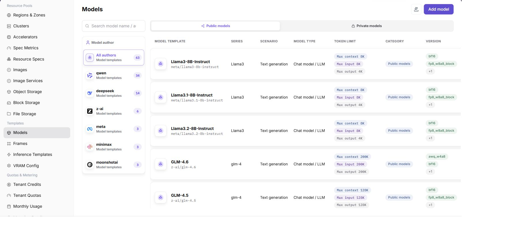

# Model Configuration

::: info Document Information
Version: v1.0
Updated: 2026-07-03
:::

::: warning Security Notice
Do not write real startup parameter keys, environment variable keys, model source credentials, repository access tokens, or internal download addresses in template documentation, screenshots, or examples. Use placeholders consistently in examples.
:::

## Feature Overview

`Model Configuration` is used to maintain model assets that can be referenced by inference templates, including base models, model versions, sources, quantization methods, token limits, tags, and associated clusters.

| Item | Content |
| --- | --- |
| Applicable Role | Operator |
| Navigation Path | Templates > Model Configuration |
| Page Route | `/powerone/fast-build-v2/models` |
| Managed Objects | Base models, model versions, model sources, quantization methods, tags, and associated clusters |
| Typical Use | Create deployable models, maintain model versions, and provide model selection scope for inference templates |

### Beginner View

Model configuration is like a model asset card before listing a model. It organizes model paths, parameter sources, environment variables, and startup parameters so frameworks can load models correctly.

### Terms Quick Reference

| Term | Description |
| --- | --- |
| Base Model | Model family or base model abstraction, such as a common description for the same model series. |
| Model Version | Version record of specific weights, quantization, source, and file path. |
| KV Token | Tokens related to inference KV Cache, which affect VRAM estimation. |
| Quantization Method | Weight compression or inference optimization method, such as FP16 or INT8. |
| Associated Cluster | Cluster scope where model files are accessible or deployable. |

## Prerequisites

1. Model source, authorization, version, and parameter count have been confirmed.
2. Model files can be downloaded by the target cluster or have been prepared in shared storage.
3. Related quantization methods, KV Token, or calculation factors have been maintained in VRAM estimation.
4. The current account has template management permissions.

## Page Description

The page displays configurations by model author, model category, and model series, and supports maintaining public or private models.

The following figure shows the model configuration page.

## Add Model

### Pre-Operation Check

1. Model file path, format, permissions, and source credentials have been confirmed.
2. The model matches the runtime framework, precision, context length, and resource specification.
3. Environment variables, startup parameters, and mount paths do not contain real keys.
4. If the model comes from an external repository, authorization scope and network connectivity have been confirmed.

### Procedure

1. Go to `Templates > Model Configuration`.
2. Click `Add Model`.
3. On the Base Model or Basic Information tab, select model series, scenario, type, and token limits.
4. On the Version Information tab, fill in model source, version, quantization method, file path, or repository identifier.
5. On the Association Configuration tab, select tags, clusters, and visibility scope.
6. Save and return to the list to check model status.

### Parameters

| Field Name | Required | Field Type | Example | Description |
| --- | --- | --- | --- | --- |
| Model Name | Yes | Text | `qwen2-72b` | Model name displayed by the platform and referenced by templates. |
| Model Path | Yes | Path / URI | `s3://models/qwen2-72b` | Location where the framework loads model files. |
| Parameter Source | Yes | Enum | `Template default` | Indicates whether parameters come from model configuration, template defaults, or user input. |
| Environment Variables | No | Key-value pairs | `MODEL_PATH=/models/qwen2` | Variables passed into the container runtime environment. |
| Startup Parameters | No | Command parameters | `--max-model-len 8192` | Model parameters appended to the framework startup command. |
| Model Source Credential | Conditionally required | Credential reference | `secret-model-repo` | Credential reference used when accessing a private model repository or object storage. |

### Pitfalls

- The model path must be consistent with the mount path or object storage path, otherwise the framework cannot find weights after startup.
- Do not mix real credentials into environment variables or startup parameters. Sensitive values should use credential references.
- Clarify the parameter source to prevent template default values from overriding model-specific parameters.

### Result Validation

1. The model appears in the list.
2. Model version status matches expectations.
3. The model can be selected when creating inference templates.
4. Models matching the visibility scope are visible in user-side deployment templates.

## FAQ

### Model Is Not Selectable When Creating a Template

**Symptom:**

The target model is not available in inference template configuration.

**Possible Causes:**

- The model is not enabled or the version is unavailable.
- The model is not associated with the target cluster.
- The model visibility scope, category, or tags do not match the template conditions.

**Solution:**

1. Check model status and version status.
2. Confirm that the model has been associated with the target cluster.
3. Verify template filter conditions, visibility scope, and tags.

### Model File Download Fails

**Symptom:**

When deploying an instance, model files cannot be downloaded or loaded.

**Possible Causes:**

- The model source address is unreachable.
- Repository authentication or object storage permission is insufficient.
- Model path, version, or file name is incorrect.

**Solution:**

1. Verify source address accessibility from the target cluster.
2. Check authentication information and object path.
3. Correct model version, path, and file name, then validate again.

## Follow-Up Operations

1. Go to [Framework Configuration](../frameworks/) to maintain frameworks available for the model.
2. Go to [Inference Templates](../inference-templates/) to establish relationships among model, framework, specification, and parameters.
3. Go to [VRAM Estimation Configuration](../vram-config/) to calibrate KV Token, quantization, and dynamic expressions.

## Notes

- Model source and authorization must be traceable.
- Do not expose access keys in model paths, descriptions, or screenshots.
