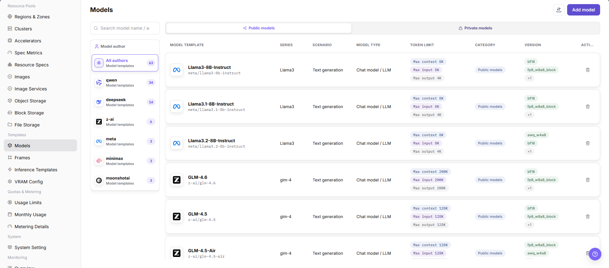
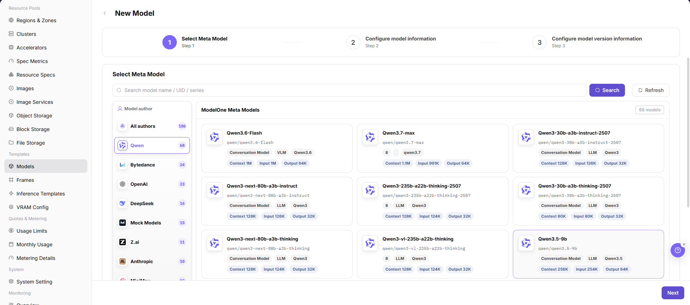
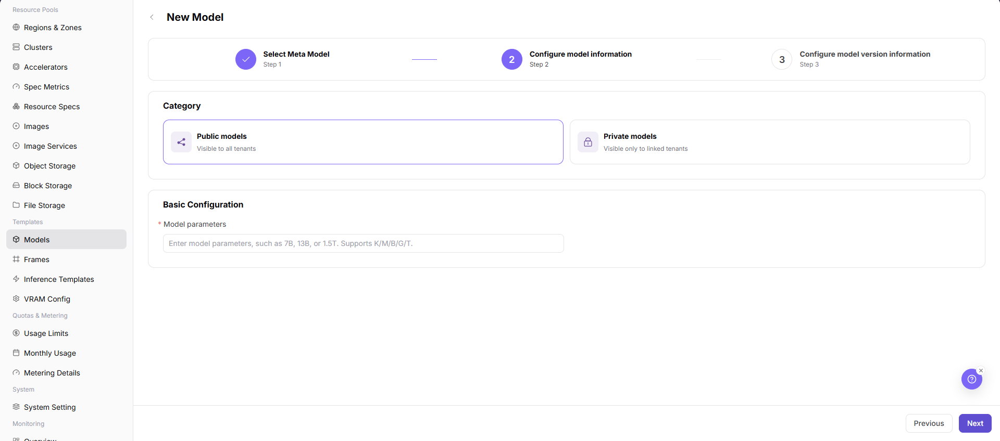
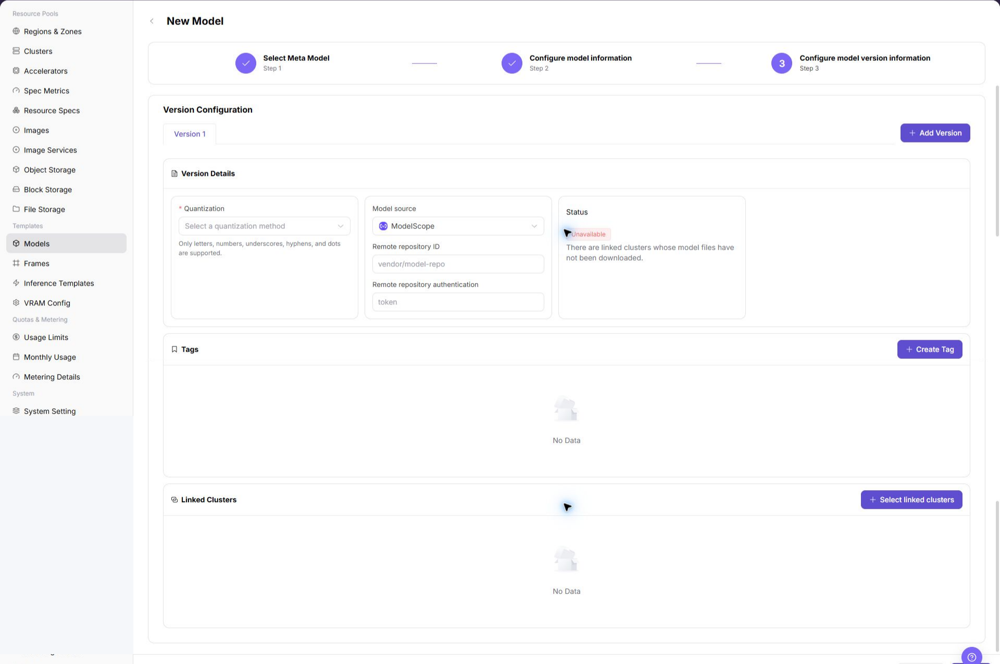
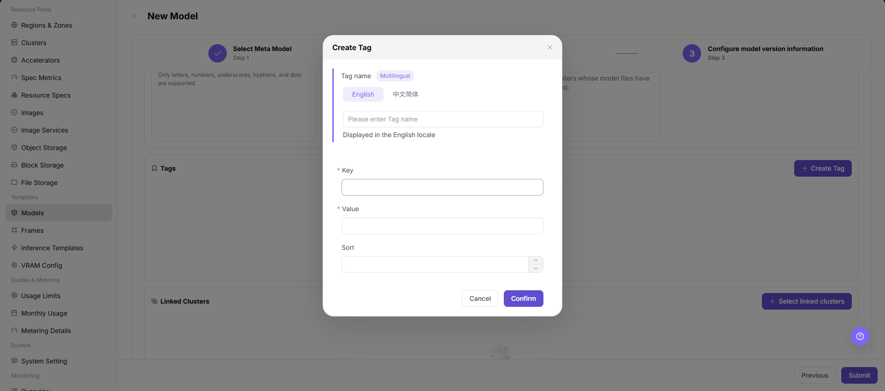
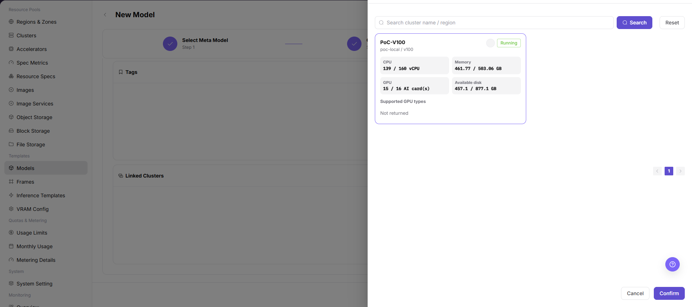

# Model Configuration

::: info Document Information
Version: v1.0
Updated: 2026-07-08
:::

## Feature Overview

`Model Configuration` is used to maintain model assets that can be referenced by inference templates, including base models, model versions, sources, quantization methods, token limits, tags, and associated clusters.

| Item | Content |
| --- | --- |
| Applicable role | Operator |
| Navigation path | AI Infrastructure > On-Prem > Templates > Model Configuration |
| Page route | `/powerone/fast-build-v2/models` |
| Managed objects | Base models, model versions, model sources, quantization methods, tags, and associated clusters |
| Typical use | Create deployable models, maintain model versions, and provide model selection scope for inference templates |

#### Beginner Explanation

Model configuration is like a model asset card before listing a model. It organizes model paths, parameter sources, environment variables, and startup parameters so frameworks can load models correctly.

#### Terms Quick Reference

| Term | Description |
| --- | --- |
| Base Model | Model family or base model abstraction, such as a common description for the same model series. |
| Model Version | Version record of specific weights, quantization, source, and file path. |
| KV Token | Tokens related to inference KV Cache, which affect VRAM estimation. |
| Quantization Method | Weight compression or inference optimization method, such as FP16 or INT8. |
| Associated Cluster | Cluster scope where model files are accessible or deployable. |

## Prerequisites

1. Model source, authorization, version, and parameter count have been confirmed.
2. Model files can be downloaded by the target cluster or have been prepared in shared storage.
3. Related quantization methods, KV Token, or calculation factors have been maintained in VRAM estimation.
4. The current account has template management permissions.

## Page Description

The page displays configurations by model author, model category, and model series, and supports maintaining public or private models.

The following figure shows the model configuration page.

## Main Operations

### Add Model

#### Pre-Operation Check

1. Model file path, format, permissions, and source credentials have been confirmed.
2. The model matches the runtime framework, precision, context length, and resource specification.
3. Environment variables, startup parameters, and mount paths do not contain real keys.
4. If the model comes from an external repository, authorization scope and network connectivity have been confirmed.

#### Procedure

1. Go to `AI Infrastructure > On-Prem > Templates > Model Configuration`.
2. Click `Add Model` or the actual add entry on the page.

The following figure shows the base model selection page, used to select model author, model series, and the base model entry.

3. In the base model or basic information area, select model author, model series, model type, scenario, and token limits.

The following figure shows model information configuration, used to maintain model type, scenario, token limits, and basic description.

4. In the version information area, fill in model source, version, quantization method, model path, or repository identifier.

The following figure shows model version information configuration, used to maintain model source, version, quantization method, and path information.

5. Configure parameter source, environment variables, startup parameters, mount path, or model source credential as required by the page.
6. In the association configuration area, select tags, visibility scope, associated clusters, or available template scope.

The following figures show tag creation and associated cluster selection, used to maintain model classification and deployment availability scope.

7. Before clicking the final `Save`, `Submit`, or `OK`, verify model path, credential reference, cluster accessibility, and visibility scope.
8. For learning or screenshots only, view fields and pages without submitting real model configuration.

## Parameter Reference

| Field Name | Required | Field Type | Example | Description |
| --- | --- | --- | --- | --- |
| Model Name | Yes | Dropdown / enum | `Qwen3-8B` | Model name displayed by the platform and referenced by templates. Use a maintainable model name instead of temporary test naming. |
| Model Author | Conditionally required | Dropdown / enum | `Example Org` | Author, organization, or source provider of the model. Keep it consistent with page filters, model series, and authorization source. |
| Model Series | Conditionally required | Dropdown / enum | `Example value` | Model family or base model series. Helps inference templates filter models by series. |
| Model Type | Conditionally required | Dropdown / enum | `Large language model` | Model capability type or business category. Keep it consistent with inference frameworks, template type, and user-side selection scope. |
| Scenario | Conditionally required | Dropdown / enum | `Example value` | Business scenario where the model applies. Do not mix test, training, or inference scenarios. |
| Token Limit | Conditionally required | Number / capacity | `8192` | Context length, input/output token limit, or KV Cache-related limit. Keep it consistent with model capability, VRAM estimation, and template parameters. |
| Model Source | Yes | Address / path | `Object Storage` | Model file source, repository source, or object storage source. Confirm authorization and network reachability for external sources. |
| Version | Yes | Dropdown / enum | `v0.8.0` | Model version or weight version record. Keep versions traceable. Do not use ambiguous `latest` for long-term configuration. |
| Quantization Method | Conditionally required | Dropdown / enum | `FP16` | Model weight quantization or precision method. Keep it consistent with runtime framework and VRAM estimation configuration. |
| Model Path | Yes | Address / path | `s3://example-bucket/model` | Path, repository identifier, or object storage location where the framework loads model files. Do not write real keys, tokens, accounts, passwords, or internal addresses. |
| Parameter Source | Conditionally required | Number / capacity | `Template default` | Whether parameters come from model configuration, template defaults, or user input. Prevent template defaults from overriding model-specific parameters. |
| Environment Variables | No | Configuration text | `ENV=prod` | Variables passed into the container runtime environment. Use only non-sensitive variables. Use credential references for sensitive values. |
| Startup Parameters | No | Dropdown / enum | `--max-model-len 8192` | Model parameters appended to the framework startup command. Match framework version, token limits, and resource specifications. |
| Model Source Credential | Conditionally required | Credential / sensitive text | `Object Storage` | Credential reference used when accessing a private model repository or object storage. Reference credential objects only. Do not write real credentials in documents. |
| Associated Cluster | Conditionally required | File / configuration text | `cluster-a` | Cluster scope where model files are accessible or deployable. Confirm network and storage accessibility for target clusters before submission. |
| Tags | No | Text | `llm` | Tags used for filtering, classification, or template matching. Keep tag meanings stable and avoid temporary tags. |
| Visibility Scope | Conditionally required | Dropdown / enum | `Tenant A` | Model visibility boundary for templates, tenants, or user-side pages. Incorrect visibility affects user-side selectable models. |
| Actions | System-generated | Action entry | `Edit` | Add, edit, save, submit, OK, and similar page operations. `Save`, `Submit`, and `OK` are high-risk final actions. |

## Pitfalls

- Incorrect model paths, repository addresses, object storage paths, or credential references can cause model loading failures after template deployment.
- Do not write real keys, tokens, AK/SK, accounts, passwords, or internal addresses in environment variables, startup parameters, or model paths.
- Incorrect associated clusters or visibility scope can affect model selection in inference templates and user-side visibility.
- Clarify the parameter source to prevent template default values from overriding model-specific parameters.
- `Save`, `Submit`, and `OK` are high-risk final actions. Do not click them during learning or screenshots.

## Result Validation

| Check Item | Success Signal | If Abnormal |
| --- | --- | --- |
| Model appears in the list | The model appears in the model configuration list. | Check associated objects, enabled status, version, and form configuration. |
| Model version status matches expectations | Version status is visible and consistent with the submitted configuration. | Check model source, version information, and backend processing status. |
| Model can be selected when creating inference templates | The model is available in inference template configuration. | Check model status, associated cluster, tags, and template filter conditions. |
| User-side deployment templates show models matching visibility scope | Users can see models that match the configured visibility scope. | Check visibility scope, associated clusters, template conditions, and account permissions. |
| No real submission during learning | During learning or screenshots, the final `Save`, `Submit`, or `OK` action is not clicked. | If submitted by mistake, immediately check the model list, associated clusters, and visibility scope, and handle it through the change process. |

## FAQ

#### Model Is Not Selectable When Creating a Template

**Symptom:**

The target model is not available in inference template configuration.

**Possible Causes:**

- The model is not enabled or the version is unavailable.
- The model is not associated with the target cluster.
- The model visibility scope, category, or tags do not match the template conditions.

**Solution:**

1. Check model status and version status.
2. Confirm that the model has been associated with the target cluster.
3. Verify template filter conditions, visibility scope, and tags.

#### Model File Download Fails

**Symptom:**

When deploying an instance, model files cannot be downloaded or loaded.

**Possible Causes:**

- The model source address is unreachable.
- Repository authentication or object storage permission is insufficient.
- Model path, version, or file name is incorrect.

**Solution:**

1. Verify source address accessibility from the target cluster.
2. Check authentication information and object path.
3. Correct model version, path, and file name, then validate again.

## Next Steps

1. Go to [Framework Configuration](../frames/) to maintain frameworks available for the model.
2. Go to [Inference Templates](../inference-templates/) to establish relationships among model, framework, specification, and parameters.
3. Go to [VRAM Estimation Configuration](../vram-config/) to calibrate KV Token, quantization, and dynamic expressions.

## Notes

- Model source and authorization must be traceable.
- Do not expose access keys in model paths, descriptions, or screenshots.
- Do not write real model repository addresses, object storage paths, AK/SK, tokens, accounts, passwords, or internal addresses in examples, screenshots, or tickets.
- Before modifying associated clusters, tags, or visibility scope, confirm the impact on inference templates and user-side deployment entries.
