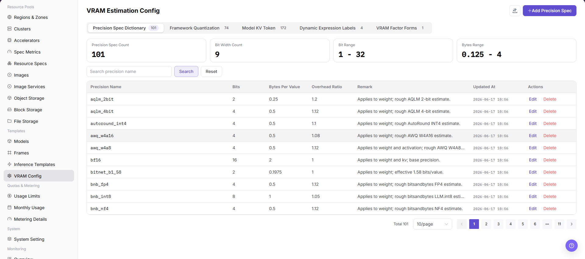

# VRAM Estimation Configuration

## Feature Overview

`VRAM Estimation Configuration` is used to maintain VRAM estimation rules for model deployment, helping inference templates recommend resource specifications based on model, precision, KV Token, concurrency, context length, and dynamic expressions.

| Item | Content |
| --- | --- |
| Applicable Role | Operator |
| Navigation Path | Templates > VRAM Estimation |
| Page Route | `/powerone/fast-build-v2/vram` |
| Managed Objects | VRAM formula, precision, KV Token, factor form, dynamic expressions, and recommended specifications |
| Typical Use | Reduce deployment failures caused by users selecting incorrect specifications |

### Beginner View

VRAM configuration is like a capacity estimator before deployment. It estimates required VRAM from model size, precision, context length, and KV Token, avoiding the discovery that the service cannot fit only after startup.

### Terms Quick Reference

| Term | Description |
| --- | --- |
| VRAM | Accelerator memory used to store model weights, KV Cache, and intermediate computation. |
| KV Token | Tokens related to Key/Value Cache in the inference context. |
| Factor | Variable involved in VRAM calculation, such as parameter count, precision, concurrency, and context length. |
| Dynamic Expression | Expression that dynamically calculates VRAM or controls form display based on parameters. |
| Trigger Condition | Determines when a field, rule, or recommendation takes effect. |

## Prerequisites

1. Model parameter count, precision, context length, concurrency, and framework VRAM overhead have been clarified.
2. Resource specifications that can be referenced by inference templates have been prepared.
3. VRAM capacity and usable margin of different accelerator models have been confirmed.
4. The current account has template management permissions.

## Page Description

The page displays VRAM estimation rules and precision configurations, and supports maintaining VRAM estimation logic for different model, framework, or precision combinations.

The following figure shows the vram estimation configuration page.

## Configure VRAM Rules

### Pre-Operation Check

1. Model parameter size, precision, quantization method, and maximum context length have been confirmed.
2. Target GPU/NPU model, single-card VRAM, and parallel strategy have been confirmed.
3. Estimation definitions for KV Token, batch size, and concurrency have been confirmed.
4. VRAM estimation results should be cross-verified with actual stress tests or trial runs.

### Procedure

1. Go to `Templates > VRAM Estimation`.
2. Click the add or edit entrypoint.
3. On the Basic Information tab, fill in rule name, applicable model, framework, and precision.
4. On the Factor Form tab, configure factors such as parameter count, KV Token, concurrency, and context length.
5. On the Dynamic Expression tab, configure VRAM calculation formulas, recommended specifications, and trigger conditions.
6. Save, then reference and verify it in inference templates.

### Parameters

| Field Name | Required | Field Type | Example | Description |
| --- | --- | --- | --- | --- |
| Model Scale | Yes | Text / number | `72B` | Model parameter scale used to estimate weight VRAM. |
| Precision | Yes | Enum | `BF16` | Affects VRAM usage for weights, activations, and KV Cache. |
| KV Token | Yes | Number | `32768` | Used to estimate KV Cache usage under context and concurrency. |
| Context Length | Yes | Number | `8192` | Maximum input/output context allowed by the model service. |
| Concurrency / Batch Size | No | Number | `4` | Used to estimate VRAM pressure under peak requests. |
| VRAM Estimation Result | System-generated | Capacity | `152 GB` | Recommended VRAM requirement calculated by the platform. |

### Pitfalls

- KV Token, context length, and concurrency significantly affect VRAM estimation. Do not look only at model parameter scale.
- Incorrect quantization precision causes recommended specifications to be too small or too large.
- VRAM estimation results should be verified through test deployments and cannot replace real stress tests.

### Result Validation

1. The rule appears in the list.
2. Inference templates can reference this VRAM rule.
3. Recommended specifications match expectations under different model, precision, KV Token, and concurrency combinations.
4. When users select an undersized specification, the page can provide restrictions or prompts.

## FAQ

### VRAM Recommendation Is Clearly Too Small

**Symptom:**

After users create an instance with the recommended specification, the service reports insufficient VRAM at startup.

**Possible Causes:**

- Model parameter count, precision, or KV Token is configured too small.
- Additional framework overhead is not included.
- Concurrency, context length, or dynamic expression does not cover the actual scenario.

**Solution:**

1. Review parameter count, precision, KV Token, and context length.
2. Increase safety margin based on framework test results.
3. Run regression validation with typical model and concurrency scenarios.

### Dynamic Expression Does Not Take Effect

**Symptom:**

After form parameters change, VRAM estimation or recommended specification does not change.

**Possible Causes:**

- Field name referenced by the expression is incorrect.
- Trigger conditions do not cover the current model or framework.
- Factor form default values are empty or types do not match.

**Solution:**

1. Check expression field names and data types.
2. Adjust trigger conditions and test them one by one.
3. Set reasonable default values and validation rules for the factor form.

## Follow-Up Operations

1. Reference VRAM estimation rules in inference templates.
2. Verify recommended specifications with small, medium, and large models.
3. Continuously calibrate VRAM formulas and safety margins based on online failure cases.

## Notes

- VRAM estimation is a recommendation and validation basis. It does not replace real stress testing.
- Before modifying rules, confirm the impact scope on templates and user creation flows that use the rules.
