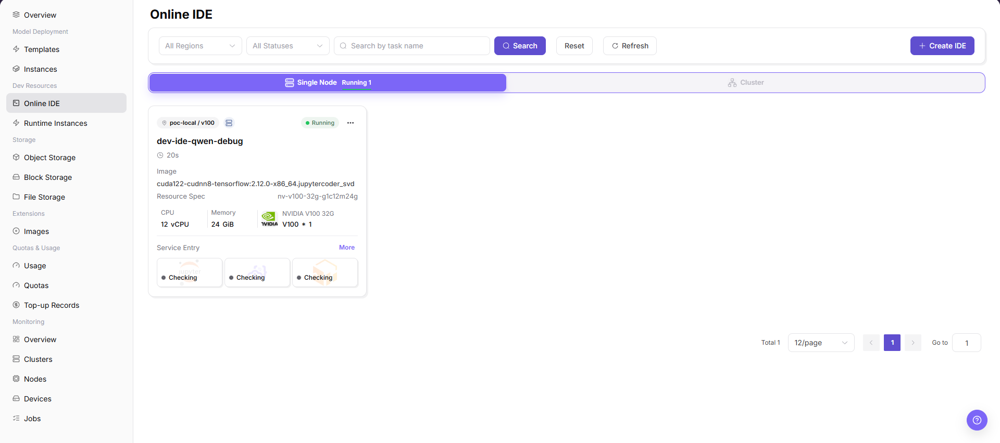
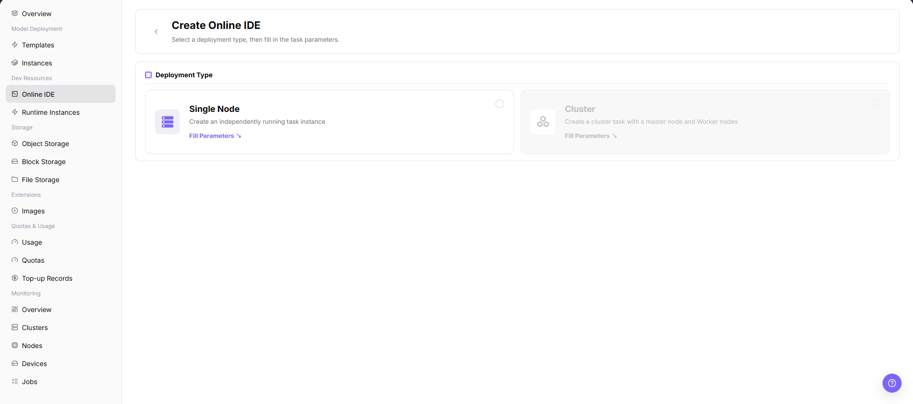
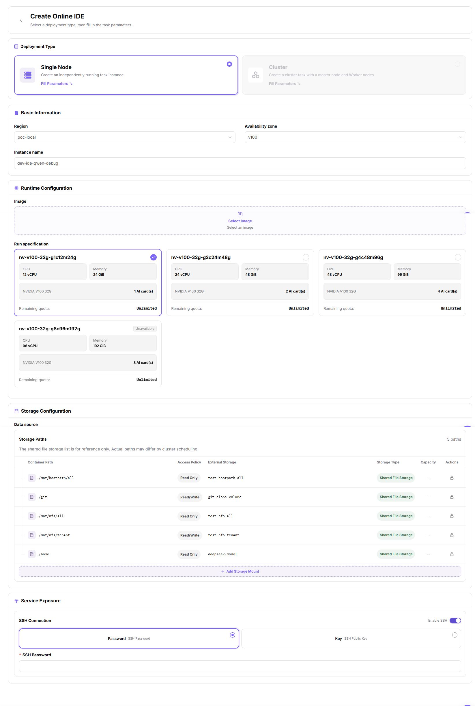

# Online IDE

::: info Document Information
Version: v1.0
Updated: 2026-07-08
:::

## Feature Overview

`Online IDE` is used to create and manage interactive development environments. Regular users can select single-node or cluster form and start a development environment based on platform images and specifications for code debugging, data processing, and experiment validation.

| Item | Content |
| --- | --- |
| Applicable role | Regular user |
| Navigation path | AI Infrastructure > On-Prem > Development Resources > Online IDE |
| Page route | `/powerone/dev-training/dev-ide` |
| Managed objects | Online development environments, single-node IDEs, cluster IDEs, images, specifications, and runtime status |
| Typical use | Create an interactive development environment, debug code online, run Notebook, or prepare training and inference scripts |

#### Beginner Explanation

You can understand Online IDE as a cloud development machine running in the resource pool. You do not need to install a GPU environment locally. Select an image and specification, and the platform creates an accessible development environment.

#### First-Time Flow

1. Go to `Development Resources > Online IDE`.
2. View the existing IDE list and status.
3. Click `Create IDE`.
4. Select `Single Node` or `Cluster` deployment type.
5. Continue filling in image, specification, storage, and startup parameters.
6. After creation, return to the list to view status and enter the IDE.

#### Terms Quick Reference

| Term | Description |
| --- | --- |
| Image | Container environment required to run a job, usually from platform image services or a custom image project. |
| Specification | Resource package that a job can request, such as CPU, memory, GPU model, and card count. |
| Quota | Resource upper limit available to a tenant. Common dimensions include GPU, CPU, memory, and specifications. |
| Single Node | Single-node development environment, suitable for regular debugging and small-scale experiments. |
| Cluster | Cluster development environment, suitable for scenarios that require primary/worker nodes or distributed resources. |

## Prerequisites

1. The current account has permission to create online IDEs.
2. The target region has available specifications and quota.
3. An available image exists and contains the required development tools.
4. If data or code directories need to be mounted, related storage has been prepared.

## Page Description

The list page supports filtering by region and status, and provides refresh and create entrypoints. In the screenshot, the current list is empty. After clicking `Create IDE`, you enter the creation page and can select single-node or cluster deployment type.

#### Page Areas

| Field/Area | Description |
| --- | --- |
| Filter Area | Filters IDEs by region, status, and keyword. |
| Refresh | Refreshes list status. |
| Create IDE | Enters the online IDE creation flow. |
| Single Node / Cluster | Distinguishes single-node and cluster forms in the list or creation page. |
| Pagination Area | View by page when there are many IDEs. |

## Main Operations

### Create Online IDE

#### Applicable Scenario

Create an online IDE when an interactive development, debugging, or Notebook environment is needed.

#### Pre-Operation Check

1. Target specification and quota are available.
2. The image contains Python, CUDA, frameworks, or other development dependencies.
3. The runtime cycle has been confirmed to avoid long idle resource consumption.

#### Procedure

1. Go to `AI Infrastructure > On-Prem > Development Resources > Online IDE`.
2. Click `Create IDE`.
3. On the deployment type page, select `Single Node` or `Cluster`.

4. Click `Fill Parameters` to open the online IDE creation configuration page.
5. Review or fill in IDE name, region, image, specification, storage mount, startup command, and other fields as provided by the page.
6. Confirm configuration items, resource specification, storage path, and runtime mode.
7. For learning or screenshots only, view fields and page status without clicking final `Submit`, `OK`, or `Confirm`.

## Parameter Reference

| Field Name | Required | Field Type | Description |
| --- | --- | --- | --- |
| IDE Name | Yes | Text | Online IDE display name. |
| Deployment Type | Yes | Radio | Select single-node or cluster form. |
| Region | Yes | Drop-down | Select the target region for creating the online IDE. |
| Image | Yes | Drop-down | Select the development environment image. |
| Resource Specification | Yes | Drop-down | Select the compute specification used by the online IDE. |
| Storage Mount | No | Path | Configure the mount path for code, data, or output directories. |
| Startup Command | No | Text | Configure the online IDE startup or runtime command. |

## Pitfalls

- Cluster mode may require more quota. Use single-node first for regular debugging.
- If the image lacks dependencies, the IDE may start but code may fail to run.
- `Submit`, `OK`, and `Confirm` are final actions.
- Creating an online IDE occupies quota and cluster resources.
- For learning or screenshots only, view pages, fields, dialogs, and status without submitting a real creation task.
- Do not write real tenant, region, image address, specification ID, storage path, token, password, endpoint, startup parameter, or test data.

## Result Validation

1. A new IDE appears in the list after creation.
2. Status enters Running or Accessible.
3. Web IDE, JupyterLab, or the corresponding development entrypoint can be opened.

## Configuration Rules and Impact

- Online IDEs occupy quotas and cluster resources. The longer they run, the more they consume.
- Images, specifications, and storage are configured by operators. Regular users can only select visible items.
- Before stopping, deleting, or releasing an IDE, confirm that code and output have been saved to persistent directories.

## FAQ

#### Create IDE Button Is Unavailable or Invisible

**Symptom:** The list page has no creation entrypoint.

**Possible Causes:**

- The current account has no creation permission.
- Online IDE is not opened in the selected region.
- Page loading or permission status is abnormal.

**Solution:**

1. Refresh the page.
2. Confirm the current region.
3. Contact the operator to check account permissions and resource pool configuration.

#### IDE Cannot Be Opened After Creation

**Symptom:** The list has an IDE, but the access entrypoint cannot be opened or the page keeps loading.

**Possible Causes:**

- The instance is still starting.
- The image startup script is abnormal.
- Network entrypoint or proxy is unavailable.

**Solution:**

1. Wait until the status enters Running.
2. View instance logs or events.
3. Contact the operator to check cluster entrypoint and image configuration.

## Next Steps

1. Enter the IDE to write and debug code.
2. Save important code, data, and output to persistent storage.
3. Stop or release the IDE when it is not in use.

## Notes

- Do not write account passwords, tokens, private keys, endpoints, startup parameters, or test data into Notebook, code repositories, or screenshots.
- Confirm storage mount paths before creation to avoid saving output only in temporary container directories.
- For learning or screenshots only, view pages, fields, dialogs, and status without submitting a real creation task.
