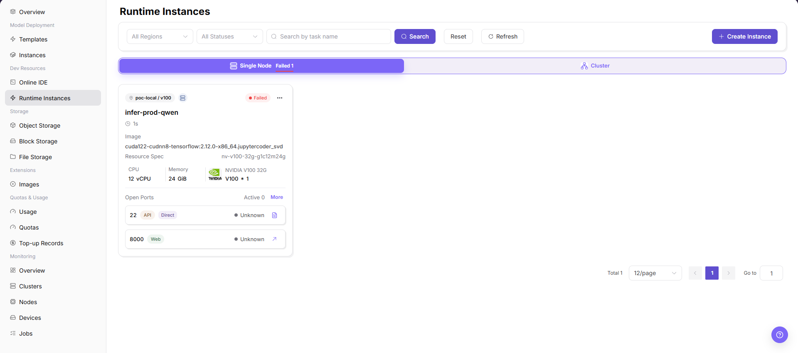
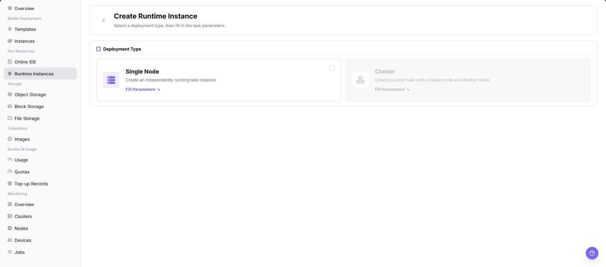
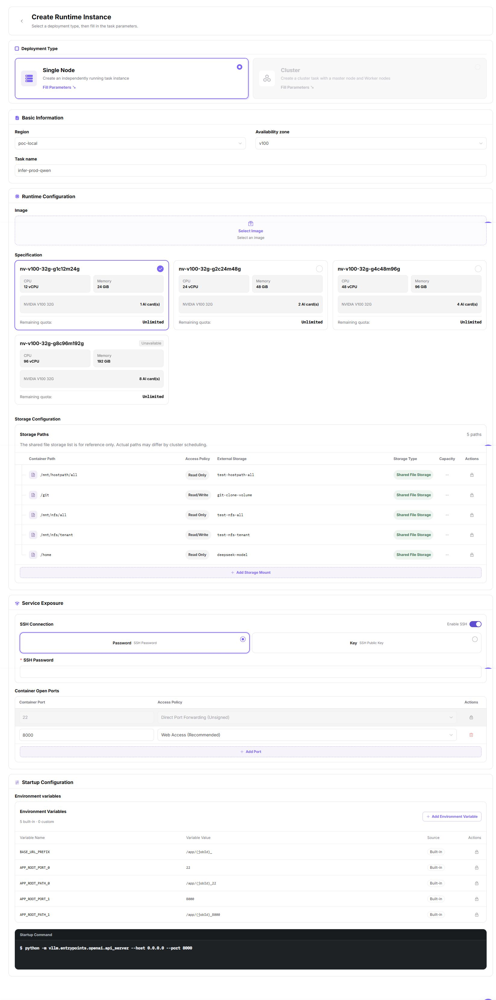

# Runtime Instances

::: info Document Information
Version: v1.0
Updated: 2026-07-08
:::

## Feature Overview

`Runtime Instances` is used to create and manage non-template runtime tasks. Regular users can select single-node or cluster form, specify image, specification, startup command, parameters, environment variables, and storage mounts, and start training, batch processing, or custom service instances.

| Item | Content |
| --- | --- |
| Applicable role | Regular user |
| Navigation path | AI Infrastructure > On-Prem > Development Resources > Runtime Instances |
| Page route | `/powerone/inference/online-inference` |
| Managed objects | Runtime instances, single-node tasks, cluster tasks, images, specifications, startup commands, and runtime status |
| Typical use | Create training, batch processing, custom service, or temporary runtime tasks |

#### Beginner Explanation

A runtime instance is like an on-demand task machine: you prepare the image, code, data, and startup command, and the platform starts the instance according to the selected specification. It is more task-execution oriented than Online IDE and more flexible than model instances.

#### Terms Quick Reference

| Term | Description |
| --- | --- |
| Image | Instance runtime environment. |
| Startup Command | Command or script executed after container startup. |
| Batch Processing | One-time or periodic task that processes data, converts files, or generates results, usually exiting after completion. |
| Parameters | Command-line parameters passed to scripts or services. |
| Environment Variables | Key-value configuration passed to the container process. |
| Storage Mount | Mounts object storage, file storage, or shared directories to paths inside the container. |

## Prerequisites

1. The current account has permission to create runtime instances.
2. Available images and specifications exist.
3. Training scripts, model files, or input data have been prepared.
4. Output directories have been planned to object storage, file storage, or shared directories.
5. Startup commands do not contain real keys, passwords, tokens, or AK/SK.

## Page Description

The list page supports filtering by region and status, and provides refresh and create entrypoints. The creation page first selects single-node or cluster deployment type.

## Main Operations

### Create Runtime Instance

#### Procedure

1. Go to `AI Infra > On-Prem > Dev Resources > Runtime Instances`.
2. Click `Create Instance`.
3. On the deployment type page, select `Single Node` or `Cluster`.

4. Click `Fill Parameters` to open the runtime instance creation configuration page.
5. Review or fill in instance name, region, image, resource specification, startup command, parameters, environment variables, storage mounts, and other fields as provided by the page.
6. Confirm deployment type, image, specification, startup command, parameter passing method, and storage path.
7. For learning or screenshots only, view fields and page status without clicking final `Submit`, `OK`, or `Confirm`.

#### Startup Command Guidance

#### Python Training Script

Used to start a training entry script. The document only describes that the entry script, data source, output location, and parameter passing method must be checked, without recording real paths or test parameters.

#### Shell Script

Used to execute batch processing, data preparation, or multi-step tasks. Before creation, confirm that the script exists in the image or mounted directory, and that output is written to a persistent path.

#### Custom Service

Used to start a long-running service process. Before creation, confirm the service entrypoint, listening method, health status, and resource release method.

#### Parameter Passing Methods

| Method | Applicable Scenario | Description |
| --- | --- | --- |
| Command-line parameters | The script supports command-line parameters. | Pass parameters through page fields. Do not record real parameters in the document. |
| Environment variables | The framework reads environment variables to control behavior. | Describe field usage only. Do not record real tokens, passwords, or endpoints. |
| Configuration file | Many parameters or reusable configuration is needed. | Confirm that the configuration file comes from a mounted directory or an image built-in path. |
| Mount path | Input data, model files, or output results. | Confirm that input and output directories use persistent storage. |

## Parameter Reference

| Field Name | Required | Field Type | Description |
| --- | --- | --- | --- |
| Instance Name | Yes | Text | Runtime instance display name. |
| Deployment Type | Yes | Radio | Select single-node or cluster form. |
| Region | Yes | Drop-down | Select the target region for creating the runtime instance. |
| Image | Yes | Drop-down | Select the image used by the runtime instance. |
| Resource Specification | Yes | Drop-down | Select the compute specification used by the runtime instance. |
| Startup Command | Yes | Text | Configure the command or script executed after container startup. |
| Parameters | No | Text | Configure parameters passed to the script or service. |
| Environment Variables | No | Key-value configuration | Configure environment variables read by the container process. |
| Storage Mount | No | Path | Configure mount paths for input data, code, model files, or output directories. |
| Output Path | No | Text | Configure the persistent location for training, batch processing, or service output. |

## Pitfalls

- Runtime instance status changes may affect downstream flows. Confirm impact before submission.
- Sanitize credentials, addresses, customer information, or business identifiers first.
- If the list is empty, check filters, region, and permissions first.
- `Submit`, `OK`, and `Confirm` are final actions.
- Creating a runtime instance occupies quota, scheduling resources, and storage resources.
- Incorrect startup command, environment variable, or mount path configuration may cause instance startup failure or output loss.
- For learning or screenshots only, view pages, fields, and status without submitting a real creation task.
- Do not write real tenant, region, image address, resource specification ID, data path, output path, token, password, endpoint, startup parameter, log, or test data.

## Result Validation

1. The instance appears in the list.
2. Status enters Running, Succeeded, or a status matching the task type.
3. Logs contain no image pull, command execution, or mount errors.
4. Expected files are generated in the output directory.

## FAQ

#### Instance Fails Immediately After Startup

**Symptom:**

The runtime instance status quickly becomes Failed.

**Possible Causes:**

- The startup command does not exist, the path is wrong, or it returns non-zero.
- The image lacks dependencies.
- The storage mount path is incorrect.
- Script parameters or environment variables do not meet program requirements.

**Solution:**

1. View instance logs and events.
2. Validate the command in Online IDE with the same image.
3. Check image, working directory, parameters, and mount path.
4. Write output to a persistent directory and retry.

#### Instance Remains Queued or Creating

**Symptom:**

The instance does not enter the running state for a long time after submission.

**Possible Causes:**

- Target specification resources are insufficient.
- Tenant quota or credits are insufficient.
- Cluster scheduling is abnormal.
- Image pull or storage mount prerequisites are not met.

**Solution:**

1. Check resource quotas and usage.
2. Use a smaller specification or another region.
3. Contact the operator to confirm cluster resources and scheduling status.
4. Check image and storage configuration.

#### Output Cannot Be Found After Task Completion

**Symptom:**

After the instance ends, result files are not found in the expected directory.

**Possible Causes:**

- Output was written to a temporary container directory.
- The output path did not mount persistent storage.
- The output directory in script parameters is incorrect.

**Solution:**

1. View `--output` in the startup command or configuration file.
2. Set the output directory to object storage, file storage, or shared directory mount path.
3. Rerun a small sample task to verify output.

## Next Steps

1. Enter instance details to view logs and output.
2. Evaluate resource consumption from the usage page.
3. Stop or release the instance after task completion.
4. Accumulate stable commands into team scripts or inference template parameters.

## Notes

- Do not write keys directly in startup commands, environment variables, or screenshots.
- Output data should be written to persistent storage to avoid loss after instance release.
- For learning or screenshots only, view pages, fields, and status without submitting a real creation task.
- Do not write real tenant, region, image address, resource specification ID, data path, output path, token, password, endpoint, startup parameter, log, or test data.
