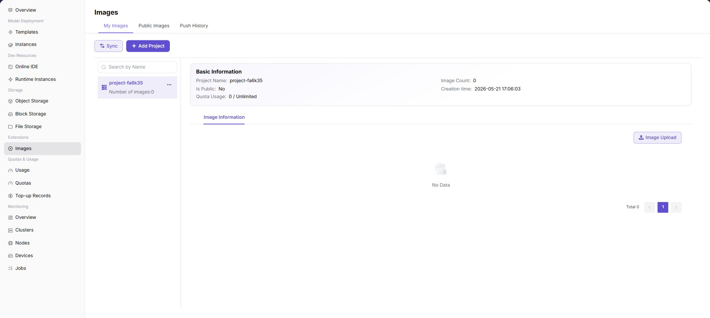
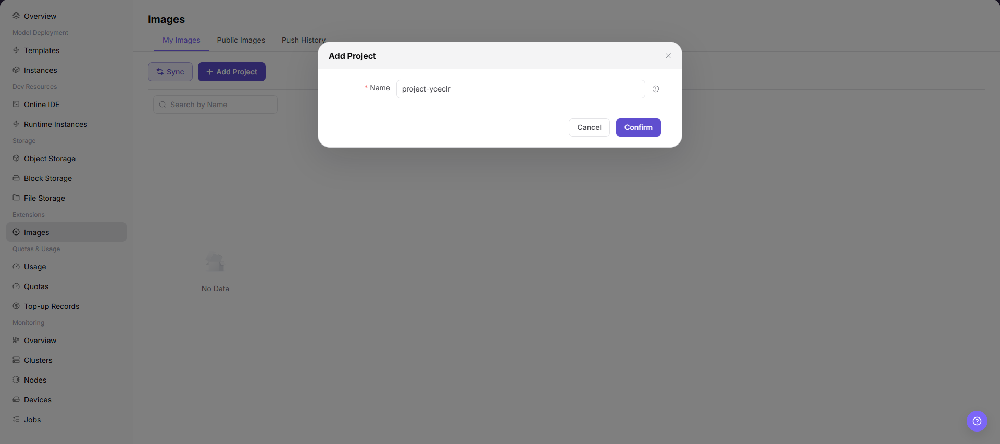

# Image Services

::: info Document Information
Version: v1.0
Updated: 2026-07-08
:::

## Feature Overview

`Image Services` is used to manage image projects, custom images, public images, and push history on the regular user side. Users can create image projects, push locally built images to the platform image repository, and then select the image in Online IDE, Runtime Instances, or model services.

| Item | Content |
| --- | --- |
| Applicable Role | Regular user |
| Navigation Path | Extension Services > Image Services |
| Page Route | `/powerone/expand-service/image-service/custom` |
| Managed Objects | My image projects, public images, push history, and image upload entrypoint |
| Typical Use | Prepare custom runtime environments, pin dependency versions, and provide images for jobs and model services |

### Beginner View

An image is the runtime environment of a job. It contains the system, framework, Python packages, startup scripts, and dependencies. An image project is like a namespace used to organize images from the same team or business. Before pushing images, confirm repository address, project name, image tag, and login credentials.

### Terms Quick Reference

| Term | Description |
| --- | --- |
| Image | Container runtime environment. |
| Image Project | Project or namespace in the image repository. |
| Image Tag | Image version identifier, such as `v1.0.0`. |
| docker login | Command used to log in to the image repository. |
| docker tag | Command used to tag a local image with a remote repository tag. |
| docker push | Command used to push an image to the remote repository. |
| Robot Credentials | Automated image repository account and password. These are sensitive credentials. |

## Prerequisites

1. Image services have been opened in the target region.
2. The current account has permissions to view, create image projects, and push images.
3. Docker or a compatible container tool has been installed locally.
4. A buildable Dockerfile or local image has been prepared.
5. Do not expose robot passwords, repository passwords, or access tokens in screenshots, documentation, or command records.

## Page Description

The page contains three views: `My Images`, `Public Images`, and `Push History`. The screenshot shows sync, add project, project list, and image information areas.



## Add Image Project

### Procedure

1. Go to `Extension Services > Image Services`.
2. On the `My Images` page, click `Add Project`.
3. Fill in the project name.
4. Click `Confirm`.

### Parameters

| Field Name | Required | Field Type | Example | Description |
| --- | --- | --- | --- | --- |
| Project Name | Yes | Text | `team-a` | Image repository project name. |
| Image Repository | System-generated | URL | `registry.example.com/team-a` | Repository address for pushing images. |
| Robot Credentials | Conditionally required | Secret text | `<robot-token>` | Credentials used to push or pull images. |
| Image Tag | Yes | Text | `app:v1` | Image version tag. |
| Sync Status | System-generated | Enum | `Synced` | Whether the image can be selected by jobs. |

### Pitfalls

- Image service status changes may affect downstream flows. Confirm impact before submission.
- Sanitize credentials, addresses, customer information, or business identifiers first.
- If the list is empty, check filters, region, and permissions first.

### Result Validation

1. The project appears in the `My Images` list.
2. Image count, quota usage, and push entrypoint can be viewed under the project.

## Push Custom Image

### Pre-Operation Check

1. The target image project has been created on the page.
2. Repository address and push instructions have been obtained from the page.
3. If the page provides robot credentials, use them only in the local terminal and do not write them into documentation, script repositories, or screenshots.
4. Use explicit image version tags. Using only `latest` is not recommended.

### Command Examples

The following examples use placeholders. Replace them with the repository address, project name, and local image name provided by the page when running them.

```bash
docker login <registry.example.local>
docker tag <local-image>:<local-tag> <registry.example.local>/<project>/<image>:<version>
docker push <registry.example.local>/<project>/<image>:<version>
```

If you need to build the image locally first, run:

```bash
docker build -t <local-image>:<local-tag> .
```

### Result Validation

1. The `docker push` command succeeds.
2. Return to the Image Services page and click `Sync`.
3. The new image and tag are visible under the project.
4. The image can be selected when creating an online IDE, runtime instance, or model service.

## View Public Images and Push History

1. Switch to `Public Images` to view base images provided by the platform.
2. Switch to `Push History` to view image push records.
3. If push fails, locate the cause from history records and local command output.

## FAQ

### docker login Fails

**Symptom:**

The login command reports authentication failure or cannot connect to the repository.

**Possible Causes:**

- Repository address is incorrect.
- Robot credentials or password is incorrect.
- The local network cannot access the image repository.
- Private certificate is not trusted by local Docker.

**Solution:**

1. Copy the repository address provided by the page and log in again.
2. Regenerate or copy robot credentials, avoiding extra spaces.
3. Check local network and DNS.
4. Configure Docker certificate trust according to enterprise certificate policy.

### Custom Image Is Not Visible in Jobs

**Symptom:**

The image has been pushed, but it is not selectable when creating an IDE, runtime instance, or model service.

**Possible Causes:**

- Sync was not clicked after the image was pushed successfully, so the platform list has not refreshed.
- The image project does not match the current region, tenant, or account.
- The image tag format does not meet platform recognition rules, or only a hard-to-identify temporary tag is used.
- The current account has no view or use permission for this image project.

**Solution:**

1. Click `Sync` to synchronize image information.
2. Confirm that the region selected when creating the job matches the image project.
3. Push again with an explicit version tag, such as `v1.0.0`.
4. Contact the project administrator to confirm image project permissions and visibility scope.

### docker push Fails

**Symptom:**

Image push fails, hangs, or reports no permission.

**Possible Causes:**

- The image project does not exist, or the current account has no push permission for the project.
- The remote image name, project name, or tag after `docker tag` does not meet repository requirements.
- The image is too large, causing network timeout or connection interruption during push.
- Local Docker login has expired, or it logged in to the wrong repository address.

**Solution:**

1. Confirm that the image project has been created and the current account has push permission.
2. Check the full image name after `docker tag`; it should include repository address, project name, image name, and version tag.
3. Run `docker login <registry>` again and push again.
4. If the image is too large, clean cache layers, remove unnecessary dependencies, or split the image.



## Follow-Up Operations

1. Select this image in Online IDE or Runtime Instances to verify dependencies.
2. Maintain version tags and change records for production images.
3. Clean up unused tags to reduce image repository storage usage.

## Notes

- Do not screenshot robot credentials, repository passwords, or tokens on image upload pages.
- Production images should use explicit version tags and avoid using only `latest`.
- When push fails, do not paste complete repository addresses, usernames, or robot passwords into public tickets.
