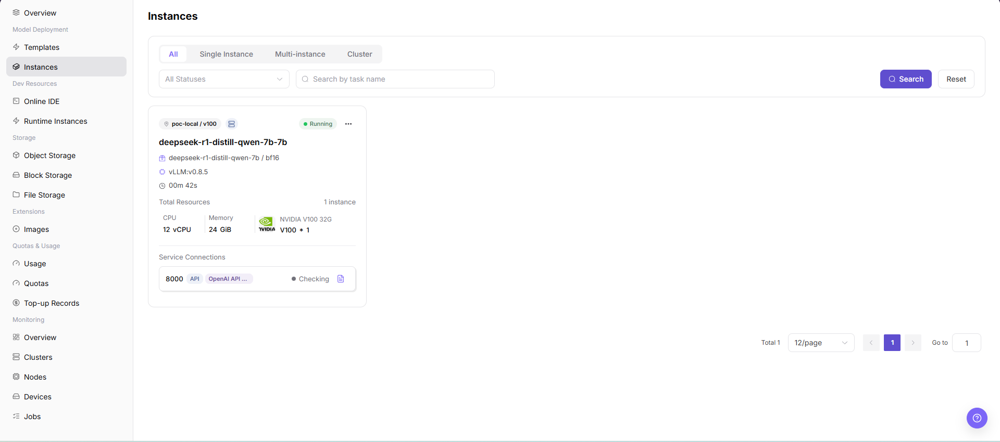

# Instances

::: info Document Information
Version: v1.0
Updated: 2026-07-08
:::

## Feature Overview

`Model Instances` is used to view model services created through deployment templates. Regular users can filter instances by instance type, status, and name here, and enter subsequent details, logs, or access troubleshooting flows.

| Item | Content |
| --- | --- |
| Applicable role | Regular user |
| Navigation path | AI Infrastructure > On-Prem > Model Deployment > Instances |
| Page route | `/powerone/quickstart/model-service` |
| Managed objects | Model service instances created through deployment templates |
| Typical use | View the model instance list, filter instances by type and status, and locate instance runtime status |

#### Beginner Explanation

Model instances can be understood as model services that have already been ordered and started. Deployment templates are responsible for creation, while the Model Instances page is responsible for checking whether creation succeeded, whether the instance is still running, and whether further troubleshooting is needed.

#### First-Time Flow

1. Create a model instance in `Model Deployment > Templates` first.
2. Go to `AI Infra > On-Prem > Model Deployment > Instances`.
3. Filter the list by instance type or status.
4. Use search conditions to locate the target instance.
5. View instance status and enter details or logs if necessary.

#### Terms Quick Reference

| Term | Description |
| --- | --- |
| Instance | A runtime object created by the platform and scheduled to a cluster, such as a model service, online IDE, or runtime instance. |
| Specification | Resource package that a job can request, such as CPU, memory, GPU model, and card count. |
| Single Instance | One model service instance runs independently, suitable for testing or low-traffic scenarios. |
| Multi-instance | One model service has multiple replicas, suitable for higher availability or higher concurrency. |
| Cluster Instance | Model service running in cluster form, usually for more complex deployment requirements. |

## Prerequisites

1. At least one model instance has been created, or you are preparing to view the current empty-list state.
2. The current account has permission to view model instances.
3. For troubleshooting, you can enter instance details, logs, or monitoring pages.

## Page Description

The page provides instance type, status, search, and reset entrypoints. In the current environment screenshot, the list is empty, indicating that the tenant has no model service instances under the current conditions.

#### Page Areas

| Field/Area | Description |
| --- | --- |
| Instance Type Filter | Narrows the scope by All, Single Instance, Multi-instance, Cluster, and other types. |
| Status Filter | Views instances by all statuses or a specific runtime status. |
| Search Area | Enter conditions and click `Search` to locate the target instance. |
| List Area | Displays model instances and their status. When no data exists, it displays No model services. |
| Pagination Area | View by page when there are many instances. |

## Main Operations

### View Instances

#### Applicable Scenario

When you need to confirm whether a model service was created successfully, is still running, or has exceptions, view the model instance list.

#### Pre-Operation Check

1. Model instance creation has been completed, or you explicitly need to confirm that there are no instances.
2. Filters are not too narrow, avoiding false empty results.

#### Procedure

1. Go to `AI Infrastructure > On-Prem > Model Deployment > Instances`.
2. View the instance list and confirm instance name, instance type, running status, model, specification, region, and creation time.
3. Use `Instance Type`, `Status`, or the search box to filter target instances.
4. Click `Search` and confirm that filters have taken effect.
5. To view all data again, click `Reset` to clear filters.
6. If the list is empty, first check whether filters exist, whether the instance was just created, and whether the current tenant or region is correct.
7. For learning or screenshots only, view the list, filters, and empty state without stopping, restarting, or deleting instances.

## Parameter Reference

| Field Name | Description |
| --- | --- |
| Instance Name | Name of the model service instance. |
| Instance Type | Instance form, such as single instance, multi-instance, or cluster instance. |
| Status | Current runtime or lifecycle status of the instance. |
| Model | Model associated with the instance. |
| Specification | Resource specification used by the instance. |
| Region | Region or resource pool where the instance runs. |
| Created At | Time when the instance was created. |
| Search Condition | Filter or keyword used to narrow the instance list. |
| Actions | Available row actions, such as viewing details or lifecycle operations. |

## Pitfalls

- The instance list may have refresh delay. A newly created instance may not appear immediately.
- An empty list does not necessarily mean there are no instances. Check filters, tenant, region, and permissions first.
- `Stop`, `Restart`, and `Delete` are high-risk actions.
- For learning or screenshots, only view the page and do not perform instance lifecycle operations.
- Do not write real instance IDs, instance names, tenant information, regions, nodes, endpoints, logs, error details, or test data in the document.

## Result Validation

| Check Item | Success Signal | If Abnormal |
| --- | --- | --- |
| Filter result | The instance list matches the selected `Instance Type`, `Status`, or search condition. | Click `Reset`, confirm tenant and region, and search again. |
| Target instance visible | The target instance appears in the list after creation and refresh. | Check whether the instance was just created, whether the creation flow succeeded, and whether permissions are sufficient. |
| Status check | The instance status matches the expected runtime state. | Enter details, logs, events, or monitoring pages for further troubleshooting. |
| Learning boundary | No `Stop`, `Restart`, or `Delete` action is performed during learning or screenshot collection. | If triggered by mistake, immediately check instance status, access impact, and operation records. |

## FAQ

#### Instance Is Not Visible in the List After Creation

**Symptom:** After deployment template submission, the model instance list is still empty.

**Possible Causes:**

- Current filters filtered out the instance.
- The instance is still being created and the list has not refreshed.
- Creation flow submission failed.

**Solution:**

1. Click `Reset` and search again.
2. Refresh the page and view again.
3. Return to deployment templates or operation records to confirm whether submission succeeded.

#### Instance Status Is Abnormal

**Symptom:** The instance shows Failed, Unavailable, or remains Creating for a long time.

**Possible Causes:**

- Image pull failed.
- Resources are insufficient or the specification cannot be scheduled.
- Startup parameters or model files are abnormal.

**Solution:**

1. Enter instance details to view logs.
2. Confirm quota and target specification.
3. Contact the operator to check image, cluster, and template configuration.

## Next Steps

1. View instance details and logs.
2. Confirm service access address and invocation method.
3. Track runtime cost in `Resource Usage`.

## Notes

- During troubleshooting, do not expose internal access credentials or API keys in screenshots.
- Before providing external service, confirm access control, instance specification, and runtime cycle.
- `Stop`, `Restart`, and `Delete` may interrupt service, release resources, or remove instance records. Confirm business impact before operating.
- Use the list and detail pages as the primary basis for instance status. Overview pages only provide entrypoints and summaries.
