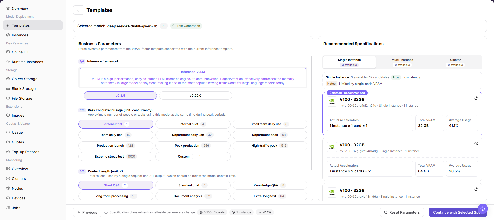
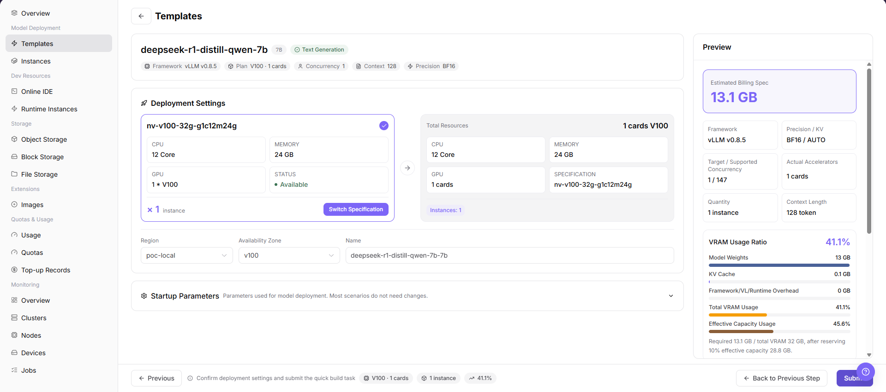

# Templates

::: info Document Information
Version: v1.0
Updated: 2026-07-23
:::

## Feature Overview

`Templates` is used by regular users to view deployment templates published by operators, select models and accelerators through a wizard, review business parameters and recommended specifications, and prepare model service deployment configuration.

| Item | Content |
| --- | --- |
| Applicable role | Regular user |
| Navigation path | AI Infrastructure > On-Prem > Model Deployment > Templates |
| Page route | `/powerone/quickstart/inference-template` |
| Managed objects | Model library, accelerators, business parameters, recommended specifications, deployment settings, and preview information |
| Typical use | View templates published by operators and use them to create model service instances after confirming quota, specifications, and deployment impact |

#### Beginner Explanation

Templates can be understood as an ordering page for model services. The user first selects a model, then checks the available accelerator and recommended specification, fills in deployment settings when needed, and finally reviews the preview before creating a model instance.

#### Terms Quick Reference

| Term | Description |
| --- | --- |
| Template | A deployable solution maintained by operators that combines model, framework, image, specification, startup parameters, and visibility rules. |
| Model Library | Area that displays models available to the current user or tenant. |
| Accelerator | Hardware option, such as GPU or NPU, that can run the selected model. |
| Recommended Specification | Resource specification recommended by the platform based on the selected model and accelerator. |
| Deployment Settings | Instance name, region, specification, startup parameters, and other settings used before creation. |
| Preview | Final configuration summary displayed before submission. |

## Prerequisites

1. The operator has published at least one template visible to the current tenant.
2. The current tenant has available quota in the target region.
3. Images, accelerators, specifications, and framework parameters required by the template have been configured by the operator.
4. If the deployment will expose a service, confirm the access scope and security policy before creating an instance.

## Page Description

The page displays model library, accelerators, business parameters, recommended specifications, deployment settings, and preview information in a wizard. The screenshot shows the templates list area.

#### Page Areas

| Field/Area | Description |
| --- | --- |
| Model Library | Displays deployable models by vendor and model name. |
| Accelerators | Displays accelerator vendor, model, VRAM, adaptation status, and peak capability. |
| Business Parameters | Displays model capability, context, startup, or runtime parameters that need confirmation. |
| Recommended Specifications | Displays selectable instance forms and recommended resource specifications. |
| Deployment Settings | Used to enter instance name, region, specification, startup parameters, and other deployment information. |
| Preview | Summarizes the selected configuration before submission. |

## Main Operations

### Deploy Template

#### Pre-Operation Check

1. Confirm that the current account has access to `AI Infra > On-Prem > Model Deployment > Templates`.
2. Confirm that the target tenant and region have been selected correctly if the page provides global selectors.
3. For learning or screenshots, prepare to stop before any final submit or confirm action.

#### Procedure

1. Go to `AI Infrastructure > On-Prem > Model Deployment > Templates`.
2. View deployable models in `Model Library`.
3. Select the target model and review `Accelerators`, `Business Parameters`, and `Recommended Specifications`.
4. Review model capability, context, startup, or runtime parameters in `Business Parameters`.

5. Enter `Deployment Settings` and review instance name, region, specification, and startup parameters.

6. Review final configuration in `Preview`.
7. For learning or screenshots only, do not click final `Submit`, `Confirm`, or `OK` actions.

## Parameter Reference

| Field Name | Required | Field Type | Description |
| --- | --- | --- | --- |
| Template Name | System-generated | Text | Name of the deployable template shown by the platform. |
| Model | Required | Selection | Model selected from the model library. |
| Accelerator | Required | Selection | Accelerator vendor and model used for this deployment. |
| Business Parameters | Depends on template | Form fields | Model capability, context, startup, or runtime parameters maintained by the template. |
| Recommended Specification | Required | Selection | Resource specification recommended or allowed by the template. |
| Region | Required when deploying | Selection | Region or resource pool where the model instance will be created. |
| Instance Name | Required when deploying | Text | Name of the model instance to be created. Do not use real customer or sensitive names in documentation. |
| Startup Parameters | Depends on template | Text or form fields | Startup parameters inherited from the template or adjusted for a clear business need. |
| Status | System-generated | Enum | Whether the template or selected option can be used to create an instance. |

## Pitfalls

- If an accelerator shows `Unadapted` or `Unmanaged`, it may not be directly deployable.
- When recommended specifications are empty, first check accelerator adaptation, resource specifications, quota, and region.
- Template parameters are maintained by operators. Do not modify startup parameters casually, because incorrect parameters may cause model service startup failure.
- `Submit`, `OK`, and `Confirm` are high-risk final actions.
- Deploying through a template may create real model instances, occupy resources, and generate usage.
- Do not write real tenant names, region names, model IDs, resource IDs, internal image addresses, endpoints, startup parameters, logs, or test data in the document.

## Result Validation

| Check Item | Success Signal | If Abnormal |
| --- | --- | --- |
| Page access | The `Templates` page opens from `Model Deployment > Templates`. | Check account permission, sidebar route, and current language. |
| Template visibility | Deployable templates are displayed in the model library. | Ask the operator to check template publishing status, tenant visibility, and model-source configuration. |
| Recommended specification | Recommended specifications appear after the model and accelerator are selected. | Check accelerator adaptation, resource specification binding, quota, and region. |
| Learning boundary | No final creation action is submitted during learning or screenshot collection. | If submitted by mistake, immediately review model instance list, quota usage, and operation records. |

## FAQ

#### The Template List Is Empty

**Symptom:** No deployable template is displayed on the page.

**Possible Causes:**

- The operator has not published templates.
- The current tenant is not included in the visible scope.
- Required model, framework, image, specification, or accelerator configuration is incomplete.

**Solution:**

1. Confirm the current tenant and region.
2. Ask the operator to check template status and visible scope.
3. Check whether related specifications, images, and accelerators are available.

#### The Continue Button Is Unavailable

**Symptom:** The next wizard step cannot be entered after a model is selected, or recommended specifications are empty.

**Possible Causes:**

- No accelerator is selected.
- The model and accelerator are not adapted.
- The current tenant has no quota for the corresponding specification.

**Solution:**

1. Confirm that both model and accelerator have been selected.
2. Switch to another accelerator or instance type.
3. Go to `Quotas` or `Usage` to check available quota and usage.

#### The Model Instance Fails to Start After Submission

**Symptom:** After an instance is created, its status is abnormal or it cannot provide service.

**Possible Causes:**

- Image pull failed.
- Startup parameters are incorrect.
- The target cluster has insufficient resources.

**Solution:**

1. Go to model instance details to view status, logs, and events.
2. Recreate a test instance with template defaults only in an approved test scenario.
3. Contact the operator to check image, specification, framework, and cluster resources.

## Next Steps

1. Go to [Instances](../instances/) to view model instance status.
2. Go to [Usage](../../quotas-usage/usage/) or [Quotas](../../quotas-usage/quotas/) to review quota and usage changes.
3. Go to [Monitoring Overview](../../monitoring/overview/) to monitor runtime status after deployment.

## Notes

- Deploying through a template may create real model instances, occupy resources, and generate usage. Confirm instance name, region, specification, and runtime cycle before submission.
- Screenshots or tickets must not contain internal service addresses, access keys, endpoints, sensitive startup parameters, logs, or customer information.
- Templates, specifications, and accelerators are maintained by operators. If the user side cannot select a target option, check publishing scope, tenant visibility, quota, and resource pool status with the operator.
