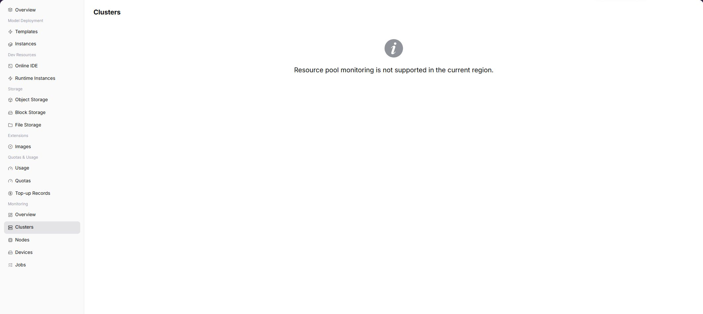

# Cluster Statistics

## Feature Overview

`Cluster Statistics` is used to view cluster resource trends, capacity, and health status within the user-visible scope from a regular user perspective. When the operator has opened user-side monitoring and collection data is normal, the page displays corresponding charts, lists, or statistics. If the capability is not opened to the selected region, users should troubleshoot with instance status, logs, and events, and contact the operator to confirm monitoring opening conditions.

| Item | Content |
| --- | --- |
| Applicable Role | Regular user |
| Navigation Path | Monitoring > Cluster Statistics |
| Page Route | `/powerone/user-monitor/clusters` |
| Managed Objects | Cluster resource trends, capacity, and health status within the user-visible scope |
| Typical Use | Determine whether the cluster where a task runs is resource-constrained or abnormal |

### Beginner View

Cluster statistics are like a capacity table for the user-visible resource pool. They help determine how much cluster capacity, node scale, and accelerator resources are still available in the current region for tasks.

### Terms Quick Reference

| Term | Description |
| --- | --- |
| Cluster Name | Kubernetes cluster identifier that hosts instances, jobs, and resource scheduling. |
| Health Status | Overall cluster availability, usually determined by collection, node, and scheduling status together. |
| Total GPUs | Number of accelerators visible or included in statistics for the current cluster. |
| Node Count | Number of nodes included in monitoring statistics in the cluster. |

## Prerequisites

1. The current account can view cluster statistics in the target region.
2. The operator has included related clusters in the user-side monitoring scope.
3. Cluster monitoring data has been synchronized to the user-side page.
4. The current account has permission to view resource watermarks or health status.

## Page Description

The page displays cluster statistics capability for the selected region. When the capability is opened, users can view metric trends, list data, or key status. When the capability is not opened, the page shows a capability prompt.

### Expected Page Elements When Capability Is Open

| Page Element | Example | Description |
| --- | --- | --- |
| Cluster List | `prod-wuhan-gpu-1` | Displays clusters within the user-visible scope. |
| Cluster Watermark | `GPU 12/32, CPU 60%` | Determines whether capacity is tight. |
| Available Capacity | `A100 remaining 4 cards` | Determines whether it is suitable to continue submitting jobs. |
| Health Status | `Available / Abnormal / Under maintenance` | Determines whether the cluster is suitable for new instances. |
| Capacity Trend | `Resource usage in the last 24 hours` | Determines short-term resource pressure. |

## View Cluster Statistics

### Procedure

1. Go to `Monitoring > Cluster Statistics`.
2. Confirm the region in the upper-right corner.
3. Filter by time, status, or keyword provided by the page.
4. View charts, lists, or prompt information.
5. If monitoring capability is not opened, return to instance details to view logs, events, and status.

### Key Focus When Capability Is Open

- Whether cluster health status is normal.
- Whether node count, total GPUs, and total CPUs match expectations.
- Whether resource watermarks are close to thresholds that affect new task creation.

### Parameters

| Field Name | Required | Field Type | Example | Description |
| --- | --- | --- | --- | --- |
| Cluster Name | Yes | Text | `cluster-a` | Locates the user-visible cluster object. |
| Region | Conditionally required | Drop-down | `Central China Zone 1` | Limits the region to which the cluster belongs. |
| Node Count | System-generated | Number | `24` | Number of nodes included in statistics in the cluster. |
| Total GPUs | System-generated | Number | `96` | Total visible accelerators in the cluster. |
| Total CPUs | System-generated | Number | `1536 Core` | Total CPU capacity of the cluster. |
| Health Status | System-generated | Status | `Healthy` | Shows whether the cluster is available, alerted, or collection abnormal. |

### Pitfalls

- High cluster watermarks do not necessarily mean your task will fail. Also check target specification and quota.
- When cluster health is abnormal, do not repeatedly submit the same job. Confirm platform events first.
- Do not mix resources from different regions in the same judgment.

### Result Validation

1. The list displays cluster name, region, node count, and health status.
2. Resource capacity is consistent with the current region and visible scope.
3. After clicking or drilling down, corresponding node, device, or job information is visible.

## Prepare Before Contacting the Operator

When page capability is not opened, data is empty, or mounting fails, prepare the following information before contacting the operator:

| Information | Example | Purpose |
| --- | --- | --- |
| Current Region | `Wuhan` | Determines whether the capability is opened in this region. |
| Current Account / Tenant | `tenant-a` | Determines menu, resource, and monitoring permissions. |
| Target Instance or Job | `train-job-001` | Helps locate logs, events, and metering records. |
| Target Specification or Resource | `gpu-a100-1-16c-64g` | Determines quota, specification, and cluster capability. |
| Page Symptom | `No data / Mount failed / Chart empty` | Helps the operator determine entrypoint, collection, or underlying resource issues. |

Alternative troubleshooting paths:

1. View instance details, logs, and events first.
2. View resource usage and resource quotas to confirm whether quota or credit limits exist.
3. When storage capability is unavailable, prioritize object storage for models, datasets, and output artifacts.
4. When monitoring capability is not opened, use instance status, logs, events, and usage as short-term troubleshooting basis.

## FAQ

### Cluster Watermark Is High

**Symptom:**

Cluster GPU, CPU, or memory watermark stays close to the limit for a long time.

**Possible Causes:**

- Many training or inference tasks are running in the same region.
- The cluster capacity bound to the target specification is insufficient.
- Some nodes are unavailable, reducing schedulable capacity.

**Solution:**

1. View job monitoring to confirm whether long-running tasks exist.
2. Switch to an available region or specification and retry creation.
3. Contact the operator to evaluate capacity expansion, migration, or specification association adjustment.

### Cluster Status Is Abnormal

**Symptom:**

The cluster list shows abnormal, unavailable, or data has not updated for a long time.

**Possible Causes:**

- Cluster collection component is abnormal.
- Node status affects cluster health.
- The current account cannot view complete monitoring data.

**Solution:**

1. Record cluster name, region, and page update time.
2. View node statistics for NotReady nodes.
3. Contact the operator to check cluster access and collection links.

## Follow-Up Operations

1. Go to node statistics to check whether a small number of nodes caused the cluster exception.
2. Go to device monitoring to confirm whether GPU/NPU resources are sufficient.
3. Before creating tasks, judge together with resource quotas and specification availability.

## Notes

- Do not expose real cluster names, internal domains, or node IPs in screenshots.
- Cluster health status and single instance status may not be synchronized. Judge together with logs and events.
- When capacity is insufficient, confirm the target specification first instead of looking only at total cluster watermarks.
