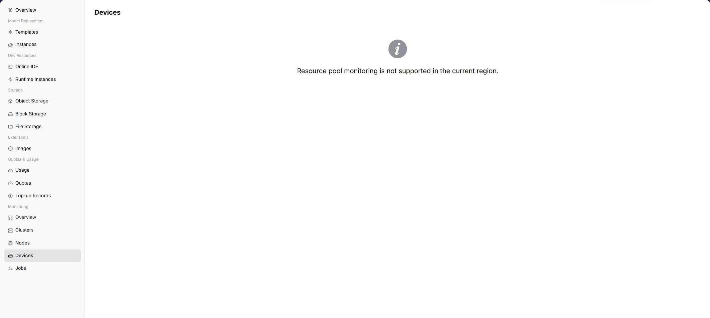

# Device Monitoring

::: info Document Information
Version: v1.0
Updated: 2026-07-08
:::

## Feature Overview

`Device Monitoring` is used to view utilization, VRAM, and health status of devices such as GPU/NPU within the user-visible scope from a regular user perspective. When the operator has opened user-side monitoring and collection data is normal, the page displays corresponding charts, lists, or statistics. If the capability is not opened to the selected region, users should troubleshoot with instance status, logs, and events, and contact the operator to confirm monitoring opening conditions.

| Item | Content |
| --- | --- |
| Applicable Role | Regular user |
| Navigation Path | Monitoring > Device Monitoring |
| Page Route | `/powerone/user-monitor/devices` |
| Managed Objects | Utilization, VRAM, and health status of GPU/NPU and other devices within the user-visible scope |
| Typical Use | Determine whether model instances or training tasks are affected by accelerator resources |

### Beginner View

Device monitoring is like a health check table for each GPU/NPU. It shows device type, health status, temperature, and VRAM usage to determine whether accelerators affect task execution.

### Terms Quick Reference

| Term | Description |
| --- | --- |
| Device Name | Identifier of a single GPU/NPU or accelerator device. |
| Device Type | Accelerator model or vendor type, such as GPU or NPU. |
| VRAM Usage | Device VRAM occupation ratio, which affects whether models can start. |
| Health Status | Whether the device is available, alerted, or offline. |

## Prerequisites

1. The current account has device monitoring view permissions.
2. The target region has visible GPU/NPU resources.
3. Device plugin and monitoring collection data are normally reported.
4. The device type or specification used by the task to troubleshoot has been clarified.

## Page Description

The page displays device monitoring capability for the selected region. When the capability is opened, users can view metric trends, list data, or key status. When the capability is not opened, the page shows a capability prompt.

### Expected Page Elements When Capability Is Open

| Page Element | Example | Description |
| --- | --- | --- |
| Device List | `GPU 0 / NPU 0` | Displays accelerators within the user-visible scope. |
| Utilization Chart | `GPU Util 85%` | Determines whether the device is busy or idle for a long time. |
| VRAM Metric | `60GiB / 80GiB` | Determines whether the model or training task is close to the VRAM limit. |
| Temperature and Health Status | `72C / Healthy` | Determines hardware health, cooling, or driver risk. |
| Update Time | `2026-07-03 10:00` | Determines whether collection is delayed. |

## View Device Monitoring

### Procedure

1. Go to `Monitoring > Device Monitoring`.
2. Confirm the region in the upper-right corner.
3. Filter by time, status, or keyword provided by the page.
4. View charts, lists, or prompt information.
5. If monitoring capability is not opened, return to instance details to view logs, events, and status.

### Key Focus When Capability Is Open

- Whether GPU/NPU utilization is empty or continuously abnormal.
- Whether VRAM usage is close to the limit.
- Whether temperature and health status have alerts.

### Parameters

| Field Name | Required | Field Type | Example | Description |
| --- | --- | --- | --- | --- |
| Device Name | Yes | Text | `GPU-0` | Locates a single device. |
| Device Type | Yes | Enum | `NVIDIA A800` | Displays accelerator model or type. |
| Node IP | Conditionally required | Text | `10.0.0.*` | Locates the node where the device resides. Documentation and screenshots should sanitize it. |
| Health Status | System-generated | Status | `Normal` | Shows whether the device is available or abnormal. |
| Temperature | System-generated | Number | `71°C` | Helps judge hardware health and cooling. |
| VRAM Usage | System-generated | Percentage | `78%` | Determines model or job VRAM pressure. |
| GPU/NPU Utilization | System-generated | Percentage | `63%` | Determines compute unit load. |

### Pitfalls

- Empty utilization may mean not collected, no task, or device plugin exception. Do not directly judge it as idle.
- High VRAM directly affects model startup even when total cluster capacity looks sufficient.
- Temperature exceptions should be handled as hardware health issues. Avoid relying only on task retry.

### Result Validation

1. The device list displays device name, type, health status, temperature, and VRAM usage.
2. Device metrics can correspond to nodes and time ranges.
3. Troubleshooting relationships can be established between abnormal devices and affected instances, jobs, or specifications.

## Prepare Before Contacting the Operator

When page capability is not opened, data is empty, or mounting fails, prepare the following information before contacting the operator:

| Information | Example | Purpose |
| --- | --- | --- |
| Current Region | `Wuhan` | Determines whether the capability is opened in this region. |
| Current Account / Tenant | `tenant-a` | Determines menu, resource, and monitoring permissions. |
| Target Instance or Job | `train-job-001` | Helps locate logs, events, and metering records. |
| Target Specification or Resource | `gpu-a100-1-16c-64g` | Determines quota, specification, and cluster capability. |
| Page Symptom | `No data / Mount failed / Chart empty` | Helps the operator determine entrypoint, collection, or underlying resource issues. |

Alternative troubleshooting paths:

1. View instance details, logs, and events first.
2. View resource usage and resource quotas to confirm whether quota or credit limits exist.
3. When storage capability is unavailable, prioritize object storage for models, datasets, and output artifacts.
4. When monitoring capability is not opened, use instance status, logs, events, and usage as short-term troubleshooting basis.

## FAQ

### GPU/NPU Utilization Is Empty

**Symptom:**

Devices exist in the list, but utilization or VRAM curves are empty.

**Possible Causes:**

- No task ran in the current time range.
- Device collection component or driver reporting is abnormal.
- The current account has no permission to view complete device metrics.

**Solution:**

1. Switch to the task runtime range and view again.
2. Compare node statistics and job monitoring to confirm whether tasks occupy devices.
3. Contact the operator to check device plugins, drivers, and monitoring collection.

### Temperature or VRAM Is Abnormal

**Symptom:**

Device temperature stays high, or VRAM usage approaches the limit and causes instance startup failure.

**Possible Causes:**

- High-load tasks are running intensively.
- Model VRAM requirement exceeds specification capability.
- Device cooling, driver, or hardware status is abnormal.

**Solution:**

1. Confirm the model size and resource specification of affected jobs.
2. Reduce concurrency, switch specifications, or retry after resources are released.
3. Provide the operator with device name, node, and abnormal time range.

## Follow-Up Operations

1. When VRAM is insufficient, return to instance or job configuration to reduce model size, concurrency, or context length.
2. When device health is abnormal, avoid continuing to submit high-priority tasks with the same device type.
3. When operator handling is needed, provide device type, node, time range, and error symptoms.

## Notes

- Node IP, device ID, and hardware status screenshots should be sanitized.
- Device monitoring only describes hardware-side status. Model parameter errors still require instance logs.
- Do not directly equate low single-card utilization with resource waste. It may be caused by sampling window or task type.
