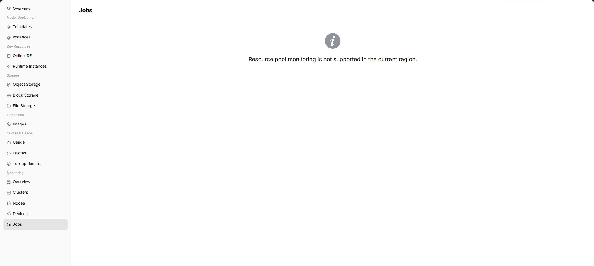

# Job Monitoring

:::: info Document Information
Version: v1.0
Updated: 2026-07-08
::::

## Feature Overview

`Job Monitoring` is used to view model instances, online IDEs, runtime instances, and historical jobs within the user-visible scope from a regular user perspective. When the operator has opened user-side monitoring and collection data is normal, the page displays corresponding charts, lists, or statistics. If the capability is not opened to the selected region, users should troubleshoot with instance status, logs, and events, and contact the operator to confirm monitoring opening conditions.

| Item | Content |
| --- | --- |
| Applicable Role | Regular user |
| Navigation Path | Monitoring > Job Monitoring |
| Page Route | `/powerone/user-monitor/jobs` |
| Managed Objects | Model instances, online IDEs, runtime instances, and historical jobs within the user-visible scope |
| Typical Use | Locate queued, failed, long-running, and abnormal resource consumption jobs |

### Beginner View

Job monitoring is like a personal task queue list. It shows job ID, status, queue duration, runtime duration, GPU occupation, and failure causes.

### Terms Quick Reference

| Term | Description |
| --- | --- |
| Job ID | Identifier used to locate a single training, inference, or runtime task. |
| Queue Duration | Time a job waits for resources or scheduling conditions. |
| Runtime Duration | Duration after a job starts running. |
| Failure Cause | Scheduling, image, startup, or resource error summary returned by the platform. |

## Prerequisites

1. The current account has job monitoring view permissions.
2. The target job belongs to the current account or current tenant visible scope.
3. The job has been submitted and generated status, events, or monitoring data.
4. The job ID or submission time to troubleshoot has been clarified.

## Page Description

The page displays job monitoring capability for the selected region. When the capability is opened, users can view metric trends, list data, or key status. When the capability is not opened, the page shows a capability prompt.

### Expected Page Elements When Capability Is Open

| Page Element | Example | Description |
| --- | --- | --- |
| Job List | `train-job-001` | Displays jobs associated with model instances, online IDEs, or runtime instances. |
| Job Status | `Running / Queued / Failed` | Determines task lifecycle and current processing stage. |
| Queue Reason | `Insufficient resources / Image pulling` | Helps locate why creation is slow or cannot start. |
| Runtime Duration | `2h 13m` | Determines whether the task exceeds expected runtime. |
| Failure Information | `ImagePullBackOff` | Determines whether logs, events, or operator support is needed. |

## View Job Monitoring

### Procedure

1. Go to `Monitoring > Job Monitoring`.
2. Confirm the region in the upper-right corner.
3. Filter by time, status, or keyword provided by the page.
4. View charts, lists, or prompt information.
5. If monitoring capability is not opened, return to instance details to view logs, events, and status.

### Key Focus When Capability Is Open

- Whether jobs remain queued for a long time.
- Whether failure causes point to quota, image, startup command, or insufficient resources.
- Whether GPU occupation and runtime duration match expectations.

### Parameters

| Field Name | Required | Field Type | Example | Description |
| --- | --- | --- | --- | --- |
| Job ID | Yes | Text | `job-20260706-001` | Locates a single job. |
| Status | System-generated | Status | `Running` | Shows queued, running, succeeded, or failed. |
| Queue Duration | System-generated | Duration | `18 minutes` | Determines whether scheduling wait exists. |
| Runtime Duration | System-generated | Duration | `2 hours 15 minutes` | Determines whether the task exceeds expectations. |
| GPU Occupation | System-generated | Number / specification | `2 * A800` | Shows accelerator resources occupied by the job. |
| Failure Cause | System-generated | Text | `ImagePullBackOff` | Helps locate failure direction. |
| Submission Time | System-generated | Date time | `2026-07-06 09:30` | Used to align logs, events, and usage. |

### Pitfalls

- Job queueing is usually related to quotas, specifications, capacity, or scheduling conditions. Do not only refresh the page.
- When failure cause is empty, view instance events and logs first.
- When GPU occupation is normal but results are abnormal, return to training scripts or model parameters for troubleshooting.

### Result Validation

1. The job list displays ID, status, queue duration, runtime duration, and resource occupation.
2. After filters change, list and statistics change accordingly.
3. Failed jobs can drill down to error summary, events, or log entrypoints.

## Prepare Before Contacting the Operator

When page capability is not opened, data is empty, or mounting fails, prepare the following information before contacting the operator:

| Information | Example | Purpose |
| --- | --- | --- |
| Current Region | `Wuhan` | Determines whether the capability is opened in this region. |
| Current Account / Tenant | `tenant-a` | Determines menu, resource, and monitoring permissions. |
| Target Instance or Job | `train-job-001` | Helps locate logs, events, and metering records. |
| Target Specification or Resource | `gpu-a100-1-16c-64g` | Determines quota, specification, and cluster capability. |
| Page Symptom | `No data / Mount failed / Chart empty` | Helps the operator determine entrypoint, collection, or underlying resource issues. |

Alternative troubleshooting paths:

1. View instance details, logs, and events first.
2. View resource usage and resource quotas to confirm whether quota or credit limits exist.
3. When storage capability is unavailable, prioritize object storage for models, datasets, and output artifacts.
4. When monitoring capability is not opened, use instance status, logs, events, and usage as short-term troubleshooting basis.

## FAQ

### Job Remains Queued for a Long Time

**Symptom:**

The job remains Pending, Queued, or waiting for resources.

**Possible Causes:**

- Target specification or GPU model resources are insufficient.
- Current tenant quota is insufficient.
- Scheduling conditions, node labels, or storage mount conditions are not satisfied.

**Solution:**

1. Verify whether resource quotas and target specifications are available.
2. View cluster, node, and device monitoring to confirm capacity.
3. Switch specification or region if necessary, or contact the operator to adjust resources.

### Job Fails but Logs Are Empty

**Symptom:**

The job status is Failed, but the log page has no application output.

**Possible Causes:**

- The container did not start successfully, so logs have not been generated.
- Image pull, startup command, or mount failure occurred before application startup.
- Log collection has delay or permission restrictions.

**Solution:**

1. View events and the failure cause field.
2. Check image address, startup command, environment variables, and mount paths.
3. Provide job ID, submission time, and error summary to the operator for troubleshooting.

## Follow-Up Operations

1. For queueing issues, verify quotas, specifications, and device capacity first.
2. For failure issues, view events, image, startup command, and mount path first.
3. For high-duration jobs, evaluate resource consumption together with the usage page.

## Notes

- Job IDs, image addresses, data paths, and log contents may contain sensitive information.
- Before stopping a job, confirm whether output files and logs need to be retained.
- When the same error appears repeatedly, adjust configuration before retrying to avoid continuous credit consumption.
