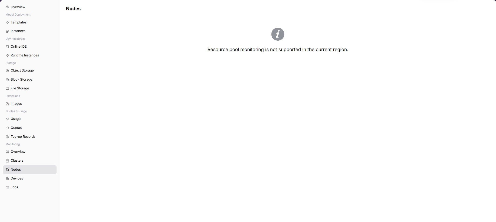

# Node Statistics

:::: info Document Information
Version: v1.0
Updated: 2026-07-08
::::

## Feature Overview

`Node Statistics` is used to view node resource trends and status within the user-visible scope from a regular user perspective. When the operator has opened user-side monitoring and collection data is normal, the page displays corresponding charts, lists, or statistics. If the capability is not opened to the selected region, users should troubleshoot with instance status, logs, and events, and contact the operator to confirm monitoring opening conditions.

| Item | Content |
| --- | --- |
| Applicable Role | Regular user |
| Navigation Path | Monitoring > Node Statistics |
| Page Route | `/powerone/user-monitor/nodes` |
| Managed Objects | Node resource trends and status within the user-visible scope |
| Typical Use | Determine whether an instance is affected by node resources or node status |

### Beginner View

Node statistics are like a dashboard for each server. They show node CPU, memory, GPU, and status to determine whether a task is slow or failed because of a specific node.

### Terms Quick Reference

| Term | Description |
| --- | --- |
| Node Name | Server node identifier in the cluster that hosts instances or jobs. |
| CPU Usage | Node compute resource usage ratio. |
| Memory Usage | Node memory occupation ratio. |
| GPU Usage | Node accelerator compute resource usage ratio. |

## Prerequisites

1. The current account has node monitoring view permissions.
2. The operator has opened node metrics for the target region or cluster.
3. Node collection data is normally reported.
4. The instance or job to troubleshoot can be mapped to a time range.

## Page Description

The page displays node statistics capability for the selected region. When the capability is opened, users can view metric trends, list data, or key status. When the capability is not opened, the page shows a capability prompt.

### Expected Page Elements When Capability Is Open

| Page Element | Example | Description |
| --- | --- | --- |
| Node List | `node-a-01` | Displays nodes within the user-visible scope. |
| CPU Metric | `CPU usage 65%` | Determines node compute resource pressure. |
| Memory Metric | `128GiB / 256GiB` | Determines whether the instance is affected by memory resources. |
| Disk Metric | `Disk 70%` | Determines whether logs, cache, or data directories are close to limits. |
| Node Status | `Ready / NotReady` | Determines whether the node can host jobs. |

## View Node Statistics

### Procedure

1. Go to `Monitoring > Node Statistics`.
2. Confirm the region in the upper-right corner.
3. Filter by time, status, or keyword provided by the page.
4. View charts, lists, or prompt information.
5. If monitoring capability is not opened, return to instance details to view logs, events, and status.

### Key Focus When Capability Is Open

- Whether nodes are Ready or schedulable.
- Whether CPU, memory, or GPU curves remain high.
- Whether curves are interrupted or update time is clearly delayed.

### Parameters

| Field Name | Required | Field Type | Example | Description |
| --- | --- | --- | --- | --- |
| Node Name | Yes | Text | `node-gpu-01` | Locates a specific node. |
| Region | Conditionally required | Drop-down | `Central China Zone 1` | Limits the region to which the node belongs. |
| Cluster | Conditionally required | Drop-down | `cluster-a` | Limits the cluster to which the node belongs. |
| CPU Usage | System-generated | Percentage | `72%` | Determines node CPU pressure. |
| Memory Usage | System-generated | Percentage | `81%` | Determines node memory pressure. |
| GPU Usage | System-generated | Percentage | `65%` | Determines node accelerator compute pressure. |
| Node Status | System-generated | Status | `Ready` | Shows whether the node is available or abnormal. |

### Pitfalls

- Temporary CPU or memory spikes are not necessarily failures. Judge them together with the task runtime window.
- Curve interruption may be collection delay or node unavailability.
- Users usually cannot maintain nodes directly. During troubleshooting, prepare time range and instance information for the operator.

### Result Validation

1. The node list displays node name, owning cluster, status, and key metrics.
2. Metric curves match the selected time range.
3. Abnormal nodes can be mapped to affected instance or job time ranges.

## Prepare Before Contacting the Operator

When page capability is not opened, data is empty, or mounting fails, prepare the following information before contacting the operator:

| Information | Example | Purpose |
| --- | --- | --- |
| Current Region | `Wuhan` | Determines whether the capability is opened in this region. |
| Current Account / Tenant | `tenant-a` | Determines menu, resource, and monitoring permissions. |
| Target Instance or Job | `train-job-001` | Helps locate logs, events, and metering records. |
| Target Specification or Resource | `gpu-a100-1-16c-64g` | Determines quota, specification, and cluster capability. |
| Page Symptom | `No data / Mount failed / Chart empty` | Helps the operator determine entrypoint, collection, or underlying resource issues. |

Alternative troubleshooting paths:

1. View instance details, logs, and events first.
2. View resource usage and resource quotas to confirm whether quota or credit limits exist.
3. When storage capability is unavailable, prioritize object storage for models, datasets, and output artifacts.
4. When monitoring capability is not opened, use instance status, logs, events, and usage as short-term troubleshooting basis.

## FAQ

### Node Is Unavailable

**Symptom:**

The node status is abnormal, and related instance or job creation fails, restarts, or migrates.

**Possible Causes:**

- The node is NotReady, unschedulable, or under maintenance.
- Node resources are exhausted or devices are abnormal.
- Monitoring collection delay prevents status from recovering in time.

**Solution:**

1. Record node name, region, cluster, and abnormal time.
2. View job or instance events to confirm whether it was scheduled to this node.
3. Contact the operator to handle node status or migrate resources.

### CPU/Memory Curve Is Interrupted

**Symptom:**

Node metric curves are interrupted or have no new data for a long time.

**Possible Causes:**

- Monitoring collection component is abnormal.
- Node network or system status is abnormal.
- The selected time range does not cover collected data.

**Solution:**

1. Adjust the time range to confirm whether it is only a short gap.
2. Compare cluster statistics and job monitoring to determine impact scope.
3. Provide the operator with sanitized node name and time period.

## Follow-Up Operations

1. When node metrics are abnormal, check whether affected jobs or instances are concentrated on this node.
2. For GPU-related issues, continue to device monitoring.
3. If the node remains abnormal, avoid repeatedly retrying on the same specification.

## Notes

- Node names, IPs, and labels are operations-sensitive information and must be sanitized before screenshots.
- Node metrics only describe resource status. Business failures still require logs and events.
- Users cannot directly repair nodes. Provide evidence to the operator.
