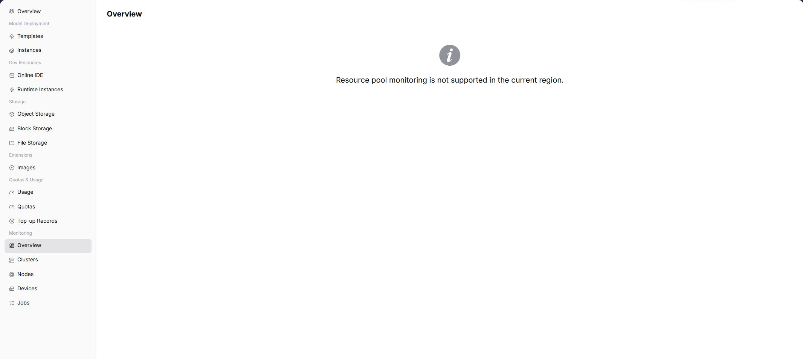

# Statistics Overview

::: info Document Information
Version: v1.0
Updated: 2026-07-08
:::

## Feature Overview

`Statistics Overview` is used to view resource pool monitoring overview, instance runtime status, and key resource trends from a regular user perspective. When the operator has opened user-side monitoring and collection data is normal, the page displays corresponding charts, lists, or statistics. If the capability is not opened to the selected region, users should troubleshoot with instance status, logs, and events, and contact the operator to confirm monitoring opening conditions.

| Item | Content |
| --- | --- |
| Applicable Role | Regular user |
| Navigation Path | Monitoring > Statistics Overview |
| Page Route | `/powerone/user-monitor/overview` |
| Managed Objects | Resource pool monitoring overview, instance runtime status, and key resource trends |
| Typical Use | Quickly determine whether the selected region has visible monitoring data and enter drill-down pages |

### Beginner View

Statistics overview is like a resource weather map for regular users. It shows cluster count, node status, exception count, and update time in one screen, helping decide whether to drill down further.

### Terms Quick Reference

| Term | Description |
| --- | --- |
| Time Range | Limits the query window for overview cards, trends, and exception statistics. |
| Region | Resource scope visible to the current user. Overview data changes after switching. |
| Exception Count | Summary of failed jobs, high-watermark resources, or offline objects within the current time range. |
| Update Time | Time point used to determine whether monitoring data is delayed. |

## Prerequisites

1. The current account has user-side monitoring view permissions.
2. The target region has been opened for monitoring by the operator.
3. The current account has visible instances, jobs, or resources in this region.
4. Monitoring collection data has completed synchronization, and page update time should not be obviously delayed.

## Page Description

The page displays statistics overview capability for the selected region. When the capability is opened, users can view metric trends, list data, or key status. When the capability is not opened, the page shows a capability prompt.

### Expected Page Elements When Capability Is Open

| Page Element | Example | Description |
| --- | --- | --- |
| Overview Cards | `Cluster count / Node count / Job count / Alert count` | Quickly judge overall resource pool status. |
| Trend Entrypoint | `Resource trend / Job trend` | Jump from overview to cluster, node, device, or job dimensions. |
| Exception Aggregation | `Failed jobs / High-watermark resources / Offline nodes` | Helps users prioritize issues that affect current instances. |
| Update Time | `2026-07-03 10:00` | Determines whether data has collection delay. |

## View Statistics Overview

### Procedure

1. Go to `Monitoring > Statistics Overview`.
2. Confirm the region in the upper-right corner.
3. Filter by time, status, or keyword provided by the page.
4. View charts, lists, or prompt information.
5. If monitoring capability is not opened, return to instance details to view logs, events, and status.

### Key Focus When Capability Is Open

- Cluster count, node status, and exception count in overview cards.
- Whether resource trends are consistent with recent instance creation, training tasks, or deployment changes.
- Whether update time is later than the latest operation.

### Parameters

| Field Name | Required | Field Type | Example | Description |
| --- | --- | --- | --- | --- |
| Time Range | Yes | Date range | `Last 1 hour` | Controls overview statistics and trend query window. |
| Region | Conditionally required | Drop-down | `Central China Zone 1` | Limits the resource scope visible to the current user. |
| Cluster Count | System-generated | Number | `3` | Number of clusters visible or associated in the current region. |
| Node Status | System-generated | Status / number | `Ready 12 / NotReady 1` | Summarizes node availability. |
| Exception Count | System-generated | Number | `2` | Aggregates failed jobs, offline nodes, or high-watermark resources. |
| Update Time | System-generated | Date time | `2026-07-06 10:00` | Determines whether monitoring data refreshes in time. |

### Pitfalls

- Overview is suitable for determining direction and should not be the sole basis for a single instance failure.
- When exception counts differ from detail pages, fix region and time range first.
- If the page only shows a capability prompt, prioritize instance logs, events, and usage, then contact the operator to confirm opening conditions.

### Result Validation

1. Overview cards display time range, region, cluster count, and exception count.
2. After switching time range, trend charts or exception counts change accordingly.
3. After drilling down to cluster, node, device, or job pages, the object scope is consistent with the overview.

## Prepare Before Contacting the Operator

When page capability is not opened, data is empty, or mounting fails, prepare the following information before contacting the operator:

| Information | Example | Purpose |
| --- | --- | --- |
| Current Region | `Wuhan` | Determines whether the capability is opened in this region. |
| Current Account / Tenant | `tenant-a` | Determines menu, resource, and monitoring permissions. |
| Target Instance or Job | `train-job-001` | Helps locate logs, events, and metering records. |
| Target Specification or Resource | `gpu-a100-1-16c-64g` | Determines quota, specification, and cluster capability. |
| Page Symptom | `No data / Mount failed / Chart empty` | Helps the operator determine entrypoint, collection, or underlying resource issues. |

Alternative troubleshooting paths:

1. View instance details, logs, and events first.
2. View resource usage and resource quotas to confirm whether quota or credit limits exist.
3. When storage capability is unavailable, prioritize object storage for models, datasets, and output artifacts.
4. When monitoring capability is not opened, use instance status, logs, events, and usage as short-term troubleshooting basis.

## FAQ

### Overview Data Is Delayed

**Symptom:**

The instance has been created or the job has ended, but overview cards have not updated.

**Possible Causes:**

- Monitoring collection synchronization is delayed.
- The page time range does not cover the latest operation time.
- User-side monitoring capability in the current region is not fully opened.

**Solution:**

1. Confirm the difference between page update time and current time.
2. Switch to a time range that covers the operation time.
3. Cross-check status with instance details, events, and logs before contacting the operator.

### Exception Count Is Inconsistent with Detail Page

**Symptom:**

The overview shows exceptions, but the count or objects do not match after entering the detail page.

**Possible Causes:**

- Overview and detail pages use different time ranges or regions.
- Exception objects recovered or were cleaned up during refresh.
- Some objects are not displayed on the detail page due to permission restrictions.

**Solution:**

1. Align region, time range, and filters.
2. Refresh the page and check whether update times are consistent.
3. Provide the operator with sanitized time range, region, and exception type.

## Follow-Up Operations

1. Enter cluster, node, device, or job pages based on exception type.
2. If only your own instance is affected, prioritize instance details, logs, and events.
3. If multiple metric types are abnormal, record the time range and resource objects, then contact the operator.

## Notes

- Mask tenant names, node names, node IPs, and business identifiers before screenshots.
- Do not directly equate instant high watermarks in the overview with failures.
- Use sanitized resource IDs and time ranges in external feedback.
