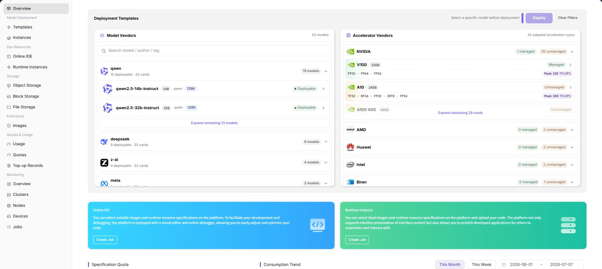

# Overview

::: info Document Information
Version: v1.0
Updated: 2026-07-08
:::

## Feature Overview

`Overview` is the summary page regular users enter after opening AI Infra-On Prem. It is used to centrally view deployment templates, accelerator capabilities, quick creation entrypoints, specification quotas, and resource consumption trends.

| Item | Content |
| --- | --- |
| Applicable Role | Regular user |
| Navigation Path | Overview |
| Page Route | `/powerone/overview` |
| Managed Objects | Deployment templates, accelerator resources, quick entrypoints, specification quotas, and resource usage trends |
| Typical Use | Quickly understand deployable models, available accelerators, quotas, and recent resource usage after entering On-Prem |

### Beginner View

The overview page can be understood as the homepage of the On-Prem user console: the upper area tells you which models can be deployed and which accelerators are available; the middle area provides quick entrypoints for Online IDE and Runtime Instance; the lower area helps you confirm whether quota is sufficient and whether resources have consumption records.

### First-Time Flow

1. Go to `AI Infra(On-Prem) > Overview`.
2. View `Deployment Templates` to confirm whether deployable models exist.
3. View `Accelerator Vendors` to confirm accelerator types supported by the current resource pool.
4. Use the `Online IDE` or `Runtime Instance` quick entrypoint to enter the creation flow.
5. View specification quota, consumption trends, and resource usage to confirm whether resources are available for job creation.

### Terms Quick Reference

| Term | Description |
| --- | --- |
| Specification | Resource package that a job can request, such as CPU, memory, GPU model, and card count. |
| Quota | Resource upper limit available to a tenant. Common dimensions include GPU, CPU, memory, and specifications. |
| Accelerator | GPU, NPU, or other AI computing device, displayed on the page by vendor and model. |
| Consumption Trend | Resource consumption changes over time, used to determine whether recent jobs generated fees or credit consumption. |

## Prerequisites

1. The current account can enter the `AI Infra(On-Prem)` subsystem.
2. The operator has opened visible regions, availability zones, clusters, specifications, and templates for the tenant.
3. To create an online IDE, runtime instance, or model instance, the account needs the corresponding creation permissions and available quota.

## Page Description

The upper area displays deployable templates and accelerator vendors; the middle area provides quick entrypoints for Online IDE and Runtime Instance; the lower area displays specification quota, consumption trends, and resource usage. The screenshot shows the left user menu, deployment template area, accelerator area, and quick entrypoints.

### Page Areas

| Field/Area | Description |
| --- | --- |
| Deployment Templates | Displays deployable models and deployment entrypoints. The deployment button is usually unavailable before a model is selected. |
| Accelerator Vendors | Displays accelerator models and adaptation status by vendors such as NVIDIA, Huawei, AMD, and Intel. |
| Quick Guide | Provides creation entrypoints for Online IDE and Runtime Instance. |
| Specification Quota | Displays specification-level quotas and used amount. |
| Consumption Trend | Displays consumption trend for the current cycle. If there is no job consumption, it is empty. |

## Main Operations

### View Deployable Resources

#### Applicable Scenario

Before creating a model service, online IDE, or runtime instance, confirm on the overview page whether templates, accelerators, and quotas are available.

#### Pre-Operation Check

1. You have entered the On-Prem overview page.
2. The region or resource scope in the upper-right corner matches the current use scenario.

#### Procedure

1. View model vendors and model cards in deployment templates.
2. View accelerator vendors, models, VRAM, and adaptation status in accelerator vendors.
3. Confirm whether the target specification still has available quota in specification quota.
4. If a job needs to be created, click `Create Job` to enter the corresponding creation page.

#### Parameters

| Field Name | Required | Field Type | Example | Description |
| --- | --- | --- | --- | --- |
| Region | No | Drop-down | `Wuhan` | Overview statistics region. |
| Resource Type | No | Enum | `GPU` | Overview resource category. |
| Quota | System-generated | Number | `10` | Available quota for the current account. |
| Used Amount | System-generated | Number | `4` | Current used resource amount. |
| Update Time | System-generated | Date time | `2026-07-07 10:00` | Overview data update time. |

#### Pitfalls

- When the deployment button is unavailable, usually no model or accelerator has been selected.
- Sufficient quota does not mean the cluster definitely has idle resources. If creation fails, check region, availability zone, and specifications.

#### Result Validation

1. The target model or quick entrypoint is visible.
2. The target specification is visible in the quota table.
3. If consumption data exists, trend and usage areas refresh normally.

## Configuration Rules and Impact

- The overview page only provides summary display and does not replace creation, detail, or troubleshooting pages of specific modules.
- Templates, specifications, and accelerators are configured by operators. Regular users cannot modify them directly on the overview page.
- Resource usage and consumption trends may have statistical delays. For real-time troubleshooting, enter specific instance or monitoring pages.

## FAQ

### No Deployable Templates on the Overview Page

**Symptom:** The deployment template area is empty or has no clickable model.

**Possible Causes:**

- The operator has not published templates.
- The current tenant has no template visibility permission.
- Filters or region scope do not match.

**Solution:**

1. Go to `Model Deployment > Deployment Templates` to view the full list.
2. Switch or confirm the current region.
3. Contact the operator to confirm whether templates have been published to the current tenant.

### Quota Looks Sufficient but Creation Fails

**Symptom:** The overview page shows unlimited or remaining quota, but job creation fails.

**Possible Causes:**

- The target cluster has insufficient idle resources.
- The specification is not associated with an available cluster.
- Image, storage, or region configuration is incomplete.

**Solution:**

1. Enter the creation page and view the specific error message.
2. Check `Resource Quotas` and `Resource Usage`.
3. Contact the operator to confirm the association between specifications and clusters.

## Follow-Up Operations

1. Go to `Model Deployment > Deployment Templates` to create a model instance.
2. Go to `Development Resources > Online IDE` to create an interactive development environment.
3. Go to `Quota & Usage > Resource Quotas` to view resource limits.

## Notes

- Do not judge failure causes only by the homepage summary. Key instance status should be based on the corresponding detail page.
- Before creation, confirm region, specification, and image source to avoid creation failure caused by unschedulable resources after submission.
