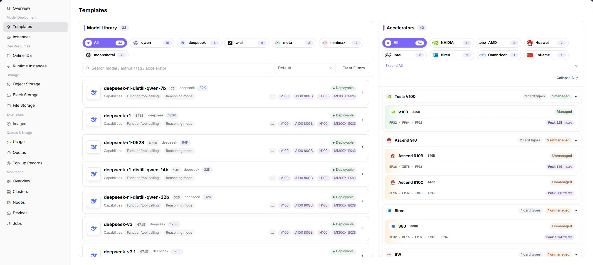

# Deployment Templates

:::: info Document Information
Version: v1.0
Updated: 2026-07-06
::::

## Feature Overview

`Deployment Templates` is used to select models, accelerators, business parameters, and recommended specifications through a wizard, and to generate model service deployment configuration. Regular users use this page to convert published templates into runnable model instances.

| Item | Content |
| --- | --- |
| Applicable Role | Regular user |
| Navigation Path | Model Deployment > Deployment Templates |
| Page Route | `/powerone/quickstart/inference-template` |
| Managed Objects | Model library, accelerators, business parameters, recommended specifications, deployment settings, and preview information |
| Typical Use | Select models, accelerators, and specifications based on templates published by operators, and quickly create model service instances |

### Beginner View

Deployment Templates can be understood as an ordering page for model services: select a model first, then select an accelerator, confirm specifications and startup parameters, and finally submit to create a model instance. The page organizes models, hardware, and parameter combinations maintained by operators into a wizard, reducing manual input.

### First-Time Flow

1. Go to `Model Deployment > Deployment Templates`.
2. Select the target model in `Model Library`.
3. Select an available accelerator in `Accelerators`.
4. Check `Business Parameters` and `Recommended Specifications`.
5. Enter `Deployment Settings` and confirm instance name, region, specification, and other information.
6. Review configuration in `Preview` and submit to create the model instance.

### Terms Quick Reference

| Term | Description |
| --- | --- |
| Image | Container environment required to run a job, usually from platform image services or a custom image project. |
| Specification | Resource package that a job can request, such as CPU, memory, GPU model, and card count. |
| Business Parameters | Context length, capability, startup parameters, or runtime options that need confirmation during model deployment. |
| Recommended Specifications | Resource packages recommended by the platform based on the model and accelerator combination. |

## Prerequisites

1. The operator has published at least one visible inference template.
2. The current tenant has available quota in the target region.
3. Images and accelerators required by the target model have been adapted.
4. If deployment exposes a service, confirm access scope and security policy in advance.

## Page Description

The page displays model library, accelerators, business parameters, recommended specifications, deployment settings, and preview information in a wizard. The screenshot shows the model library and accelerator selection areas.

### Page Areas

| Field/Area | Description |
| --- | --- |
| Model Library | Displays deployable models by model vendor and model name. |
| Accelerators | Displays accelerator vendor, model, VRAM, adaptation status, and peak capability. |
| Business Parameters | Used to confirm model capability and deployment-related business parameters. |
| Recommended Specifications | Displays selectable instance forms and recommended specifications. |
| Deployment Settings | Fill in instance name, region, specification, startup parameters, and other deployment information. |
| Preview | Summarizes this deployment configuration before submission. |

## Create Model Instance

### Applicable Scenario

When a published model needs to be deployed as an online service, use deployment templates to create a model instance.

### Pre-Operation Check

1. The model is shown as deployable in the template list.
2. The target accelerator and specification have available quota.
3. The service access method and lifecycle after deployment have been confirmed.

### Procedure

1. Go to `Model Deployment > Deployment Templates`.
2. Select the target model in the model library.
3. Select the target vendor and model in the accelerator area.
4. Check business parameters and recommended specifications, and select an appropriate instance type.
5. In deployment settings, fill in instance name, region, specification, and startup parameters.
6. Review configuration on the preview page and submit after confirmation.

### Parameters

| Field Name | Required | Field Type | Example | Description |
| --- | --- | --- | --- | --- |
| Template Name | System-generated | Text | `qwen-vllm-template` | Optional inference template name. |
| Recommended Specification | System-generated | Text | `1GPU-16C-64G` | Specification recommended by the template. |
| Framework | System-generated | Text | `vLLM` | Runtime framework used by the template. |
| Startup Parameters | System-generated | Text | `--max-model-len 8192` | Default startup parameters of the template. |
| Status | System-generated | Enum | `Available` | Whether the template can create instances. |

### Pitfalls

- If an accelerator shows Unadapted or Unmanaged, it may not be directly deployable.
- Empty recommended specifications usually mean this model and hardware combination has no available resources or is not fully configured.
- Do not modify startup parameters casually. Incorrect parameters may cause model service startup failure.

### Result Validation

1. After submission, enter `Model Deployment > Model Instances`.
2. Confirm that the new instance appears in the list.
3. The instance status enters Creating, Running, or another expected state.

## Configuration Rules and Impact

- Models, accelerators, and specifications have adaptation relationships. Do not select only by VRAM size.
- Template parameters are maintained by operators. Regular users should only adjust fields required by clear business needs.
- Confirm region and specification before submission to avoid creating instances in the wrong resource pool.

## FAQ

### Continue Button Is Unavailable

**Symptom:** After selecting a model, the next step cannot be entered or recommended specifications are empty.

**Possible Causes:**

- No accelerator is selected.
- Model and accelerator are not adapted.
- The current tenant has no quota for the corresponding specification.

**Solution:**

1. Confirm that both model and accelerator have been selected.
2. Switch to another accelerator or instance type.
3. Go to `Resource Quotas` to check available credits.

### Model Instance Fails to Start After Submission

**Symptom:** After the instance is created, its status is abnormal or it cannot provide service.

**Possible Causes:**

- Image pull failed.
- Startup parameters are incorrect.
- The target cluster has insufficient resources.

**Solution:**

1. Go to model instance details to view status, logs, and events.
2. Recreate a test instance with the template default parameters.
3. Contact the operator to check image, specification, and cluster resources.

## Follow-Up Operations

1. Go to `Model Deployment > Model Instances` to view instance status.
2. Perform integration testing or stress testing based on the service address.
3. Continuously monitor usage and quota consumption.

## Notes

- Submitting a deployment creates resources and generates usage. Confirm instance name, specification, and runtime cycle before submission.
- Screenshots or tickets must not contain internal service addresses, access keys, or sensitive startup parameters.
