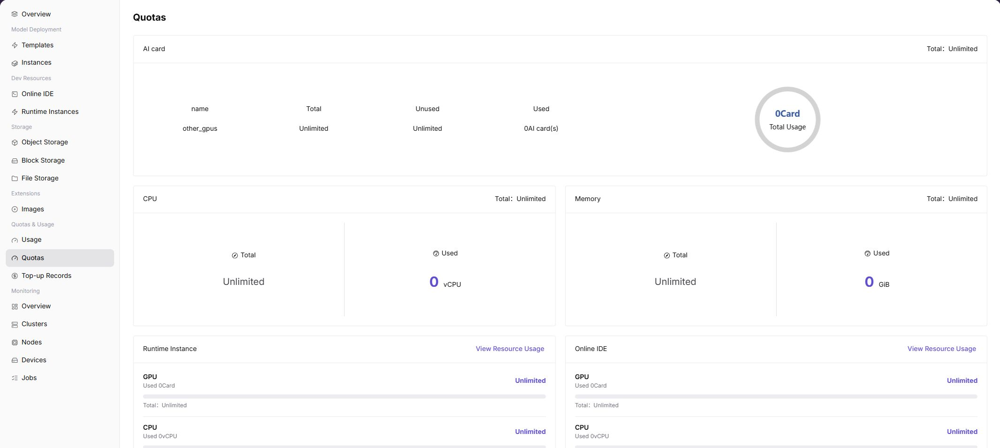

# Resource Quotas

::: info Document Information
Version: v1.0
Updated: 2026-07-08
:::

## Feature Overview

`Resource Quotas` displays the total amount, used amount, and availability of the current tenant across AI cards, CPU, memory, and different instance types. Regular users should confirm whether quotas meet requirements before creating instances.

| Item | Content |
| --- | --- |
| Applicable Role | Regular user |
| Navigation Path | Quota & Usage > Resource Quotas |
| Page Route | `/powerone/quota-usage/quota` |
| Managed Objects | AI card, CPU, memory, online IDE, and runtime instance quotas |
| Typical Use | View current tenant resource limits and used amount to determine whether resources are available for instance creation |

### Beginner View

My quota is like a personal resource balance sheet. It shows how many instances can still be created and how much compute and storage can still be used.

### First-Time Flow

1. Go to `Quota & Usage > Resource Quotas`.
2. View total and used amounts for AI card, CPU, and Memory.
3. View resource occupation for Runtime Instance and Online IDE.
4. Click `View Resource Usage` to view occupation details.
5. If quota is insufficient, release idle instances or contact the operator for adjustment.

### Terms Quick Reference

| Term | Description |
| --- | --- |
| Quota | Resource upper limit available to a tenant. Common dimensions include GPU, CPU, memory, and specifications. |
| AI card | AI accelerator quota, which may include GPU, NPU, or other cards. |
| Used | Used resource amount. |
| Total | Total quota. |

## Prerequisites

1. The current account has permission to view quotas.
2. The operator has allocated resource quotas to the tenant.
3. If quota adjustment is needed, target specification and business requirements are clear.

## Page Description

The page displays Total, Unused, and Used by resource type, and separately displays resource occupation for runtime instances and online IDEs. In the screenshot, GPU, CPU, and Memory are Unlimited or 0 Used.

### Page Areas

| Field/Area | Description |
| --- | --- |
| AI card | Displays total, unused, and used amount of AI accelerators. |
| CPU | Displays total CPU quota and used vCPU. |
| Memory | Displays total memory quota and used GiB. |
| Runtime Instance | Displays runtime instance occupation. |
| Online IDE | Displays online IDE occupation. |
| View Resource Usage | Views resource occupation details for the corresponding type. |

## Main Operations

### View Resource Occupation

#### Applicable Scenario

When creation fails with insufficient quota, or when you need to confirm which instances occupy resources, view resource occupation details.

#### Pre-Operation Check

1. The target resource type, such as GPU, CPU, or Memory, has been confirmed.
2. Whether to view runtime instance or online IDE occupation has been confirmed.

#### Procedure

1. Go to `Quota & Usage > Resource Quotas`.
2. Find the `Runtime Instance` or `Online IDE` area.
3. Click `View Resource Usage`.
4. View resource occupation items in the dialog.
5. After locating the occupying instance, go to the corresponding instance list for handling.

The following figure shows the resource occupation details dialog, used to view instance-level resource usage.

#### Parameters

| Field Name | Required | Field Type | Example | Description |
| --- | --- | --- | --- | --- |
| Resource Type | Yes | Enum | `GPU` | View credits for CPU, GPU/NPU, memory, storage, instance count, and other resources. |
| Total Quota | System-generated | Number / capacity | `4 cards` | Resource upper limit available to the current account or tenant. |
| Used Quota | System-generated | Number / capacity | `2 cards` | Quota already occupied by running resources. |
| Remaining Quota | System-generated | Number / capacity | `2 cards` | Quota still available for resource creation. |
| Region | Conditionally required | Drop-down | `Central China Zone 1` | Limits the region or resource pool to which the quota belongs. |
| Update Time | System-generated | Date time | `2026-07-06 10:00` | Determines whether quota data has refreshed in time. |

#### Pitfalls

- When quota is sufficient but creation fails, actual cluster resources may be insufficient.
- If occupation details are empty but Used is not 0, statistical delay may exist.

#### Result Validation

1. The resource occupation dialog can open.
2. Occupation items match the instance type.
3. Instances that need to be released or retained can be located.

## Configuration Rules and Impact

- Quotas control tenant upper limits and are not equivalent to real-time idle resources in the underlying cluster.
- Online IDE and runtime instance occupation may be counted separately.
- Quota reclamation may have a short delay after instances are released.

## FAQ

### Can Creation Still Fail When Quota Shows Unlimited

**Symptom:** Quota shows Unlimited, but instance creation fails.

**Possible Causes:**

- The underlying cluster has no idle resources.
- The specification cannot be scheduled.
- Image or storage configuration failed.

**Solution:**

1. View the instance creation error.
2. Switch specification or region.
3. Contact the operator to confirm cluster capacity.

### Quota Does Not Recover Immediately After Instance Release

**Symptom:** After an instance is stopped or deleted, Used still shows occupied.

**Possible Causes:**

- Statistical delay.
- The instance is still releasing.
- Other instances still occupy the same type of resource.

**Solution:**

1. Wait for the page to refresh.
2. View resource occupation details.
3. Confirm that the instance lifecycle has ended.

## Follow-Up Operations

1. When remaining quota is insufficient, release unused instances, jobs, or storage resources.
2. After confirming that business expansion is required, contact the operator to request credit adjustment.
3. When instance creation fails, verify credits, specification availability, and cluster capacity together.
4. Periodically view credit changes to avoid long-running resources occupying all quotas.

## Notes

- Sufficient remaining quota does not guarantee successful creation. Region, specification, image, storage, and cluster capability must also be satisfied.
- Do not expose tenant names, business project names, or internal resource IDs in screenshots.
- Quota refresh may be delayed. After releasing resources, wait until page update time changes.
