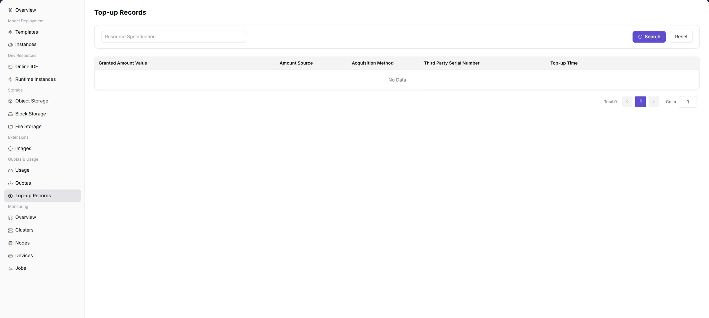

# Top-Up Records

::: info Document Information
Version: v1.0
Updated: 2026-07-08
:::

## Feature Overview

`Top-Up Records` is used to view the current tenant's credit top-up history, including granted amount, value amount, source, acquisition method, third-party serial number, and top-up time.

| Item | Content |
| --- | --- |
| Applicable Role | Regular user |
| Navigation Path | Quota & Usage > Top-Up Records |
| Page Route | `/powerone/quota-usage/top-up-history` |
| Managed Objects | Credit top-up records, source, acquisition method, third-party serial number, and top-up time |
| Typical Use | View top-up history for tenant credits or balance, and reconcile credit source and arrival |

### Beginner View

Top-up records are like the transaction history of a credit wallet, used to view the time, quantity, and status of each top-up, deduction, or adjustment.

### First-Time Flow

1. Go to `Quota & Usage > Top-Up Records`.
2. Search for target records by conditions.
3. View granted amount, source, and time.
4. If there is no data, confirm whether the current tenant has had top-ups or grants.
5. During reconciliation, use external payment or approval records together.

### Terms Quick Reference

| Term | Description |
| --- | --- |
| Granted Amount | Amount of credits granted to the account by the platform. |
| Value Amount | Value amount corresponding to the credits. |
| Source | Credit source, such as manual grant, campaign, or external system. |
| Third-Party Serial Number | Serial identifier in an external payment or business system. |

## Prerequisites

1. The current account has permission to view top-up records.
2. The current tenant has had credit top-ups or grants.
3. For reconciliation, external payment or approval records have been prepared.

## Page Description

The page provides search, reset, and top-up record tables. In the screenshot, the list is empty, indicating no top-up records under the current conditions.

### Page Areas

| Field/Area | Description |
| --- | --- |
| Search Area | Filters top-up records by conditions. |
| Granted Amount | Granted credit quantity. |
| Value Amount | Credit value amount. |
| Source | Credit source. |
| Acquisition Method | Acquisition method. |
| Third Party Serial Number | External serial number. |
| Top-up Time | Arrival time. |

## Query Top-Up Records

### Applicable Scenario

When you need to confirm whether credits have arrived, reconcile accounts, or trace credit source, query top-up records.

### Pre-Operation Check

1. The time range or serial information to query is clear.
2. The current account is viewing the target tenant.

### Procedure

1. Go to `Quota & Usage > Top-Up Records`.
2. Enter query conditions.
3. Click `Search`.
4. View records in the table.
5. To restore the default list, click `Reset`.

### Parameters

| Field Name | Required | Field Type | Example | Description |
| --- | --- | --- | --- | --- |
| Record ID | System-generated | Text | `topup-20260706-001` | Locates a single top-up or adjustment record. |
| Change Type | System-generated | Enum | `Top-up` | Shows top-up, deduction, refund, or manual adjustment type. |
| Change Quantity | System-generated | Number | `2000 Credits` | Quantity of credits changed this time. |
| Operation Time | System-generated | Date time | `2026-07-06 10:00` | Time when the credit change occurred. |
| Effective Status | System-generated | Status | `Effective` | Whether the record has affected available credits. |
| Remarks | No | Text | `Project expansion` | Describes the business background or source of this change. |

### Pitfalls

- When there is no data, click `Reset` first to exclude filter impact.
- Top-up records are used for reconciliation and do not mean resource quotas have been adjusted.

### Result Validation

1. Amount, source, and time in the record match expectations.
2. Third-party serial number can match the external system.

## Configuration Rules and Impact

- Top-up records only reflect credit changes and do not reflect resource quotas such as GPU or CPU.
- Credit arrival and resource quota adjustment are different concepts.
- During reconciliation, retain external serial numbers and times.

## FAQ

### Top-Up Records Are Empty

**Symptom:** The page shows No Data.

**Possible Causes:**

- The current tenant has no top-up records.
- Filters are too narrow.
- The account has no permission to view historical records.

**Solution:**

1. Click `Reset`.
2. Confirm the current tenant.
3. Contact the operator to verify credit grant records.

### Resources Still Cannot Be Created After Top-Up Arrives

**Symptom:** There are top-up records, but instance creation still fails.

**Possible Causes:**

- Credits and resource quotas are not the same item.
- Underlying cluster resources are insufficient.
- Target specification is not opened.

**Solution:**

1. View `Resource Quotas`.
2. Confirm the instance creation error.
3. Contact the operator to adjust resource quotas or specifications.

## Follow-Up Operations

1. If credits do not change after top-up, verify record status and effective time.
2. When abnormal deductions are found, troubleshoot together with usage records and operator metering details.
3. For reconciliation, export or record top-up transactions by time range.
4. When contacting the operator, provide record ID, time, change quantity, and a screenshot of current credits.

## Notes

- Top-up records involve credits and settlement information. Do not display complete screenshots in public channels.
- After a record takes effect, the balance may still change due to metering deductions. View usage at the same time.
- During reconciliation, use record ID and time range. Do not leak internal accounts or business contract information.
