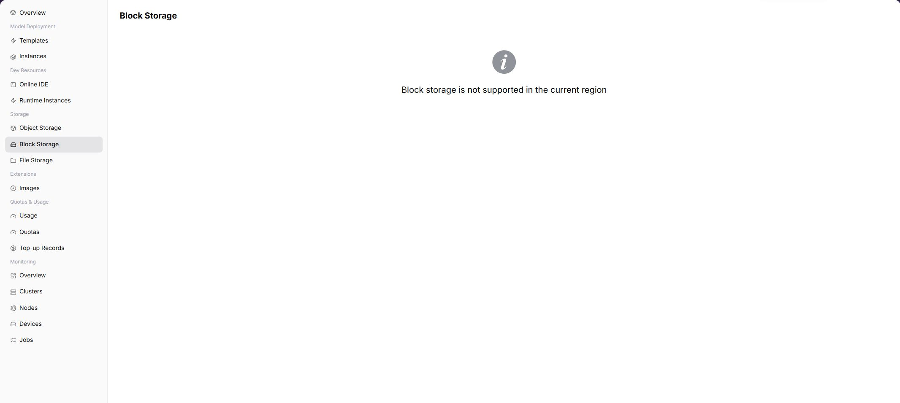

# Block Storage

:::: info Document Information
Version: v1.0
Updated: 2026-07-08
::::

## Feature Overview

`Block Storage` is used to view and use block storage volume capabilities opened by the operator in the target region. After the capability is opened, the page displays available volumes, capacity, status, and mount entrypoints. When the capability is not opened, users need to confirm region, permissions, quotas, and operator component access status.

| Item | Content |
| --- | --- |
| Applicable Role | Regular user |
| Navigation Path | Storage Services > Block Storage |
| Page Route | `/powerone/storage-service/block` |
| Managed Objects | Block storage volumes, capacity, mount relationships, and volume status |
| Typical Use | Provide independent persistent volumes for instances, suitable for tasks that require block devices or independent volumes |

### Beginner View

Block storage is like attaching an independent disk to an instance. It is suitable for tasks that require persistent writes, independent volumes, or block device semantics. It is not a shared directory. Before multiple instances read and write simultaneously, confirm whether the platform supports the corresponding mount mode.

### Terms Quick Reference

| Term | Description |
| --- | --- |
| Volume | Persistent block device that can be mounted by an instance. |
| Capacity | Usable storage size of a volume. |
| Mount | Connects a volume to an instance or in-container path. |
| Unmount | Removes the mount relationship between a volume and an instance. |

## Prerequisites

1. The operator has connected and opened block storage components in the target region.
2. The current account has permission to view and use block storage.
3. Tenant quota, capacity, and instance specifications meet usage requirements.
4. When mounting to an instance, the instance region, cluster, and storage capability are consistent.

## Page Description

The page is used to display block storage capability in the selected region. When the capability is opened, it usually displays list, capacity, status, creation entrypoint, mount entrypoint, and operation entrypoint. When the capability is not opened, the page shows a capability unavailable prompt.

## Create Volume

### Areas Displayed When the Feature Is Available

| Area | Description |
| --- | --- |
| List Area | Displays existing volumes, capacity, status, and update time. |
| Create Entrypoint | Adds a block storage volume. |
| Mount Entrypoint | Associates a volume with an instance or container path. |
| Operation Entrypoint | Edit, expand, unmount, delete, or view details depending on page capabilities. |

### Procedure

1. Go to `Storage Services > Block Storage`.
2. Confirm the region in the upper-right corner.
3. If the page provides a create entrypoint, fill in name, capacity, access policy, and description.
4. After submission, return to the list and view status.
5. Select this volume in instance creation or instance details and set the in-container path.

### Parameters

| Field Name | Required | Field Type | Example | Description |
| --- | --- | --- | --- | --- |
| Volume Name | Yes | Text | `train-data-volume` | Block storage volume display name. |
| Capacity | Yes | Number | `100GiB` | Usable space of the volume. |
| Access Mode | Conditionally required | Enum | `ReadWriteOnce` | Controls whether the volume allows single-instance or multi-instance mounting. |
| Mount Path | Conditionally required | Text | `/mnt/data` | Access path inside the instance or container. |
| Volume Status | System-generated | Enum | `Available` | Used to determine whether it can be mounted, expanded, or deleted. |

## Mount, Unmount, and Confirm Capacity

### Mount

1. Open the instance creation page or storage mount entrypoint.
2. Select the target block storage resource.
3. Fill in the in-container path, such as `/mnt/data` or `/mnt/output`.
4. After submission, view instance events and logs to confirm successful mounting.

### Unmount

1. Confirm that no running process is reading or writing this path.
2. Perform unmount through the instance or storage operation entrypoint.
3. Refresh the page to confirm that the mount relationship has been removed.

### Confirm Capacity

1. View capacity and status in the block storage list.
2. Run `df -h` inside the instance or perform application-side capacity checks.
3. If capacity is insufficient, expand according to page capabilities or contact the operator to adjust quota.

## Alternative Paths

- To save model files, datasets, or artifact packages, consider [Object Storage](../object-storage/) first.
- When shared directory semantics are required, use file storage or cluster shared storage configured by the operator.
- When independent volume capability is required, use block storage. If the page is not opened, contact the operator to confirm whether the target region has underlying storage components.

## Prepare Before Contacting the Operator

When page capability is not opened, data is empty, or mounting fails, prepare the following information before contacting the operator:

| Information | Example | Purpose |
| --- | --- | --- |
| Current Region | `Wuhan` | Determines whether the capability is opened in this region. |
| Current Account / Tenant | `tenant-a` | Determines menu, resource, and monitoring permissions. |
| Target Instance or Job | `train-job-001` | Helps locate logs, events, and metering records. |
| Target Specification or Resource | `gpu-a100-1-16c-64g` | Determines quota, specification, and cluster capability. |
| Page Symptom | `No data / Mount failed / Chart empty` | Helps the operator determine entrypoint, collection, or underlying resource issues. |

Alternative troubleshooting paths:

1. View instance details, logs, and events first.
2. View resource usage and resource quotas to confirm whether quota or credit limits exist.
3. When storage capability is unavailable, prioritize object storage for models, datasets, and output artifacts.
4. When monitoring capability is not opened, use instance status, logs, events, and usage as short-term troubleshooting basis.

### Pitfalls

- Block storage is usually not suitable for multiple instances reading and writing the same path simultaneously. Confirm the access mode before use.
- Mount paths must not overwrite system directories, startup directories, or key directories inside the image.
- Before deleting a volume, confirm that no running instances, training tasks, or output artifacts depend on it.

## FAQ

### Page Has No Block Storage Data

**Symptom:**

No available block storage resources are visible after entering the page, or the page indicates that the capability is not opened to the selected region.

**Possible Causes:**

- The operator has not connected block storage components in the target region.
- The current account has no view or use permission.
- Tenant quota or capacity is insufficient.
- The filtered region is inconsistent with the instance region.

**Solution:**

1. Confirm the region in the upper-right corner.
2. Contact the operator to confirm block storage component, region binding, and tenant permissions.
3. Check resource quotas and capacity.
4. In the short term, object storage or temporary directories inside instances can be used, but temporary directories are not suitable for saving important results.

### Path Is Unavailable After Mounting

**Symptom:**

After the instance starts, the block storage mount path cannot be accessed inside the container.

**Possible Causes:**

- Mount path is incorrect or conflicts with the application directory.
- The cluster where the instance runs cannot access underlying storage.
- Permissions, access policy, or capacity configuration is incorrect.

**Solution:**

1. View instance events and logs.
2. Confirm in-container path, access policy, and instance region.
3. Contact the operator to check underlying storage components and cluster mount capability.

### Delete or Unmount Fails

**Symptom:**

Attempts to delete or unmount a block storage resource fail.

**Possible Causes:**

- Running instances are still using this resource.
- The resource is abnormal, expanding, or recycling.
- Current account permissions are insufficient.

**Solution:**

1. Stop or migrate dependent instances first.
2. Refresh the page and confirm resource status.
3. Contact the operator to check permissions and underlying storage reclaim status.

## Follow-Up Operations

1. Verify the mount path in runtime instances or Online IDE.
2. Write input data and output results to persistent paths.
3. Periodically clean up unused data to avoid exhausting quotas.

## Notes

- Before deleting or unmounting, confirm that no running instances depend on it.
- Mount paths must not overwrite system directories, application directories, or key directories inside the image.
