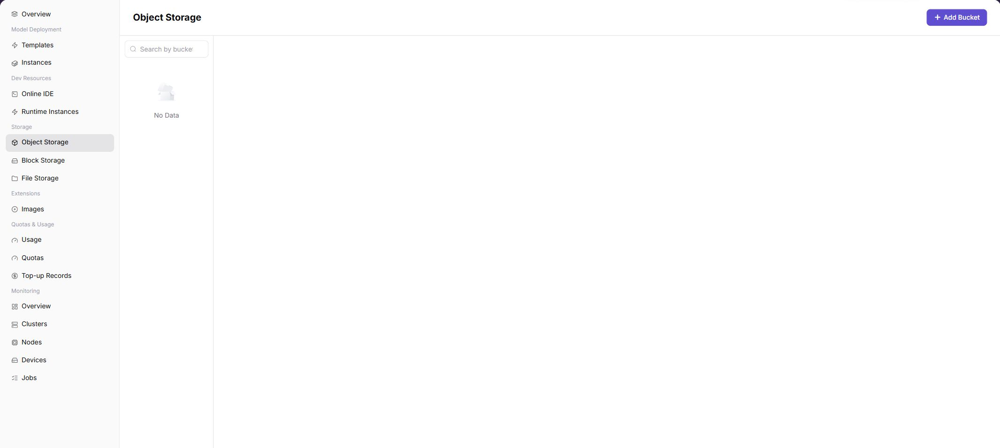

# Object Storage

## Feature Overview

`Object Storage` is used to manage buckets and objects of the current tenant in the On-Prem resource pool. Object storage is suitable for storing model weights, datasets, compressed packages, log archives, and runtime artifacts.

| Item | Content |
| --- | --- |
| Applicable Role | Regular user |
| Navigation Path | Storage Services > Object Storage |
| Page Route | `/powerone/storage-service/object` |
| Managed Objects | Object storage buckets, object files, object paths, and object storage capability within a region |
| Typical Use | Create buckets, upload, download, and delete objects, and provide data paths for IDEs, runtime instances, and model services |

### Beginner View

Object storage is like cloud drive for models and data. It stores files, datasets, model packages, and output results with buckets and objects. It is suitable for uploading, downloading, and sharing files by path, but it is not the same as a directly mountable POSIX shared directory.

### Terms Quick Reference

| Term | Description |
| --- | --- |
| Bucket | Top-level container in object storage. |
| Object | A single file or data item in a bucket. |
| Object Path | File path inside a bucket, used to locate data in jobs. |
| POSIX Shared Directory Semantics | Directory, permission, random read/write, and file lock semantics similar to a local file system. Object storage usually does not provide complete POSIX semantics. Evaluate file storage first when shared directories are needed. |
| Region | Large resource boundary where resources are located, affecting object storage visibility and job access scope. |

## Prerequisites

1. Object storage capability has been opened by the operator in the target region.
2. The current account has permissions to view, create buckets, and manage objects.
3. Bucket name, object path, and data retention policy have been planned.
4. If used by jobs, the job region should be able to access this object storage.

## Page Description

The left side provides bucket search and bucket list, and the upper-right corner provides the add bucket entrypoint. After entering a bucket, you can upload, download, or delete objects through object list entrypoints provided by the page.

## Add Bucket

### Procedure

1. Go to `Storage Services > Object Storage`.
2. Confirm the region in the upper-right corner.
3. Click `Add Bucket`.
4. Fill in Bucket Name.
5. Click `Confirm` to submit.

### Parameters

| Field Name | Required | Field Type | Example | Description |
| --- | --- | --- | --- | --- |
| Resource Name | Yes | Text | `storage-a` | Storage resource display name. |
| Region | Yes | Drop-down | `Wuhan` | Region where storage capability is located. |
| Capacity / Quota | Conditionally required | Number | `100GiB` | Storage capacity or credits. |
| Access Path | Conditionally required | Text | `/mnt/data` | Mount path used by jobs or instances. |
| Status | System-generated | Enum | `Available` | Current storage resource status. |

### Pitfalls

- Storage paths, bucket names, AK/SK, and NFS paths must be sanitized before screenshots.
- If mounting fails, confirm region, permissions, and storage component status first.
- Before deleting storage resources, confirm that no instances, tasks, or output artifacts depend on them.

### Result Validation

1. The new bucket appears in the bucket list.
2. Searching by bucket name can locate the bucket.
3. After entering bucket details, the object list or upload entrypoint is visible.

## Upload Object

### Procedure

1. Open the target bucket in the bucket list.
2. Click the upload entrypoint provided by the page.
3. Select a local file or directory and confirm the object path.
4. Submit the upload and wait for completion.
5. Refresh the object list and confirm file size, update time, and path.

### Naming Recommendations

| Type | Example Path | Description |
| --- | --- | --- |
| Model file | `models/qwen/version-1/model.safetensors` | Organize by model and version. |
| Dataset | `datasets/train/train.jsonl` | Organize by use and batch. |
| Output result | `outputs/job-20260703/result.json` | Organize by task or date. |

## Download Object

### Procedure

1. Open the target bucket.
2. Find the target file in the object list.
3. Click the download entrypoint.
4. After download, verify file size, format, and content.

## Delete Object or Bucket

### Delete Object

1. Open the target bucket.
2. Select or locate the target object.
3. Click the delete entrypoint.
4. Read the confirmation prompt and submit.
5. Refresh the list to confirm that the object has been removed.

### Delete Bucket

Before deleting a bucket, confirm that objects in the bucket have been backed up or are no longer used. If the platform requires an empty bucket before deletion, clean up objects first, then delete the bucket.

## Configuration Rules and Impact

- Buckets are regional storage resources. Cross-region access capability depends on operator configuration.
- Object storage is suitable for unstructured files and not suitable for scenarios requiring POSIX shared directory semantics.
- Before deleting buckets or objects, confirm that no instances, models, scripts, or jobs depend on them.
- Object paths can be used in startup commands or parameters, but do not write access keys into commands.

## FAQ

### Object Storage List Is Empty

**Symptom:**

The page shows no bucket or object data.

**Possible Causes:**

- The current tenant has not created buckets.
- Object storage capability in the target region has not been opened to the current tenant.
- The account has no view permission.
- Filters limit the results.

**Solution:**

1. Confirm the region in the upper-right corner.
2. Click the add bucket entrypoint to create a bucket.
3. Contact the operator to confirm object storage component and account permissions.
4. Clear filters and refresh.

### Object Upload Fails

**Symptom:**

After selecting a file and submitting, upload fails or the object does not appear in the list.

**Possible Causes:**

- The file is too large or its format does not meet platform limits.
- Bucket permissions are insufficient.
- The object storage component is unavailable or the network is abnormal.
- The object path contains special characters that are not recommended.

**Solution:**

1. Check the page error message and file size.
2. Retry with a standard object path.
3. Confirm bucket permissions and region selection.
4. Contact the operator to check object storage component status.

### Job Cannot Read Object

**Symptom:**

After a runtime instance or model service starts, logs indicate that the object path cannot be found.

**Possible Causes:**

- Bucket name or object path in the startup command is incorrect.
- The region where the job runs cannot access this bucket.
- Object permissions or mount configuration does not match.

**Solution:**

1. Copy the complete path from the object list and reconfigure it.
2. Confirm that the job and object storage are within an accessible region scope.
3. View instance logs and contact the operator to verify permissions.

## Follow-Up Operations

1. Reference object paths in runtime instances, online IDEs, or model services.
2. Periodically clean up unused objects to control storage usage.
3. Establish backup or version archive rules for important models and datasets.

## Notes

- Do not write keys, accounts, tokens, or customer-sensitive information in object paths or file names.
- Before deleting important data, confirm backups and dependencies.
