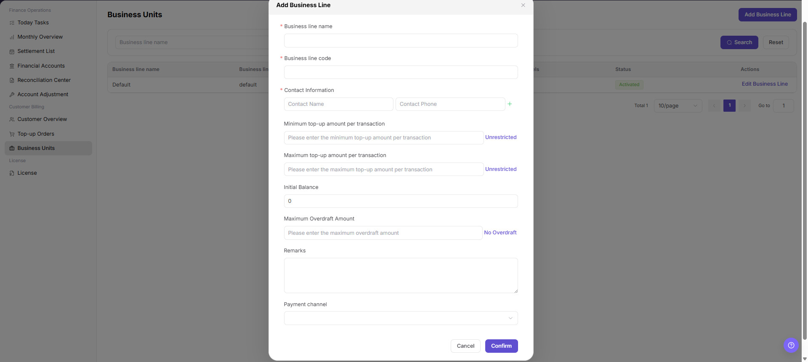

# Business Units

::: info Document Information
Version: v1.0
Updated: 2026-07-10
:::

## Feature Overview

`Business Units` is used to configure business units, payment channels, single top-up amount ranges, initial balance, overdraft limit, and enabled or disabled status. These settings affect the customer top-up flow, available payment channels, and balance rules.

| Item | Content |
| --- | --- |
| Applicable role | Platform operator, billing operator |
| Navigation path | Billing > Customer Billing > Business Units |
| Page route | `/billing/customers/business-units` |
| Managed objects | Business units, payment channels, top-up amount limits, initial balance, overdraft limit, and status |
| Typical use | Add or edit business units, control top-up channels and amount limits, and manage overdraft rules |

#### Beginner Explanation

Business Units works like the checkout configuration for customer top-up. Each business unit controls which payment channels are available, how much a customer can top up in one order, and whether overdraft is allowed.

#### Terms Quick Reference

| Term | Meaning | Handling tip |
| --- | --- | --- |
| Business Unit | Configuration object that controls customer top-up channels, amount limits, and overdraft rules. | Confirm the affected customer scope before changes. |
| Business Unit Code | Unique code used by the system to identify the business unit. | Keep it stable after creation. |
| Payment Channel | Payment method available to customers under the business unit. | Confirm the channel is connected and enabled. |
| Overdraft Limit | Maximum amount a customer can consume beyond balance. | Review the risk scope before enabling. |
| Status | Whether the business unit is available for customer top-up. | Evaluate online top-up impact before disabling. |

## Prerequisites

1. The current account can access `Customer Billing > Business Units`.
2. Payment channels required by the business unit have been configured or confirmed.
3. The target customer scope, top-up amount policy, initial balance, and overdraft policy have been confirmed.
4. For screenshots, tickets, or comments, prepare a desensitization method first.

## Page Description

The page includes filters, the business unit table, and an entry for adding a business unit.

| Area | Description |
| --- | --- |
| Business Unit Name | Filter or display name of the business unit. |
| Status | Filter or display enabled and disabled status. |
| Business unit table | Shows business unit name, code, description, payment channels, status, and row-level actions. |
| Add Business Unit | Opens the dialog for creating a business unit. |
| Edit Business Unit | Opens the existing business unit configuration for review or update. |

The following screenshot shows business units list.

## Main Operations

Use the following operations to add or edit business units. Complete view-only checks before the final `Confirm` action.

### Add a Business Unit

1. Go to `Billing > Customer Billing > Business Units`.
2. Click `Add Business Unit` at the top of the page.
3. In the dialog, fill in `Business Unit Name`, `Business Unit Code`, contact name, contact phone number, and business unit description.
4. Configure payment channels, single top-up amount range, initial balance, overdraft limit, and whether overdraft is disabled.
5. Confirm that the business unit code is stable, payment channels are available, and top-up amount limits match operation policy.
6. Before clicking the final `Confirm`, verify business unit name, code, payment channels, initial balance, and overdraft limit again.
7. For learning or screenshots only, view fields and the dialog without submitting real business unit configuration.

### Edit a Business Unit

1. Go to `Billing > Customer Billing > Business Units`.
2. Locate the target business unit in the list.
3. Click `Edit Business Unit` for the target row.
4. Review or adjust business unit name, description, payment channels, amount limits, initial balance, overdraft limit, and status according to the page fields.
5. Before clicking the final `Confirm`, verify the affected customer scope and top-up policy impact again.
6. For learning or screenshots only, view fields and the dialog without submitting real configuration changes.

## Parameter Reference

| Field Name | Required | Field Type | Example | Description |
| --- | --- | --- | --- | --- |
| Business Unit Name | Required | Text | `Example business unit` | Display name of the business unit. |
| Business Unit Code | Required | Text | `demo-cn` | Unique code of the business unit. Keep it stable after creation. |
| Contact Name | No | Text | `Example owner` | Contact person for the business unit. Desensitize it in screenshots or tickets. |
| Contact Phone Number | No | Text | `138****0000` | Contact phone number. Desensitize it in screenshots or tickets. |
| Business Unit Description | No | Text | `Example top-up scope` | Business purpose and scope description. Do not write internal sensitive parameters. |
| Payment Channel | Required | Multi-select | `Stripe` | Payment channel available under the business unit. |
| Single Top-up Amount Range | Required | Amount range | `100 - 50,000` | Minimum and maximum amount allowed for one top-up order. |
| Initial Balance | No | Credits | `1,000 Credits` | Initial balance configured for customers under the business unit. |
| Overdraft Limit | No | Credits | `5,000 Credits` | Maximum overdraft amount allowed for customers. |
| Disable Overdraft | No | Switch / option | `Disable Overdraft` | Sets overdraft limit to zero and prevents overdraft consumption. |
| Status | System generated | Enum | `Enabled` | Whether the business unit is available for customer top-up. |
| Add Business Unit | No | Button | `Add Business Unit` | Opens the add business unit dialog. |
| Confirm | Required | Final action button | `Confirm` | Submits the business unit configuration. This is a high-risk final action. |
| Cancel | No | Button | `Cancel` | Closes the dialog without submitting changes. |

## Pitfalls

- Do not rely on one amount field alone for financial confirmation; cross-check transactions, bills, settlement statements, and reconciliation results.
- Do not repeat high-risk billing operations when the first attempt fails; check status and error details first.
- Remove sensitive customer, bank, contract, token, Key, or internal processing information before sharing screenshots or tickets.
- Adding a business unit affects customer top-up entry, available payment channels, single top-up amount range, initial balance, and overdraft rules.
- Business unit code should remain stable. An incorrect code may cause later top-up, customer ownership, or billing statistics issues.
- Incorrect payment channel, overdraft limit, or initial balance may affect real customer top-up and balance calculation.
- `Confirm` is a high-risk final action. For learning or screenshots only, view fields and the dialog without submitting real configuration.

## Result Validation

| Check Item | Success Signal | If Abnormal |
| --- | --- | --- |
| Page access | The `Customer Billing > Business Units` page opens and data loads normally. | Check role permissions and refresh the page. |
| Filter result | The list changes according to the selected filters. | Reset filters and search again. |
| Record detail | Details, status, amount, permission, or configuration values are visible. | Confirm the record scope and permissions. |
| Follow-up path | Related pages or dialogs can be opened from visible entries. | Return to the sidebar and enter the downstream page directly. |

## FAQ

#### Target billing data is not visible in Business Units

The expected account, customer, order, bill, settlement, adjustment, or License record does not appear on this page.

**How to check:**

1. Confirm the current tenant, organization, customer, account, and role scope.
2. Check page filters such as billing cycle, time range, customer, account type, status, and keyword.
3. Verify that upstream actions, such as top-up, reconciliation, settlement, adjustment, or License activation, have completed successfully.
4. If the record was just created or updated, refresh the list and compare it with related transaction, bill, settlement, or operation records.

#### Amount, status, or billing cycle does not match in Business Units

The displayed balance, consumption, settlement status, monthly bill, or License status differs from the expected result.

**How to check:**

1. Confirm business unit, customer, credit ownership, account status, and transaction scope before comparing figures.
2. Check whether pending top-up orders, adjustments, refunds, settlement reviews, or metering synchronization are still in progress.
3. Compare the summary number with the detail list and operation records on the related billing pages.
4. For financial-impacting differences, pause confirmation actions and escalate with desensitized record IDs, time range, customer scope, and screenshots without credentials.

#### Save fails

Check the selected billing cycle, customer or project scope, status filters, and related asynchronous task records. Compare the result with transaction details, settlement records, and operation logs before repeating any high-risk billing action.

## Next Steps

1. Review related billing records, transactions, settlement statements, and account balance changes.
2. Keep only desensitized page paths, timestamps, status values, and screenshots when escalating.
3. Continue with the related reconciliation, settlement, top-up, or adjustment flow after the result is confirmed.

## Notes

- Billing amounts, settlements, balances, and customer information are sensitive. Desensitize them before sharing.
- Keep page routes, API fields, Key, AK/SK, License, and other product terms in their UI form.
- Keep credentials, private operational details, and sensitive customer data out of the manual.
- Do not record real contact names, phone numbers, internal business codes, customer information, payment channel secrets, accounts, Token, or Key.
- For learning or screenshots only, view fields and the dialog without submitting real configuration.
