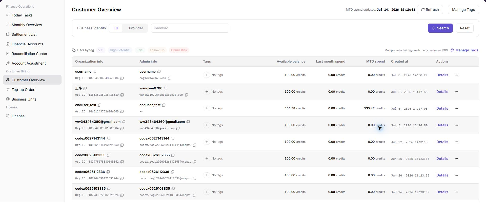
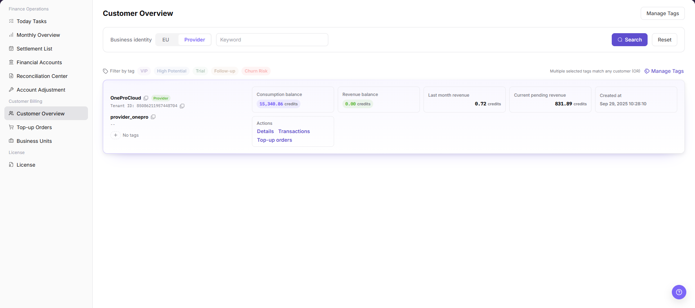

# Customer Overview

::: info Document Information
Version: v1.0
Updated: 2026-07-10
:::

## Feature Overview

`Customer Overview` is used to view EU and Provider customer records, tags, account balances, consumption, and revenue-related information. Operators can use this page to locate customers, verify customer identity, and continue with downstream billing checks.

| Item | Content |
| --- | --- |
| Applicable role | Platform operator, billing operator |
| Navigation path | Billing > Customer Billing > Customer Overview |
| Page route | `/billing/customers/overview` |
| Managed objects | Customer records, customer tags, account balances, consumption, and revenue information |
| Typical use | Search EU or Provider customers, maintain tags, and verify balances or consumption |

#### Beginner Explanation

Customer Overview works like an operator-side CRM list for billing. It brings customer organizations, administrators, tags, balances, consumption, and Provider-related revenue information into one place.

#### Terms Quick Reference

| Term | Meaning | Handling tip |
| --- | --- | --- |
| Customer Account | An account object that records customer organization, administrator, and balance information. | Confirm customer identity before troubleshooting. |
| Business Identity | The customer business category used for billing and customer overview filtering. | Keep the selected identity consistent when comparing records. |
| EU | End User customer identity. | Use it to review consumption and balance information. |
| Provider | Provider customer identity. | Use it to review Provider-related revenue or consumption information. |
| Tags | Labels used to classify customers. | Confirm the impact scope before adding or changing tags. |

## Prerequisites

1. The current account can access `Customer Billing > Customer Overview`.
2. At least one customer organization has been created before the list can show data.
3. The browser is logged in with an operator account and the session has not expired.
4. For screenshots, export, tickets, or comments, prepare a desensitization method first.

## Page Description

The page shows customer overview filters, tag management entry, and customer lists for different business identities.

| Area | Description |
| --- | --- |
| Business Identity | Select `EU` or `Provider` to switch the customer list scope. |
| Keyword | Search by customer name, customer ID, administrator email, or related customer identifier. |
| Tags | Filter customers by platform built-in tags or custom tags. |
| Customer list | Shows customer name, administrator, business identity, tags, account balance, consumption, revenue-related information, and last update time. |
| Manage Tags | Opens the tag management dialog when the current account has permission. |

EU and Provider screenshots are placed under the corresponding operation steps. Screenshot data is masked to avoid exposing customer information.

## Main Operations

Use the following operations to view EU and Provider customer overview records and manage tags. Complete view-only checks before any export, tag change, save, or submit action.

### View Customer Overview - EU

1. Go to `Billing > Customer Billing > Customer Overview`.
2. Select `EU` in `Business Identity`.
3. Enter customer name, customer ID, administrator email, tags, or other filters as needed.
4. Click `Search` and review the EU customer list.
5. Verify customer name, administrator, business identity, tags, account balance, consumption, and last update time.
6. For learning or screenshots only, view filters and list fields without exporting real customer data or recording sensitive customer information.

### View Customer Overview - Provider

1. Go to `Billing > Customer Billing > Customer Overview`.
2. Select `Provider` in `Business Identity`.
3. Enter customer name, customer ID, administrator email, tags, or other filters as needed.
4. Click `Search` and review the Provider customer list.
5. Verify customer name, administrator, business identity, tags, account balance, revenue or consumption-related information, and last update time.
6. For learning or screenshots only, view filters and list fields without exporting real customer data or recording sensitive customer information.

### Manage Tags

1. Go to `Billing > Customer Billing > Customer Overview`.
2. Click `Manage Tags` to open the tag management dialog.
3. Review platform built-in tags. These tags are locked by the platform and cannot be edited.
4. In the custom tag area, enter a new tag name and click the visible create entry when it is available.
5. Close the dialog after confirming the tag list.
6. For learning or screenshots only, view tag names, counts, and permission prompts without recording real customer tagging policies or internal operation notes.

## Parameter Reference

| Field Name | Required | Field Type | Example | Description |
| --- | --- | --- | --- | --- |
| Business Identity | No | Enum | `EU` | Filters customers by business identity. |
| EU | System enum | Enum value | `EU` | End User customer view for consumption and balance information. |
| Provider | System enum | Enum value | `Provider` | Provider customer view for revenue or consumption-related information. |
| Customer Name | No | Text | `Example customer` | Locates a customer by customer name. |
| Customer ID | No | Text | `customer-xxxx` | Locates a customer by unique customer identifier. Use placeholders only in documentation. |
| Administrator Email | No | Text | `user@example.com` | Locates a customer by administrator email. Desensitize it in screenshots or tickets. |
| Tags | No | Multi-select | `VIP` | Filters customers by selected tags. |
| Account Balance | System generated | Credits | `10,000 Credits` | Current remaining customer account balance. |
| Consumption | System generated | Credits | `2,500 Credits` | Consumption amount for the selected customer scope. |
| Revenue Information | System generated | Credits | `1,000 Credits` | Provider revenue or settlement-related information. |
| Last Update Time | System generated | Time | `2026-07-10 12:00:00` | Latest update time of customer overview data. |
| Search | No | Button | `Search` | Refreshes the customer list by current filters. |
| Reset | No | Button | `Reset` | Clears filters and restores the default list. |
| Actions | System generated | Button / link | `Details` | Provides row-level entries for viewing or follow-up checks. |

## Pitfalls

- Do not rely on one amount field alone for financial confirmation; cross-check transactions, bills, settlement statements, and reconciliation results.
- Do not repeat high-risk billing operations when the first attempt fails; check status and error details first.
- Remove sensitive customer, bank, contract, token, Key, or internal processing information before sharing screenshots or tickets.
- Customer name, administrator email, customer ID, account balance, consumption amount, and revenue amount are sensitive. Desensitize screenshots, exports, tickets, and comments.
- For learning or screenshots only, view filters and list fields without exporting real customer data.

## Result Validation

| Check Item | Success Signal | If Abnormal |
| --- | --- | --- |
| Page access | The `Customer Billing > Customer Overview` page opens and data loads normally. | Check role permissions and refresh the page. |
| Filter result | The list changes according to the selected filters. | Reset filters and search again. |
| Record detail | Details, status, amount, permission, or configuration values are visible. | Confirm the record scope and permissions. |
| Follow-up path | Related pages or dialogs can be opened from visible entries. | Return to the sidebar and enter the downstream page directly. |

## FAQ

#### Target billing data is not visible in Customer Overview

The expected account, customer, order, bill, settlement, adjustment, or License record does not appear on this page.

**How to check:**

1. Confirm the current tenant, organization, customer, account, and role scope.
2. Check page filters such as billing cycle, time range, customer, account type, status, and keyword.
3. Verify that upstream actions, such as top-up, reconciliation, settlement, adjustment, or License activation, have completed successfully.
4. If the record was just created or updated, refresh the list and compare it with related transaction, bill, settlement, or operation records.

#### Amount, status, or billing cycle does not match in Customer Overview

The displayed balance, consumption, settlement status, monthly bill, or License status differs from the expected result.

**How to check:**

1. Confirm customer, business unit, account status, credit limit, and billing period before comparing balances.
2. Check whether pending top-up orders, adjustments, refunds, settlement reviews, or metering synchronization are still in progress.
3. Compare the summary number with the detail list and operation records on the related billing pages.
4. For financial-impacting differences, pause confirmation actions and escalate with desensitized record IDs, time range, customer scope, and screenshots without credentials.

#### Custom tag save fails

Check the selected billing cycle, customer or project scope, status filters, and related asynchronous task records. Compare the result with transaction details, settlement records, and operation logs before repeating any high-risk billing action.

## Next Steps

1. Review related billing records, transactions, settlement statements, and account balance changes.
2. Keep only desensitized page paths, timestamps, status values, and screenshots when escalating.
3. Continue with the related reconciliation, settlement, top-up, or adjustment flow after the result is confirmed.

## Notes

- Billing amounts, settlements, balances, and customer information are sensitive. Desensitize them before sharing.
- Keep page routes, API fields, Key, AK/SK, License, and other product terms in their UI form.
- Keep credentials, private operational details, and sensitive customer data out of the manual.
- Do not record real customer names, organization names, customer IDs, emails, phone numbers, account balances, consumption amounts, revenue amounts, order numbers, Token, or Key.
- For learning or screenshots only, view filters and list fields without exporting real customer data.
