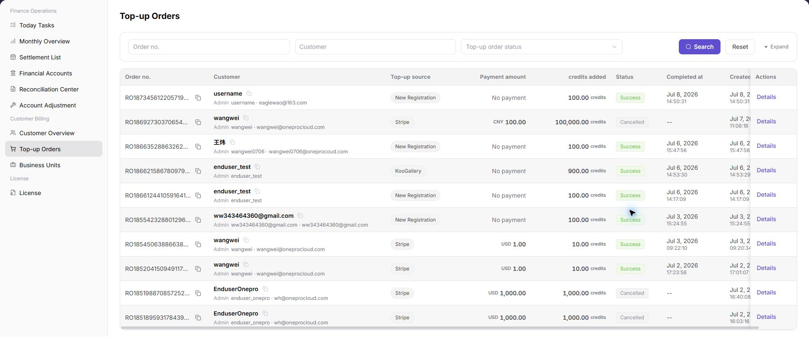

# Customer Top-up Orders

::: info Document Information
Version: v1.0
Updated: 2026-07-10
:::

## Feature Overview

`Customer Top-up Orders` is used to view the customer top-up order list, top-up amount, credited credits, payment channel, order status, created time, completed time, and details entry. Operators use this page to verify customer balance changes and troubleshoot top-up issues.

| Item | Content |
| --- | --- |
| Applicable role | Platform operator, billing operator |
| Navigation path | Billing > Customer Billing > Customer Top-up Orders |
| Page route | `/billing/customers/top-ups/orders` |
| Managed objects | Customer top-up orders, payment channel, credited credits, order status, and customer balance changes |
| Typical use | Search top-up orders, verify credited amount, track order status, and troubleshoot customer balance issues |

#### Beginner Explanation

Customer Top-up Orders works like a top-up ledger. After a customer completes a top-up, the order appears on this page so operators can verify the source, amount, credited credits, status, and details.

#### Terms Quick Reference

| Term | Meaning | Handling tip |
| --- | --- | --- |
| Top-up Order | An order record generated by a customer top-up. | Use the order number to locate issues. |
| Payment Channel | The third-party or platform payment channel used for top-up. | Check upstream payment status when abnormal. |
| Credited Credits | Credits actually credited to the customer account. | Verify it separately from payment amount and currency. |
| Top-up Order Status | The current processing result of a top-up order. | Do not adjust customer balance directly when status is abnormal. |
| Details | Row-level entry for a single top-up order. | Use it before comparing balances or payment transactions. |

## Prerequisites

1. The current account can access `Customer Billing > Customer Top-up Orders`.
2. At least one customer or top-up order exists before the list can show data.
3. The browser is logged in with an operator account and the session has not expired.
4. For screenshots, export, tickets, or comments, prepare a desensitization method first.

## Page Description

The page includes filters and a customer top-up order table.

| Area | Description |
| --- | --- |
| Top-up Order No. | Search by top-up order number. |
| Customer | Search by customer name or customer identifier. |
| Top-up Order Status | Filter by order status. |
| Customer top-up order list | Shows top-up order number, customer information, top-up amount, credited credits, payment channel, order status, created time, completed time, and row-level actions. |
| Details | Opens a single top-up order for verification. |

The list screenshot is placed under the main operation steps. Screenshot data is masked to avoid exposing customer or order information.

## Main Operations

Use the following operation to review customer top-up orders and verify balance changes. Complete view-only checks before any export, refund, correction, or manual adjustment.

### View Customer Top-up Orders

1. Go to `Customer Billing > Customer Top-up Orders`.
2. Enter filters such as `Top-up Order No.`, customer name, customer ID, order status, or time range as needed.
3. Click `Search` and review the customer top-up order list.
4. Verify top-up order number, customer information, top-up amount, credited credits, payment channel, order status, created time, and completed time.
5. To verify a single top-up order, click `Details` for the target order.
6. Compare with Customer Overview, Financial Accounts, or payment transactions to confirm that customer balance and top-up order status are consistent.
7. For learning or screenshots only, view filters and list fields without exporting real orders or recording customer, order, or payment-sensitive information.

## Parameter Reference

| Field | Required | Type | Example | Description |
| --- | --- | --- | --- | --- |
| Top-up Order No. | No | Text | `TOPUP-202607080001` | Precisely locates a customer top-up order. Use placeholders only in documentation. |
| Customer Name | No | Text | `Example customer` | Locates top-up orders by customer name. |
| Customer ID | No | Text | `customer-xxxx` | Locates top-up orders by customer identifier. Use placeholders only in documentation. |
| Top-up Order Status | No | Enum | `Succeeded` | Filters customer top-up orders by status. |
| Top-up Amount | System generated | Amount | `USD 100.00` | Top-up amount displayed in the original order currency. |
| Credited Credits | System generated | Credits | `1,000 Credits` | Credits actually credited to the customer account. |
| Payment Channel | System generated | Enum | `Stripe` | Payment channel or source of the top-up funds. |
| Created Time | System generated | Time | `2026-07-10 12:00:00` | Time when the top-up order was created. |
| Completed Time | System generated | Time | `2026-07-10 12:10:00` | Time when the top-up order was completed. |
| Details | No | Button / link | `Details` | Opens a single customer top-up order for verification. |
| Search | No | Button | `Search` | Refreshes the top-up order list by current filters. |
| Reset | No | Button | `Reset` | Clears filters and restores the default list. |

## Pitfalls

- Do not rely on one amount field alone for financial confirmation; cross-check transactions, bills, settlement statements, and reconciliation results.
- Do not repeat high-risk billing operations when the first attempt fails; check status and error details first.
- Remove sensitive customer, bank, contract, token, Key, or internal processing information before sharing screenshots or tickets.
- Top-up orders include customer identity, order number, amount, payment channel, and credited information. Desensitize screenshots and tickets.
- Do not mix top-up order numbers with payment transaction numbers. They are different objects.
- For learning or screenshots only, view filters, list fields, and details entries without exporting real order data.

## Result Validation

| Check item | Success signal | If abnormal |
| --- | --- | --- |
| Page access | The `Customer Billing > Customer Top-up Orders` page opens and data loads normally. | Check role permissions and refresh the page. |
| Filter result | The list changes according to the selected filters. | Reset filters and search again. |
| Record detail | Details, status, amount, permission, or configuration values are visible. | Confirm the record scope and permissions. |
| Follow-up path | Related pages or dialogs can be opened from visible entries. | Return to the sidebar and enter the downstream page directly. |

## FAQ

#### Target billing data is not visible in Customer Top-up Orders

The expected account, customer, order, bill, settlement, adjustment, or License record does not appear on this page.

**How to check:**

1. Confirm the current tenant, organization, customer, account, and role scope.
2. Check page filters such as billing cycle, time range, customer, account type, status, and keyword.
3. Verify that upstream actions, such as top-up, reconciliation, settlement, adjustment, or License activation, have completed successfully.
4. If the record was just created or updated, refresh the list and compare it with related transaction, bill, settlement, or operation records.

#### Amount, status, or billing cycle does not match in Customer Top-up Orders

The displayed balance, consumption, settlement status, monthly bill, or License status differs from the expected result.

**How to check:**

1. Confirm that the same billing cycle, customer, account, currency, and resource scope are being compared.
2. Check whether pending top-up orders, adjustments, refunds, settlement reviews, or metering synchronization are still in progress.
3. Compare the summary number with the detail list and operation records on the related billing pages.
4. For financial-impacting differences, pause confirmation actions and escalate with desensitized record IDs, time range, customer scope, and screenshots without credentials.

#### Customer balance is not updated

Check the selected billing cycle, customer or project scope, status filters, and related asynchronous task records. Compare the result with transaction details, settlement records, and operation logs before repeating any high-risk billing action.

## Next Steps

1. Review related billing records, transactions, settlement statements, and account balance changes.
2. Keep only desensitized page paths, timestamps, status values, and screenshots when escalating.
3. Continue with the related reconciliation, settlement, top-up, or adjustment flow after the result is confirmed.

## Notes

- Billing amounts, settlements, balances, and customer information are sensitive. Desensitize them before sharing.
- Keep page routes, API fields, Key, AK/SK, License, and other product terms in their UI form.
- Keep credentials, private operational details, and sensitive customer data out of the manual.
- Do not record real customer names, customer IDs, phone numbers, emails, top-up order numbers, payment transaction numbers, amounts, payment vouchers, accounts, Token, or Key.
- For learning or screenshots only, view filters, list fields, and details entries without exporting real order data.
