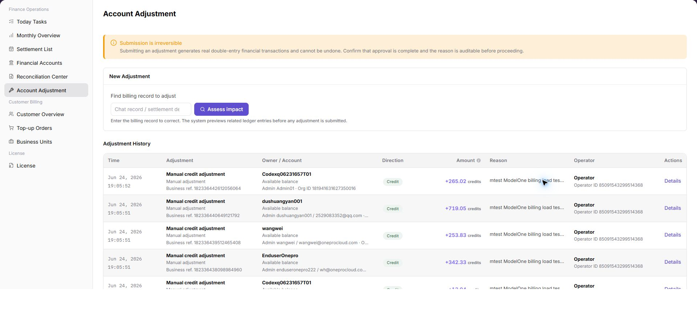

# Account Adjustment

::: info Document Information
Version: v1.0
Updated: 2026-07-10
:::

## Feature Overview

`Account Adjustment` is used to find billing records that require manual correction, evaluate adjustment impact, and review submitted adjustment records. The page warns that submitted adjustments may generate real fund flows and are usually irreversible, so approval, reason, and impact scope must be confirmed before submission.

| Item | Content |
| --- | --- |
| Applicable role | Platform operator, billing operator |
| Navigation path | Billing > Finance Operations > Account Adjustment |
| Page route | `/billing/admin/account-adjustments` |
| Managed objects | Billing records, adjustment impact assessment, and adjustment records |
| Typical use | Locate records to correct, evaluate adjustment impact, and review adjustment history |

#### Beginner Explanation

Account Adjustment is like a financial reversal or correction voucher. It is a fund correction action that should only be performed after approval. Normal queries can be repeated, but submitted adjustments may generate real fund flows and are usually irreversible.

#### Terms Quick Reference

| Term | Meaning | Handling tip |
| --- | --- | --- |
| Adjustment | Approved fund correction for abnormal billing records. | Confirm impact scope before submission. |
| Reversal | Reverse correction for an incorrect fund direction or amount. | Keep approval and reason for audit. |
| Approval Status | Workflow status that determines whether adjustment can continue. | Do not submit without approval. |
| Related Document | Settlement statement, transaction, or billing fact related to the adjustment. | Used for traceability. |
| Impact Billing Cycle | Billing cycle affected by the adjustment. | Avoid adjusting the wrong billing cycle. |

## Prerequisites

1. The current account can access `Finance Operations > Account Adjustment`.
2. Adjustment approval or business confirmation has been obtained.
3. The billing record, settlement detail, transaction number, or billing fact ID to correct is ready.
4. Adjustment reason, amount direction, and impact scope have been confirmed.

## Page Description

The page includes a risk notice, `New Adjustment` area, and `Adjustment Records` list.

| Area | Description |
| --- | --- |
| Risk notice | Reminds operators that submitted adjustments are usually irreversible and require approval and reason confirmation. |
| New Adjustment | Enter billing record clues and evaluate adjustment impact. |
| Billing Record to Adjust | Supports billing record, settlement detail, transaction number, or billing fact ID. |
| Evaluate Impact | Previews related accounting entries and impact scope before adjustment. |
| Adjustment Records | Shows time, adjustment type, subject / account, direction, amount, reason, operator, and details entry. |

The following screenshot shows the risk notice, new adjustment area, and adjustment records list.

## Main Operations

Use the following operations to view the account adjustment page, evaluate adjustment impact, and review adjustment records. For learning or screenshots, only view page structure, fields, and records. Do not click real submit, confirm, or adjustment actions.

### View Account Adjustment

1. Go to `Finance Operations > Account Adjustment`.
2. Review the risk notice at the top of the page and confirm that submitted adjustments may generate real fund flows and are usually irreversible.
3. Review the `New Adjustment` area and confirm that target records can be located by billing record, settlement detail, transaction number, or billing fact ID.
4. Review the `Adjustment Records` list, including time, adjustment type, subject / account, direction, amount, reason, operator, and details entry.
5. For learning or screenshots only, view page structure, fields, and records without clicking submit, confirm, or real adjustment actions.

### Evaluate Adjustment Impact

1. Go to `Finance Operations > Account Adjustment`.
2. In the `New Adjustment` area, enter the billing record clue that requires adjustment.
3. Before clicking `Evaluate Impact`, confirm record source, billing cycle, organization, amount direction, and approval basis.
4. Review affected account, direction, amount, related document, and reason in the evaluation result.
5. If the result does not match expectations, stop submission and continue verification in Financial Accounts, Settlement List, or Reconciliation Center.
6. For learning or screenshots only, view the evaluation entry and fields without submitting a real adjustment.

### View Adjustment Records

1. Go to `Finance Operations > Account Adjustment`.
2. Review existing records in the `Adjustment Records` list.
3. Locate the target record by time, subject / account, direction, amount, reason, or operator.
4. Click `Details` to view more information for a single adjustment record.
5. Verify whether the record is consistent with approval basis, related document, and account transactions.
6. Hide real account, organization name, transaction number, amount, and approval information when sharing screenshots or external communication.

## Parameter Reference

| Field | Required | Type | Example | Description |
| --- | --- | --- | --- | --- |
| New Adjustment | No | Page area | New Adjustment | Used to enter billing record clues and start impact evaluation. |
| Billing Record to Adjust | Yes | Text | `FACT-202607080001` | Billing record, settlement detail, transaction number, or billing fact ID. |
| Evaluate Impact | No | Button | Evaluate Impact | Previews affected account, direction, amount, and related document. |
| Adjustment Records | System-generated | List | Adjustment Records | Shows adjustment history and details entry. |
| Time | System-generated | Time | `2026-07-08 10:00` | Time when the adjustment record was generated. |
| Adjustment Type | System-generated | Enum / Text | Reversal | Adjustment type or business transaction information. |
| Subject / Account | System-generated | Text | Example Organization A / Platform Clearing Account | Subject and account affected by the adjustment. |
| Direction | System-generated | Enum | Income | Income or expense direction. |
| Amount | System-generated | Amount | `1,000.00 credits` | Adjustment amount. |
| Reason | Yes | Text | Duplicate settlement transaction reversal | Adjustment reason or note. |
| Operator | System-generated | Text | operator | Operator who initiated or processed the adjustment. |
| Details | System-generated | Operation entry | Details | Shows more information for a single adjustment record. |
| Approval Basis | Yes | Text / Attachment | Desensitized approval note | Explains the adjustment basis for audit traceability. |
| Related Document | Yes | Text | Desensitized settlement statement number | Related settlement statement, transaction, or billing fact. |

## Pitfalls

- Do not rely on one amount field alone for financial confirmation; cross-check transactions, bills, settlement statements, and reconciliation results.
- Do not repeat high-risk billing operations when the first attempt fails; check status and error details first.
- Remove sensitive customer, bank, contract, token, Key, or internal processing information before sharing screenshots or tickets.
- Submitted adjustments may generate real fund flows and are usually irreversible.
- Before adjustment, confirm approval, billing cycle, organization, related document, amount direction, and affected account.
- Adjustment cannot replace normal settlement, compensation, or reconciliation flows.
- For learning or screenshots, only view the page, fields, and records. Do not execute real submission.
- Do not record real accounts, account IDs, customer names, organization names, billing-cycle amounts, transaction numbers, internal transaction numbers, approval information, tokens, or keys.

## Result Validation

| Check item | Success signal | If abnormal |
| --- | --- | --- |
| Page access | The `Finance Operations > Account Adjustment` page opens and data loads normally. | Check role permissions and refresh the page. |
| Filter result | The list changes according to the selected filters. | Reset filters and search again. |
| Record detail | Details, status, amount, permission, or configuration values are visible. | Confirm the record scope and permissions. |
| Follow-up path | Related pages or dialogs can be opened from visible entries. | Return to the sidebar and enter the downstream page directly. |

## FAQ

#### Target billing data is not visible in Account Adjustment

The expected account, customer, order, bill, settlement, adjustment, or License record does not appear on this page.

**How to check:**

1. Confirm the current tenant, organization, customer, account, and role scope.
2. Check page filters such as billing cycle, time range, customer, account type, status, and keyword.
3. Verify that upstream actions, such as top-up, reconciliation, settlement, adjustment, or License activation, have completed successfully.
4. If the record was just created or updated, refresh the list and compare it with related transaction, bill, settlement, or operation records.

#### Amount, status, or billing cycle does not match in Account Adjustment

The displayed balance, consumption, settlement status, monthly bill, or License status differs from the expected result.

**How to check:**

1. Confirm that the same billing cycle, customer, account, currency, and resource scope are being compared.
2. Check whether pending top-up orders, adjustments, refunds, settlement reviews, or metering synchronization are still in progress.
3. Compare the summary number with the detail list and operation records on the related billing pages.
4. For financial-impacting differences, pause confirmation actions and escalate with desensitized record IDs, time range, customer scope, and screenshots without credentials.

#### The amount after impact assessment is not as expected

Check the selected billing cycle, customer or project scope, status filters, and related asynchronous task records. Compare the result with transaction details, settlement records, and operation logs before repeating any high-risk billing action.

#### The processed result is not visible in adjustment records

Check the selected billing cycle, customer or project scope, status filters, and related asynchronous task records. Compare the result with transaction details, settlement records, and operation logs before repeating any high-risk billing action.

## Next Steps

1. Review related billing records, transactions, settlement statements, and account balance changes.
2. Keep only desensitized page paths, timestamps, status values, and screenshots when escalating.
3. Continue with the related reconciliation, settlement, top-up, or adjustment flow after the result is confirmed.

## Notes

- Billing amounts, settlements, balances, and customer information are sensitive. Desensitize them before sharing.
- Keep page routes, API fields, Key, AK/SK, License, and other product terms in their UI form.
- Submitted adjustments may generate real fund flows and are usually irreversible. Confirm approval, reason, direction, amount, subject, and impact scope before submission.
- Do not record real accounts, account IDs, customer names, organization names, billing-cycle amounts, transaction numbers, internal transaction numbers, approval information, tokens, or keys in the manual, screenshots, notes, or tickets.
